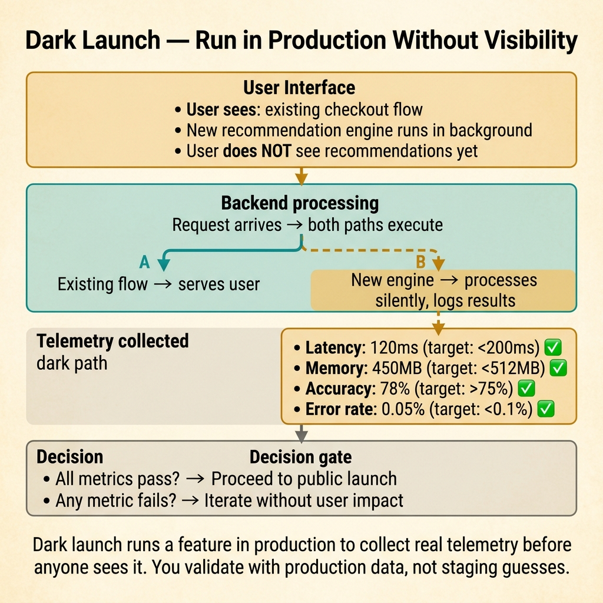
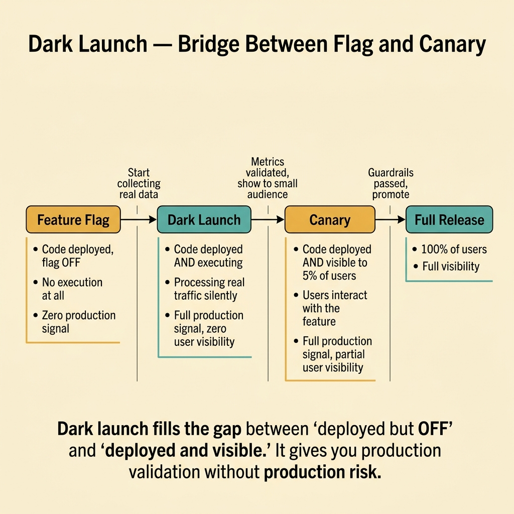
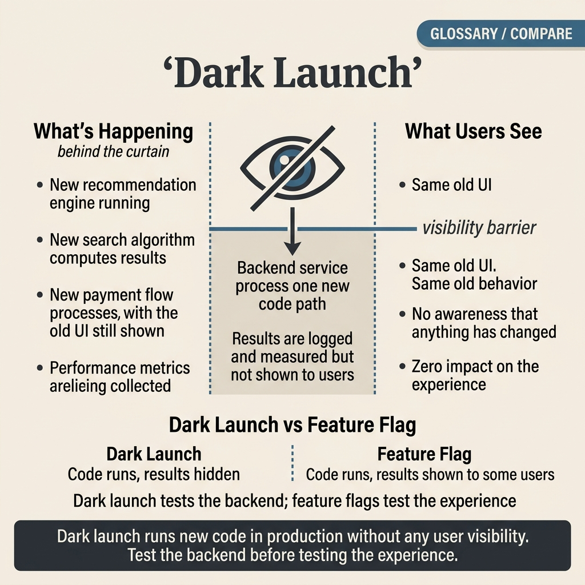

<!-- tags: glossary, reference, deployment-runtime, dark-launch -->
# Dark Launch

> A technique that puts a new feature or code path into production but hides it from most users, primarily to observe system behavior before widening exposure.

| Aspect | Detail |
| --- | --- |
| **Concept** | A technique that puts a new feature or code path into production but hides it from most users, primarily to observe system behavior before widening exposure. |
| **Audience** | Backend engineer, platform engineer, SRE, reviewer |
| **Primary style** | Glossary term |
| **Entry point** | Use when you want a feature or code path to run in the production context without broad public visibility |

📅 Created: 2026-03-30 · 🔄 Updated: 2026-04-16 · ⏱️ 8 min read

---

## 1. DEFINE

Picture a new recommendation engine. The team wants to know if it handles production query variety, latency budgets, and downstream load before announcing it to anyone. Dark launch lets the feature run live — real users on a hidden path or internal testers only — while telemetry answers the question "is this safe to widen?" That is the boundary of Dark Launch.

**Dark Launch** is a technique that puts a new feature or code path into production but hides it from most users, primarily to observe system behavior before widening exposure.

| Variant | Description |
| --- | --- |
| Internal-only dark launch | Only internal users or testers interact with the feature. |
| Hidden-path dark launch | The new code path runs in the background or via a hidden entry point. |
| Instrumentation-first dark launch | The primary goal is observing metrics before any public exposure. |

| Approach | Time | Space | When to choose |
| --- | --- | --- | --- |
| Public launch immediately | O(1) | O(1) | When ready to accept the risk of full exposure. |
| Feature flag gating | O(1) | O(flag rules) | When simple runtime visibility control is enough. |
| Dark launch with hidden exposure | O(1) | O(hidden path + telemetry) | When production realism is needed but broad public release is not. |

Core insight:

> Dark launch is a release technique focused on production validation before public exposure.

### 1.1 Invariants & Failure Modes

The common failure mode is calling every flag-off deploy a "dark launch." A real dark launch requires a validation intent — specific metrics, specific questions, and a plan for what happens next.

---

## 2. CONTEXT

**Who uses it**: Backend engineer, platform engineer, SRE, reviewer

**When**: Use when you want a feature or code path to run in the production context without broad public visibility

**Purpose**: Dark launch is a release technique focused on production validation before public exposure.

**In the ecosystem**:
- The team needs to validate a feature under real production conditions before committing publicly.
- Staging cannot replicate production complexity, so real-environment observation is required.
- Dark launch sits between feature flag gating and canary rollout in the release lifecycle.

Boundary to hold:
- Dark launch belongs to the deployment-runtime layer, not a business-domain term.
- Dark launch differs from shadow deployment: in dark launch, real users or real paths touch the feature. In shadow, only mirrored traffic does.
- Dark launch without telemetry is just a hidden feature, not a validation step.

---

Running a feature in stealth is clear. But how does dark launch differ from shadow deployment, how does it differ from a feature flag, and how do you collect feedback when users do not know the feature exists?

## 3. EXAMPLES

Dark launch surfaces most clearly when enabling a new recommendation engine for 5% of users without announcing it, when an A/B test runs silently to measure impact before marketing, or when a dark-launched feature causes a bug that nobody reports because users do not know the feature is new. The examples below place the pattern into exactly those situations.

### Example 1: Basic — Run a feature in production without broad public visibility

> **Goal**: Validate the runtime behavior of a new feature.
> **Approach**: Limit exposure to internal users or a hidden path.
> **Example**: A new checkout recommendation service opens only for internal QA accounts.
> **Complexity**: Basic

```text
  Dark launch exposure model:

  All users
  ┌──────────────────────────────────────────────┐
  │                                              │
  │  Public users ──► existing feature path      │
  │  (95% of traffic)                            │
  │                                              │
  │  ┌── Dark launch zone ─────────────────────┐ │
  │  │  Internal QA accounts ──► new feature   │ │
  │  │  (5% of traffic)          path          │ │
  │  │                                         │ │
  │  │  Telemetry: latency, errors, cost ──►   │ │
  │  │  dashboard (team only)                  │ │
  │  └─────────────────────────────────────────┘ │
  │                                              │
  └──────────────────────────────────────────────┘
```

*Figure: Public users follow the existing path. The dark launch zone is invisible to them. Only internal accounts exercise the new feature, and telemetry flows to the team.*



*Figure: Dark launch runs a feature in production to collect real telemetry before anyone sees it.*

```yaml
dark_launch_scope:
  code_in_prod: true
  visible_to:
    - internal_users
  public_exposure: false
```

**Why?** Staging does not always reproduce production accurately. Dark launch allows learning from the real environment without opening the full blast radius.

**Conclusion**: Dark launch provides production realism with constrained visibility.

### Example 2: Intermediate — Observe telemetry before public launch

> **Goal**: Know how the new feature affects latency, error rate, and cost.
> **Approach**: Set up dedicated metrics and alerts for the dark-launched path.
> **Example**: A dark-launched ranking pipeline increases CPU and downstream calls more than predicted.
> **Complexity**: Intermediate

```text
  Dark launch telemetry pipeline:

  Dark-launched path
       │
       ├── latency_p95 ──────► 45ms (baseline: 30ms)  ⚠️ +50%
       ├── downstream_qps ───► 1200 (baseline: 800)   ⚠️ +50%
       ├── error_rate ────────► 0.3% (baseline: 0.1%)  ⚠️ +0.2%
       ├── cost_per_request ──► $0.003 (baseline: $0.002)
       │
       ▼
  ┌─ Decision ─────────────────────────────────────┐
  │  Metrics within budget?                        │
  │  ├── YES ──► widen to next stage               │
  │  └── NO  ──► investigate before widening       │
  └────────────────────────────────────────────────┘
```

*Figure: Each metric is tracked independently. The decision to widen depends on whether all metrics stay within the acceptable budget.*

```yaml
dark_launch_observability:
  track:
    - latency_p95
    - downstream_qps
    - error_rate
    - cost_per_request
```

**Why?** A dark launch without targeted telemetry means the team is just hiding a feature, not learning anything.

**Conclusion**: Intermediate dark launch is release gating by observability.

### Example 3: Advanced — Use dark launch as a bridge between feature flag and canary

> **Goal**: Create a safe path from hidden production execution to real public rollout.
> **Approach**: Run hidden first, then internal cohort, then canary on public traffic.
> **Example**: Search v2 runs as a dark launch internally, then goes to 5% public via canary.
> **Complexity**: Advanced

```text
  Release stages — dark launch as bridge:

  Stage 1: Dark Launch (internal)
  ┌─────────────────────────────────┐
  │  Internal users only            │
  │  Observe: latency, errors, cost │
  │  Duration: 1 week               │
  └────────────┬────────────────────┘
               │ metrics OK ✅
               ▼
  Stage 2: Targeted Flag Rollout
  ┌─────────────────────────────────┐
  │  5% public traffic via flag     │
  │  Observe: conversion, latency   │
  │  Duration: 3 days               │
  └────────────┬────────────────────┘
               │ metrics OK ✅
               ▼
  Stage 3: Public Canary
  ┌─────────────────────────────────┐
  │  25% → 50% → 100% via canary   │
  │  Metric-gated promotion         │
  │  Auto-rollback on breach        │
  └────────────┬────────────────────┘
               │ all stages clear ✅
               ▼
  Stage 4: Full Release
  ┌─────────────────────────────────┐
  │  100% traffic, flag retired     │
  └─────────────────────────────────┘
```

*Figure: Dark launch is not a final state. It is the first step in a multi-stage release pipeline that graduates from hidden observation to full exposure.*



*Figure: Dark launch fills the gap between 'deployed but OFF' and 'deployed and visible.' Production validation without production risk.*

```yaml
release_stages:
  - dark_launch_internal
  - targeted_flag_rollout
  - public_canary
  - full_release
```

**Why?** Dark launch is most powerful when it is not standalone but becomes a stage in the overall release plan.

**Conclusion**: Advanced dark launch is a bridge stage between hidden execution and full release.

---

## 4. COMPARE




*Figure: Dark launch as hidden exposure with intent — code runs in the production context, visibility is constrained, and telemetry must indicate when it is safe to widen the rollout.*

Dark launch sounds like shadow deployment, but the key difference is important. In dark launch, real users or real paths actually touch the feature. In shadow deployment, only mirrored traffic reaches the candidate. Dark launch has production footprint; shadow does not.

### Level 1


```text
code in production
feature hidden from most users
small trusted group or hidden path exercises it
```

*Figure: Level 1 shows the basic shape of dark launch in the lifecycle.*

### Level 2


```text
Need prod realism before full launch?
  -> run feature in limited hidden mode
  -> observe telemetry and cost
  -> widen later
```

*Figure: Level 2 turns the term into a decision boundary — dark launch is observation with real execution, not just mirroring.*

### Easily confused or boundary-slipping

You have seen at which step of the runtime lifecycle Dark Launch belongs. The mistakes below are common misuses where rollout, startup, or recovery sounds right by name but system behavior is entirely different.

| # | Severity | Mistake | Consequence | Fix |
| --- | --- | --- | --- | --- |
| 1 | 🔴 Fatal | Calling every flag-off release a dark launch | Team uses the wrong term and sets wrong expectations | Only call it dark launch when there is a clear production validation intent. |
| 2 | 🟡 Common | Dark launch without dedicated telemetry | Nothing is learned from this phase | Set specific metrics and objectives. |
| 3 | 🟡 Common | Hiding the UI but leaving backend side effects uncontrolled | Production behavior becomes unpredictable | Define scope and safeguards explicitly. |
| 4 | 🔵 Minor | No next-stage plan after dark launch | Feature gets stuck in an ambiguous state | Write release stages clearly. |

### Quick scan

| If you face | Action |
| --- | --- |
| Want a feature running in production but not publicly visible | Use dark launch |
| Only have a flag set to off with no validation goal | That may not be a dark launch |
| Need a bridge from hidden phase to public rollout | Use dark launch as a release stage |

---

## 5. REF

| Resource | Type | Link | Note |
| --- | --- | --- | --- |
| Google SRE Workbook | Reference | https://sre.google/workbook/table-of-contents/ | Strong foundation for release safety and incident response. |
| Argo Rollouts | Reference | https://argo-rollouts.readthedocs.io/ | Useful for rollout patterns like canary and blue-green. |
| LaunchDarkly Guides | Reference | https://launchdarkly.com/docs/ | Useful for release control, flags, and dark launch. |

---

## 6. RECOMMEND

Dark launch solves the problem "validate a feature with real users without committing publicly." The next question: what does a rollback strategy look like, and when is a hotfix needed?

| Expand to | When | Reason | File/Link |
| --- | --- | --- | --- |
| Previous concept | When comparing this term with the one before it | Maintains continuity in the learning path | [Feature Flag / Feature Toggle](./08-feature-flag.md) |
| Next concept | When continuing along the current lifecycle | Keeps the learning flow consistent | [Rollback](./10-rollback.md) |
| Topic hub | When returning to the larger taxonomy | Preserves full topic context | [Deployment & Runtime](./README.md) |

Back to the recommendation engine at the start — running silently for 5% of users, measuring click-through before announcing. Now you know: dark launch = feature flag + monitoring. The feature is live but invisible. Data speaks, not assumptions.

**Links**: [← Previous](./08-feature-flag.md) · [→ Next](./10-rollback.md)
