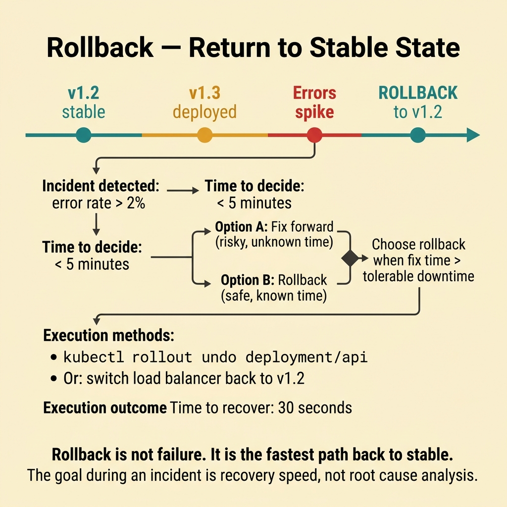
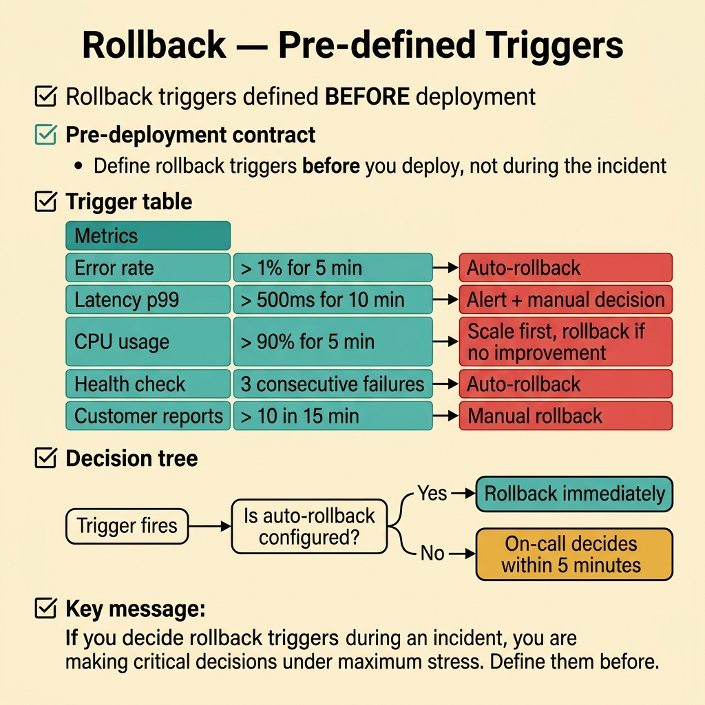
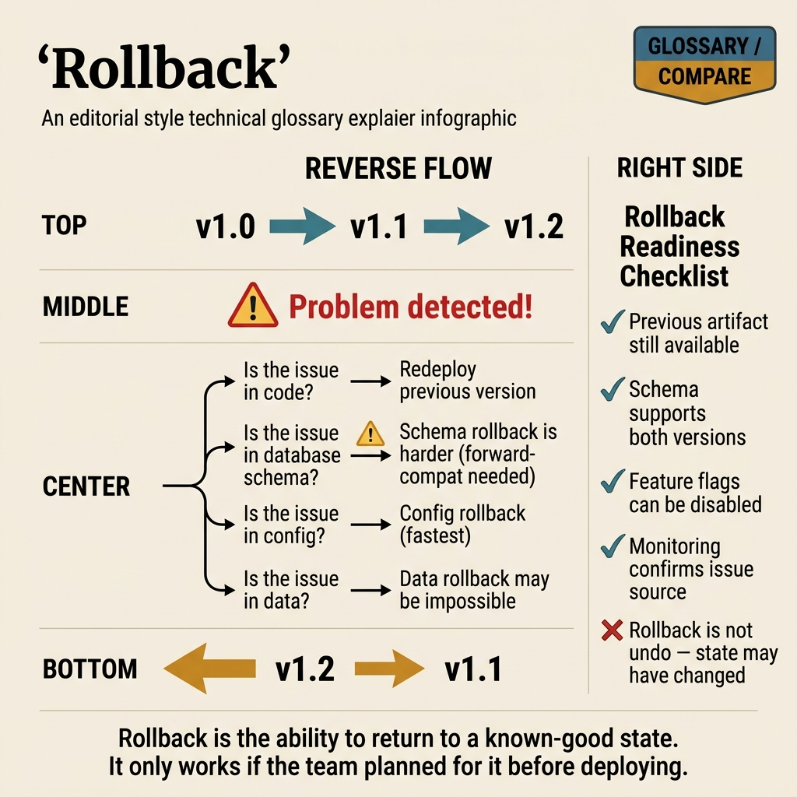

<!-- tags: glossary, reference, deployment-runtime, rollback -->
# Rollback

> The action of reverting to a previous stable version when the new release causes errors or exceeds the error budget after rollout.

| Aspect | Detail |
| --- | --- |
| **Concept** | The action of reverting to a previous stable version when the new release causes errors or exceeds the error budget after rollout. |
| **Audience** | Backend engineer, platform engineer, SRE, reviewer |
| **Primary style** | Glossary term |
| **Entry point** | Use when the current release needs to be withdrawn quickly to restore a stable state |

📅 Created: 2026-03-30 · 🔄 Updated: 2026-04-16 · ⏱️ 8 min read

---

## 1. DEFINE

Picture a deploy that ships at 2 PM. By 2:05 PM, the error rate triples. The team has two choices: debug under fire while users suffer, or revert to the last known good version and investigate later. Rollback is the second choice — and in most incidents, it is the right one. That is the boundary of Rollback.

**Rollback** is the action of reverting to a previous stable version when the new release causes errors or exceeds the error budget after rollout.

| Variant | Description |
| --- | --- |
| Traffic or config rollback | Switch traffic or config back to the previous state quickly. |
| Artifact rollback | Revert to the previous image or build artifact. |
| Feature-level rollback | Disable the new behavior via flag instead of replacing the artifact. |

| Approach | Time | Space | When to choose |
| --- | --- | --- | --- |
| Fix forward only | O(time to patch) | O(1) | When the issue is small and the patch is very fast. |
| Traffic or config rollback | O(1) to minutes | O(1) | When the fastest recovery is needed and a known-good state is ready. |
| Artifact rollback with redeploy | O(redeploy time) | O(1) | When recovery requires reverting to the previous binary or version. |

Core insight:

> Rollback is a recovery action. Its value lies in restoring a stable state faster than debating the root cause while users are still affected.

### 1.1 Invariants & Failure Modes

The common failure mode is hesitating on rollback due to sunk cost fallacy. Every minute spent debating "should we rollback?" while the error rate climbs is a minute users pay for.

---

## 2. CONTEXT

**Who uses it**: Backend engineer, platform engineer, SRE, reviewer

**When**: Use when the current release needs to be withdrawn quickly to restore a stable state

**Purpose**: Rollback is a recovery action. Its value lies in restoring a stable state faster than debating the root cause while users are still affected.

**In the ecosystem**:
- The release has shipped and metrics are degrading.
- The team needs a clear name for the recovery action that reverts to a previous known-good state.
- Rollback connects release behavior with traffic, exposure, and recovery.

Boundary to hold:
- Rollback belongs to the deployment-runtime layer, not a business-domain term.
- Rollback is recovery, not a substitute for good rollout design.
- Rollback may not be possible if data migrations are not backward-compatible.

---

Reverting to the old version is clear. But how do you roll back a database migration, how fast can recovery happen, and what are the auto-rollback criteria?

## 3. EXAMPLES

Rollback surfaces most clearly when a new deploy causes a 5xx spike and needs to be reverted within 2 minutes, when the app is rolled back but the database schema is forgotten, or when auto-rollback triggers a false positive due to metric noise. The examples below place the pattern into exactly those situations.

### Example 1: Basic — Return to a stable state as fast as possible

> **Goal**: Reduce the time users are affected by a broken release.
> **Approach**: Use the fastest safe path to return to the last known good state.
> **Example**: Blue-green switches traffic back to blue, or revert the image tag.
> **Complexity**: Basic

```text
  Rollback timeline:

  14:00  Deploy v2 ships
  14:02  Error rate spike detected ⚠️
  14:03  On-call confirms: new release is the cause
  14:04  ┌─────────────────────────────────────────┐
         │  ROLLBACK DECISION                       │
         │                                          │
         │  Option A: Blue-green switch             │
         │    switch traffic → v1 (blue)            │
         │    time: ~30 seconds ✅                  │
         │                                          │
         │  Option B: Image tag revert              │
         │    redeploy with previous tag             │
         │    time: ~3 minutes                       │
         │                                          │
         │  Option C: Feature flag kill switch       │
         │    disable new behavior via flag          │
         │    time: ~10 seconds ✅                  │
         └─────────────────────────────────────────┘
  14:05  Stable state restored ✅
  14:06  Begin root cause investigation (no pressure)
```

*Figure: The rollback decision happens under pressure. Recovery speed is the primary metric. Root cause investigation starts after stability returns.*



*Figure: Rollback is not failure. It is the fastest path back to stable. Recovery speed beats root cause analysis during an incident.*

```yaml
rollback_decision:
  trigger: error_budget_burn_after_release
  fastest_safe_path: switch_to_last_known_good
```

**Why?** When the service is broken, the greatest value of rollback is time.

**Conclusion**: Rollback should prioritize recovery speed first.

### Example 2: Intermediate — Define rollback triggers before the release

> **Goal**: Eliminate vague debate during an active incident.
> **Approach**: Set thresholds for errors, latency, or business metrics that trigger an abort.
> **Example**: If error rate increases significantly in the first 5 minutes of canary, roll back.
> **Complexity**: Intermediate

```text
  Pre-committed rollback contract:

  ┌─ Before Release ─────────────────────────────────┐
  │  Define abort criteria:                           │
  │    error_rate delta > 2%         → ROLLBACK       │
  │    latency_p95 delta > 100ms     → ROLLBACK       │
  │    checkout_failure spike        → ROLLBACK       │
  │                                                   │
  │  Define rollback method:                          │
  │    primary: blue-green switch                     │
  │    fallback: image tag revert                     │
  │                                                   │
  │  Sign-off: on-call + tech lead                    │
  └───────────────────────────────────────────────────┘

  ┌─ During Release ─────────────────────────────────┐
  │  5 min after deploy:                              │
  │    error_rate delta = 3.2%  ──► EXCEEDS 2% ❌    │
  │                                                   │
  │  Decision: automatic rollback triggered           │
  │  No debate. Contract was signed before release.   │
  └───────────────────────────────────────────────────┘
```

*Figure: Rollback criteria are defined before the release. During the incident, the contract removes debate — the threshold is breached, so the rollback executes.*



*Figure: Define rollback triggers before you deploy, not during the incident when stress is highest.*

```yaml
rollback_trigger:
  latency_p95_delta_max: 100ms
  error_rate_delta_max: 2_percent
  business_abort_signal:
    - checkout_failure_spike
```

**Why?** Rollback is most trustworthy when the trigger is defined before the release.

**Conclusion**: Good rollback is a precommitted recovery policy.

### Example 3: Advanced — Choose the right rollback layer

> **Goal**: Avoid using a heavier recovery measure than necessary.
> **Approach**: Identify which layer caused the issue and revert at exactly that layer.
> **Example**: A feature bug may only need a kill switch. A binary regression may need an artifact rollback.
> **Complexity**: Advanced

```text
  Rollback layer decision tree:

  Issue identified
       │
       ├── Is it a feature behavior bug?
       │      │
       │      └── YES ──► Layer: Feature flag
       │                   Action: disable_flag
       │                   Speed: ~10 seconds
       │
       ├── Is it a traffic routing issue?
       │      │
       │      └── YES ──► Layer: Traffic / LB
       │                   Action: route_back
       │                   Speed: ~30 seconds
       │
       ├── Is it a config change gone wrong?
       │      │
       │      └── YES ──► Layer: Config
       │                   Action: restore_previous_config
       │                   Speed: ~1 minute
       │
       └── Is it a binary / code regression?
              │
              └── YES ──► Layer: Artifact
                           Action: redeploy_previous_image
                           Speed: ~3-5 minutes
```

*Figure: Not every incident needs the same rollback. Match the recovery layer to the root cause layer for the fastest, least disruptive fix.*

```yaml
rollback_layers:
  feature: disable_flag
  traffic: route_back
  artifact: redeploy_previous_image
  config: restore_previous_config
```

**Why?** Not every incident should be rolled back the same way. Choosing the right layer makes recovery faster and less disruptive.

**Conclusion**: Advanced rollback is a decision tree by change layer.

---

## 4. COMPARE




*Figure: Position of rollback between release harm, layer-specific recovery, and precommitted abort criteria.*

Rollback sounds like "revert commit." Not quite. Rollback is a recovery decision under pressure. The layer that needs reverting could be traffic, flag, config, or artifact — not just source code.

### Level 1


```text
new release causes problems
  -> decide rollback
  -> switch traffic or artifact back
  -> regain stable state
```

*Figure: Level 1 shows the basic shape of rollback in the lifecycle.*

### Level 2


```text
If release harms users now
  -> restore stable state first
  -> investigate root cause after
```

*Figure: Level 2 turns the term into a decision boundary — stability first, investigation second.*

### Easily confused or boundary-slipping

You have seen at which step of the runtime lifecycle Rollback belongs. The mistakes below are common misuses where rollout, startup, or recovery sounds right by name but system behavior is entirely different.

| # | Severity | Mistake | Consequence | Fix |
| --- | --- | --- | --- | --- |
| 1 | 🔴 Fatal | Delaying rollback due to sunk cost | Users suffer longer than necessary | Prioritize recovery speed first. |
| 2 | 🟡 Common | Not defining rollback triggers before release | Incident response is slow and contentious | Write abort criteria in advance. |
| 3 | 🟡 Common | Rolling back the app but forgetting data or config incompatibility | Recovery is incomplete | Check the compatibility contract. |
| 4 | 🔵 Minor | Not distinguishing rollback layers | Applying a heavier measure than needed | Choose the recovery layer that matches the issue. |

### Quick scan

| If you face | Action |
| --- | --- |
| Release just caused a clear metrics degradation | Consider rollback early |
| Not sure where to rollback | Check the layer: flag, traffic, config, artifact |
| No abort criteria defined before release | Add them to the rollout contract next time |

---

## 5. REF

| Resource | Type | Link | Note |
| --- | --- | --- | --- |
| Google SRE Workbook | Reference | https://sre.google/workbook/table-of-contents/ | Strong foundation for release safety and incident response. |
| Argo Rollouts | Reference | https://argo-rollouts.readthedocs.io/ | Useful for rollout patterns like canary and blue-green. |
| LaunchDarkly Guides | Reference | https://launchdarkly.com/docs/ | Useful for release control, flags, and dark launch. |

---

## 6. RECOMMEND

Rollback solves the problem "new deploy causes an incident, need to revert now." The next question: when rollback is not enough and a fix forward is needed, what does a hotfix look like?

| Expand to | When | Reason | File/Link |
| --- | --- | --- | --- |
| Previous concept | When comparing this term with the one before it | Maintains continuity in the learning path | [Dark Launch](./09-dark-launch.md) |
| Next concept | When continuing along the current lifecycle | Keeps the learning flow consistent | [Hotfix](./11-hotfix.md) |
| Topic hub | When returning to the larger taxonomy | Preserves full topic context | [Deployment & Runtime](./README.md) |

Back to the 5xx spike at the start — the team needed to revert within 2 minutes. Now you know: plan the rollback before the deploy. Keep the old image tag ready, make database migrations backward-compatible, and write a clear runbook. Rollback is not plan B. It is part of plan A.

**Links**: [← Previous](./09-dark-launch.md) · [→ Next](./11-hotfix.md)
