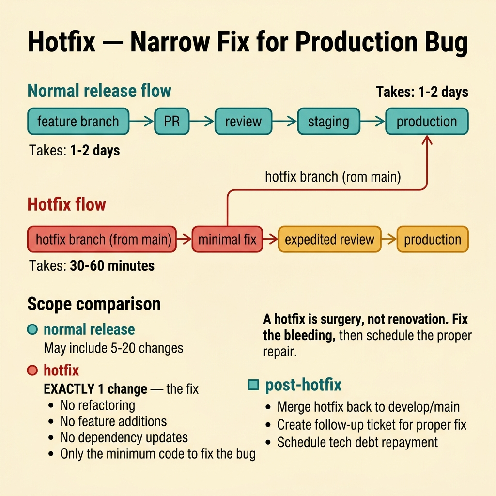
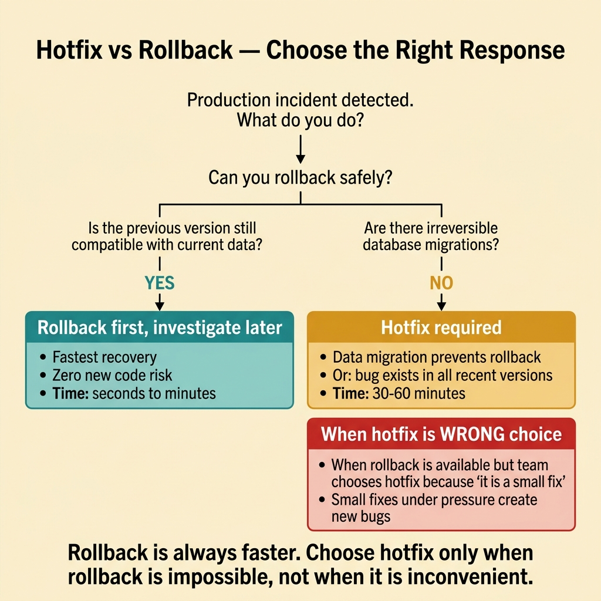
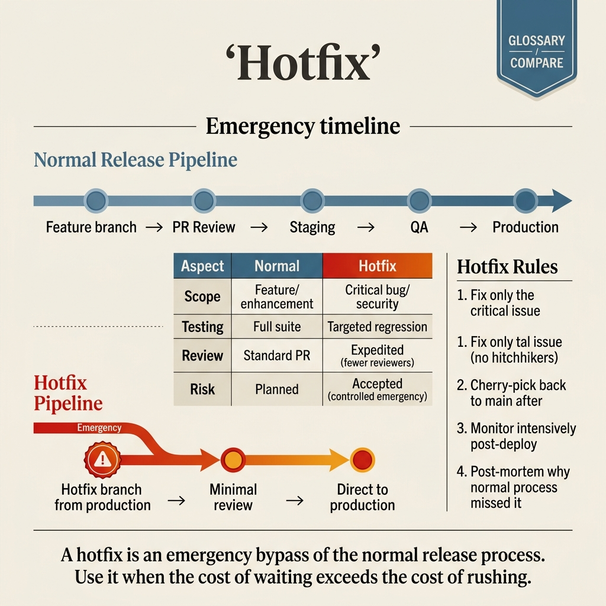

<!-- tags: glossary, reference, deployment-runtime, hotfix -->
# Hotfix

> An emergency patch for a production incident, targeting a specific narrow issue that needs to be resolved immediately without waiting for the normal release cadence.

| Aspect | Detail |
| --- | --- |
| **Concept** | An emergency patch for a production incident, targeting a specific narrow issue that needs to be resolved immediately without waiting for the normal release cadence. |
| **Audience** | Backend engineer, platform engineer, SRE, reviewer |
| **Primary style** | Glossary term |
| **Entry point** | Use when production needs a fast, narrow-scope patch for an ongoing incident |

📅 Created: 2026-03-30 · 🔄 Updated: 2026-04-16 · ⏱️ 8 min read

---

## 1. DEFINE

Picture a payment callback handler that starts throwing null pointer errors at 3 AM. Rollback is not ideal because the new release also includes a critical schema migration that cannot be reversed. The team writes a one-line null check, pushes it through a fast-track CI pipeline, and deploys within 40 minutes. That is the boundary of Hotfix.

**Hotfix** is an emergency patch for a production incident, targeting a specific narrow issue that needs to be resolved immediately without waiting for the normal release cadence.

| Variant | Description |
| --- | --- |
| Code hotfix | A small code patch to fix a specific bug on the production path. |
| Config hotfix | A configuration adjustment to restore the expected behavior. |
| Operational hotfix | A script, migration step, or runtime guard fix outside the planned release train. |

| Approach | Time | Space | When to choose |
| --- | --- | --- | --- |
| Wait for normal release train | O(next release cadence) | O(1) | When the issue is not urgent enough or blast radius is low. |
| Targeted hotfix patch | O(patch + validation time) | O(1) | When a narrow fix is needed fast and rollback is not optimal. |
| Hotfix plus follow-up cleanup | O(patch + later hardening) | O(1) | When accepting a quick fix now with a commitment to harden later. |

Core insight:

> Hotfix is not a license to bypass engineering discipline. It is a special-cadence release for a narrow, urgent scope of fix.

### 1.1 Invariants & Failure Modes

The common failure mode is smuggling unrelated changes into a hotfix. Every extra change beyond the incident scope increases risk during the worst possible moment.

---

## 2. CONTEXT

**Who uses it**: Backend engineer, platform engineer, SRE, reviewer

**When**: Use when production needs a fast, narrow-scope patch for an ongoing incident

**Purpose**: Hotfix is not a license to bypass engineering discipline. It is a special-cadence release for a narrow, urgent scope of fix.

**In the ecosystem**:
- The production system is experiencing an active incident.
- Rollback is not the best option (due to data migrations, downstream dependencies, or business constraints).
- A narrow, targeted code or config change can resolve the immediate issue.

Boundary to hold:
- Hotfix belongs to the deployment-runtime layer, not a business-domain term.
- Hotfix is forward repair; rollback is backward recovery. Different directions.
- Hotfix is a temporary measure. Follow-up cleanup is not optional.

---

A quick production fix is clear. But how does the hotfix process differ from a normal release, what testing is needed, and what about hotfix debt?

## 3. EXAMPLES

Hotfix surfaces most clearly when a production bug needs to be fixed within 1 hour but the full CI pipeline takes 45 minutes, when a hotfix bypasses code review and introduces a new bug, or when a hotfix branch diverges from main and creates merge conflicts later. The examples below place the pattern into exactly those situations.

### Example 1: Basic — Fix a narrow production bug immediately

> **Goal**: Restore correct behavior without waiting for the release train.
> **Approach**: Keep the patch small and target only the nearest root cause.
> **Example**: A missing null check on the payment callback path causes an error burst.
> **Complexity**: Basic

```text
  Hotfix timeline:

  03:00  Alert fires: payment callback errors spiking ⚠️
  03:05  On-call identifies root cause: missing null check
  03:10  ┌─────────────────────────────────────────┐
         │  HOTFIX DECISION                         │
         │                                          │
         │  Scope: 1 line — add null check          │
         │  Unrelated changes: FORBIDDEN ❌         │
         │  Review: expedited (1 reviewer)          │
         │  CI: fast-track pipeline (15 min)         │
         └─────────────────────────────────────────┘
  03:25  Hotfix deployed ✅
  03:30  Error rate returns to baseline ✅
  03:35  Create follow-up ticket:
           - root cause fix (proper validation)
           - add regression test
           - update docs
```

*Figure: The hotfix scope is one line. Unrelated changes are forbidden. Follow-up cleanup starts immediately after stability returns.*



*Figure: A hotfix is surgery, not renovation. Fix the bleeding, then schedule the proper repair.*

```yaml
hotfix_scope:
  incident: payment_callback_errors
  patch_size: narrow
  unrelated_changes: forbidden
```

**Why?** A hotfix is only safe when it is narrow. The more changes bundled beyond the core incident, the higher the risk.

**Conclusion**: A hotfix is most valuable when it is extremely narrow.

### Example 2: Intermediate — Choose hotfix only when rollback is not a better option

> **Goal**: Avoid choosing hotfix because it feels more heroic than rollback.
> **Approach**: Compare speed, risk, and recoverability between rollback and patch.
> **Example**: An additive schema change is stable, but a single new logic branch has a small bug.
> **Complexity**: Intermediate

```text
  Hotfix vs. Rollback decision matrix:

  ┌─────────────────────────────────────────────────────────┐
  │  Question                      Rollback    Hotfix       │
  │  ────────────────────────────── ─────────── ──────────── │
  │  Can we revert the artifact?   YES         N/A          │
  │  Is schema backward-compat?    NO ❌       N/A          │
  │  Is the fix scope narrow?      N/A         YES ✅       │
  │  Time to recover?              ~5 min      ~25 min      │
  │  Risk of recovery action?      HIGH (schema) LOW (1 line)│
  │  ────────────────────────────── ─────────── ──────────── │
  │  VERDICT:                      ❌ risky    ✅ safer      │
  └─────────────────────────────────────────────────────────┘
```

*Figure: Rollback would break the schema. The hotfix is one line with low risk. The decision matrix removes emotion from the choice.*



*Figure: Rollback is always faster. Choose hotfix only when rollback is impossible, not when it is inconvenient.*

```yaml
decision_matrix:
  rollback_possible: true
  rollback_cost: high_user_impact
  hotfix_scope: narrow
  chosen_action: hotfix
```

**Why?** Not every incident should be hotfixed. Hotfix is the right call only when the patch is narrow and rollback is not a better path.

**Conclusion**: A good hotfix is a deliberate decision with comparison, not a default reflex.

### Example 3: Advanced — Require follow-up to repay the technical debt from the incident

> **Goal**: Prevent the emergency patch from becoming the final architectural state forever.
> **Approach**: Ship the hotfix first, but create cleanup and hardening tasks immediately after stabilization.
> **Example**: A temporary guard condition is added. It must be refactored into the proper flow afterward.
> **Complexity**: Advanced

```text
  Hotfix lifecycle with mandatory aftercare:

  ┌─ Phase 1: Emergency ─────────────────────────────┐
  │  Hotfix shipped                                   │
  │  Incident resolved                                │
  │  Metrics stable                                   │
  └────────────┬──────────────────────────────────────┘
               │ within 48 hours
               ▼
  ┌─ Phase 2: Aftercare (MANDATORY) ─────────────────┐
  │  □ Root cause fix merged to main                  │
  │  □ Regression test added                          │
  │  □ Documentation updated                          │
  │  □ Postmortem completed                           │
  │  □ Hotfix branch merged back (no divergence)      │
  └──────────────────────────────────────────────────┘

  ⚠️ If Phase 2 is skipped:
     emergency workaround → permanent tech debt
     hotfix branch → merge conflict time bomb
```

*Figure: The hotfix is not done when the incident closes. Phase 2 aftercare prevents the emergency patch from becoming permanent debt.*

```yaml
hotfix_follow_up:
  immediate_patch: shipped
  required_aftercare:
    - root_cause_fix
    - tests_added
    - docs_updated
```

**Why?** Hotfixes optimize for speed, not elegance. Without follow-up, the emergency workaround becomes long-term debt.

**Conclusion**: Advanced hotfix always comes with a technical debt repayment plan.

---

## 4. COMPARE




*Figure: Hotfix as narrow forward repair — it is correct only when rollback is not a better option and the workaround is not allowed to live as the final system state.*

Hotfix sounds like rollback, but the decision boundary is different. Hotfix is a deliberate forward patch for a very narrow failure path, not a blanket exemption from controls just because an incident is active.

### Level 1


```text
incident
  -> identify narrow fix
  -> patch
  -> verify
  -> deploy outside normal cadence
```

*Figure: Level 1 shows the basic shape of hotfix in the lifecycle.*

### Level 2


```text
Need recovery now?
  -> can rollback solve it?
      -> yes: rollback may be better
      -> no: hotfix with narrow scope
```

*Figure: Level 2 turns the term into a decision boundary — hotfix only when rollback is not the better option.*

### Easily confused or boundary-slipping

You have seen at which step of the runtime lifecycle Hotfix belongs. The mistakes below are common misuses where rollout, startup, or recovery sounds right by name but system behavior is entirely different.

| # | Severity | Mistake | Consequence | Fix |
| --- | --- | --- | --- | --- |
| 1 | 🔴 Fatal | Bundling unrelated changes into a hotfix | Risk spikes during the incident | Keep scope extremely narrow. |
| 2 | 🟡 Common | Choosing hotfix when rollback is clearly better | Recovery is slower and more complex than needed | Compare options before patching. |
| 3 | 🟡 Common | Shipping the hotfix without follow-up | Workaround becomes permanent debt | Create mandatory cleanup tasks. |
| 4 | 🔵 Minor | Skipping minimum verification because of urgency | The new patch creates another incident | Keep a short but strict verification checklist. |

### Quick scan

| If you face | Action |
| --- | --- |
| Incident needs an extremely narrow patch right now | Consider hotfix |
| Rollback is faster and safer | Rollback may be the better choice |
| Hotfix has shipped | Create follow-up cleanup and tests immediately |

---

## 5. REF

| Resource | Type | Link | Note |
| --- | --- | --- | --- |
| Google SRE Workbook | Reference | https://sre.google/workbook/table-of-contents/ | Strong foundation for release safety and incident response. |
| Argo Rollouts | Reference | https://argo-rollouts.readthedocs.io/ | Useful for rollout patterns like canary and blue-green. |
| LaunchDarkly Guides | Reference | https://launchdarkly.com/docs/ | Useful for release control, flags, and dark launch. |

---

## 6. RECOMMEND

Hotfix solves the problem "production bug needs a fix forward because rollback is not feasible." The next question: how does cold start affect deploy speed, and what about warm-up after hotfix?

| Expand to | When | Reason | File/Link |
| --- | --- | --- | --- |
| Previous concept | When comparing this term with the one before it | Maintains continuity in the learning path | [Rollback](./10-rollback.md) |
| Next concept | When returning to the full lifecycle | Keeps the learning flow consistent | [Deployment & Runtime](./README.md) |
| Topic hub | When returning to the larger taxonomy | Preserves full topic context | [Deployment & Runtime](./README.md) |

Back to the production bug at the start — 1 hour to fix, full CI takes 45 minutes. Now you know: a separate hotfix pipeline, fast-track CI, minimum tests. But review is still required — hotfix does not mean cowboy coding. Fix fast, but fix right.

**Links**: [← Previous](./10-rollback.md) · [→ Next](./README.md)
