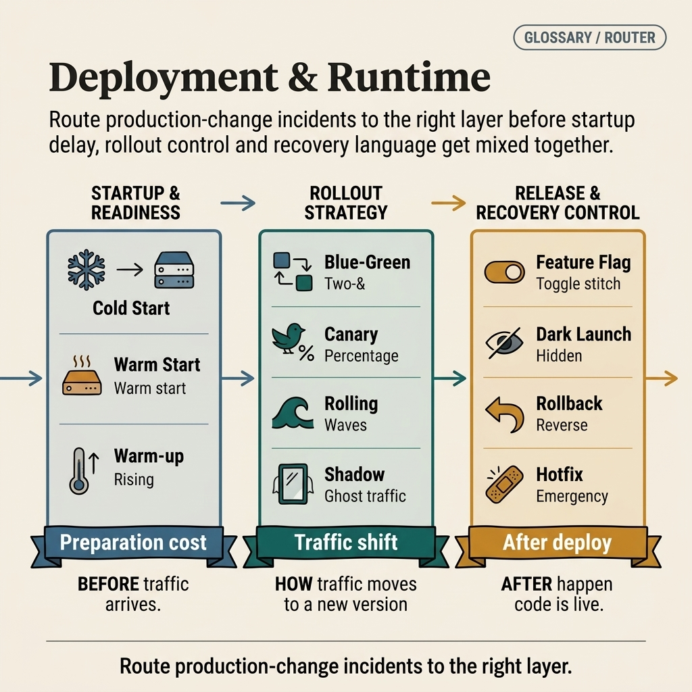
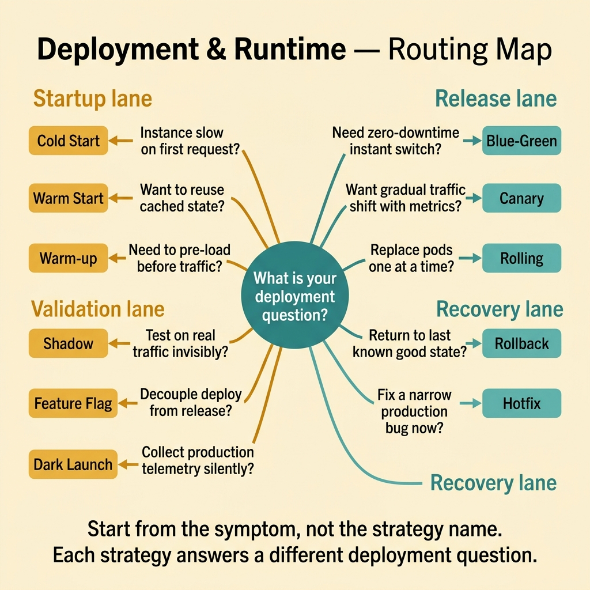

<!-- tags: glossary, reference, deployment-runtime, overview -->
# Deployment & Runtime

> A cluster of terms that name startup behavior, rollout strategy, release control, and recovery action after code reaches production.

| Aspect | Detail |
| --- | --- |
| **Concept** | A cluster of terms that name startup behavior, rollout strategy, release control, and recovery action after code reaches production. |
| **Audience** | Backend engineer, platform engineer, SRE, reviewer |
| **Primary style** | Glossary hub router |
| **Entry point** | Open when the team knows the problem lies in a production change but is unsure whether it is a startup, traffic shift, exposure, or recovery issue |

📅 Created: 2026-03-30 · 🔄 Updated: 2026-04-16 · ⏱️ 6 min read

---

## 1. DEFINE

Picture this: a release ships, metrics degrade, and the team immediately says "rollback." But the problem might be cold start. It might be a canary misconfiguration. It might just be a feature toggled on for the wrong user segment. This README exists to route the team to the right layer of production change before reacting.

**Deployment & Runtime** is a cluster of terms that name startup behavior, rollout strategy, release control, and recovery action after code reaches production.

| Variant | Description |
| --- | --- |
| Startup & readiness | Cold start, warm start, and warm-up describe the moment an instance is born or not yet ready for traffic. |
| Rollout strategy | Blue-green, canary, rolling, and shadow describe how traffic shifts to a new version. |
| Release & recovery control | Feature flag, dark launch, rollback, and hotfix hold the boundary between deploy, feature exposure, and recovery. |

| Approach | Time | Space | When to choose |
| --- | --- | --- | --- |
| Route by production symptom | O(1) route | O(1) | When all you know is "deploy went wrong" but not which layer. |
| Learn by release lifecycle | O(1) route | O(1) | When building a mental model from startup through rollout to recovery. |
| Use as runbook language | O(1) route | O(1) | When design docs, runbooks, and postmortems must share the same vocabulary. |

Core insight:

> Production change management breaks down the moment the team uses a rollout term for a startup issue or a recovery term for a feature exposure problem.

### 1.1 Signals & Boundaries

- Deploying code differs from releasing a feature; feature flags and dark launch belong to the exposure control layer.
- Rollout strategy differs from startup behavior; canary cannot fix cold start.
- Rollback is a recovery action, not a substitute for good rollout design.

### Coverage Map

| Entry | Role | Note |
| --- | --- | --- |
| [Cold Start](01-cold-start.md) | Canonical term | Primary entry for this branch |
| [Warm Start](02-warm-start.md) | Canonical term | Primary entry for this branch |
| [Warm-up](03-warm-up.md) | Canonical term | Primary entry for this branch |
| [Blue-Green Deployment](04-blue-green-deployment.md) | Canonical term | Primary entry for this branch |
| [Canary Deployment](05-canary-deployment.md) | Canonical term | Primary entry for this branch |
| [Rolling Deployment](06-rolling-deployment.md) | Canonical term | Primary entry for this branch |
| [Shadow Deployment](07-shadow-deployment.md) | Canonical term | Primary entry for this branch |
| [Feature Flag / Feature Toggle](08-feature-flag.md) | Canonical term | Primary entry for this branch |
| [Dark Launch](09-dark-launch.md) | Canonical term | Primary entry for this branch |
| [Rollback](10-rollback.md) | Canonical term | Primary entry for this branch |
| [Hotfix](11-hotfix.md) | Canonical term | Primary entry for this branch |

---

## 2. VISUAL




*Figure: Router map separating startup, rollout, and recovery control so production-change discussions do not slip into the wrong action layer.*

What is missing at this point is not more definitions but a route map clear enough for the team to identify whether the symptom sits in the startup path, the traffic shift, or the release control layer before reacting on instinct.

### Level 1

```text
  ┌─────────────────────────────────────────────────────┐
  │            Deployment & Runtime Hub                 │
  ├─────────────────┬───────────────┬───────────────────┤
  │  Startup &      │  Rollout      │  Release &        │
  │  Readiness      │  Strategy     │  Recovery Control │
  │                 │               │                   │
  │  Cold Start     │  Blue-Green   │  Feature Flag     │
  │  Warm Start     │  Canary       │  Dark Launch      │
  │  Warm-up        │  Rolling      │  Rollback         │
  │                 │  Shadow       │  Hotfix           │
  └─────────────────┴───────────────┴───────────────────┘
```

*Figure: Level 1 splits this hub into three decision lanes so the reader does not have to navigate a flat list of terms.*

### Level 2

```text
  Symptom observed                           Open first
  ─────────────────────────────────────────  ──────────────────────
  Instance is slow after spawning            Cold Start
  Want to shift partial traffic to new ver   Canary Deployment
  Code deployed but not ready for all users  Feature Flag / Toggle
  New version causes errors, need to revert  Rollback
```

*Figure: Level 2 turns the hub into a symptom router — start from the real question, then branch to the specific term.*

---

## 3. CODE

The diagram above splits the runtime into startup behavior, rollout strategy, and recovery path. From here, use this hub as a runbook router to connect production symptoms with the right operational concept.

### Problem 1: Basic — Route the right symptom to the right glossary entry

> **Goal**: Prevent every question about **Deployment & Runtime** from landing in the same bucket.
> **Approach**: Start from the symptom or the reader's question, then open the most fitting entry first.
> **Example**: Input is a review or design question; output is the first file to open, such as `./01-cold-start.md`.
> **Complexity**: Basic

```text
  Symptom triage:
  ┌───────────────────────────────────┐
  │ "Deploy went out. Something is    │
  │  wrong. What do I open?"          │
  └──────────────┬────────────────────┘
                 │
       ┌─────────┴──────────┐
       ▼                    ▼
  Latency spike?        Error rate spike?
       │                    │
       ▼                    ▼
  First request only?   All requests?
       │                    │
       ▼                    ▼
  Cold Start             Rollback
```

*Figure: Start from the symptom shape, not the term name. Latency on first request points to Cold Start. Error rate across all traffic points to Rollback.*



*Figure: Start from the symptom, not the strategy name. Each strategy answers a different deployment question.*

```yaml
router:
  - symptom: Instance is slow or receives traffic too early after spawning
    open_first: ./01-cold-start.md
  - symptom: Want to shift partial traffic to a new version
    open_first: ./05-canary-deployment.md
  - symptom: Code deployed but not ready for all users
    open_first: ./08-feature-flag.md
  - symptom: New version causes errors, need to revert quickly
    open_first: ./10-rollback.md
```

**Why?** In deployment and runtime, misidentifying the symptom is dangerous. Cold start, warm-up, and rollback look similar on the surface but lead to completely different actions. This router forces investigation into the correct lane.

**Conclusion**: The hub's first value is helping the reader open the right operational term before touching infrastructure or live traffic.

### Problem 2: Intermediate — Use the hub as a purposeful learning path

> **Goal**: Read **Deployment & Runtime** in logical clusters instead of jumping between isolated files.
> **Approach**: Follow each lane from foundational concepts to heavier variants, then compare adjacent concepts when needed.
> **Example**: A reader building a durable mental model rather than looking up a single definition.
> **Complexity**: Intermediate

```text
  Reading order by lane:

  Startup lane:     Cold Start ──► Warm Start ──► Warm-up
                        │              │              │
                        └── compare ───┘── compare ───┘

  Rollout lane:     Blue-Green ──► Canary ──► Rolling ──► Shadow
                        │             │           │           │
                        └── risk ─────┘── risk ───┘── risk ───┘
                              (increasing granularity)

  Recovery lane:    Feature Flag ──► Dark Launch ──► Rollback ──► Hotfix
                        │                │              │
                        └── exposure ────┘── recovery ──┘
```

*Figure: Each lane progresses from simple to complex. Adjacent entries within a lane share comparison boundaries.*

```yaml
learning_path:
  startup:
    - 01-cold-start.md
    - 02-warm-start.md
    - 03-warm-up.md
  rollout:
    - 04-blue-green-deployment.md
    - 05-canary-deployment.md
    - 06-rolling-deployment.md
    - 07-shadow-deployment.md
  release_recovery:
    - 08-feature-flag.md
    - 09-dark-launch.md
    - 10-rollback.md
    - 11-hotfix.md
```

**Why?** Rollout terms gain meaning only when placed side by side in a timeline of risk and exposure. This learning path turns the hub into a rehearsal path for decisions that must be made fast during deploys.

**Conclusion**: At the intermediate level, the hub turns production symptoms into a reading path organized by release, rollout, and recovery cadence.

### Problem 3: Advanced — Use the hub as a governance map for shared vocabulary

> **Goal**: Ensure reviews, ADRs, runbooks, and postmortems use the same language within **Deployment & Runtime**.
> **Approach**: Group terms by decision lane, then use that lane as a glossary contract for the team.
> **Example**: Two people using the same word but actually debating at two different system layers.
> **Complexity**: Advanced

```text
  Governance map — who owns which lane:

  ┌── Platform / SRE ──────────────────────┐
  │  startup_readiness:                     │
  │    Cold Start, Warm Start, Warm-up      │
  │  rollout_strategy:                      │
  │    Blue-Green, Canary, Rolling          │
  └─────────────────────────────────────────┘

  ┌── Product / Backend ───────────────────┐
  │  release_control:                       │
  │    Feature Flag, Dark Launch            │
  └─────────────────────────────────────────┘

  ┌── Incident Response ───────────────────┐
  │  recovery:                              │
  │    Rollback, Hotfix                     │
  └─────────────────────────────────────────┘
```

*Figure: Different teams own different lanes. Governance maps prevent cross-lane confusion during incidents.*

```yaml
governance_map:
  startup_readiness:
    - 01-cold-start.md
    - 02-warm-start.md
    - 03-warm-up.md
  rollout_strategy:
    - 04-blue-green-deployment.md
    - 05-canary-deployment.md
    - 06-rolling-deployment.md
  release_recovery_control:
    - 08-feature-flag.md
    - 09-dark-launch.md
    - 10-rollback.md
```

**Why?** Shared vocabulary in this cluster is part of incident discipline. A governance map keeps the team distinguishing rollout mechanisms, runtime signals, and recovery strategies.

**Conclusion**: At the advanced level, this hub is an operational language dispatch board so deployment is not driven by gut feeling.

---

## 4. PITFALLS

The taxonomy is clear, but correct routing alone does not prevent the common slips when using or interpreting this cluster of concepts.

| # | Severity | Mistake | Consequence | Fix |
| --- | --- | --- | --- | --- |
| 1 | 🔴 Fatal | Mixing multiple concept layers in the same discussion | Team fixes the wrong layer, debate goes off track | Re-route through the correct lane in this README before opening a specific term |
| 2 | 🟡 Common | Picking a term by familiar name instead of by symptom | Deep-links to the right file but misses the boundary | Ask the symptom question first, then choose the entry point |
| 3 | 🟡 Common | Reading terms in isolation without the learning path | Understanding stays fragmented, missing adjacent comparisons | Follow the suggested reading clusters from CODE/RECOMMEND |
| 4 | 🔵 Minor | Not linking back to the hub or root hub | Reader gets lost and cannot return to the taxonomy | Treat the hub as a router, not an island |

---

## 5. REF

| Resource | Type | Link | Note |
| --- | --- | --- | --- |
| Google SRE Workbook | Reference | https://sre.google/workbook/table-of-contents/ | Highly useful for release safety and incident handling |
| Argo Rollouts | Reference | https://argo-rollouts.readthedocs.io/ | Practical examples for canary and blue-green |
| LaunchDarkly Guides | Reference | https://launchdarkly.com/docs/ | Useful for flags, dark launch, and release control |

---

## 6. RECOMMEND

You have locked the right runtime lane. Continue along the symptom closest to production to ensure rollout and recovery decisions do not drift in meaning.

| Expand to | When | Reason | File/Link |
| --- | --- | --- | --- |
| Startup first | When the symptom is readiness and boot behavior | If the instance is not stable, rollout is meaningless | [Cold Start](./01-cold-start.md) |
| Canary when traffic shift is the biggest concern | When the team wants to reduce blast radius of a new version | This is the entry point for safe rollout discussion | [Canary Deployment](./05-canary-deployment.md) |
| Rollback last | When you need to know how to revert quickly | Recovery should come after understanding startup and release control | [Rollback](./10-rollback.md) |

---

## 7. QUICK REF

| If you face | Open |
| --- | --- |
| Instance is slow or receives traffic too early after spawning | [Cold Start](./01-cold-start.md) |
| Want to shift partial traffic to a new version | [Canary Deployment](./05-canary-deployment.md) |
| Code deployed but not ready for all users | [Feature Flag / Feature Toggle](./08-feature-flag.md) |
| New version causes errors, need to revert quickly | [Rollback](./10-rollback.md) |
