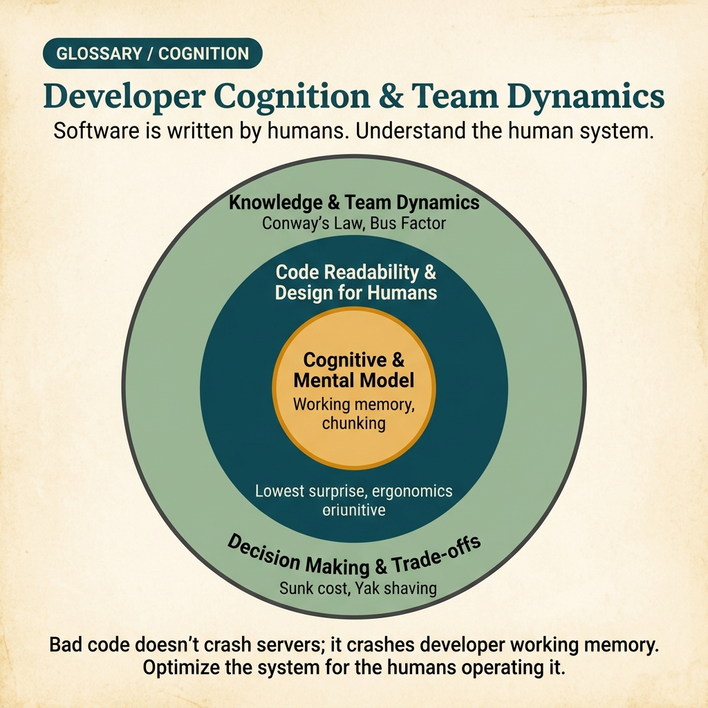

<!-- tags: glossary, reference, developer-cognition-team-dynamics, overview -->
# Developer Cognition & Team Dynamics

> Cụm glossary cross-cutting về cách developer đọc, hiểu, học và phối hợp với nhau khi xây và vận hành hệ thống.

| Aspect | Detail |
| --- | --- |
| **Concept** | Cụm glossary cross-cutting về cách developer đọc, hiểu, học và phối hợp với nhau khi xây và vận hành hệ thống. |
| **Audience** | Developer, reviewer, tech lead, engineering manager |
| **Primary style** | Glossary hub router |
| **Entry point** | Mở khi vấn đề không nằm ở syntax hay runtime, mà nằm ở cách con người hiểu sai, quá tải nhận thức hoặc khó phối hợp |

📅 Ngày tạo: 2026-03-30 · 🔄 Cập nhật: 2026-04-04 · ⏱️ 7 phút đọc

---

## 1. DEFINE

Hình dung Hệ thống có thể chạy đúng nhưng team vẫn mệt: PR nhỏ cũng khó review, onboarding lâu, tranh luận lan man và incident postmortem không học được gì. Lúc này debt nằm ở cognitive và collaboration layer hơn là ở code syntax. README này route bạn vào đúng nhóm term về readability, mental model, decision trade-off và team dynamics.

**Developer Cognition & Team Dynamics** là cụm glossary cross-cutting về cách developer đọc, hiểu, học và phối hợp với nhau khi xây và vận hành hệ thống.

| Variant | Mô tả |
| --- | --- |
| Đọc và hiểu code | Những term giúp gọi tên readability, naming, surprise và dead code. |
| Nhận thức và học tập | Những term giúp giải thích cognitive load, mental model, flow và cách kiến thức được giữ/truyền. |
| Quyết định và phối hợp | Những term về trade-off, design for humans và team collaboration dynamics. |

| Approach | Time | Space | Khi chọn |
| --- | --- | --- | --- |
| Route theo pain của người đọc | O(1) route | O(1) | Khi symptom là hiểu chậm, review mệt hay onboarding dừng lại |
| Route theo pain của team | O(1) route | O(1) | Khi symptom nằm ở tranh luận, ownership, học tập và delivery |
| Học từ cá nhân đến tổ chức | O(1) route | O(1) | Khi muốn đi từ code readability sang collaboration structure |

Core insight:

> Nhiều hệ thống xấu không vì thiếu pattern kỹ thuật, mà vì team không có language để gọi tên debt ở cấp độ nhận thức và collaboration.

### 1.1 Signals & Boundaries

- Nếu PR khó đọc, bắt đầu ở readability và cognitive load trước khi đổ lỗi cho cá nhân.
- Nếu team lặp đi lặp lại những tranh luận xấu, route sang decision-making hoặc design-for-humans.
- Nếu vấn đề nằm ở ownership, feedback safety hay knowledge spread, route sang collaboration dynamics.

### Coverage Map

| Entry | Vai trò | Ghi chú |
| --- | --- | --- |
| [Code Readability & Comprehension](code-readability-comprehension/README.md) | Subtopic hub | 7 docs trong nhánh này |
| [Cognitive & Mental Model](cognitive-mental-model/README.md) | Subtopic hub | 8 docs trong nhánh này |
| [Decision Making & Trade-offs](decision-making-trade-offs/README.md) | Subtopic hub | 8 docs trong nhánh này |
| [Design for Humans](design-for-humans/README.md) | Subtopic hub | 8 docs trong nhánh này |
| [Knowledge & Learning](knowledge-learning/README.md) | Subtopic hub | 6 docs trong nhánh này |
| [Team & Collaboration Dynamics](team-collaboration-dynamics/README.md) | Subtopic hub | 8 docs trong nhánh này |

---

## 2. VISUAL




*Hình: Router map ưu tiên scan nhanh các lane, entry point và boundary đọc trước khi đi vào prose chi tiết bên dưới.*

Tên cluster đã rõ rồi; phần dễ lẫn nhất vẫn nằm ở ranh giới giữa các nhánh. Visual dưới đây làm rõ chính ranh giới đó.

### Level 1

```text
Đọc và hiểu code
Nhận thức và học tập
Quyết định và phối hợp
```

*Hình: Level 1 chia hub này thành các lane quyết định chính để người đọc không phải mò từ một danh sách thuật ngữ phẳng.*

### Level 2

```text
Nếu hiện tượng là...                                     Mở file nào trước
------------------------------------------------------   ------------------------------------------
Code đúng nhưng đọc rất mệt, naming và surprise cao     Code Readability & Comprehension
Người đọc phải giữ quá nhiều context trong đầu          Cognitive & Mental Model
Team tranh luận trade-off, bikeshedding hoặc optimize sai chỗ Decision Making & Trade-offs
Issue nằm ở ownership, psych safety hoặc cách team hợp tác Team & Collaboration Dynamics
```

*Hình: Level 2 biến hub thành symptom router: bắt đầu từ câu hỏi thật, rồi mới rẽ sang term cụ thể.*

---

## 3. CODE

Diagram vừa chia cụm này thành các lớp đọc code, suy nghĩ, ra quyết định và phối hợp. Từ đây, hãy dùng hub như một router cho những vấn đề nhìn giống kỹ thuật nhưng thật ra bắt nguồn từ con người.

### Problem 1: Basic — Route đúng symptom vào đúng glossary entry

> **Mục tiêu**: Không để mọi câu hỏi về **Developer Cognition & Team Dynamics** bị ném vào cùng một rổ.
> **Approach**: Bắt đầu từ symptom hoặc câu hỏi của người đọc, rồi mở entry đầu tiên phù hợp nhất.
> **Ví dụ**: Đầu vào là một câu hỏi review/design; đầu ra là file nên mở đầu tiên như `./code-readability-comprehension/README.md`.
> **Độ phức tạp**: Basic

```yaml
router:
  - symptom: Code đúng nhưng đọc rất mệt, naming và surprise cao
    open_first: ./code-readability-comprehension/README.md
  - symptom: Người đọc phải giữ quá nhiều context trong đầu
    open_first: ./cognitive-mental-model/README.md
  - symptom: Team tranh luận trade-off, bikeshedding hoặc optimize sai chỗ
    open_first: ./decision-making-trade-offs/README.md
  - symptom: Issue nằm ở ownership, psych safety hoặc cách team hợp tác
    open_first: ./team-collaboration-dynamics/README.md
```

**Tại sao?** Ở cụm này, gọi sai symptom là cách nhanh nhất để chữa nhầm bệnh: một vấn đề naming có thể bị đẩy thành ownership, còn cognitive overload lại bị hiểu là thiếu kỷ luật. Router này giúp khóa đúng lớp ma sát.

**Kết luận**: Giá trị đầu tiên của hub là chỉ ra đúng nơi vấn đề bắt đầu xảy ra trong đầu người đọc hoặc trong cách team vận hành cùng nhau.

### Problem 2: Intermediate — Dùng hub như learning path có chủ đích

> **Mục tiêu**: Đọc **Developer Cognition & Team Dynamics** theo cụm có logic thay vì nhảy file rời rạc.
> **Approach**: Đi theo lane từ nền tảng đến biến thể nặng hơn, rồi quay lại so sánh adjacent concepts khi cần.
> **Ví dụ**: Một reader muốn xây mental model bền hơn thay vì chỉ tra một định nghĩa đơn lẻ.
> **Độ phức tạp**: Intermediate

```yaml
learning_path:
  individual_reading:
    - Code Readability & Comprehension
    - Cognitive & Mental Model
  decision_and_design:
    - Decision Making & Trade-offs
    - Design for Humans
  knowledge_and_team:
    - Knowledge & Learning
    - Team & Collaboration Dynamics
```

**Tại sao?** Các term về cognition và collaboration chỉ sáng nghĩa khi người đọc thấy đường nối từ cá nhân sang nhóm. Learning path biến hub này thành bản đồ tăng dần từ cảm giác khó đọc đến debt ở cấp tổ chức.

**Kết luận**: Ở mức intermediate, hub này dẫn người đọc đi từ ma sát cá nhân sang debt ở cấp tổ chức mà không bỏ mất mối nối giữa hai lớp.

### Problem 3: Advanced — Dùng hub như governance map cho shared vocabulary

> **Mục tiêu**: Giữ review, ADR, runbook hoặc postmortem dùng đúng cùng một language trong **Developer Cognition & Team Dynamics**.
> **Approach**: Gom các term theo lane quyết định, rồi dùng lane đó như glossary contract cho team.
> **Ví dụ**: Khi hai người đang nói cùng một từ nhưng thật ra đang tranh luận ở hai lớp khác nhau của hệ thống.
> **Độ phức tạp**: Advanced

```yaml
governance_map:
  doc_va_hieu_code:
    - Code Readability & Comprehension
    - Cognitive & Mental Model
  nhan_thuc_va_hoc_tap:
    - Decision Making & Trade-offs
    - Design for Humans
  quyet_dinh_va_phoi_hop:
    - Knowledge & Learning
    - Team & Collaboration Dynamics
```

**Tại sao?** Shared vocabulary ở cụm này là guardrail cho những cuộc tranh luận rất dễ cảm tính. Governance map giữ cho team phân biệt rõ friction ở cấp code, nhận thức, quyết định hay phối hợp.

**Kết luận**: Ở mức advanced, hub này là sơ đồ nguyên nhân gốc cho các vấn đề kỹ thuật mang bản chất con người và tổ chức.

---

## 4. PITFALLS

Taxonomy đã rõ, nhưng route đúng chưa đủ để tránh những cú trượt phổ biến khi dùng hoặc diễn giải cụm khái niệm này.

| # | Severity | Lỗi | Hậu quả | Fix |
| --- | --- | --- | --- | --- |
| 1 | 🔴 Fatal | Trộn nhiều lớp khái niệm trong cùng một cuộc thảo luận | Team fix sai lớp vấn đề, tranh luận lệch hướng | Route lại theo đúng lane trong README trước khi mở term cụ thể |
| 2 | 🟡 Common | Chọn term theo tên quen tai thay vì theo symptom | Deep-link đúng file nhưng sai boundary | Đặt câu hỏi symptom trước, rồi mới chọn entry point |
| 3 | 🟡 Common | Đọc term lẻ mà bỏ qua learning path | Hiểu rời rạc, thiếu adjacent concept để so sánh | Đi theo cụm đọc đã gợi ý ở CODE/RECOMMEND |
| 4 | 🔵 Minor | Không link ngược về hub cha hoặc root hub | Người đọc khó quay lại taxonomy khi bị lạc | Giữ hub như router, không biến file thành island |

---

## 5. REF

| Resource | Loại | Link | Ghi chú |
| --- | --- | --- | --- |
| A Philosophy of Software Design | Book | https://web.stanford.edu/~ouster/cgi-bin/book.php | Rất mạnh cho complexity và readability theo góc nhìn người đọc |
| Team Topologies | Book | https://teamtopologies.com/ | Nền tảng tốt cho cognitive load ở cấp team |
| Accelerate | Book | https://itrevolution.com/product/accelerate/ | Hữu ích khi nói về team dynamics và delivery outcomes |

---

## 6. RECOMMEND

Bạn đã biết lớp ma sát nằm ở đâu. Hãy đi tiếp theo lane gần nhất với hành vi thật đang gây pain, để vấn đề con người không bị che bởi ngôn ngữ kỹ thuật chung chung.

| Mở rộng | Khi nào | Lý do | File/Link |
| --- | --- | --- | --- |
| Readability trước | Khi symptom xuất hiện ngay trong lúc đọc code | Khởi đầu từ friction trước mắt của người đọc là nhanh nhất | [Code Readability & Comprehension](./code-readability-comprehension/README.md) |
| Cognitive load sau đó | Khi PR nhỏ vẫn đòi giữ quá nhiều state trong đầu | Lúc này vấn đề là mental effort hơn là style thuần túy | [Cognitive & Mental Model](./cognitive-mental-model/README.md) |
| Team dynamics khi debt đã vượt khỏi cấp cá nhân | Khi ownership, safety và learning bắt đầu ảnh hưởng system quality | Đây là lớp quyết định xem vấn đề có tiếp tục tái diễn hay không | [Team & Collaboration Dynamics](./team-collaboration-dynamics/README.md) |

---

## 7. QUICK REF

| Nếu gặp | Mở đâu |
| --- | --- |
| Code đúng nhưng đọc rất mệt, naming và surprise cao | [Code Readability & Comprehension](./code-readability-comprehension/README.md) |
| Người đọc phải giữ quá nhiều context trong đầu | [Cognitive & Mental Model](./cognitive-mental-model/README.md) |
| Team tranh luận trade-off, bikeshedding hoặc optimize sai chỗ | [Decision Making & Trade-offs](./decision-making-trade-offs/README.md) |
| Issue nằm ở ownership, psych safety hoặc cách team hợp tác | [Team & Collaboration Dynamics](./team-collaboration-dynamics/README.md) |
