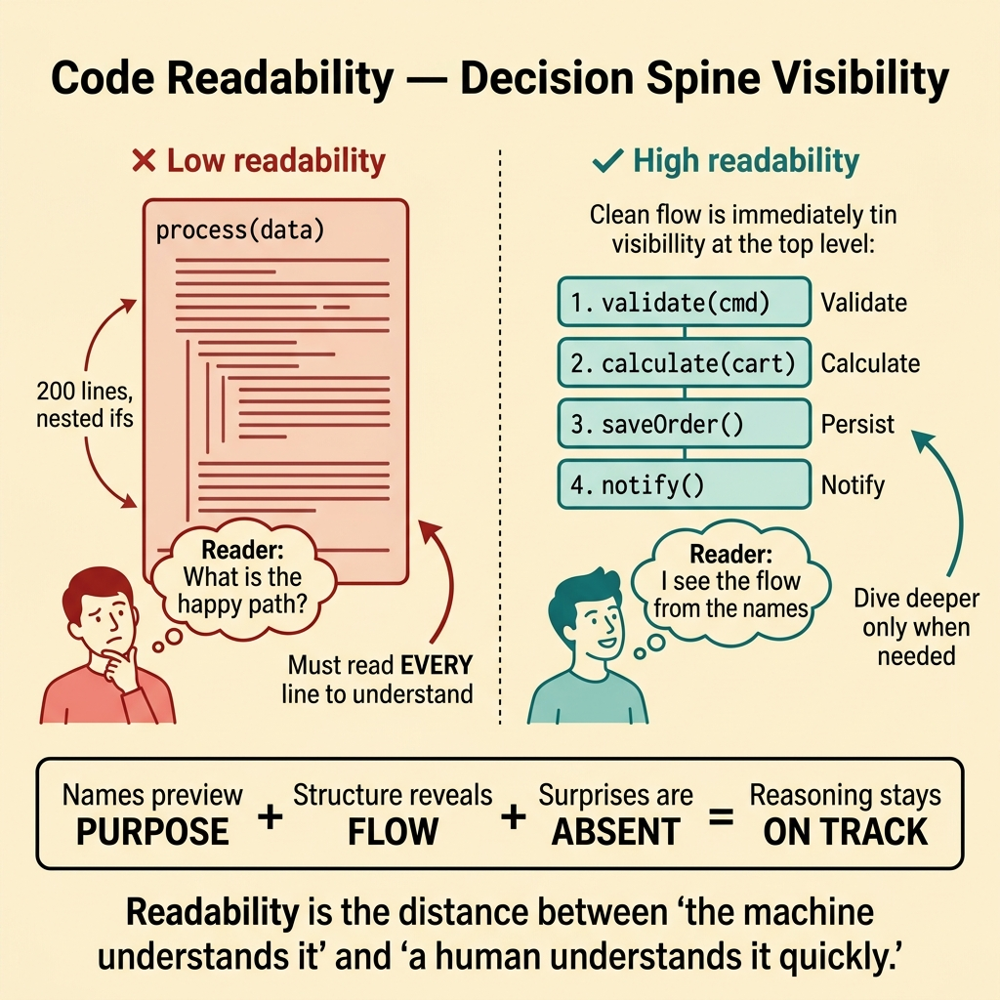
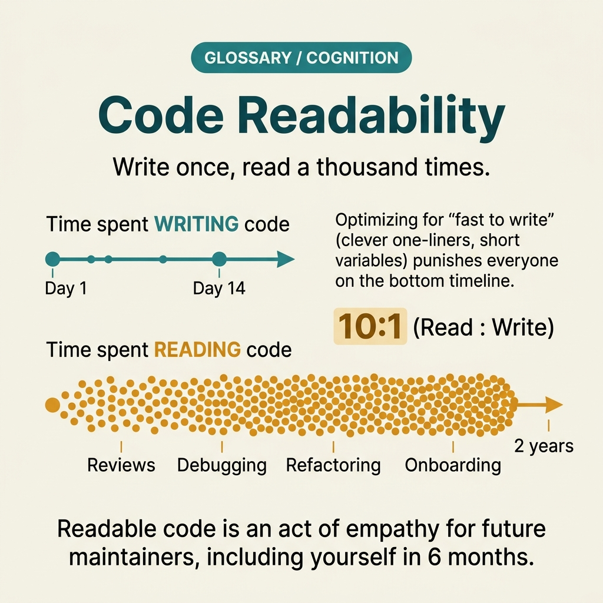

<!-- tags: glossary, reference, developer-cognition-team-dynamics, code-readability-comprehension, code-readability -->
# Code Readability

> The degree to which a reader can understand the purpose, flow, and reasoning of code without excessive effort or external context.

| Aspect | Detail |
| --- | --- |
| **Concept** | The degree to which a reader can understand the purpose, flow, and reasoning of code without excessive effort or external context. |
| **Audience** | Developer, reviewer, maintainer |
| **Primary style** | Glossary term |
| **Entry point** | Use when the codebase is technically correct but consistently exhausting to read, review, or onboard into. |

📅 Created: 2026-03-30 · 🔄 Updated: 2026-04-04 · ⏱️ 10 min read

---

## 1. DEFINE

Picture opening a pull request where every function works, tests pass, and the compiler is happy — yet after ten minutes of reading, you still cannot explain what the module does to someone else. The logic hides behind vague names, tangled control flow, and assumptions baked into raw numbers. Code readability measures exactly this gap: the distance between "the machine understands it" and "a human understands it quickly."

**Code Readability** is the degree to which a reader can understand the purpose, flow, and reasoning of code without excessive effort or external context.

| Variant | Description |
| --- | --- |
| Surface readability | Names, formatting, and line-level clarity that reduce eye friction. |
| Structural readability | Module boundaries, function decomposition, and flow that reveal intent at the architecture level. |
| Semantic readability | The alignment between what the code says and what the domain means — the deepest layer. |

| Approach | Time | Space | When to choose |
| --- | --- | --- | --- |
| Improve surface signals first | O(n renames) | O(1) | When the obvious problem is names, formatting, or inconsistency. |
| Restructure around decision spines | O(n refactors) | O(refactor plan) | When the reader can only understand the flow by reading every line. |
| Align code language with domain language | O(n design reviews) | O(glossary) | When the gap is between what the code says and what the business means. |

Core insight:

> Readability is not about making code look pretty. It is about keeping the reader's reasoning correct when they must make decisions based on the code. Every naming ambiguity, every surprise, every dead branch is a tax on that reasoning.

### 1.1 Invariants & Failure Modes

The invariant is that the reader should be able to predict the purpose of a block before reading its details. When a function name says one thing but the body does another, or when the flow requires reading every line to grasp the intent, readability has failed.

---

## 2. CONTEXT

**Who uses it**: Developer, reviewer, maintainer

**When**: Use when the codebase is technically correct but consistently exhausting to read, review, or onboard into.

**Purpose**: Readability is not about aesthetics. It is about keeping reasoning accurate when the reader must make decisions on the code. Every naming ambiguity, every surprise behavior, every dead branch taxes that reasoning.

**In the ecosystem**:
- Readability sits at the foundation: poor readability undermines every other quality attribute because reviewers cannot reason correctly about what they cannot understand.
- Readability is not synonymous with short code; sometimes longer, more explicit code reads better.
- This term anchors the entire `code-readability-comprehension` cluster.

---

Readable code is a clear goal. But how do you measure readability, where is the line between readable and over-engineered, and which specific signals matter most?

## 3. EXAMPLES

Code readability surfaces most visibly when a reviewer says "I don't get what this does" about working code, when onboarding takes weeks because the codebase is a maze, or when a five-line function takes five minutes to understand. The examples below place the pattern into exactly those situations.

### Example 1: Basic — A function that works but nobody can explain

You see a function called `process(data)` that runs correctly in production. But when a new team member asks "what does process do?", no one can explain without opening the implementation. At the basic level, readability starts with names that preview purpose.

The input is a working but opaque function. The output is the same logic with a name and structure that reveal intent. Complexity is low because it is primarily renaming.

```go
// Before: process(data) — works but means nothing
// After: name reveals business intent
func applyDiscountToEligibleOrders(orders []Order, discount Discount) ([]Order, error) {
	var result []Order
	for _, o := range orders {
		if o.IsEligibleFor(discount) {
			o.ApplyDiscount(discount)
			result = append(result, o)
		}
	}
	return result, nil
}
```

**Why?** The reader's first interaction with code is the name. If the name does not anchor understanding, the reader must reverse-engineer purpose from the body — a much more expensive cognitive operation.

**Takeaway**: Readability begins at the name. A good name lets the reader decide whether to read deeper or move on.
**Caveat**: A descriptive name does not fix a confusing implementation; it only provides the first anchor.
**Use when**: reviewers or onboarding developers consistently say "I have to read the whole function to understand it."

### Example 2: Intermediate — Control flow hides the decision spine

A checkout flow has 200 lines in one function with nested ifs, early returns, and inline error handling. The logic is correct, but tracing the "happy path" requires reading every branch. At the intermediate level, readability means structuring code so the decision spine is visible without deep reading.

The input is a monolithic function with tangled control flow. The output is a structured flow where each business step is a named, top-level call. Complexity is moderate because it requires decomposition discipline.



*Figure: Readability is the distance between "the machine understands it" and "a human understands it quickly."*

```go
func (uc *CheckoutUseCase) Execute(cmd CheckoutCommand) error {
	// Decision spine visible at the top level:
	// validate → calculate → persist → notify
	if err := uc.validator.Validate(cmd); err != nil {
		return fmt.Errorf("validation: %w", err)
	}
	price := uc.pricing.Calculate(cmd.Cart)
	if err := uc.repo.SaveOrder(cmd.UserID, price); err != nil {
		return fmt.Errorf("persist: %w", err)
	}
	return uc.notifier.OrderCreated(cmd.UserID, price)
}
```

**Why?** Readable structure lets the reader grasp the flow's skeleton before choosing which branch to explore. When every detail is inline, the reader's working memory fills with mechanics instead of business logic.

**Takeaway**: Readable code exposes the decision spine at the right abstraction level so the reader sees the story without drowning in details.
**Caveat**: Over-decomposition into too many tiny functions can also hurt readability if names are vague.
**Use when**: the "happy path" of a flow is invisible without reading every line.

### Example 3: Advanced — The code reads well locally but not across boundaries

Each module is clean internally, but the reader cannot trace a request from API to database because naming, error handling, and abstraction levels change at every boundary. At the advanced level, readability is a system-level property, not just a file-level one.

The input is a system where each module reads well in isolation but cross-module reasoning is exhausting. The output is consistent naming, error wrapping, and abstraction levels across boundaries. Complexity is high because it requires team-wide alignment.

```go
// Consistent error wrapping across boundaries:
// every layer adds context with the same pattern
func (h *OrderHandler) HandleCreateOrder(w http.ResponseWriter, r *http.Request) {
	cmd, err := decodeCreateOrderRequest(r)
	if err != nil {
		respondError(w, http.StatusBadRequest, fmt.Errorf("handler: %w", err))
		return
	}
	if err := h.useCase.Execute(cmd); err != nil {
		respondError(w, http.StatusInternalServerError, fmt.Errorf("handler: %w", err))
		return
	}
	respondOK(w, http.StatusCreated)
}
```

**Why?** A reader tracing a request across boundaries needs consistent signals: same naming patterns, same error wrapping convention, same level of abstraction. When every module invents its own conventions, the reader rebuilds a mental model at each boundary crossing.

**Takeaway**: System-level readability requires consistent patterns across modules, not just clean code within each file.
**Caveat**: Enforcing consistency across all modules simultaneously can be overwhelming; prioritize high-traffic boundaries first.
**Use when**: individual modules read well but tracing a request end-to-end is still exhausting.

### Example 4: Expert — Readability must be measured and governed, not wished for

A team talks about "clean code" in every retro but readability debt keeps growing. No review explicitly checks readability signals, and no metric tracks naming quality or structural complexity over time. At the expert level, readability becomes a governed engineering practice.

The input is a codebase where readability is desired but not measured. The output is review checklists, complexity metrics, and team agreements that make readability an observable property. Complexity is high because it requires cultural and tooling changes.

```go
type ReadabilityReviewChecklist struct {
	NamingRevealsIntent       bool
	DecisionSpineVisible      bool
	NoMagicLiterals           bool
	DeadCodeAbsent            bool
	CrossBoundaryConsistent   bool
}
```

**Why?** Readability remains subjective until the team defines what "readable" means in their context and checks for it explicitly. Without governance, readability standards depend on whoever wrote the code last.

**Takeaway**: You turn readability from a wish into a measurable, reviewable team practice.
**Caveat**: Over-measuring can create checkbox fatigue; keep the checklist focused on the highest-impact signals.
**Use when**: the team discusses readability often but the codebase does not improve.

---

## 4. COMPARE




*Figure: Position of code readability among code quality, code style, and comprehension.*

Code readability sounds like code quality. Related but different: code quality is broader (testing, performance, security, readability), while code readability specifically measures how easily a human can understand the code. You can have high-quality but hard-to-read code.

### Level 1

```text
reader opens code
  -> names preview purpose
  -> structure reveals flow
  -> surprises are absent
  -> reasoning stays on track
```

*Figure: Level 1 shows the chain: good readability keeps the reader's reasoning correct at every step.*

### Level 2

```text
low readability
  process(data) -> read 200 lines -> still unsure

high readability
  applyDiscountToEligibleOrders(orders, discount) -> purpose clear from name
```

*Figure: Level 2 highlights how readability is the distance between "machine understands" and "human understands quickly."*

### Easy to confuse or cross the boundary

| # | Severity | Mistake | Consequence | Fix |
| --- | --- | --- | --- | --- |
| 1 | 🔴 Fatal | Equating readability with short code | Complex logic compressed into one-liners becomes harder to read | Optimize for understanding speed, not line count. |
| 2 | 🟡 Common | Fixing formatting while ignoring naming | Code looks clean but reasoning is still hard | Address naming and structure before formatting. |
| 3 | 🟡 Common | Assuming readability is subjective and cannot be improved | No action taken, debt grows | Define concrete readability signals the team agrees on. |
| 4 | 🔵 Minor | Only improving readability within files, not across boundaries | Module-level clarity but system-level confusion | Align patterns across boundaries. |

### Quick scan

| If you encounter | What to do |
| --- | --- |
| Working code that nobody can explain | Rename to reveal business intent. |
| Flow that requires reading every line | Restructure to expose the decision spine. |
| Clean modules but exhausting cross-module tracing | Align naming and error patterns across boundaries. |
| Readability discussed but never improving | Introduce a review checklist with concrete signals. |

---

## 5. REF

| Resource | Type | Link | Notes |
| --- | --- | --- | --- |
| Clean Code | Book | https://www.oreilly.com/library/view/clean-code-a/9780136083238/ | Classic source for readability and naming. |
| A Philosophy of Software Design | Book | https://web.stanford.edu/~ouster/cgi-bin/book.php | Strong on complexity from the reader's perspective. |
| Refactoring | Book | https://martinfowler.com/books/refactoring.html | Practical techniques for improving readability through restructuring. |

---

## 6. RECOMMEND

Code readability is the foundation. The next question: what happens when readable code still surprises the reader, and how does naming convention scale across a team?

| Expand to | When | Why | File/Link |
| --- | --- | --- | --- |
| Principle of Least Surprise | When readable code still produces unexpected behavior | Surprise is a specific readability failure. | [Principle of Least Surprise](./02-principle-of-least-surprise.md) |
| Self-Documenting Code | When you want to minimize reliance on comments | Self-documenting code is readability through structure. | [Self-Documenting Code](./03-self-documenting-code.md) |
| Naming Convention | When the team needs consistent naming rules | Convention mechanizes readability across the codebase. | [Naming Convention](./05-naming-convention.md) |

The pull request from the beginning — ten minutes of reading and still no understanding. Now you know: readability is not about making code pretty. It is about keeping the reader's reasoning correct. Name the intent, expose the spine, remove the noise.

**Links**: [→ Next](./02-principle-of-least-surprise.md)
