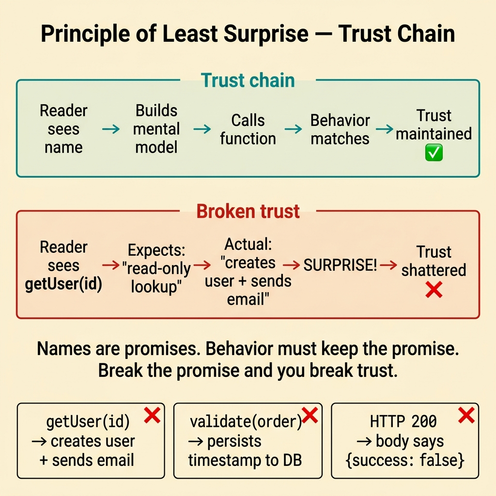
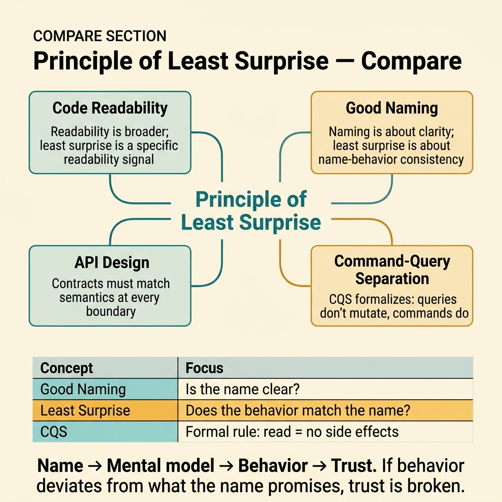

<!-- tags: glossary, reference, developer-cognition-team-dynamics, code-readability-comprehension, principle-of-least-surprise -->
# Principle of Least Surprise

> A design principle stating that code behavior should match what a reader reasonably expects from its name, signature, and context.

| Aspect | Detail |
| --- | --- |
| **Concept** | A design principle stating that code behavior should match what a reader reasonably expects from its name, signature, and context. |
| **Audience** | Developer, reviewer, API designer |
| **Primary style** | Glossary term |
| **Entry point** | Use when functions, APIs, or modules behave differently from what their name, signature, or documentation suggests. |

📅 Created: 2026-03-30 · 🔄 Updated: 2026-04-04 · ⏱️ 10 min read

---

## 1. DEFINE

Picture calling a function named `getUser(id)` and expecting it to return a user object. Instead, it silently creates a new user if the ID does not exist, triggers a welcome email, and returns the newly created record. The name said "get" but the behavior said "get or create and notify." Every time code behavior deviates from what the name and context promise, the reader's mental model shatters. The Principle of Least Surprise exists to prevent exactly this kind of cognitive betrayal.

**Principle of Least Surprise** (also known as Principle of Least Astonishment) is a design principle stating that code behavior should match what a reader reasonably expects from its name, signature, and context.

| Variant | Description |
| --- | --- |
| Naming surprise | The function name promises one thing, but the body does something additional or different. |
| Side-effect surprise | A function that looks like a pure query actually mutates state. |
| Contract surprise | An API endpoint or interface behaves differently from what the types and docs suggest. |

| Approach | Time | Space | When to choose |
| --- | --- | --- | --- |
| Rename to match actual behavior | O(n identifiers) | O(1) | When the function does what it should but the name is misleading. |
| Extract hidden side effects | O(n refactors) | O(refactor plan) | When the function does too many things and some are not expected. |
| Document unavoidable surprises | O(n doc updates) | O(1) | When the surprise is inherent to the domain and cannot be refactored away. |

Core insight:

> The reader's first mental model is built from the name, the types, and the surrounding context. Every hidden behavior that deviates from that model is a surprise — and surprises in code are bugs in trust.

### 1.1 Invariants & Failure Modes

The invariant is that calling a function should produce only the effects a reasonable reader would predict from the name and signature. When a function named `validate` also persists data, or a function named `get` also creates records, the contract between author and reader is broken.

---

## 2. CONTEXT

**Who uses it**: Developer, reviewer, API designer

**When**: Use when functions, APIs, or modules behave differently from what their name, signature, or documentation suggests.

**Purpose**: The reader's first mental model is built from the name and types. Every hidden behavior that deviates from that model is a surprise. Surprises erode trust and cause bugs in reasoning.

**In the ecosystem**:
- This principle directly connects to readability: surprising code is unreadable code, even if the syntax is clean.
- It applies everywhere: function names, API contracts, config defaults, error handling, middleware behavior.
- The principle does not mean "never do complex things" — it means "tell the reader what you are about to do."

---

No surprises sounds simple. But how do you identify surprises in your own code, where is the line between "helpful magic" and violation, and what do you do when the surprise is inherent to the domain?

## 3. EXAMPLES

Principle of Least Surprise surfaces most visibly when `getUser` creates a user, when `validate` sends an email, or when an API returns 200 OK for a failed operation. The examples below place the pattern into exactly those situations.

### Example 1: Basic — A getter that secretly mutates state

You call `getUser(id)` expecting a lookup. The function actually creates a new user if the ID is not found, triggering a welcome email. The reader assumed "get" means read-only. At the basic level, the fix is making the name match the actual behavior.

The input is a function whose name promises a query but performs a command. The output is either renaming to match the behavior or extracting the side effect into a separate function. Complexity is low because it is primarily renaming.



*Figure: Names are promises. Behavior must keep the promise. Break the promise and you break trust.*

```go
// SURPRISE: getUser creates a user and sends email
// FIX: rename to match actual behavior
func getOrCreateUser(id string) (*User, error) {
	user, err := repo.FindByID(id)
	if err == ErrNotFound {
		user = createNewUser(id) // now explicit in the name
		return user, nil
	}
	return user, err
}

// Or better: separate the concerns
func getUser(id string) (*User, error) {
	return repo.FindByID(id) // pure lookup, no surprises
}
```

**Why?** "Get" in every programmer's mental model means "read, no side effects." When "get" also writes, the reader's assumption is violated at the most fundamental level. This is not a style issue — it is a trust issue.

**Takeaway**: If the behavior does not match the name, either rename the function or extract the hidden behavior.
**Caveat**: Sometimes "get or create" is a valid pattern (e.g., caches), but the name must say so explicitly.
**Use when**: a function named with a read verb (get, find, fetch) actually performs mutations.

### Example 2: Intermediate — A validation function with hidden side effects

A function named `validateOrder(order)` checks business rules — and also saves a validation timestamp to the database. The caller expects a pure check that returns an error or nil. The hidden persist turns a "safe to call anywhere" function into one that can only be called once.

The input is a validation function with a hidden write. The output is a clean separation: validate returns a result, persist happens explicitly elsewhere. Complexity is moderate because callers may depend on the side effect.

```go
// Validate is now a pure check — no hidden writes
func validateOrder(order Order) error {
	if order.Total <= 0 {
		return errors.New("order total must be positive")
	}
	if order.Items == nil || len(order.Items) == 0 {
		return errors.New("order must have at least one item")
	}
	return nil
}

// Timestamp recording happens explicitly where the caller controls it
func recordValidation(orderID string, result error) {
	repo.SaveValidationResult(orderID, result, time.Now())
}
```

**Why?** Validation functions carry an implicit promise: "I only check, I do not change anything." When that promise is broken, every caller must now worry about when and how many times they call validate — a cognitive burden that should not exist.

**Takeaway**: Functions with names that imply "check" or "validate" should be side-effect-free. Make writes explicit.
**Caveat**: Logging inside a validation function is usually acceptable because it does not affect business state.
**Use when**: callers are surprised by state changes after calling what looks like a pure function.

### Example 3: Advanced — An API endpoint whose error response contradicts its status code

A REST endpoint responds with HTTP 200 and a body containing `{ "success": false, "error": "payment declined" }`. The caller's HTTP client sees 200 and treats the response as successful — the error is silently swallowed. At the advanced level, least surprise applies to communication contracts, not just function internals.

The input is an API that uses success status codes for failures. The output is an API that uses correct HTTP status codes so clients can trust the protocol. Complexity is high because fixing this may break existing integrations.

```go
// WRONG: 200 for a business error — surprise for every HTTP client
// respondJSON(w, 200, ErrorResponse{Success: false, Error: "payment declined"})

// RIGHT: status code matches the outcome
func handlePayment(w http.ResponseWriter, r *http.Request) {
	result, err := paymentService.Charge(r)
	if err != nil {
		// 402 Payment Required — HTTP semantics match business semantics
		respondJSON(w, http.StatusPaymentRequired, map[string]string{
			"error": err.Error(),
		})
		return
	}
	respondJSON(w, http.StatusOK, result)
}
```

**Why?** HTTP status codes are a universal contract. Every HTTP client, every monitoring tool, and every load balancer relies on status codes to make decisions. Returning 200 for an error violates the contract at the infrastructure level, not just the application level.

**Takeaway**: Contracts (HTTP, events, schemas) must match their semantics. A success code for a failure is a lie.
**Caveat**: Some legacy APIs cannot be fixed without breaking clients; in that case, document the deviation prominently.
**Use when**: API consumers report that errors are silently swallowed, or monitoring tools miss failures.

### Example 4: Expert — Surprise at the system boundary requires a deprecation strategy

An event named `OrderProcessed` fires before the order is actually processed — it signals "processing started," not "processing completed." Every downstream consumer assumed the past tense meant completion. At the expert level, fixing surprises at system boundaries requires coordinated migration.

The input is an event name that misleads consumers about its timing semantics. The output is a corrected event name with a versioned migration plan. Complexity is high because multiple teams consume the event.

```go
// PHASE 1: Introduce the correct event alongside the misleading one
type OrderProcessingStarted struct {
	OrderID   string
	StartedAt time.Time
}

// PHASE 2: Deprecate the old event with a clear timeline
// OrderProcessed — DEPRECATED: use OrderProcessingStarted
// Removal date: 2026-06-01, Owner: payments-team
```

**Why?** Surprise at async boundaries multiplies because each consumer independently builds an assumption. Fixing the name requires coordinated migration — but leaving the lie in place guarantees that future consumers will make the same mistake.

**Takeaway**: Fixing system-level surprises requires a deprecation strategy, not just a rename.
**Caveat**: During migration, both old and new events may coexist; document which is canonical.
**Use when**: downstream consumers are building incorrect assumptions based on misleading event/API names.

---

## 4. COMPARE




*Figure: Position of Principle of Least Surprise among readability, naming, and API design.*

Principle of Least Surprise sounds like "good naming." Deeper: naming is about clarity, least surprise is about consistency between name and behavior. A function can be well-named but still surprise you if its side effects are hidden.

### Level 1

```text
reader sees name and types
  -> builds mental model
  -> calls the function
  -> actual behavior matches model
  -> trust maintained
```

*Figure: Level 1 shows the chain: name → mental model → behavior → trust. Surprise breaks the chain.*

### Level 2

```text
surprise
  getUser(id) → creates user + sends email
  validate(order) → also persists timestamp
  HTTP 200 → actually an error

no surprise
  getOrCreateUser(id) → name matches behavior
  validate(order) → pure check, returns error only
  HTTP 402 → status code matches outcome
```

*Figure: Level 2 shows the contrast between surprising and non-surprising code across functions and APIs.*

### Easy to confuse or cross the boundary

| # | Severity | Mistake | Consequence | Fix |
| --- | --- | --- | --- | --- |
| 1 | 🔴 Fatal | "Get" function that creates and mutates | Reader's trust is shattered at the most basic level | Rename or extract the side effect. |
| 2 | 🟡 Common | Validation function with hidden writes | Callers cannot reason about call safety | Make validation side-effect-free. |
| 3 | 🟡 Common | Success status code for business errors | Monitoring and clients silently swallow failures | Use correct HTTP semantics. |
| 4 | 🔵 Minor | Event name implies completion but fires at start | Consumers build wrong timing assumptions | Rename with a deprecation migration plan. |

### Quick scan

| If you encounter | What to do |
| --- | --- |
| A "get" function that creates or mutates | Rename to match behavior or extract the side effect. |
| A "validate" function that writes to the database | Separate the check from the write. |
| HTTP 200 returned for an error | Use the correct HTTP status code. |
| An event name that misleads about timing | Introduce the correct event and deprecate the old one. |

---

## 5. REF

| Resource | Type | Link | Notes |
| --- | --- | --- | --- |
| Principle of Least Astonishment | Wikipedia | https://en.wikipedia.org/wiki/Principle_of_least_astonishment | Overview and history of the principle. |
| Clean Code | Book | https://www.investigatii.md/uploads/resurse/Clean_Code.pdf | Strong guidance on naming and side-effect discipline. |
| Code Readability | Related term | ./01-code-readability.md | Least surprise is a specific readability signal. |

---

## 6. RECOMMEND

Principle of Least Surprise solves the problem of "code that does things you did not expect." The next question: how to make code self-explaining without comments, and how does naming scale to shared language?

| Expand to | When | Why | File/Link |
| --- | --- | --- | --- |
| Self-Documenting Code | When you want to eliminate the need for explainer comments | If names are non-surprising, comments for "what" become unnecessary. | [Self-Documenting Code](./03-self-documenting-code.md) |
| Code Readability | When you want the broader readability frame | Least surprise is one signal within the readability family. | [Code Readability](./01-code-readability.md) |
| Ubiquitous Language | When surprises come from vocabulary drift | Inconsistent terminology across code and docs is a form of surprise. | [Ubiquitous Language](./04-ubiquitous-language.md) |

Back to that `getUser` from the beginning — it created a user and sent an email. Now you know: names are promises, behavior must keep the promise. `get` means read-only, `validate` means check-only, `200` means success. Break the promise and you break trust.

**Links**: [← Previous](./01-code-readability.md) · [→ Next](./03-self-documenting-code.md)
