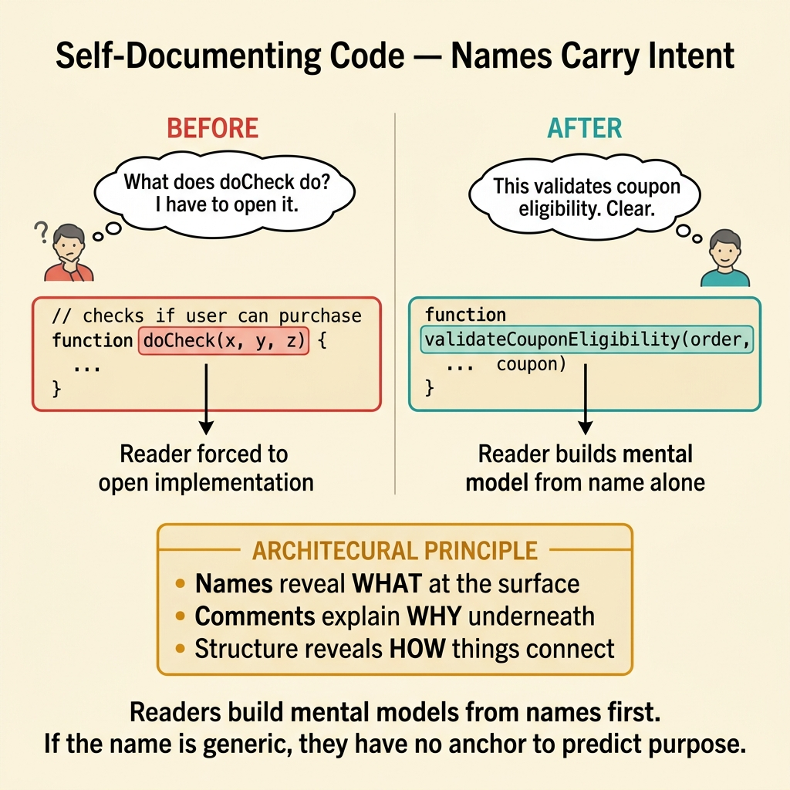
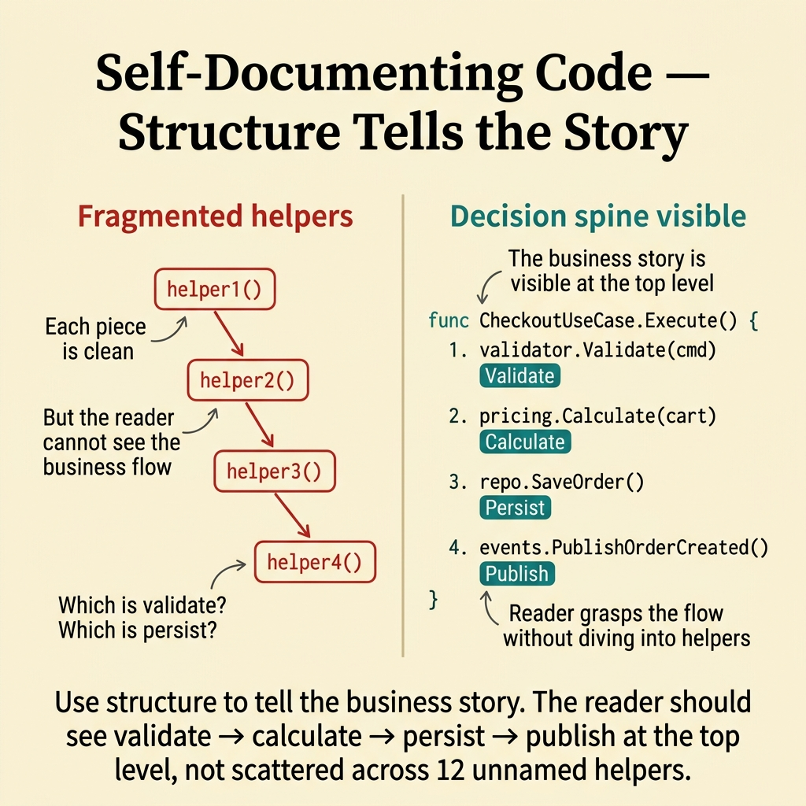
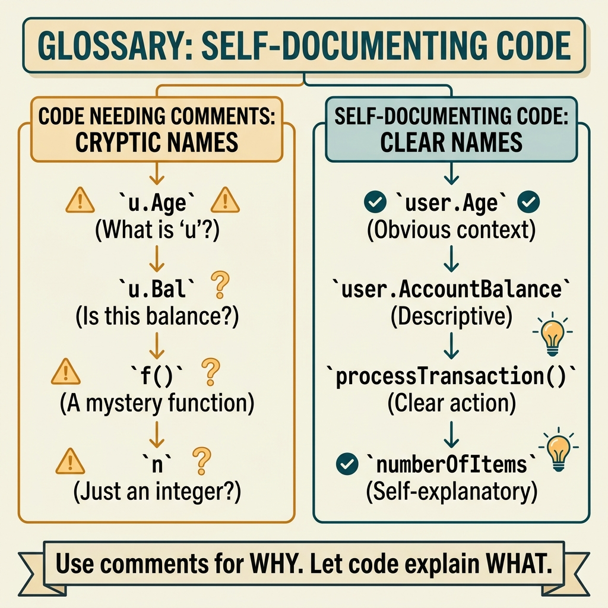

<!-- tags: glossary, reference, developer-cognition-team-dynamics, code-readability-comprehension, self-documenting-code -->
# Self-Documenting Code

> A coding style where function names, variable names, module structure, and boundaries are clear enough that readers grasp the intent without redundant comments.

| Aspect | Detail |
| --- | --- |
| **Concept** | A coding style where function names, variable names, module structure, and boundaries are clear enough that readers grasp the intent without redundant comments. |
| **Audience** | Developer, reviewer, maintainer |
| **Primary style** | Glossary term |
| **Entry point** | Use when the team wants to reduce "translation" comments and increase the ability to understand code directly from names, structure, and boundaries. |

📅 Created: 2026-03-30 · 🔄 Updated: 2026-04-04 · ⏱️ 10 min read

---

## 1. DEFINE

Picture a file where a long comment explains "this function checks whether the user can purchase an item," but the function is named `doCheck()` and accepts parameters `x`, `y`, `z`. The comment rescues the reader in the short term, but the moment the logic changes, the comment goes stale while the code remains opaque. Self-documenting code aims for a harder target: let the code's own structure carry the obvious meaning, so comments are reserved for reasoning that the code cannot express on its own.

**Self-Documenting Code** is a coding style where function names, variable names, module structure, and boundaries are clear enough that readers grasp the intent without redundant comments.

| Variant | Description |
| --- | --- |
| Semantic naming | Names that reveal the role and meaning of a code element. |
| Structural self-documentation | Boundaries and module shape help the reader correctly predict responsibility. |
| Intent-first comments | Comments serve only to explain decisions or caveats, never to translate the code. |

| Approach | Time | Space | When to choose |
| --- | --- | --- | --- |
| Rename for intent | O(n identifiers) | O(1) | When the problem is names that do not convey business meaning. |
| Extract around business actions | O(n refactors) | O(refactor plan) | When the reader can only understand the code after reading every detail. |
| Reserve comments for reasoning | O(n review passes) | O(1) | When the code is full of comments that repeat statements instead of explaining why. |

Core insight:

> Self-documenting code does not mean "never write comments." It means structure and names must carry the obvious meaning, so comments are reserved for what the code alone cannot tell: trade-offs, invariants, caveats.

### 1.1 Invariants & Failure Modes

The invariant is that the reader must understand "what this block does" before diving into mechanical details. When the code only reveals its meaning after reading 50 lines or relying on a comment above, self-documentation has failed.

---

## 2. CONTEXT

**Who uses it**: Developer, reviewer, maintainer

**When**: Use when the team wants to reduce "translation" comments and increase the ability to understand code directly from names, structure, and boundaries.

**Purpose**: Self-documenting code does not mean "never write comments." It means structure and names carry the obvious meaning, so comments are reserved for what the code alone cannot tell: trade-offs, invariants, caveats.

**In the ecosystem**:
- Well self-documented code lets the reader predict purpose before reading the implementation.
- Self-documenting code is not synonymous with extremely long names; what matters is names at the right level of abstraction.
- Comments are still needed when technical decisions are non-obvious, but comments should not serve as a dictionary that translates the code.

---

The concept of self-explanatory code is clear. But when do you still need comments, when does self-documenting become verbose, and where is the boundary?

## 3. EXAMPLES

Self-documenting code becomes most visible when a comment says "increment i" above `i++`, when code without comments leaves no one understanding the business logic, or when a function name stretches to 50 characters "trying to self-explain." The examples below place the pattern into exactly those situations.

### Example 1: Basic — Function name does not reveal the business action

You read a service with a function `handle(order)`. To know whether "handle" means validate, persist, or publish, you are forced to open the implementation. At the basic level, self-documenting code starts by letting names carry the business action from the very first glance.

The input is a generic function name. The output is a new name that reveals purpose so the reader understands context before even opening the function body. Complexity is low because only the surface-level semantics change.



*Figure: Readers build mental models from names first. If the name is generic, they have no anchor to predict purpose.*

```go
func validateCouponEligibility(order Order, coupon Coupon) error {
	// The function name already says this is a validation step,
	// not "do something with coupon."
	if coupon.ExpiredAt.Before(time.Now()) {
		return errors.New("coupon expired")
	}
	return nil
}
```

**Why?** Readers build mental models from names first. If a name is generic, they have no anchor to predict purpose and are forced to read the implementation even for simple cases.

**Takeaway**: You expose the business action at the code surface, reducing the need to "open the box" prematurely.
**Caveat**: A long but vague name still does not help; the focus is meaning, not character count.
**Use when**: function names like `handle`, `process`, `doWork` appear in business-critical locations.

### Example 2: Intermediate — Comments translate statements instead of explaining decisions

You see a comment `// increment retry counter` directly above the line `retryCount++`. This comment adds no new meaning. At the intermediate level, self-documenting code requires cleaning out these translation comments to make room for reasoning that truly matters.

The input is a code block full of translation comments. The output is code that reads on its own through better naming, with comments retained only for non-obvious decisions. Complexity is moderate because both code and review habits need adjustment.

```go
func nextRetryDelay(attempt int) time.Duration {
	// Exponential backoff is capped at 30s to keep tail latency
	// from exploding during traffic bursts; this is a policy decision
	// that cannot be inferred directly from the code.
	delay := time.Second * time.Duration(1<<attempt)
	if delay > 30*time.Second {
		return 30 * time.Second
	}
	return delay
}
```

**Why?** A comment has value only when it adds information the reader cannot immediately infer from the code. If a comment merely repeats the statement, it increases noise and obscures the reasoning comments that truly matter.

**Takeaway**: You free comments from the "translator" role so they can focus on policy and important caveats.
**Caveat**: Do not go to the extreme of removing all comments; non-obvious decisions still need to be stated.
**Use when**: a file has many comments describing what the code already says clearly.

### Example 3: Advanced — Structure does not tell the right story of the use case

A checkout use case is split into many small helpers, but the helper names and folder layout do not reveal which is validate, which is pricing, and which is side effect. The reader sees "very clean" but cannot follow the business story. At the advanced level, self-documentation is a problem of organizing narrative through structure.

The input is an over-fragmented flow. The output is boundaries and function names that reflect the decision spine of the use case. Complexity is high because structural refactoring is needed, not just renaming.



*Figure: Use structure to tell the business story. The reader should see validate → calculate → persist → publish at the top level.*

```go
type CheckoutUseCase struct {
	validator PaymentValidator
	pricing   PricingService
	repo      OrderRepository
	events    EventPublisher
}

func (uc *CheckoutUseCase) Execute(cmd CheckoutCommand) error {
	if err := uc.validator.Validate(cmd); err != nil {
		return err
	}

	finalPrice := uc.pricing.Calculate(cmd.Cart)
	if err := uc.repo.SaveOrder(cmd.UserID, finalPrice); err != nil {
		return err
	}

	return uc.events.PublishOrderCreated(cmd.UserID, finalPrice)
}
```

**Why?** A well self-documented structure exposes the decision spine of the flow at the right abstraction level. The reader does not need to dive into every small helper to know the system is validating, calculating, persisting, then publishing.

**Takeaway**: You use structure to tell the business story, instead of forcing the reader to reassemble it from scattered helper fragments.
**Caveat**: Self-documenting does not mean flattening everything into a single layer.
**Use when**: code is "clean" in the sense of small splits, but the reader still cannot grasp the overall flow.

### Example 4: Expert — Self-documenting code must synchronize with docs and review language

A team uses `tenant` in docs, `workspace` in code, and `org` in the dashboard. Each artifact may be "self-readable" locally, but the system as a whole is not. At the expert level, self-documentation must extend beyond the code file and become a discipline of shared language.

The input is multiple artifacts using different vocabulary for the same domain concept. The output is a unified set of names and terms across code, docs, review templates, and runtime labels. Complexity is high because it requires team-wide coordination.

```go
type WorkspaceID string

type InviteWorkspaceMemberCommand struct {
	WorkspaceID WorkspaceID
	Email       string
}

func (uc *InviteWorkspaceMemberUseCase) Execute(cmd InviteWorkspaceMemberCommand) error {
	// Uses the same vocabulary "workspace" across type, command, and use case
	// so the reader does not have to translate between different names
	// for the same concept.
	return uc.membership.Invite(cmd.WorkspaceID, cmd.Email)
}
```

**Why?** Code is only truly "self-documenting" when its language matches the language the team uses everywhere else. If each artifact calls the same concept by a different name, the reader still has to manually translate the mental model.

**Takeaway**: You elevate self-documenting code from a local technique to a shared language across the entire team.
**Caveat**: Changing vocabulary across the system requires a planned migration; do not rename en masse without prioritization.
**Use when**: the same domain concept is called by different names across code, docs, and the dashboard.

---

## 4. COMPARE




*Figure: Position of self-documenting code among code readability, comments, and documentation.*

Self-documenting sounds like "no comments needed." Wrong: self-documenting code explains what and how, but why still needs comments. Business rules, workarounds, non-obvious decisions — comment those.

### Level 1

```text
reader sees code
  -> names reveal intent
  -> structure reveals responsibility
  -> comments explain only the non-obvious
```

*Figure: Level 1 shows how self-documenting code divides roles clearly: names and structure carry meaning, comments carry reasoning.*

### Level 2

```text
bad
  code says: doThing(x, y)
  comment says: validate coupon and update order

good
  code says: validateCouponAndUpdateOrder(...)
  comment says: update happens before publish to avoid duplicate events
```

*Figure: Level 2 highlights the difference between comments that translate statements and comments that explain decisions.*

### Easy to confuse or cross the boundary

You have seen where Self-Documenting Code should be applied. The mistakes below are common misuses that make code syntactically correct but still leave the reader gasping for context.

| # | Severity | Mistake | Consequence | Fix |
| --- | --- | --- | --- | --- |
| 1 | 🔴 Fatal | Using comments to compensate for poor naming | Comments go stale fast, code remains hard to read | Fix names and boundaries first, then comment. |
| 2 | 🟡 Common | Misunderstanding self-documenting as "never need comments" | Difficult decisions go unexplained | Keep comments for reasoning and caveats. |
| 3 | 🟡 Common | Over-splitting without clarifying the narrative | Reader sees many clean pieces but cannot understand the flow | Organize structure around business actions. |
| 4 | 🔵 Minor | Vocabulary in code diverges from docs/runtime labels | Team must translate the concept across artifacts | Synchronize shared language across the system. |

### Quick scan

| If you encounter | What to do |
| --- | --- |
| Generic function names that force the reader to open the implementation | Rename according to the business action. |
| Comments that translate the statement | Keep comments for reasoning, not translation. |
| Beautifully small structure but the overall flow is invisible | Reorganize around the decision spine of the use case. |
| Domain concept changes name between code and docs | Synchronize shared vocabulary. |

---

## 5. REF

| Resource | Type | Link | Notes |
| --- | --- | --- | --- |
| Refactoring | Book | https://martinfowler.com/books/refactoring.html | Many rename and extract techniques to increase clarity. |
| Clean Code | Book | https://www.investigatii.md/uploads/resurse/Clean_Code.pdf | Extensive discussion on names and comments. |
| Ubiquitous Language | Related term | ./04-ubiquitous-language.md | Helps extend self-documenting to the domain level. |

---

## 6. RECOMMEND

Self-documenting code solves the problem of "outdated and misleading comments." The next question: how to handle ubiquitous language naming, and what about naming conventions?

| Expand to | When | Why | File/Link |
| --- | --- | --- | --- |
| Naming Convention | When the focus is on naming rules | Naming is the first layer of self-documentation. | [Naming Convention](./05-naming-convention.md) |
| Ubiquitous Language | When you need to extend clarity from local code to the domain level | Shared language helps code speak the right business meaning. | [Ubiquitous Language](./04-ubiquitous-language.md) |
| Code Readability | When you want to return to the foundational concept | Self-documenting code is one way to realize readability. | [Code Readability](./01-code-readability.md) |

Back to that "increment i" comment from the beginning — useless. Now you know: code explains what, comments explain why. Good variable/function names > comments. But "why this workaround" still needs a comment. Balance, not extremes.

**Links**: [← Previous](./02-principle-of-least-surprise.md) · [→ Next](./04-ubiquitous-language.md)
