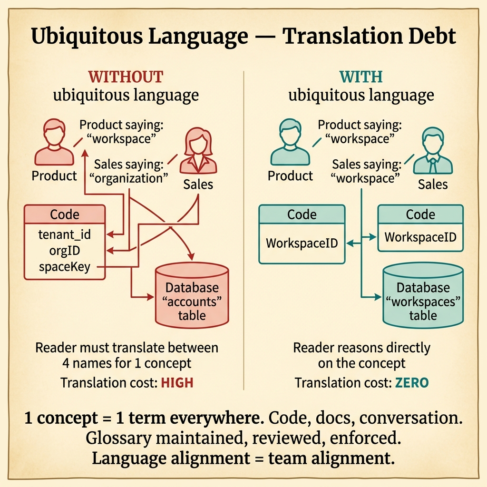
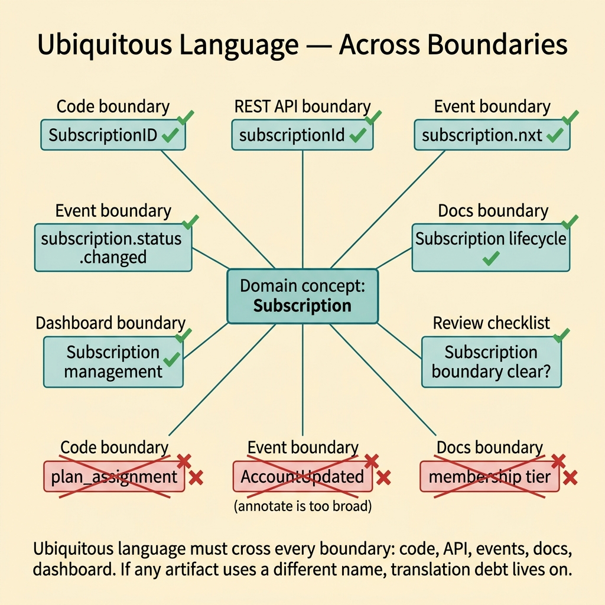
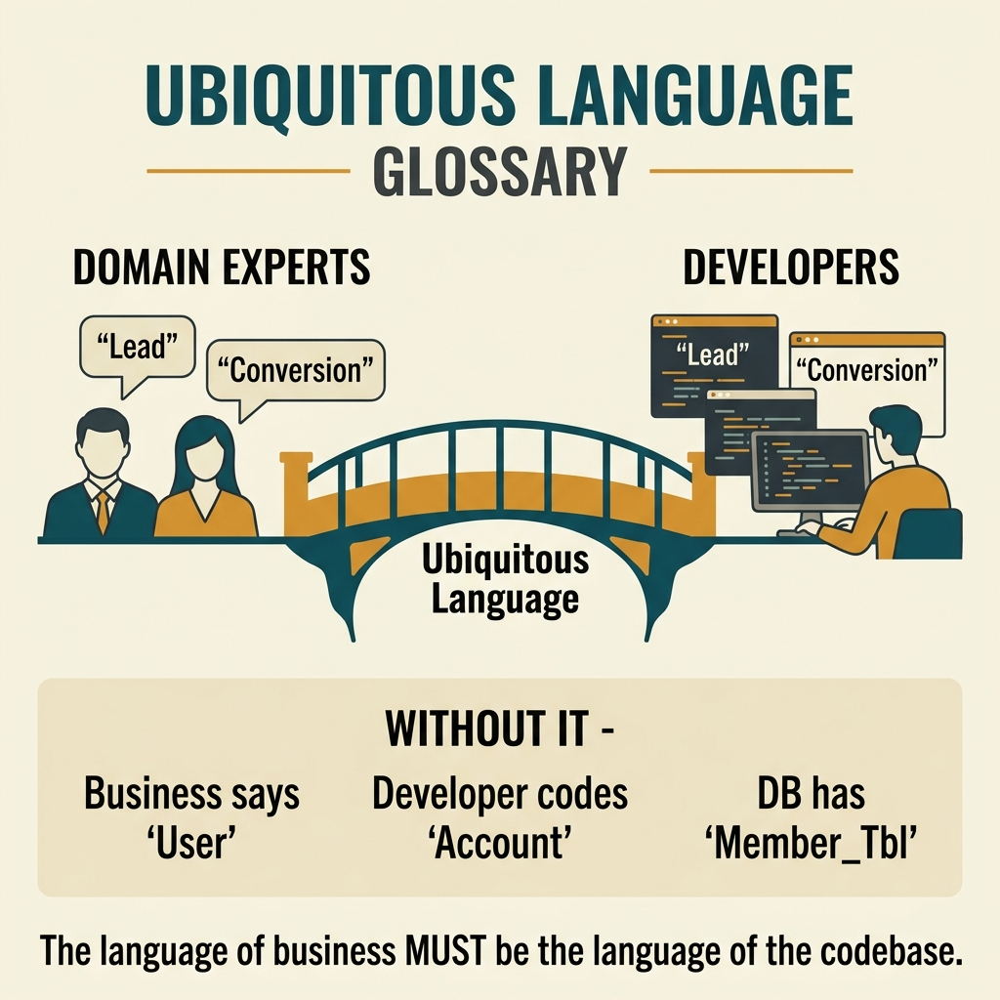

<!-- tags: glossary, reference, developer-cognition-team-dynamics, code-readability-comprehension, ubiquitous-language -->
# Ubiquitous Language

> A unified vocabulary shared between developers and domain experts to describe the same concept with the same name.

| Aspect | Detail |
| --- | --- |
| **Concept** | A unified vocabulary shared between developers and domain experts to describe the same concept with the same name. |
| **Audience** | Developer, domain expert, architect |
| **Primary style** | Glossary term |
| **Entry point** | Use when code, documentation, and meetings call the same concept by different names, causing reasoning to drift. |

📅 Created: 2026-03-30 · 🔄 Updated: 2026-04-04 · ⏱️ 10 min read

---

## 1. DEFINE

Picture Product calling it a "workspace," the sales deck calling it an "organization," and the codebase sporting `tenant_id`, `orgID`, and `spaceKey` — all for the same concept. Nobody intentionally made things harder, but each artifact added another translation layer. By the time a review or debug session starts, the team wastes time arguing "are we even talking about the same thing?" Ubiquitous language exists to stop exactly this kind of friction.

**Ubiquitous Language** is a unified vocabulary shared between developers and domain experts to describe the same concept with the same name.

| Variant | Description |
| --- | --- |
| Domain term | Vocabulary that describes a real business concept. |
| Technical alias | A technical name that appears in code, schema, or events. |
| Translation debt | The state where multiple aliases coexist and force the reader to map between them. |

| Approach | Time | Space | When to choose |
| --- | --- | --- | --- |
| Normalize domain terms | O(n terms) | O(glossary) | When multiple names compete for the same concept. |
| Propagate vocabulary through code | O(n refactors) | O(migration plan) | When docs are clear but code still uses old technical aliases. |
| Encode vocabulary in contracts | O(n boundaries) | O(doc + schema updates) | When events, APIs, or schemas are where the term drifts. |

Core insight:

> Ubiquitous language is not a naming beauty contest. It is a mechanism to reduce translation debt. The fewer translations needed between business speak and code speak, the faster a team reasons and the fewer misunderstandings occur.

### 1.1 Invariants & Failure Modes

The invariant is that the same concept must carry the same name across key artifacts. When schema, API, and docs use three different labels for the same idea, the reader struggles to maintain the correct mental model.

---

## 2. CONTEXT

**Who uses it**: Developer, domain expert, architect

**When**: Use when code, documentation, and meetings call the same concept by different names, causing reasoning to drift.

**Purpose**: Ubiquitous language is not a naming beauty contest. It is a mechanism to reduce translation debt. The fewer translations between business speak and code speak, the faster the team reasons and the fewer misunderstandings happen.

**In the ecosystem**:
- A good term must be stable enough to use in code, docs, reviews, and incident conversations.
- Not every alias is bad; but each additional alias is a new translation cost.
- This is a concept at the team and knowledge-system level, not just local naming.

---

The idea of a shared language between dev and domain expert is clear. But who maintains the glossary, how is language drift handled, and how does bounded context affect language?

## 3. EXAMPLES

Ubiquitous language surfaces most visibly when a developer says "order" but the business says "purchase request," when the code has three different words for the same concept, or when a domain expert cannot understand the code because the naming is completely different. The examples below place the pattern into exactly those situations.

### Example 1: Basic — The same concept is called by two names within the same module

You read a membership module and see `tenantID` in one function, `workspaceID` in another, even though both point to the same entity. The reader is forced to guess whether they are equivalent or different. At the basic level, ubiquitous language starts by cutting redundant aliases at the local scope.

The input is a module with two names for the same concept. The output is the same behavior using a single unified domain term. Complexity is low because it mainly involves cleaning up local drift.



*Figure: 1 concept = 1 term everywhere. Language alignment = team alignment.*

```go
type WorkspaceID string

func InviteWorkspaceMember(workspaceID WorkspaceID, email string) error {
	// A single name for the same domain concept keeps the reader
	// from having to build a mapping table in their head.
	return membershipRepo.Invite(workspaceID, email)
}
```

**Why?** Readers typically have only a few seconds to decide "do I understand the context?" Two names for the same concept make them doubt the boundary and spend extra mental effort re-checking assumptions.

**Takeaway**: You cut translation debt right at the local scope with a single unified domain term.
**Caveat**: Renaming locally without fixing related artifacts may just move the debt elsewhere.
**Use when**: the same concept is called differently within the same module or PR.

### Example 2: Intermediate — API contract uses different terminology from the business language

Product and support say "subscription," but the REST API exposes a field called `plan_assignment`. The API reader has to learn an extra language even though the domain already has a perfectly clear term. At the intermediate level, you need to pull the public contract closer to the domain language.

The input is an API/schema field that has drifted from the domain vocabulary. The output is a contract that uses names closer to the domain, or at least provides an explicit mapping. Complexity is moderate because backward compatibility may be affected.

```go
type SubscriptionStatusResponse struct {
	SubscriptionID string `json:"subscriptionId"`
	Status         string `json:"status"`
}

func toSubscriptionStatusResponse(s Subscription) SubscriptionStatusResponse {
	return SubscriptionStatusResponse{
		SubscriptionID: s.ID,
		Status:         s.Status,
	}
}
```

**Why?** Public contracts are where vocabulary gets amplified the fastest — through SDKs, docs, and support scripts. If the contract uses an alias far from the domain, translation debt does not just live in the code; it spreads across the entire surrounding ecosystem.

**Takeaway**: You bring public vocabulary back to the domain, reducing the semantic gap between business and API.
**Caveat**: For APIs that have been public for a long time, renaming fields requires a clear migration strategy.
**Use when**: support, product, and developers are constantly "translating" between business language and API language.

### Example 3: Advanced — Event names and payloads drift domain understanding

An event named `AccountUpdated` actually refers only to a billing preference change, but another listener interprets "account" as the identity profile. At the advanced level, ubiquitous language must be maintained even across async boundaries, where misunderstandings are easily replicated as bugs between services.

The input is an event contract that is too broad or ambiguous. The output is an event name and payload that accurately reflect the specific domain slice being discussed. Complexity is high because it affects multiple consumers.



*Figure: Ubiquitous language must cross every boundary: code, API, events, docs, dashboard.*

```go
type BillingPreferenceChanged struct {
	WorkspaceID string
	Currency    string
}

func publishBillingPreferenceChanged(evt BillingPreferenceChanged) error {
	// A specific event name narrows the domain slice so consumers
	// do not infer too broadly.
	return bus.Publish("billing.preference.changed", evt)
}
```

**Why?** Async systems make vocabulary drift more dangerous than synchronous code because producers and consumers do not see the same implementation. An ambiguous event name lets each consumer build its own meaning, and divergence appears very quickly.

**Takeaway**: You use ubiquitous language to keep distributed boundaries speaking the same thing.
**Caveat**: Changing event contracts requires coordination and disciplined versioning.
**Use when**: multiple services subscribe to the same event but each interprets it slightly differently.

### Example 4: Expert — Shared language must live in docs, review templates, and onboarding

A team has renamed the code beautifully, but onboarding docs and review checklists still use the old terms. New team members read docs one way, then open the code and see something different. At the expert level, ubiquitous language is only durable if it is encoded into every place the team uses to think together.

The input is a chosen domain vocabulary that has not yet propagated to all artifacts. The output is a set of docs, checklists, and templates that all use the same unified language. Complexity is high because this is governance, not just code refactoring.

```go
type ReviewChecklist struct {
	// The checklist uses the same vocabulary as the code
	// so the reviewer does not have to translate concepts.
	WorkspaceBoundaryClear bool
	BillingTermConsistent  bool
}
```

**Why?** Shared language does not sustain itself through source code alone. Teams think through docs, tickets, review comments, and dashboards too. If those artifacts use different terms, the code will quickly drift back.

**Takeaway**: You turn ubiquitous language into a team discipline, not just a rename campaign in the code.
**Caveat**: No need to force-standardize every term at once; prioritize domain terms that cause the most confusion or have the biggest impact.
**Use when**: code has improved but vocabulary arguments in reviews and docs keep recurring.

---

## 4. COMPARE




*Figure: Position of ubiquitous language among DDD, naming convention, and documentation.*

Ubiquitous language sounds like naming convention. Different: naming convention governs format (camelCase, snake_case), ubiquitous language governs semantics ("Order" means the exact same thing in code, docs, and conversation). Format vs meaning.

### Level 1

```text
domain concept
  -> shared name
  -> code / docs / meetings use the same term
  -> lower translation cost
```

*Figure: Level 1 shows how ubiquitous language turns a concept into a shared anchor for the entire team.*

### Level 2

```text
without ubiquitous language
  customer account -> tenant -> org -> workspace
  reader must translate continuously

with ubiquitous language
  workspace -> workspace -> workspace -> workspace
  reader reasons directly on the concept
```

*Figure: Level 2 highlights the biggest benefit: eliminating repetitive translation debt.*

### Easy to confuse or cross the boundary

You have seen where Ubiquitous Language should be applied. The mistakes below are common misuses that make code syntactically correct but still leave the reader gasping for context.

| # | Severity | Mistake | Consequence | Fix |
| --- | --- | --- | --- | --- |
| 1 | 🔴 Fatal | A concept has too many competing aliases | Reader and consumer misunderstand the boundary | Choose a canonical term and propagate with a plan. |
| 2 | 🟡 Common | Only renaming in code while forgetting schema/docs/events | Translation debt persists in other artifacts | Audit vocabulary across boundaries, not just source code. |
| 3 | 🟡 Common | Choosing a technical term far from the domain because "it is shorter" | Product and engineering struggle to reason together | Prioritize the domain term as canonical; technical alias is secondary. |
| 4 | 🔵 Minor | Standardizing too many terms at once | Chaotic migration, team fatigue from churn | Prioritize concepts that cause the most confusion first. |

### Quick scan

| If you encounter | What to do |
| --- | --- |
| The same concept called by multiple names | Choose a canonical term and apply across modules. |
| API field drifting from business language | Pull the contract closer to domain vocabulary. |
| Ambiguous event causing consumers to interpret differently | Rename event/payload to the specific domain slice. |
| Reviews and docs still using old terms | Synchronize vocabulary beyond the code. |

---

## 5. REF

| Resource | Type | Link | Notes |
| --- | --- | --- | --- |
| Domain-Driven Design | Book | https://www.domainlanguage.com/ddd/ | Ubiquitous language is a central concept of DDD. |
| DDD Reference | Reference | https://www.domainlanguage.com/ddd/reference/ | A concise summary of the building blocks. |
| Naming Convention | Related term | ./05-naming-convention.md | Naming convention is the mechanized layer of shared language. |

---

## 6. RECOMMEND

Ubiquitous language solves the problem of "dev and business say different things about the same concept." The next question: what format should naming conventions take, and how should magic numbers be avoided?

| Expand to | When | Why | File/Link |
| --- | --- | --- | --- |
| Naming Convention | When you need to turn the shared language into concrete naming rules | Shared language needs naming rules to be durable. | [Naming Convention](./05-naming-convention.md) |
| Self-Documenting Code | When you want to apply language to structure and function names | This is the implementation layer of shared vocabulary. | [Self-Documenting Code](./03-self-documenting-code.md) |
| Architecture Design / DDD | When you need to extend into domain modeling | DDD is where ubiquitous language shines brightest. | [DDD](/home/mvt/Repositories/Go/go-domain-driven-design/documents/assets/glosaries/architecture-design/DDD.md) |

Back to that "order" vs "purchase request" from the beginning — each person understood it differently. Now you know: 1 concept = 1 term everywhere (code, doc, conversation). Glossary maintained, reviewed, enforced. Language alignment = team alignment.

**Links**: [← Previous](./03-self-documenting-code.md) · [→ Next](./05-naming-convention.md)
