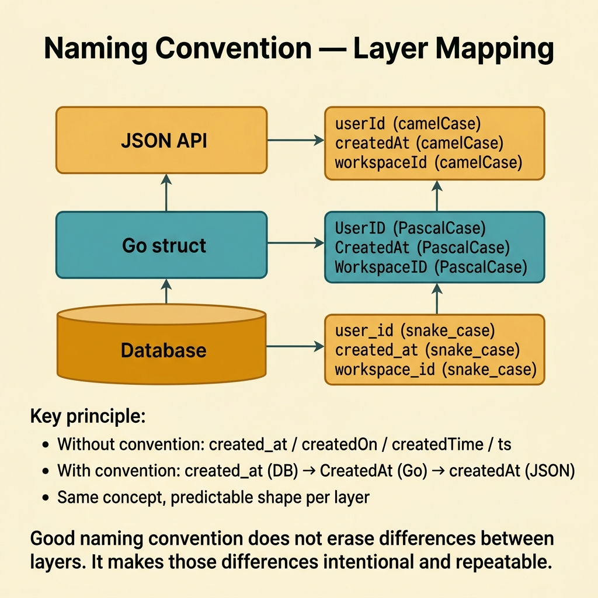
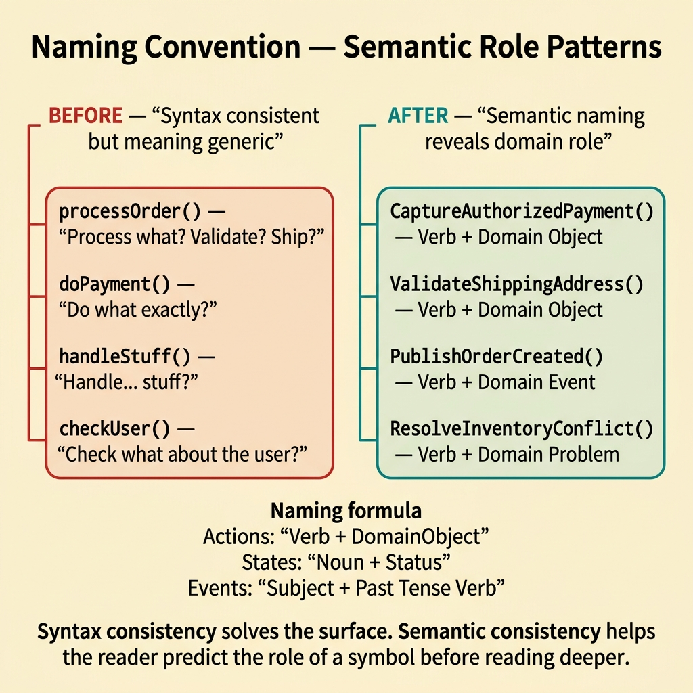
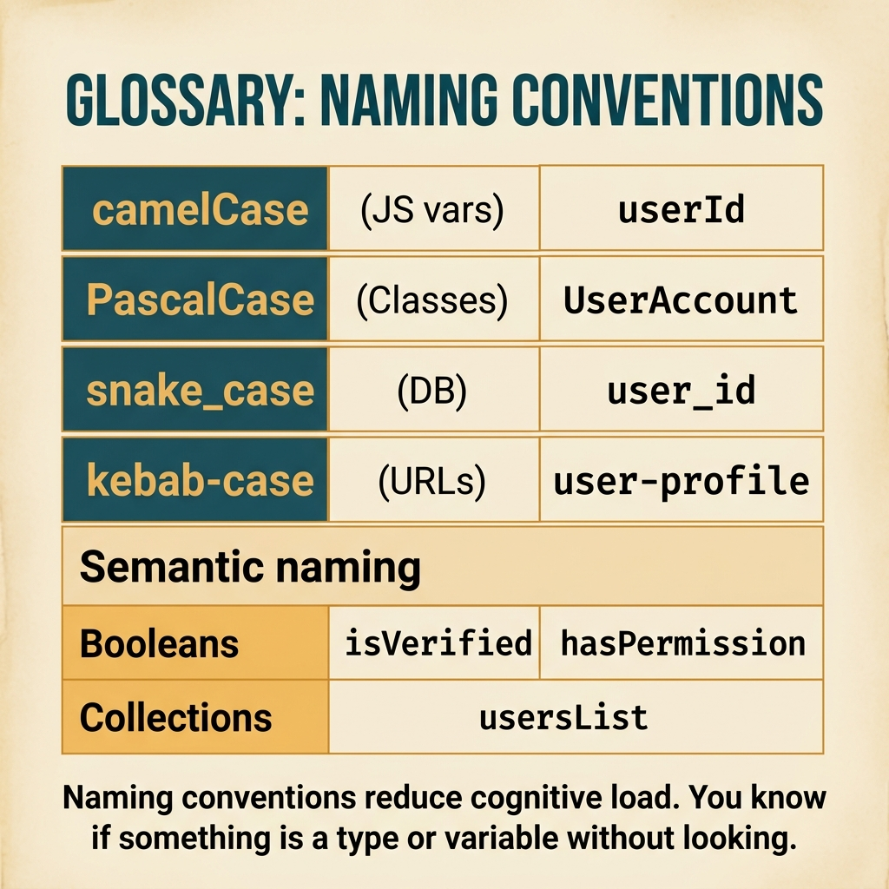

<!-- tags: glossary, reference, developer-cognition-team-dynamics, code-readability-comprehension, naming-convention -->
# Naming Convention

> A consistent set of naming rules for files, modules, functions, variables, and domain concepts across the entire codebase.

| Aspect | Detail |
| --- | --- |
| **Concept** | A consistent set of naming rules for files, modules, functions, variables, and domain concepts across the entire codebase. |
| **Audience** | Developer, reviewer, tech lead |
| **Primary style** | Glossary term |
| **Entry point** | Use when the team already has a shared language but the codebase still drifts because each person names things according to personal habit. |

📅 Created: 2026-03-30 · 🔄 Updated: 2026-04-04 · ⏱️ 10 min read

---

## 1. DEFINE

Picture two PRs that both handle the same type of timestamp, but one uses `created_at`, another uses `createdOn`, and a third prefers `createdTime`. Logically they are equivalent, but the reader has to stop and confirm "are these the same concept?" Naming convention does not make the system smarter, but it cuts an enormous amount of pointless friction like this.

**Naming Convention** is a consistent set of naming rules for files, modules, functions, variables, and domain concepts across the entire codebase.

| Variant | Description |
| --- | --- |
| Local naming | Rules for variables, functions, and types within a file or package. |
| Boundary naming | Rules for API fields, events, table columns, and config keys. |
| Domain naming | Rules to maintain the same vocabulary for the same concept across the entire system. |

| Approach | Time | Space | When to choose |
| --- | --- | --- | --- |
| Establish naming rule by layer | O(n rules) | O(style guide) | When the team is mixing snake_case, camelCase, and verb styles. |
| Normalize high-churn hotspots first | O(n refactors) | O(migration plan) | When you cannot rename the entire codebase at once. |
| Anchor names in domain language | O(n design reviews) | O(glossary) | When the real problem is meaning drift, not just formatting. |

Core insight:

> Naming convention is not about "making things look pretty." It is a mechanism to reduce uncertainty. The fewer unexpected naming patterns, the less energy the reader spends guessing whether similar-looking things are actually the same.

### 1.1 Invariants & Failure Modes

The invariant is that the same type of concept must have a consistent naming shape within its layer. When enums, events, table columns, and API fields each use a different style, the reader has to do extra classification work that creates no value.

---

## 2. CONTEXT

**Who uses it**: Developer, reviewer, tech lead

**When**: Use when the team already has a shared language but the codebase still drifts because each person names things according to personal habit.

**Purpose**: Naming convention is not about "making things look pretty." It is a mechanism to reduce uncertainty. The fewer unexpected naming patterns, the less energy the reader spends guessing whether similar-looking things are actually the same.

**In the ecosystem**:
- Good convention helps readers predict the type, role, and boundary of a symbol before diving deeper.
- Convention does not replace domain understanding; it only makes that shared understanding more stable.
- Naming convention should be simple enough for the team to remember and apply, not a jungle of rules.

---

The naming rules are clear. But which convention for Go, which for TypeScript, and when do you break convention?

## 3. EXAMPLES

Naming convention surfaces most visibly when a codebase mixes camelCase and snake_case, when the same concept has five different names in five files, or when abbreviations are so short nobody understands them ("usr", "txn", "ctx"). The examples below place the pattern into exactly those situations.

### Example 1: Basic — Same type of data but names do not share the same shape

You read a struct and see `userId`, `workspace_id`, and `createdTime` standing side by side. The values still parse correctly, but the reader no longer knows what the naming rule of this module is. At the basic level, naming convention starts by making the same type of concept share the same shape within the same layer.

The input is a struct with mixed field name styles. The output is a struct using consistent naming rules for the current layer. Complexity is low because it is mostly local cleanup.

```go
type MembershipRecord struct {
	UserID      string
	WorkspaceID string
	CreatedAt   time.Time
}
```

**Why?** Fast recognition is the greatest benefit of convention. When the reader sees `CreatedAt`, they do not need to spend an extra cognitive cycle guessing whether it is a timestamp or a business label.

**Takeaway**: You reduce friction by making symbols of the same kind look and read with the same rhythm.
**Caveat**: Convention shape does not compensate for poor meaning; `xID` is still a bad name even with the right letter case.
**Use when**: a file or package has many naming styles mixed together.

### Example 2: Intermediate — Every layer invents its own rules without clear mapping

The database uses `snake_case`, Go structs use `PascalCase`, and JSON returns `camelCase`. These differences are normal, but if the mapping is unclear or has whimsical exceptions, readers easily misidentify which field maps to which. At the intermediate level, naming convention must clarify rules per layer.

The input is multiple layers with different naming shapes. The output is a stable, predictable mapping between layers. Complexity is moderate because it requires designing rules, not just fixing local names.



*Figure: Good naming convention does not erase differences between layers. It makes those differences intentional and repeatable.*

```go
type UserProfile struct {
	UserID    string    `json:"userId" db:"user_id"`
	CreatedAt time.Time `json:"createdAt" db:"created_at"`
}
```

**Why?** Convention is most powerful when it helps the reader guess the mapping between layers without manually checking each field. Tags or generator rules make that relationship explicit and repeatable.

**Takeaway**: You turn cross-layer differences into intentional patterns instead of whimsical exceptions.
**Caveat**: Do not abuse tags as a way to compensate for poorly named models at the source of truth.
**Use when**: DB, API, and application layers are using different naming shapes.

### Example 3: Advanced — Naming rules must reflect domain roles, not just syntax style

A team is consistently using camelCase everywhere, but still has `processOrder`, `doPayment`, `handleStuff`. The problem is no longer syntax style; it is that names do not express domain roles. At the advanced level, convention must push deeper into semantic patterns.

The input is code with unified letter style but generic names. The output is semantic rules like `Verb + DomainObject` for actions, `Noun + Status` for state. Complexity is high because it involves review discipline.



*Figure: Syntax consistency solves the surface. Semantic consistency helps the reader predict the role of a symbol before reading deeper.*

```go
type PaymentUseCase struct{}

func (uc *PaymentUseCase) CaptureAuthorizedPayment(cmd CapturePaymentCommand) error {
	// Verb + domain object makes the action visible right at the call site.
	return nil
}
```

**Why?** Syntax consistency only solves the surface. Semantic consistency helps the reader predict the role of a symbol before reading deeper. That is where naming convention begins to support real reasoning.

**Takeaway**: You elevate naming convention from "unify letter case" to "unify how domain roles are expressed."
**Caveat**: Overly rigid semantic rules can make names bloat and become awkward if the abstraction level is wrong.
**Use when**: code looks clean style-wise but remains hard to understand because names are generic, lacking domain signal.

### Example 4: Expert — Convention must live in reviews, linters, and migration plans

A beautifully written style guide document exists, but reviews do not enforce it, linters do not check it, and the old repo is full of exceptions. The result is a convention that only lives in Notion. At the expert level, naming convention has value only when it is enforced through tooling and workflow.

The input is a convention that has been defined but has low adoption. The output is review checklists, lint rules, and refactor priorities that help the convention actually spread across the codebase. Complexity is high because it requires both technical and team operational skills.

```go
type ReviewNamingChecklist struct {
	DomainTermConsistent bool
	LayerMappingClear    bool
	GenericNamesRemoved  bool
}
```

**Why?** Convention is a shared habit. Without feedback mechanisms in reviews or tooling, the team will quickly revert to personal defaults. Naming quality then becomes random, depending on whoever wrote the code.

**Takeaway**: You turn naming convention from a reference document into a part of the team's operating system.
**Caveat**: Enforcing too aggressively on old code without a migration path will create counterproductive friction.
**Use when**: the team has naming rules but the actual repo still drifts fast and reviews cannot catch it.

---

## 4. COMPARE




*Figure: Position of naming convention among code readability, ubiquitous language, and linter rules.*

Naming convention sounds like style guide. Close — but naming convention focuses on names (variables, functions, types), while style guide is broader (formatting, structure, patterns). Naming is the most important subset of a style guide.

### Level 1

```text
same kind of concept
  -> same naming shape
  -> faster recognition
  -> fewer wrong assumptions
```

*Figure: Level 1 shows how naming convention makes recognition nearly automatic.*

### Level 2

```text
no convention
  created_at / createdOn / createdTime / ts

with convention
  created_at in DB
  CreatedAt in Go structs
  createdAt in JSON
```

*Figure: Level 2 illustrates that good naming convention does not erase differences between layers, but makes those differences intentional and repeatable.*

### Easy to confuse or cross the boundary

You have seen where Naming Convention should be applied. The mistakes below are common misuses that make code syntactically correct but still leave the reader gasping for context.

| # | Severity | Mistake | Consequence | Fix |
| --- | --- | --- | --- | --- |
| 1 | 🔴 Fatal | Unifying letter style but ignoring meaning | Code looks clean but reasoning is still hard | Add semantic rules for domain roles. |
| 2 | 🟡 Common | Each layer uses different naming without clear mapping | Reader easily confuses equivalent fields | Define mapping rules between DB, API, and app layer. |
| 3 | 🟡 Common | Writing a guide but not enforcing it | Convention dies on paper | Push rules into review and lint tooling. |
| 4 | 🔵 Minor | Renaming at scale without prioritization | Large churn, hard to review | Prioritize hotspots with high churn or high confusion first. |

### Quick scan

| If you encounter | What to do |
| --- | --- |
| Same type of field but different styles everywhere | Standardize naming shape per layer. |
| DB/API/app using different rules | Define explicit mapping between layers. |
| Names have correct style but meaning is still generic | Add semantic rules for domain roles. |
| Convention only lives in docs | Enforce through review checklists and tooling. |

---

## 5. REF

| Resource | Type | Link | Notes |
| --- | --- | --- | --- |
| A Philosophy of Software Design | Book | https://web.stanford.edu/~ouster/cgi-bin/book.php | Extensive discussion on clarity and naming. |
| Clean Code | Book | https://www.investigatii.md/uploads/resurse/Clean_Code.pdf | Practical guidance on naming. |
| Ubiquitous Language | Related term | ./04-ubiquitous-language.md | Good naming convention often anchors to shared domain language. |

---

## 6. RECOMMEND

Naming convention solves the problem of "inconsistent and confusing codebase." The next question: how should magic numbers be avoided, and how should dead code be handled?

| Expand to | When | Why | File/Link |
| --- | --- | --- | --- |
| Ubiquitous Language | When naming drift originates from inconsistent domain terms | Shared language is the root of good convention. | [Ubiquitous Language](./04-ubiquitous-language.md) |
| Magic Number / Magic String | When convention needs to extend to constants | Unnamed literals are another form of naming debt. | [Magic Number / Magic String](./06-magic-number-magic-string.md) |
| Code Readability | When you need to return to the bigger picture | Naming convention is only one part of readability. | [Code Readability](./01-code-readability.md) |

Back to that camelCase/snake_case mix from the beginning — every file a different style. Now you know: pick one convention, enforce with a linter, document exceptions. Consistency > personal preference. Team convention > individual habit.

**Links**: [← Previous](./04-ubiquitous-language.md) · [→ Next](./06-magic-number-magic-string.md)
