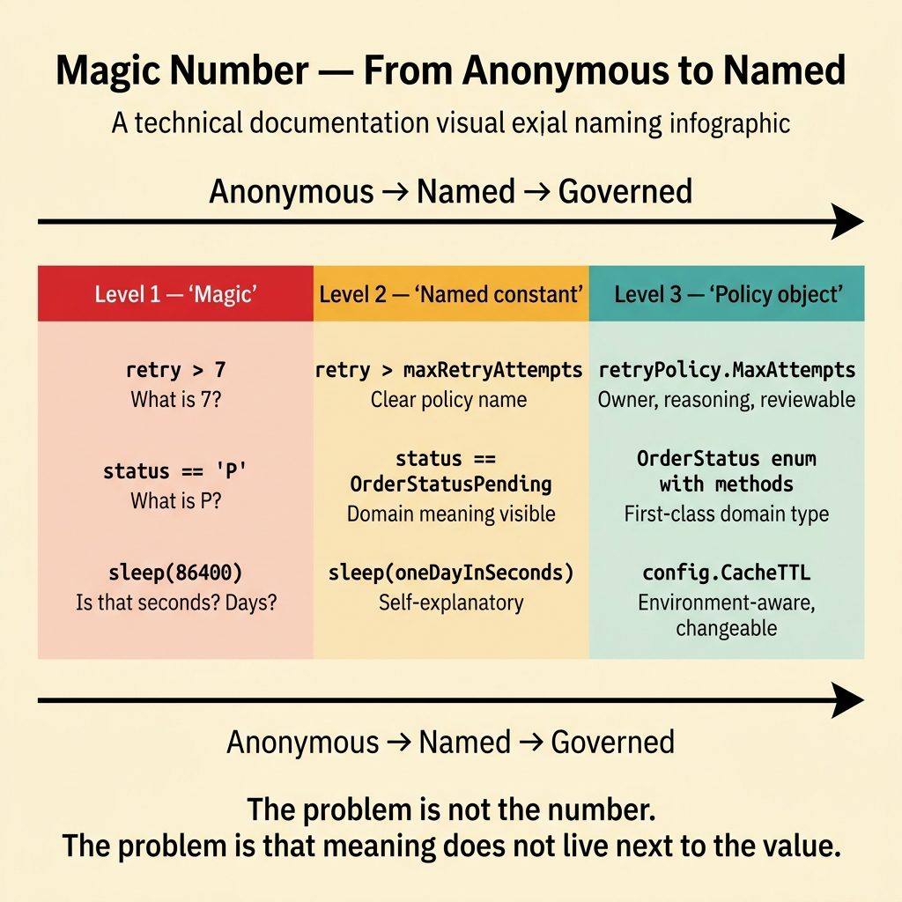
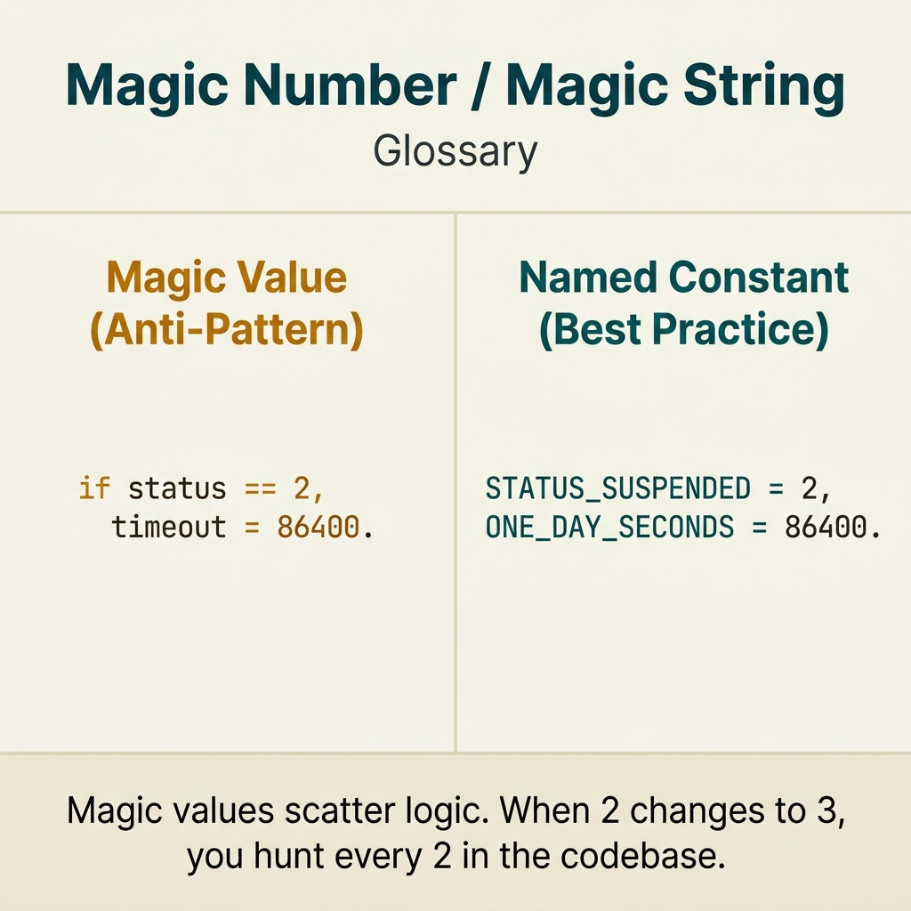

<!-- tags: glossary, reference, developer-cognition-team-dynamics, code-readability-comprehension, magic-number-magic-string -->
# Magic Number / Magic String

> A literal value that appears directly in the code without a semantic name or clear explanation.

| Aspect | Detail |
| --- | --- |
| **Concept** | A literal value that appears directly in the code without a semantic name or clear explanation. |
| **Audience** | Developer, reviewer |
| **Primary style** | Glossary term |
| **Entry point** | Use when a reviewer spots numbers or strings that "everyone implicitly understands" but a newcomer could never guess correctly. |

📅 Created: 2026-03-30 · 🔄 Updated: 2026-04-04 · ⏱️ 9 min read

---

## 1. DEFINE

Picture seeing `if retries > 7` or `if env == "prod-eu-2"` sitting raw in the code. The author at the time of writing may have understood the meaning of `7` and that string perfectly, but a few weeks later someone else reading it will ask: "7 is what policy?", "Is this string a canonical value or just a temporary shortcut?" Magic numbers and magic strings are where meaning hides behind anonymous literals.

**Magic Number / Magic String** is a literal value that appears directly in the code without a semantic name or clear explanation.

| Variant | Description |
| --- | --- |
| Policy literal | A literal encoding a business rule or technical threshold. |
| Domain literal | A literal representing a domain state or enum value. |
| Hidden coupling literal | A literal that looks harmless but is actually bound to a config, database, or external system. |

| Approach | Time | Space | When to choose |
| --- | --- | --- | --- |
| Extract named constant | O(n literals) | O(1) | When the literal repeats or its meaning is not self-evident. |
| Promote literal to type/enum | O(n refactors) | O(type definitions) | When the literal represents a domain state with a clear lifecycle. |
| Move policy to config or rule object | O(n boundaries) | O(config/rule structs) | When the literal is a decision or threshold that may change per environment. |

Core insight:

> The problem with magic literals is not that numbers or strings are "bad." The problem is that their meaning does not live alongside the literal. The reader is forced to hunt for context elsewhere just to understand what a value represents.

### 1.1 Invariants & Failure Modes

The invariant is that important values must have their meaning visible near where they are used. When the reader sees `86400` and cannot tell if it is one day, a legacy timeout, or a temporary policy, the reasoning chain is broken.

---

## 2. CONTEXT

**Who uses it**: Developer, reviewer

**When**: Use when a reviewer spots numbers or strings that "everyone implicitly understands" but a newcomer could never guess correctly.

**Purpose**: The problem with magic literals is not that numbers or strings are "bad." The problem is that their meaning does not live alongside the literal. The reader is forced to hunt for context elsewhere to understand what a value represents.

**In the ecosystem**:
- Obvious literals like `0`, `1`, `""` are sometimes not a problem if meaning is self-evident in context.
- A literal becomes "magic" when business meaning or coupling is not visible at the local scope.
- This is simultaneously a readability, maintainability, and change safety problem.

---

The problem with unnamed constants is clear. But when is a number magic, when is it obvious, and when is extracting a constant overkill?

## 3. EXAMPLES

Magic numbers surface most visibly when `if (status == 3)` and nobody knows what 3 means, when `sleep(86400)` forces you to Google "how many seconds in a day," or when extracting a constant for 0 and 1 creates noise. The examples below place the pattern into exactly those situations.

### Example 1: Basic — A threshold number that nobody can remember what policy it represents

You read retry logic and encounter `if attempt >= 7`. The number might be correct, but the reader cannot tell if it is a benchmark, a vendor limit, or just an old guess. At the basic level, the first step is giving the number a name so it carries meaning.

The input is a threshold literal. The output is a named constant that clarifies what policy it represents. Complexity is low because it only separates meaning from the raw literal.



*Figure: The problem is not the number. The problem is that meaning does not live next to the value.*

```go
const maxRetryAttempts = 7

func shouldStopRetry(attempt int) bool {
	// The constant name keeps the business/technical meaning
	// right next to the value.
	return attempt >= maxRetryAttempts
}
```

**Why?** Readers are bad at remembering the meaning of a raw number, especially when the same file has many literals. A named constant transforms a value from an anonymous object into a decision that can be discussed, reviewed, and changed later.

**Takeaway**: You pull the policy out of the mute literal and give it a name that can be discussed.
**Caveat**: If the constant name is still vague like `limitValue`, the problem only changes form.
**Use when**: a literal stands alone, causing the reviewer to ask "why this number?"

### Example 2: Intermediate — String literal represents a domain state

A system checks `if order.Status == "P"` in many places. A newcomer cannot tell if `"P"` means pending, paid, or processing. At the intermediate level, string literals like this should be promoted to a type or lightweight enum so the domain state speaks its own name.

The input is a domain status encoded as a short string. The output is named status constants so the call site requires less guessing. Complexity is moderate because multiple modules may be affected.

```go
type OrderStatus string

const (
	OrderStatusPending OrderStatus = "P"
	OrderStatusPaid    OrderStatus = "D"
)

func canCapturePayment(status OrderStatus) bool {
	return status == OrderStatusPending
}
```

**Why?** Domain state needs to be identified by meaning first, raw storage value second. When the reader sees `OrderStatusPending`, they reason directly on the domain instead of translating from a cryptic abbreviation.

**Takeaway**: You convert domain state from hard-to-guess shorthand into vocabulary with clear meaning.
**Caveat**: If an external system forces short codes, keep a clear mapping between the raw value and the meaningful name.
**Use when**: string literals are representing state/domain concepts, not just temporary data.

### Example 3: Advanced — A literal hides coupling with an external system

A service directly checks `"prod-eu-2"` to enable special behavior. The reader cannot tell if it is a canonical region, a deployment alias, or a temporary vendor workaround. At the advanced level, magic literals must be promoted to config or capability flags so the coupling becomes explicit.

The input is a literal tied to an environment or external dependency. The output is a config-driven decision or a feature flag with a clear name. Complexity is high because it involves deployment/runtime concerns.

```go
type RuntimeConfig struct {
	EnableLowLatencyMode bool
}

func shouldUseLowLatencyPath(cfg RuntimeConfig) bool {
	// A capability flag is more stable than scattering
	// a region string throughout the code.
	return cfg.EnableLowLatencyMode
}
```

**Why?** Environment literals create hidden coupling: the code reads simply but actually depends on an external assumption that is hard to see. Promoting it to config or a capability flag makes the dependency contract transparent.

**Takeaway**: You turn a hidden workaround into a named dependency with a proper management location that can be changed safely.
**Caveat**: Not every environment literal needs to be config-ified; only promote values that control behavior.
**Use when**: a string or number encodes knowledge about a vendor, region, feature rollout, or environment.

### Example 4: Expert — Policy literals must have a place for discussion and verification

A team has extracted constants very well, but important constants like timeout, retry, and rate limit values are scattered with no one knowing who owns them. At the expert level, magic literals are only truly tamed when policy values have an owner, documentation, and a clear review path.

The input is many named constants without governance. The output is rule objects or config maps with reasoning comments and clear ownership. Complexity is high because it involves both design and team operations.

```go
type RetryPolicy struct {
	MaxAttempts int
	BaseDelay   time.Duration
}

var paymentRetryPolicy = RetryPolicy{
	// The policy lives in a named object so the reviewer understands
	// these are a cluster of related decisions.
	MaxAttempts: 7,
	BaseDelay:   2 * time.Second,
}
```

**Why?** Extracting a constant alone does not ensure the reader understands why the value exists or when it is safe to change. Grouping values into a policy object with a name exposes ownership and intent, helping reviews focus on what truly needs discussion.

**Takeaway**: You elevate literals from "values to avoid hardcoding" into policy artifacts that can be reviewed and maintained.
**Caveat**: Do not group every small constant into a large object if they do not truly belong to the same decision.
**Use when**: the repo has many named constants but the team still hesitates when important thresholds need to change.

---

## 4. COMPARE




*Figure: Position of magic number among naming convention, code smell, and enum pattern.*

Magic number sounds like code smell. Correct — magic number is a specific code smell: a literal value without context. Fix with a named constant or enum. But 0, 1, "" are usually obvious, not magic.

### Level 1

```text
literal appears
  -> reader asks "what does this stand for?"
  -> meaning is hidden
  -> review confidence drops
```

*Figure: Level 1 shows how magic literals break readability by forcing the reader to reverse-engineer meaning from the value.*

### Level 2

```text
bad
  retry > 7
  status == "A"

better
  retry > maxRetryAttempts
  status == StatusActive
```

*Figure: Level 2 shows the core fix is pulling meaning to the front of the code.*

### Easy to confuse or cross the boundary

You have seen where Magic Number / Magic String should be applied. The mistakes below are common misuses that make code syntactically correct but still leave the reader gasping for context.

| # | Severity | Mistake | Consequence | Fix |
| --- | --- | --- | --- | --- |
| 1 | 🔴 Fatal | Hardcoding an important literal without meaning | Reviewer cannot tell what policy it represents | Extract a constant or policy object with a clear name. |
| 2 | 🟡 Common | Using short strings for domain state | Reader must translate from abbreviation to meaning | Promote to enum/type with clear domain names. |
| 3 | 🟡 Common | Environment literal hides external coupling | Behavior is hard to change and hard to test | Promote to config/capability flag. |
| 4 | 🔵 Minor | Extracting constants but without ownership/purpose | Team still fears changing thresholds | Group into a policy with reasoning and an owner. |

### Quick scan

| If you encounter | What to do |
| --- | --- |
| A threshold number nobody remembers the meaning of | Extract a named constant. |
| Short strings representing state/domain | Promote to enum or typed constants. |
| Literal tightly bound to vendor/region | Turn into config or a capability flag. |
| Constants have names but are still hard to change | Group into a policy object with an owner and reasoning. |

---

## 5. REF

| Resource | Type | Link | Notes |
| --- | --- | --- | --- |
| Refactoring Guru — Replace Magic Number with Symbolic Constant | Reference | https://refactoring.guru/replace-magic-number-with-symbolic-constant | The most basic technique for this case. |
| Clean Code | Book | https://www.investigatii.md/uploads/resurse/Clean_Code.pdf | Extensive discussion on naming and constants. |
| Naming Convention | Related term | ./05-naming-convention.md | Magic literals are often hidden naming debt. |

---

## 6. RECOMMEND

Magic number solves the problem of "literal values nobody understands." The next question: how should dead code be handled, and how does cognitive load come into play?

| Expand to | When | Why | File/Link |
| --- | --- | --- | --- |
| Naming Convention | When fixing literals requires consistent naming | Good constant names are part of the naming rule. | [Naming Convention](./05-naming-convention.md) |
| Self-Documenting Code | When you want to understand the role of comments and constants | Self-documenting code is the bigger frame for this term. | [Self-Documenting Code](./03-self-documenting-code.md) |
| Dead Code | When a literal is tied to a path no longer in use | Strange literals are sometimes a sign of a dead branch. | [Dead Code](./07-dead-code.md) |

Back to that `status == 3` from the beginning — what is 3? Approved? Rejected? Pending? Now you know: `const StatusApproved = 3`. Or better: enum. Name the intent, and the code reads like prose.

**Links**: [← Previous](./05-naming-convention.md) · [→ Next](./07-dead-code.md)
