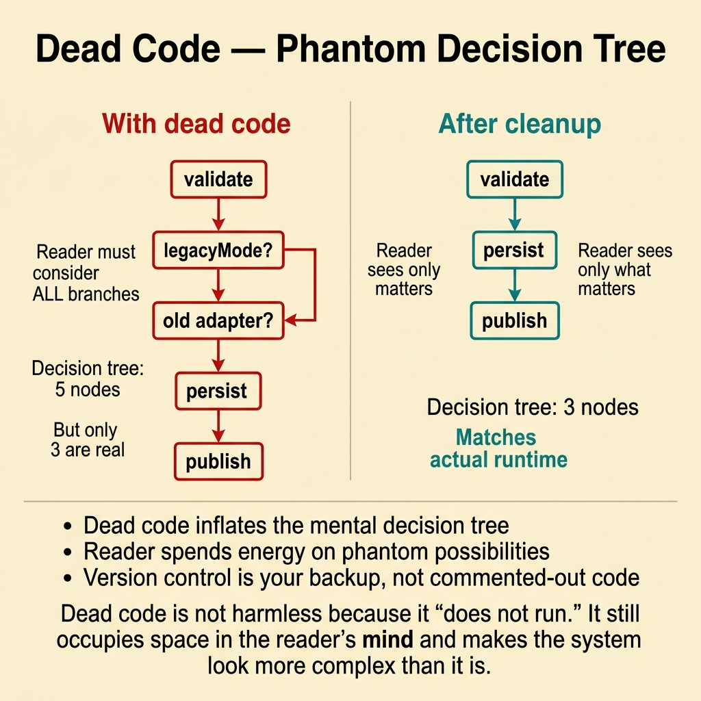
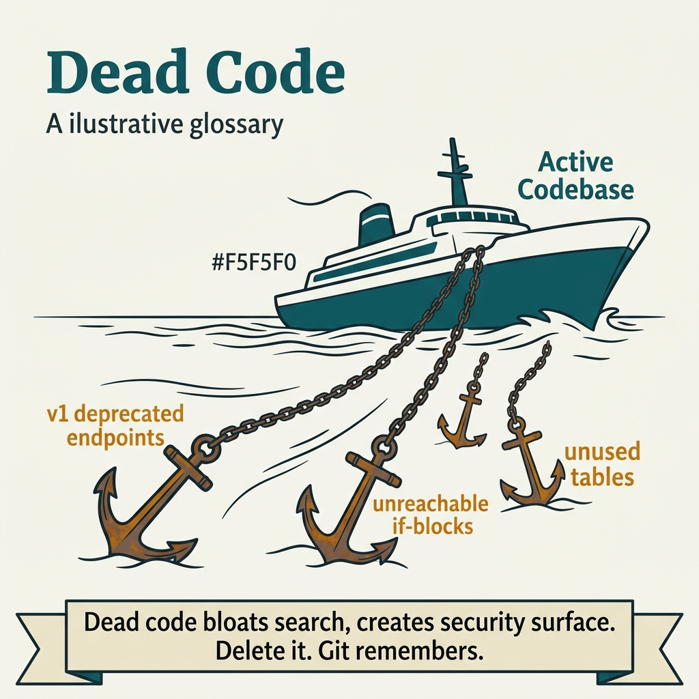

<!-- tags: glossary, reference, developer-cognition-team-dynamics, code-readability-comprehension, dead-code -->
# Dead Code

> Code that is no longer executed or no longer serves any meaningful behavior in the system.

| Aspect | Detail |
| --- | --- |
| **Concept** | Code that is no longer executed or no longer serves any meaningful behavior in the system. |
| **Audience** | Developer, reviewer, maintainer |
| **Primary style** | Glossary term |
| **Entry point** | Use when the repo becomes increasingly hard to read because of branches, helpers, or config paths kept "just in case" but no longer serving anything. |

📅 Created: 2026-03-30 · 🔄 Updated: 2026-04-04 · ⏱️ 10 min read

---

## 1. DEFINE

Picture yourself fixing a signup flow and encountering a branch `if legacyModeEnabled { ... }` that nobody on the team can remember when it last ran. Tests do not cover it, logs show no trace, docs do not mention it. Yet the code sits there, forcing everyone to read it, speculate about it, and maintain a possibility that may have died long ago. Dead code eats into readability before it ever causes a bug.

**Dead Code** is code that is no longer executed or no longer serves any meaningful behavior in the system.

| Variant | Description |
| --- | --- |
| Unreachable code | A branch or function with no valid execution path remaining. |
| Obsolete feature path | Logic that once served a purpose but the product or runtime has moved on. |
| Defensive leftovers | Code kept "just in case" but with no owner or usage signal. |

| Approach | Time | Space | When to choose |
| --- | --- | --- | --- |
| Verify reachability with logs/tests | O(n traces) | O(test/log notes) | When unsure whether the path is truly dead or just rare. |
| Remove obsolete branch with safety net | O(n refactors) | O(test updates) | When there is enough evidence the branch no longer has value. |
| Encode deprecation lifecycle | O(n rollout steps) | O(doc + flags) | When the feature is on the path to death but cannot be cut immediately. |

Core insight:

> Dead code is not harmless just because it "does not run." It still occupies space in the reader's mind, extends review time, and makes the system's decision tree look more complex than reality.

### 1.1 Invariants & Failure Modes

The invariant is that every existing branch must have a reason for living that can be stated out loud. When a piece of code is kept only because "leave it for safety," both readability and change safety decline.

---

## 2. CONTEXT

**Who uses it**: Developer, reviewer, maintainer

**When**: Use when the repo becomes increasingly hard to read because of branches, helpers, or config paths kept "just in case" but no longer serving anything.

**Purpose**: Dead code is not harmless just because it "does not run." It still occupies space in the reader's mind, extends review time, and makes the system's decision tree look more complex than reality.

**In the ecosystem**:
- Not all rarely-executed code is dead code; an incident path is rare but still alive if there is a clear signal.
- Dead code differs from a feature flag rollout path that is being managed intentionally.
- This is a concept about usage evidence, not just the intuition of "looks old."

---

The idea of never-running code is clear. But how do you detect dead code, is "keeping it just in case" worth it, and what is the risk of deletion?

## 3. EXAMPLES

Dead code surfaces most visibly when a function has no callers but nobody dares delete it, when commented-out code sits for two years "just in case," or when a dead code path contains a bug and causes confusion. The examples below place the pattern into exactly those situations.

### Example 1: Basic — A helper with no callers still sits in the module

You open a file and see `buildLegacyPayload()` — a long function — but searching the entire repo finds no callers. The reader still has to scan past it and wonder whether it is important. At the basic level, the problem is confirming that this helper truly has no users.

The input is a function that appears to be forgotten. The output is evidence about reachability before deletion. Complexity is low because it is mostly verification, not a large refactor.



*Figure: Dead code inflates the decision tree in the reader’s mind. Version control is your backup, not commented-out code.*

```go
// After confirming no caller exists and tests do not use reflection
// to call it indirectly, this helper should be deleted rather than
// kept as a "memento" that increases noise.
func buildLegacyPayload() []byte {
	return []byte("{}")
}
```

**Why?** Readers cannot tell whether a function is dead or important just by looking at its length. If the repo keeps many orphaned helpers, every time someone reads the file they have to run an extra mental pass asking "am I missing something?"

**Takeaway**: You start handling dead code with evidence, not with gut feeling.
**Caveat**: Searching for zero callers is not enough if the code uses reflection, plugin loading, or an entrypoint outside the repo.
**Use when**: you encounter a helper or branch that looks old but lacks clear evidence about reachability.

### Example 2: Intermediate — Feature flag path remains after rollout is complete

A feature flag has been at 100% for months, but the old path still sits under `if !newFlowEnabled`. The reader must now reason about both branches even though the product only uses one. At the intermediate level, you need to close the rollout lifecycle and cut the dead branch.

The input is a feature flag rollout that has been completed. The output is a streamlined flow with only the living branch. Complexity is moderate because it requires coordinating evidence from product, ops, and code.

```go
func executeCheckout(cmd CheckoutCommand) error {
	// The old path was removed after 100% rollout and metrics
	// confirmed the rollback path is no longer needed.
	return executeCheckoutV2(cmd)
}
```

**Why?** A rollout path only has meaning when it protects a transition. When the transition is complete but the branch stays, it transforms from a safety mechanism into pure readability debt.

**Takeaway**: You close the rollout loop by removing the old path, returning the flow's decision tree to its actual size.
**Caveat**: Only cut the branch when a new rollback strategy is clearly in place; do not delete prematurely out of eagerness to clean up.
**Use when**: a feature flag has been stable for a long time but the old path still lives in mainline code.

### Example 3: Advanced — Dead code distorts the mental model of the boundary

An old adapter for a payment gateway still lives in the repo, sharing the same interface as the new adapter. The reader thinks the system supports both providers, but in reality the old adapter is not wired in any environment. At the advanced level, dead code does not just cause noise; it makes the reader misunderstand the current architecture.

The input is an old implementation still present at an important boundary. The output is a boundary that reflects the actual runtime topology. Complexity is high because it may touch docs, diagrams, and test fixtures.

```go
type PaymentGateway interface {
	Charge(req ChargeRequest) error
}

type StripeGateway struct{}

func (g StripeGateway) Charge(req ChargeRequest) error {
	return nil
}
```

**Why?** At the architecture level, dead code makes the reader think the system supports more capabilities than it actually does. This undermines decision making: people may avoid a necessary refactor because they mistakenly believe old compatibility must be preserved.

**Takeaway**: You make the boundary reflect the living architecture, rather than a museum of every past decision.
**Caveat**: If the old implementation is still needed for migration or a disaster plan, document its lifecycle clearly rather than deleting blindly.
**Use when**: old adapters, providers, or interfaces persist even though the runtime topology has changed completely.

### Example 4: Expert — Dead code must be managed as debt, not as decoration

A team knows the repo has many dead branches, but every cleanup attempt is postponed because "touching it might break things." Gradually dead code becomes a sediment layer that slows every onboarding and refactor. At the expert level, you need to turn dead-code cleanup into a part of the operating cadence rather than a sporadic campaign.

The input is a codebase with many suspected dead zones but no cleanup process. The output is a clear lifecycle for deprecate → observe → remove. Complexity is high because it involves ownership and release management.

```go
type DeprecationRecord struct {
	FeatureName string
	RemoveAfter string
	Owner       string
}

var checkoutLegacyPath = DeprecationRecord{
	FeatureName: "checkout-legacy-path",
	RemoveAfter: "2026-05-01",
	Owner:       "payments-team",
}
```

**Why?** Dead code often survives not because it is too hard to delete, but because nobody owns the moment of deletion. An explicit deprecation record turns cleanup into a decision with an owner and a deadline, replacing a vague promise.

**Takeaway**: You shift dead-code cleanup from an inspired action to an operational mechanism with an owner.
**Caveat**: Setting a deadline without observability evidence or a test safety net is still risky.
**Use when**: the repo continuously accumulates old branches because everyone says "later" without a clear lifecycle.

---

## 4. COMPARE




*Figure: Position of dead code among code smell, refactoring, and version control.*

Dead code sounds like unused import. Close — but dead code is broader: unreachable branches, obsolete functions, commented-out blocks. Unused import is trivial dead code; unreachable logic paths are more dangerous because they cause confusion.

### Level 1

```text
reader opens a flow
  -> sees extra branch
  -> must consider it as real
  -> review tree becomes larger than actual system behavior
```

*Figure: Level 1 shows how dead code inflates the decision tree in the reader's mind even though the runtime no longer needs it.*

### Level 2

```text
live path
  validate -> persist -> publish

with dead branch
  validate -> legacyMode? -> old adapter? -> persist -> publish
```

*Figure: Level 2 emphasizes how dead code forces the reader to reason about phantom possibilities the system no longer uses.*

### Easy to confuse or cross the boundary

You have seen where Dead Code should be applied. The mistakes below are common misuses that make code syntactically correct but still leave the reader gasping for context.

| # | Severity | Mistake | Consequence | Fix |
| --- | --- | --- | --- | --- |
| 1 | 🔴 Fatal | Keeping old code with a vague "who knows, we might need it" | Reader must reason about phantom possibilities | Require reachability evidence or a clear lifecycle. |
| 2 | 🟡 Common | Deleting code based only on searching callers | Easy to miss reflection or external entrypoints | Combine logs, tests, and deployment knowledge. |
| 3 | 🟡 Common | Leaving rollout branches alive forever after rollout completes | Flow inflates for no reason | Close the feature lifecycle with a removal step. |
| 4 | 🔵 Minor | No owner for deprecation cleanup | Cleanup is always postponed | Assign an owner, deadline, and observability plan. |

### Quick scan

| If you encounter | What to do |
| --- | --- |
| A helper that appears to have no callers | Verify reachability before deleting. |
| Feature flag old path after rollout is complete | Cut the old branch and keep the rollback plan in the right place. |
| An old adapter distorting the architecture understanding | Delete or clearly mark its lifecycle. |
| Dead code cleanup is always postponed | Assign an owner and a deprecation deadline. |

---

## 5. REF

| Resource | Type | Link | Notes |
| --- | --- | --- | --- |
| Refactoring | Book | https://martinfowler.com/books/refactoring.html | Extensive guidance for safe removal. |
| A Philosophy of Software Design | Book | https://web.stanford.edu/~ouster/cgi-bin/book.php | Clear discussion on the harm of unnecessary complexity. |
| Code Readability | Related term | ./01-code-readability.md | Dead code is a very direct source of readability debt. |

---

## 6. RECOMMEND

Dead code solves the problem of "the codebase inflates but nobody knows which parts are still alive." The next question: how does cognitive load work when reading code, and what about mental models?

| Expand to | When | Why | File/Link |
| --- | --- | --- | --- |
| Magic Number / Magic String | When you suspect strange literals belong to an old dead path | Dead code and magic literals often travel together. | [Magic Number / Magic String](./06-magic-number-magic-string.md) |
| Principle of Least Surprise | When dead branches make the flow hard to predict | Old branches distort the reader's expectations. | [Principle of Least Surprise](./02-principle-of-least-surprise.md) |
| Code Readability | When you want to return to the foundational frame | Dead code is readability debt at the flow level. | [Code Readability](./01-code-readability.md) |

Back to that "keep it just in case" from the beginning — two years, nobody used it. Now you know: version control is your backup, not commented-out code. Delete dead code; git history keeps it. A lean codebase = low cognitive load.

**Links**: [← Previous](./06-magic-number-magic-string.md) · [→ Next](./README.md)
