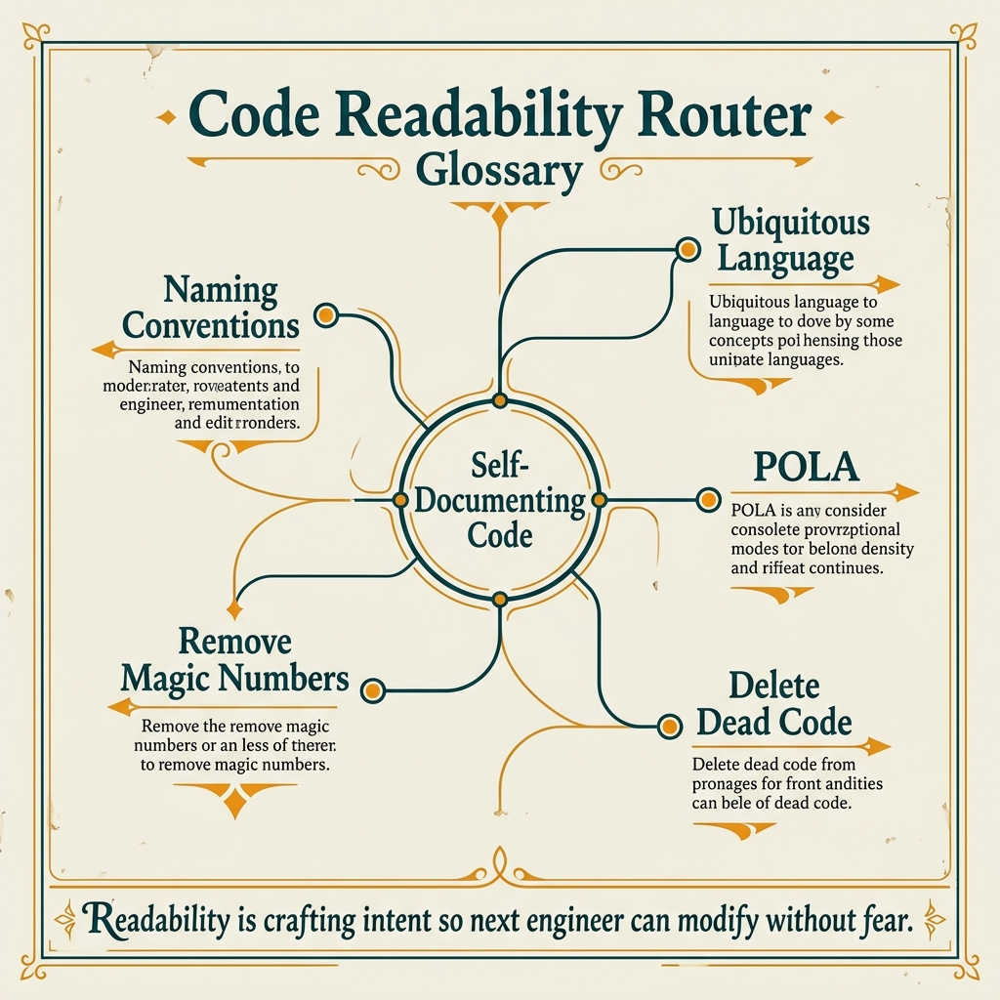

<!-- tags: glossary, reference, developer-cognition-team-dynamics, code-readability-comprehension, overview -->
# Code Readability & Comprehension

> A cluster of terms that names how easy it is to read, predict, and reason about a codebase from the reader's perspective.

| Aspect | Detail |
| --- | --- |
| **Concept** | A cluster of terms that names how easy it is to read, predict, and reason about a codebase from the reader's perspective. |
| **Audience** | Developer, reviewer, tech lead |
| **Primary style** | Glossary hub router |
| **Entry point** | Open when an issue surfaces while reading code: vague names, magic values, dead code, or misaligned team language. |

📅 Created: 2026-03-30 · 🔄 Updated: 2026-04-04 · ⏱️ 6 min read

---

## 1. DEFINE

There are pieces of code that are logically correct but still exhaust the reader very quickly. Usually the culprit is not business complexity, but vague naming, surprise behavior, magic values, and code fragments "left for later." This README routes those reading symptoms to the right term before the team dissolves into a formatting or style war.

**Code Readability & Comprehension** is a cluster of terms that names how easy it is to read, predict, and reason about a codebase from the reader's perspective.

| Variant | Description |
| --- | --- |
| Readability signals | Code readability and principle of least surprise name the overall friction when reading code. |
| Language & naming | Self-documenting code, ubiquitous language, and naming convention lock in the meaning of names. |
| Noise & residue | Magic number/string and dead code are the most common sources of reader noise. |

| Approach | Time | Space | When to choose |
| --- | --- | --- | --- |
| Route by reading symptom | O(1) route | O(1) | When the reader feels exhausted, cannot predict the flow, or stumbles on names. |
| Route by language discipline | O(1) route | O(1) | When the team is repeating terms, naming things differently, and losing shared vocabulary. |
| Learn from easy reading to correct reading | O(1) route | O(1) | When you want to go from basic readability to language governance. |

Core insight:

> Readability is not just about aesthetics; it is the ability to keep reasoning correct when the reader must make decisions based on the code.

### 1.1 Signals & Boundaries

- Principle of least surprise identifies moments when behavior deviates from what the name and context promise.
- Ubiquitous language and naming convention belong to the shared meaning layer, not just coding style.
- Magic numbers and dead code belong to the noise layer and need their own terms to pinpoint the source of friction.

### Coverage Map

| Entry | Role | Notes |
| --- | --- | --- |
| [Code Readability](01-code-readability.md) | Canonical term | The primary entry for this branch. |
| [Principle of Least Surprise](02-principle-of-least-surprise.md) | Canonical term | The primary entry for this branch. |
| [Self-Documenting Code](03-self-documenting-code.md) | Canonical term | The primary entry for this branch. |
| [Ubiquitous Language](04-ubiquitous-language.md) | Canonical term | The primary entry for this branch. |
| [Naming Convention](05-naming-convention.md) | Canonical term | The primary entry for this branch. |
| [Magic Number / Magic String](06-magic-number-magic-string.md) | Canonical term | The primary entry for this branch. |
| [Dead Code](07-dead-code.md) | Canonical term | The primary entry for this branch. |

---

## 2. VISUAL




*Figure: Router map prioritizes quick lane scanning, entry points, and boundaries before diving into detailed prose below.*

The hub has value only when it reveals the next path forward. The visual below pulls learning paths and symptom routes onto the same plane.

### Level 1

```text
Readability signals
Language & naming
Noise & residue
```

*Figure: Level 1 divides this hub into the main decision lanes so the reader does not have to grope through a flat list of terms.*

### Level 2

```text
If the phenomenon is...                                    Open first
---------------------------------------------------------  ------------------------------------------
Code is correct but very hard to read in general           Code Readability
Names and behavior keep surprising the reader              Principle of Least Surprise
Team is naming things off-domain and reviews are chaotic   Ubiquitous Language
File is full of hard-coded values and residue no one dares delete  Magic Number / Magic String
```

*Figure: Level 2 turns the hub into a symptom router: start from the real question, then branch to the specific term.*

---

## 3. CODE

The diagram just separated this cluster by naming, surprise, noise signals, and shared language. From here, use the hub as a lens for code that is syntactically correct but still leaves the reader gasping.

### Problem 1: Basic — Route the right symptom to the right glossary entry

> **Goal**: Do not let every question about **Code Readability & Comprehension** get thrown into the same bucket.
> **Approach**: Start from the reader's symptom or question, then open the most fitting entry first.
> **Example**: The input is a review/design question; the output is the file to open first, like `./01-code-readability.md`.
> **Complexity**: Basic

```yaml
router:
  - symptom: Code is correct but very hard to read in general
    open_first: ./01-code-readability.md
  - symptom: Names and behavior keep surprising the reader
    open_first: ./02-principle-of-least-surprise.md
  - symptom: Team is naming things off-domain and reviews are chaotic
    open_first: ./04-ubiquitous-language.md
  - symptom: File is full of hard-coded values and residue no one dares delete
    open_first: ./06-magic-number-magic-string.md
```

**Why?** In readability, picking the wrong entry point causes reviews to ramble about style when the real pain is in naming, implicit behavior, or dead code. This router forces the reader to name the right source of friction.

**Takeaway**: The hub's first value is helping reviews pinpoint the exact type of reading difficulty happening, instead of generic complaints that the code is ugly.

### Problem 2: Intermediate — Use the hub as an intentional learning path

> **Goal**: Read **Code Readability & Comprehension** in logical clusters instead of jumping between isolated files.
> **Approach**: Follow lanes from foundational to more advanced variants, then compare adjacent concepts when needed.
> **Example**: A reader wants to build a durable mental model rather than just looking up a single definition.
> **Complexity**: Intermediate

```yaml
learning_path:
  baseline_reading:
    - 01-code-readability.md
    - 02-principle-of-least-surprise.md
    - 03-self-documenting-code.md
  shared_language:
    - 04-ubiquitous-language.md
    - 05-naming-convention.md
  noise_cleanup:
    - 06-magic-number-magic-string.md
    - 07-dead-code.md
```

**Why?** Readability does not come from individual techniques but from the connections between naming, surprise, and shared language. The learning path helps the reader see a continuous line of improvement instead of scattered tips.

**Takeaway**: At the intermediate level, this hub helps the reader see how readability debt grows from naming to surprise and then spreads to shared language.

### Problem 3: Advanced — Use the hub as a governance map for shared vocabulary

> **Goal**: Keep reviews, ADRs, runbooks, or postmortems using the same language within **Code Readability & Comprehension**.
> **Approach**: Group terms by decision lane, then use that lane as a glossary contract for the team.
> **Example**: When two people use the same word but are actually arguing at two different layers of the system.
> **Complexity**: Advanced

```yaml
governance_map:
  readability_signals:
    - 01-code-readability.md
    - 02-principle-of-least-surprise.md
    - 03-self-documenting-code.md
  language_naming:
    - 04-ubiquitous-language.md
    - 05-naming-convention.md
  noise_residue:
    - 06-magic-number-magic-string.md
    - 07-dead-code.md
```

**Why?** Shared vocabulary in this cluster determines the quality of daily code review. The governance map keeps the team talking specifically about readability debt rather than arguing by personal taste.

**Takeaway**: At the advanced level, this hub is a review lens to turn readability into a technical criterion that can be discussed objectively.

---

## 4. PITFALLS

The taxonomy is clear, but routing correctly is not enough to avoid the common mistakes when using or interpreting this cluster of concepts.

| # | Severity | Mistake | Consequence | Fix |
| --- | --- | --- | --- | --- |
| 1 | 🔴 Fatal | Mixing multiple concept layers in the same discussion | Team fixes the wrong layer of the problem, discussion goes off-track | Re-route using the lanes in this README before opening a specific term. |
| 2 | 🟡 Common | Choosing a term by familiar name instead of by symptom | Deep-links to the right file but the wrong boundary | Ask the symptom question first, then choose the entry point. |
| 3 | 🟡 Common | Reading a term in isolation, skipping the learning path | Fragmented understanding, missing adjacent concepts for comparison | Follow the suggested reading clusters in CODE/RECOMMEND. |
| 4 | 🔵 Minor | Not linking back to the parent hub or root hub | Reader cannot navigate back to the taxonomy when lost | Keep the hub as a router; do not turn files into islands. |

---

## 5. REF

| Resource | Type | Link | Notes |
| --- | --- | --- | --- |
| Clean Code | Book | https://www.oreilly.com/library/view/clean-code-a/9780136083238/ | Classic source for readability and naming. |
| Domain-Driven Design | Book | https://www.domainlanguage.com/ddd/ | The canon for ubiquitous language. |
| A Philosophy of Software Design | Book | https://web.stanford.edu/~ouster/cgi-bin/book.php | Very strong on complexity from the reader's perspective. |

---

## 6. RECOMMEND

You now know the friction lies in how code is read. Move on to the term closest to the specific kind of reading difficulty the reader just encountered, to fix the right cognitive bottleneck.

| Expand to | When | Why | File/Link |
| --- | --- | --- | --- |
| Code readability first | When you need a simple baseline for reading friction | This is the entry point to check whether the codebase is hard to read overall. | [Code Readability](./01-code-readability.md) |
| Ubiquitous language when the team is misaligning | When names in code, docs, and meetings do not match | The issue has moved beyond individual files. | [Ubiquitous Language](./04-ubiquitous-language.md) |
| Dead code when the codebase starts accumulating residue | When noise is affecting reading speed | Now you need to remove residue rather than just reformatting. | [Dead Code](./07-dead-code.md) |

---

## 7. QUICK REF

| If you encounter | Open first |
| --- | --- |
| Code is correct but very hard to read in general | [Code Readability](./01-code-readability.md) |
| Names and behavior keep surprising the reader | [Principle of Least Surprise](./02-principle-of-least-surprise.md) |
| Team is naming things off-domain and reviews are chaotic | [Ubiquitous Language](./04-ubiquitous-language.md) |
| File is full of hard-coded values and residue no one dares delete | [Magic Number / Magic String](./06-magic-number-magic-string.md) |
