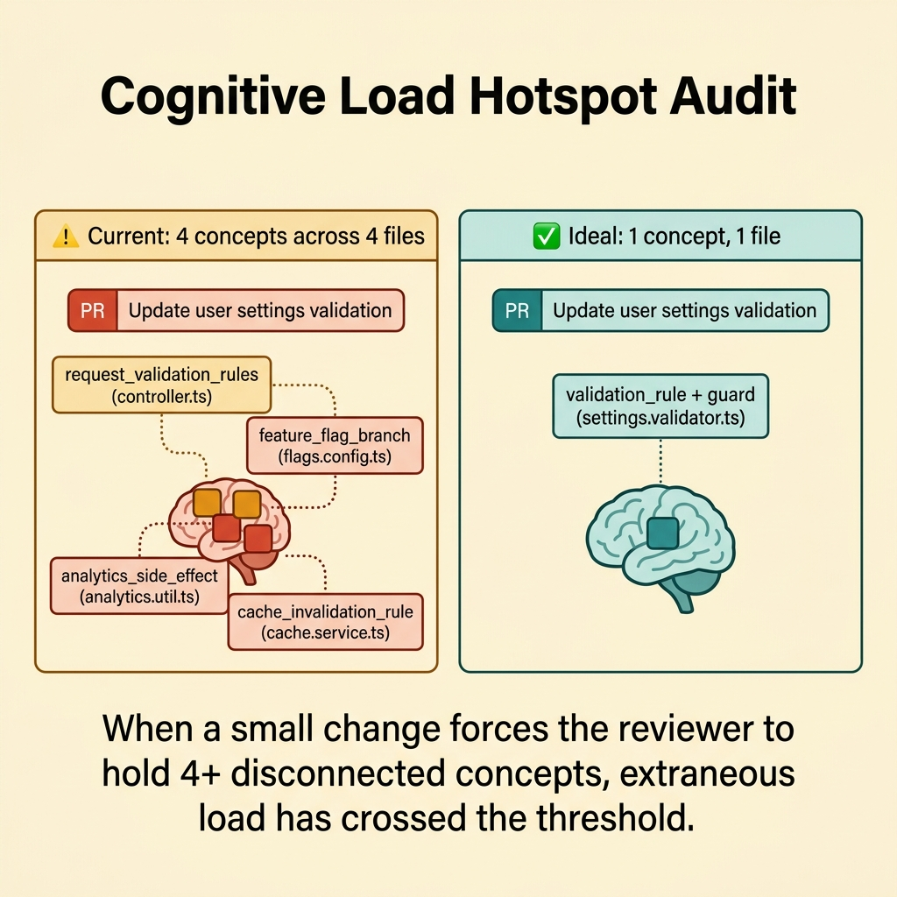
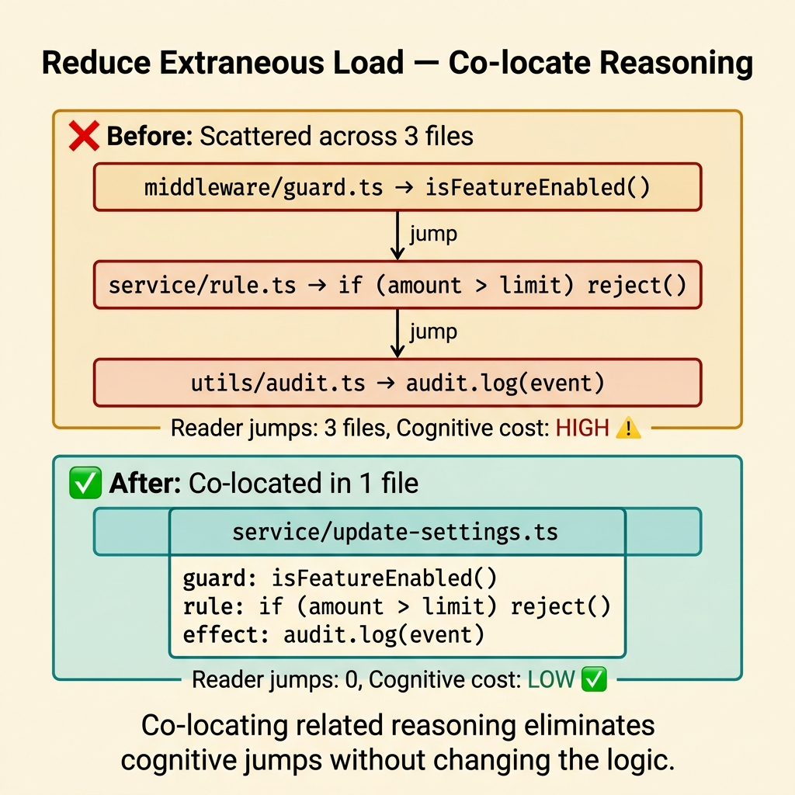
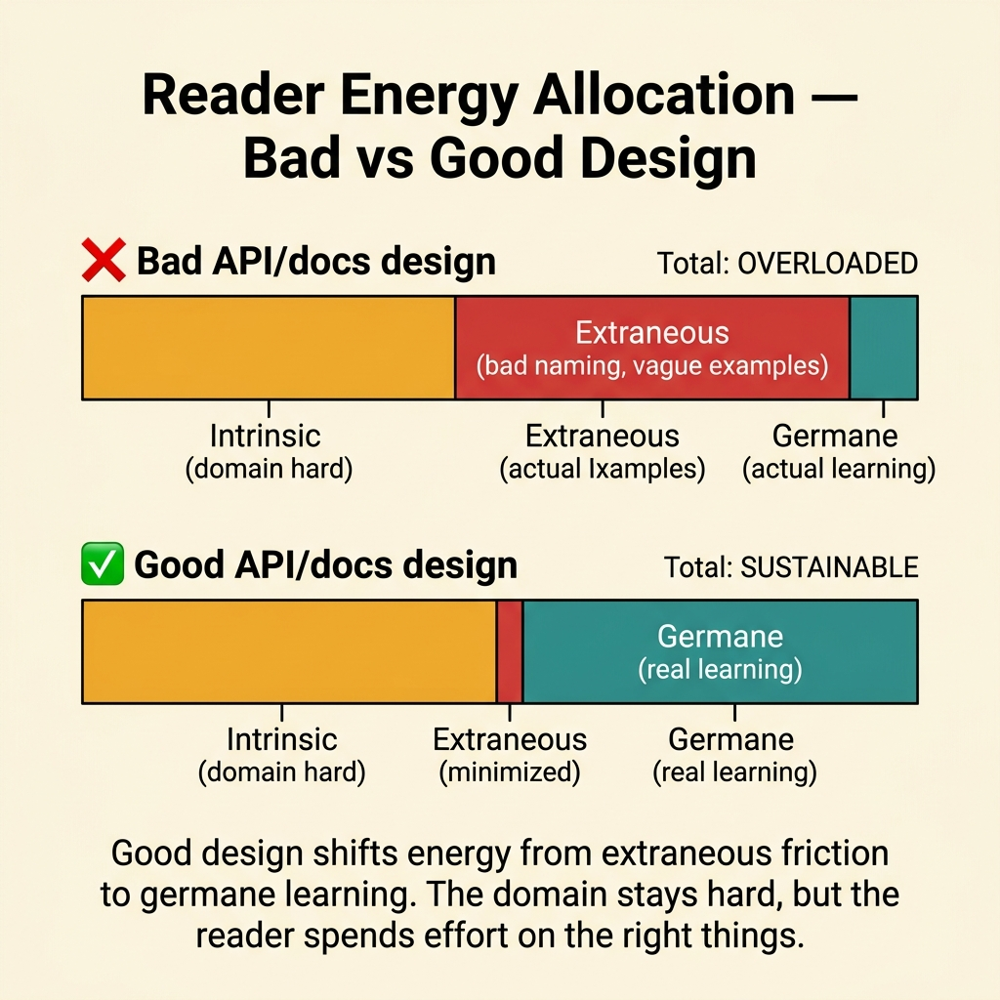
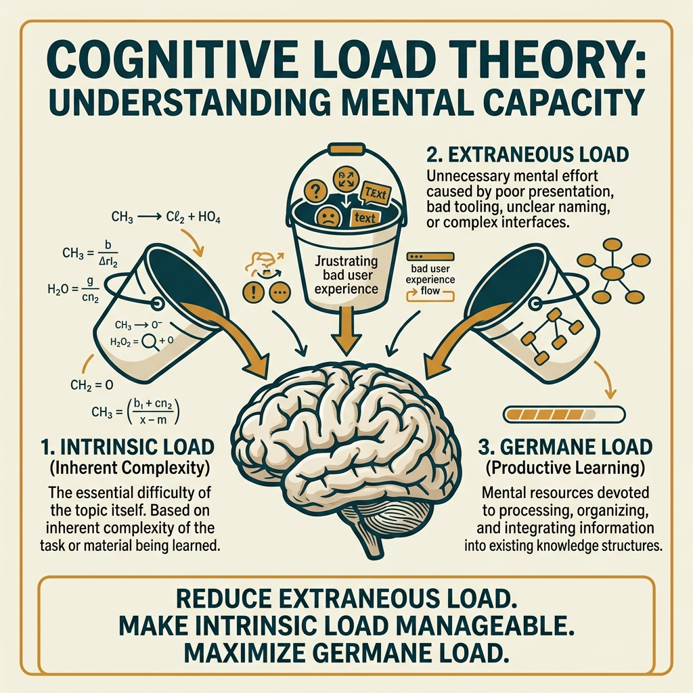

<!-- tags: glossary, reference, developer-cognition-team-dynamics, cognitive-mental-model, cognitive-load -->
# Cognitive Load

> The amount of mental effort a developer must spend to understand code, documentation, or a technical decision at any given moment.

| Aspect | Detail |
| --- | --- |
| **Concept** | The amount of mental effort a developer must spend to understand code, documentation, or a technical decision at any given moment. |
| **Audience** | Developer, reviewer, tech lead |
| **Primary style** | Glossary term |
| **Entry point** | Use when the team feels code is "exhausting to read," onboarding stalls, or even small reviews drain cognitive energy. |

📅 Created: 2026-03-30 · 🔄 Updated: 2026-04-17 · ⏱️ 10 min read

---

## 1. DEFINE

Picture opening a PR that changes a single validation rule. Twenty minutes later you are still juggling the controller, the service layer, a feature flag, an env var, a cache key, and three function names that communicate nothing. The logic itself may be fine. The problem is that your brain is forced to carry too many things at once. That is cognitive load.

**Cognitive Load** is the amount of mental effort a developer must spend to understand code, documentation, or a technical decision at any given moment.

| Variant | Description |
| --- | --- |
| Intrinsic load | The inherent difficulty of the problem itself. |
| Extraneous load | The burden imposed by bad naming, tangled structure, or poor docs. |
| Germane load | The useful effort spent building an accurate mental model. |

| Approach | Time | Space | When to choose |
| --- | --- | --- | --- |
| Load audit by reader journey | O(n review passes) | O(notes) | When you need to find where the reader gets stuck. |
| Complexity reduction by structure | O(n refactors) | O(refactor plan) | When extraneous load comes from code/doc shape. |
| Task-scope narrowing | O(n workflow steps) | O(checklists) | When load increases because each task drags in too much context. |

Core insight:

> Cognitive load is not just "feeling tired." It is a design cost that the codebase imposes on the reader. A healthy team optimizes not only for correct execution but also for keeping the reader's head light enough to reason accurately.

### 1.1 Invariants & Failure Modes

The key invariant: the reader must be able to trace the reasoning flow without holding too many disconnected pieces of state in their head. When a small change requires jumping across 7 files and 5 abstractions just to understand what is happening, extraneous load has crossed the acceptable threshold.

---

## 2. CONTEXT

**Who uses it**: Developer, reviewer, tech lead

**When**: Use when the team feels code is "exhausting to read," onboarding stalls, or even small reviews drain cognitive energy.

**Purpose**: Cognitive load is a design cost that the codebase imposes on the reader. A healthy team optimizes for keeping the reader's head light enough to reason accurately.

**In the ecosystem**:
- Cognitive load differs from pure business difficulty. The problem can be hard, but the code can still be presented clearly.
- It differs from stress or burnout, though it can contribute to both.
- If two strong engineers consistently get lost in the same area of code, the issue is usually cognitive design, not individual competence.

---

The cost of reading code is clear. But how do you reduce cognitive load, what separates intrinsic from extraneous, and what is the team-level impact?

## 3. EXAMPLES

Cognitive load surfaces most clearly when a 200-line function forces you to hold 10 variables in your head, when inconsistent naming forces re-reading, or when over-abstracted architecture requires tracing 7 layers to understand a flow. The examples below place the pattern into exactly those situations.

### Example 1: Basic — Identify where the reader carries too much context

You open a PR that changes a small validation rule. To understand its impact, you must jump through the controller, middleware, env config, and an analytics hook. The problem may not be hard — the context is just spread too wide. At the basic level, the first step is not to refactor, but to name the hotspot.



*Figure: When a small change forces the reviewer to hold 4+ disconnected concepts, extraneous load has crossed the threshold.*

```text
  Cognitive load hotspot audit:

  PR: "Update user settings validation"
  ┌─────────────────────────────────────────────────────┐
  │  Reader must hold simultaneously:                   │
  │                                                     │
  │  1. request_validation_rules ──► controller.ts      │
  │  2. feature_flag_branch ───────► flags.config.ts    │
  │  3. analytics_side_effect ─────► analytics.util.ts  │
  │  4. cache_invalidation_rule ───► cache.service.ts   │
  │                                                     │
  │  Concepts in working memory: 4                      │
  │  Files touched to understand: 4                     │
  │  Smell: too_many_concepts_for_small_change ⚠️       │
  └─────────────────────────────────────────────────────┘

  Compare: ideal state for a small validation change:
  ┌─────────────────────────────────────────────────────┐
  │  Reader holds: 1 validation rule + 1 guard          │
  │  Files: 1                                           │
  │  Smell: none ✅                                     │
  └─────────────────────────────────────────────────────┘
```

*Figure: The audit exposes how many disconnected concepts the reader must juggle for a single small change. Four concepts across four files for one validation rule signals extraneous load.*

```yaml
load_hotspot:
  path: update-user-settings
  reader_must_hold:
    - request_validation_rules
    - feature_flag_branch
    - analytics_side_effect
    - cache_invalidation_rule
  smell:
    too_many_concepts_for_small_change: true
```

**Why?** When load goes unnamed, teams describe it with vague phrases like "this part feels messy" or "the code is a bit confusing." An inventory forces that feeling into actionable data: exactly how many concepts the reader must hold, and where.

**Conclusion**: You have turned a complaint like "this part is annoying" into a specific hotspot the whole team can examine and discuss with data instead of feelings.

**Caveat**: The inventory tells you where it hurts. It does not automatically show which boundary to split or which name to change.

**Use when**: A small PR still sucks the reviewer into too much context, or onboarding stalls because new readers do not know what to hold in their head.

### Example 2: Intermediate — Reduce extraneous load by co-locating reasoning

You have a flow where the business rule lives in the service, the side effect lives in a utility file, and the guard condition sits in shared middleware. The reader keeps jumping back and forth just to assemble the full story. At the intermediate level, the goal is to bring related reasoning closer together without changing the underlying logic.



*Figure: Co-locating related reasoning eliminates cognitive jumps without changing the logic.*

```text
  Before: reasoning fragments scattered

  ┌─ middleware/ ──────────────────────────────┐
  │  guard: isFeatureEnabled(flag_x)           │
  └────────────┬───────────────────────────────┘
               │ reader jumps ↓
  ┌─ service/ ─────────────────────────────────┐
  │  rule: if (amount > limit) reject()        │
  └────────────┬───────────────────────────────┘
               │ reader jumps ↓
  ┌─ utils/ ───────────────────────────────────┐
  │  side effect: audit.log(event)             │
  └────────────────────────────────────────────┘

  Reader jumps: 3 files, 3 directories
  Cognitive cost: HIGH ⚠️

  ───────────────────────────────────────────────

  After: reasoning co-located near decision

  ┌─ service/update-settings.ts ───────────────┐
  │  guard: isFeatureEnabled(flag_x)           │
  │  rule:  if (amount > limit) reject()       │
  │  effect: audit.log(event)                  │
  └────────────────────────────────────────────┘

  Reader jumps: 0
  Cognitive cost: LOW ✅
```

*Figure: Before the refactor, the reader must reassemble three fragments from three files. After co-location, one file tells the complete story of the decision.*

```yaml
refactor_direction:
  current_problem:
    - guard_far_from_decision
    - side_effect_hidden_in_utility
  action:
    - move_guard_closer_to_use_case
    - name_side_effect_explicitly
    - group_related_rules_together
  expected_result:
    reader_needs_fewer_jumps: true
```

**Why?** Cognitive load spikes when the reader must self-assemble reasoning fragments scattered across distant files. Grouping related logic closer together reduces cognitive jumps, even if the total line count stays the same.

**Conclusion**: You reduced the "extraneous" portion of load by placing rule, guard, and side effect close enough for the reader to follow one complete reasoning thread from start to finish.

**Caveat**: Co-locating does not mean cramming everything into a single file. Overdoing it just trades one kind of mess for another.

**Use when**: The reader constantly alt-tabs between abstractions to understand a single rule, and the dominant cost comes from reassembling the story.

### Example 3: Advanced — Design APIs and docs to preserve germane load without adding extraneous load

An API is inherently difficult because the domain is difficult. But the docs use vague names and examples that do not reflect real paths. The reader now spends energy on things that should not be necessary. At the advanced level, you accept intrinsic complexity but deliberately remove all presentation friction around it.



*Figure: Good design shifts energy from extraneous friction to germane learning.*

```text
  Reader energy allocation:

  ┌─ Bad API/docs design ──────────────────────┐
  │                                             │
  │  ████████████████  Intrinsic (domain hard)  │
  │  ████████████████  Extraneous (bad naming,  │
  │                    vague examples, hidden   │
  │                    side effects)             │
  │  ███              Germane (actual learning)  │
  │                                             │
  │  Total: OVERLOADED ❌                       │
  └─────────────────────────────────────────────┘

  ┌─ Good API/docs design ─────────────────────┐
  │                                             │
  │  ████████████████  Intrinsic (domain hard)  │
  │  ██               Extraneous (minimized)    │
  │  ████████████     Germane (real learning)   │
  │                                             │
  │  Total: SUSTAINABLE ✅                      │
  └─────────────────────────────────────────────┘
```

*Figure: Good design shifts energy from extraneous friction to germane learning. The domain stays hard, but the reader's budget is spent on the right things.*

```yaml
reader_friendly_boundary:
  api_shape:
    explicit_names: true
    hidden_side_effects: false
  docs:
    example_before_edge_cases: true
    assumptions_made_explicit: true
    failure_modes_called_out: true
```

**Why?** The reader always must invest effort to understand the genuinely hard parts of the domain. If naming, docs, and contracts also force them to spend effort guessing authorial intent, total load crosses the threshold fast. Good design protects cognitive energy for the reasoning that matters most.

**Conclusion**: You preserve the reader's cognitive energy for the genuinely hard parts of the domain, instead of burning it on decoding vague naming and unclear contracts.

**Caveat**: You cannot remove all load. For genuinely hard domains, the goal is to strip away presentation friction, not to pretend the complex problem is simple.

**Use when**: The API or docs are technically correct but newcomers still consistently misunderstand, ask the same questions, or fix one thing and break another.

### Example 4: Expert — Use the cognitive-load lens to design team workflow

A team may have decent code but still feel chronically exhausted. Every day they switch between incidents, small features, reviews, meetings, and production fixes. The load at this point comes not from code but from workflow. At the expert level, you use cognitive load as a lens to design how the team works.

```text
  Workflow-induced cognitive load:

  ┌─ Monday for a typical engineer ────────────┐
  │                                             │
  │  09:00  incident triage ──────► context A   │
  │  09:45  standup ──────────────► context B   │
  │  10:00  feature work ─────────► context C   │
  │  10:30  PR review request ────► context D   │
  │  11:00  back to feature ──────► reload C    │
  │  11:15  Slack question ───────► context E   │
  │  11:30  meeting ──────────────► context F   │
  │  12:00  lunch                               │
  │  13:00  production fix ───────► context G   │
  │  14:00  back to feature ──────► reload C    │
  │  ...                                        │
  │                                             │
  │  Context switches by noon: 6                │
  │  Deep work blocks: 0 ❌                     │
  └─────────────────────────────────────────────┘

  ┌─ Redesigned workflow ──────────────────────┐
  │                                             │
  │  09:00  incident triage (batched) ► ctx A   │
  │  10:00  PROTECTED FOCUS ──────────► ctx C   │
  │  12:00  lunch                               │
  │  13:00  PROTECTED FOCUS ──────────► ctx C   │
  │  15:00  PR reviews (batched) ─────► ctx D   │
  │  16:00  meetings (batched) ───────► ctx F   │
  │                                             │
  │  Context switches by noon: 1                │
  │  Deep work blocks: 1 (2 hours) ✅           │
  └─────────────────────────────────────────────┘
```

*Figure: The fragmented day forces 6+ context switches before noon with zero deep work. The redesigned day batches interruptions and protects two-hour focus windows.*

```yaml
workflow_design:
  reduce:
    - fragmented_tasks
    - hidden_ownership
    - interrupt_heavy_review_flow
  add:
    - clearer_batching
    - ownership_boundaries
    - protected_focus_windows
```

**Why?** Cognitive load is not only a code-style problem. A fragmented workflow forces the brain to maintain too many live contexts at the same time. Good team design reduces load before anyone opens an editor.

**Conclusion**: You have shifted cognitive load from "each person just deals with it" into a real design criterion for workflow, ownership, and team rhythm.

**Caveat**: Not every interruption is bad. Incidents, pairing, and coordination must exist, but they need clear boundaries so they do not swallow all deep-work capacity.

**Use when**: The team constantly feels "busy all day but never goes deep," and the issue is not technical skill but how the work is organized.

---

## 4. COMPARE




*Figure: Position of cognitive load between working memory, mental model, and code readability. Extraneous load is the part the team can control.*

Cognitive load sounds like "hard code." Not quite. Intrinsic load comes from domain complexity (unavoidable). Extraneous load comes from bad code or architecture (avoidable). Reducing extraneous load is the developer's responsibility.

### Level 1

```text
reader opens code
  -> must hold many concepts at once
  -> reasoning slows down
  -> mistakes and fatigue increase
```

*Figure: Level 1 shows cognitive load appearing when the number of concepts the reader must hold simultaneously exceeds their comfort zone.*

### Level 2

```text
intrinsic complexity
  + extraneous mess
  - helpful structure
  = actual load on the reader
```

*Figure: Level 2 emphasizes that the team cannot always reduce intrinsic complexity, but can dramatically reduce the load caused by poor presentation and organization.*

### Easily confused or boundary-slipping

You have seen at which cognitive layer Cognitive Load operates. The mistakes below are common misuses that leave the feeling of overload vague and hard to improve.

| # | Severity | Mistake | Consequence | Fix |
| --- | --- | --- | --- | --- |
| 1 | 🔴 Fatal | Treating reading fatigue as the reader's personal failure | Team ignores real design debt | Audit hotspots and reduce extraneous load with deliberate refactoring. |
| 2 | 🟡 Common | Optimizing logic but leaving naming and structure tangled | Maintainers slow down, reviews miss defects | Co-locate reasoning and use clearer names. |
| 3 | 🟡 Common | Conflating intrinsic complexity with bad code presentation | Believing "it is just hard, deal with it" | Separate inherent complexity from presentation friction. |
| 4 | 🔵 Minor | Discussing cognitive load only at the code level, ignoring workflow | Team remains exhausted from task fragmentation | Apply the lens to ownership and scheduling too. |

### Quick scan

| If you face | Action |
| --- | --- |
| Small PR but reviewer must hold too many things in their head | Audit the cognitive-load hotspot. |
| Code is correct but exhausting to read | Reduce extraneous load through naming and regrouping. |
| Team is busy nonstop but never goes deep | Examine workflow-induced cognitive load. |

---

## 5. REF

| Resource | Type | Link | Note |
| --- | --- | --- | --- |
| A Philosophy of Software Design | Book | https://web.stanford.edu/~ouster/cgi-bin/book.php | Excellent on reducing complexity for readers. |
| Team Topologies | Book | https://teamtopologies.com/ | Connects workflow, ownership, and cognitive load. |
| Working Memory | Reference | ./06-working-memory.md | The closest term about the cognitive foundation underneath. |

---

## 6. RECOMMEND

Cognitive load solves the problem "my brain overloads when reading code." The next question: how does a mental model form, and what does context switching actually cost?

| Expand to | When | Reason | File/Link |
| --- | --- | --- | --- |
| Mental Model | When you want to understand how load affects system comprehension | Mental model is the target that load either blocks or supports. | [Mental Model](./02-mental-model.md) |
| Working Memory | When you want to zoom into the specific cognitive limit | Working memory is the mechanism underneath cognitive load. | [Working Memory](./06-working-memory.md) |
| Cognitive & Mental Model | When you need to return to the subtopic hub | Preserves the context of the entire branch. | [Cognitive & Mental Model](./README.md) |

Back to the 200-line function at the start — 10 variables in your head. Now you know: chunking (group related logic), naming (reduce lookup), small functions (reduce working memory). Code for the brain, not for the compiler.

**Links**: [← Previous](./README.md) · [→ Next](./02-mental-model.md)
