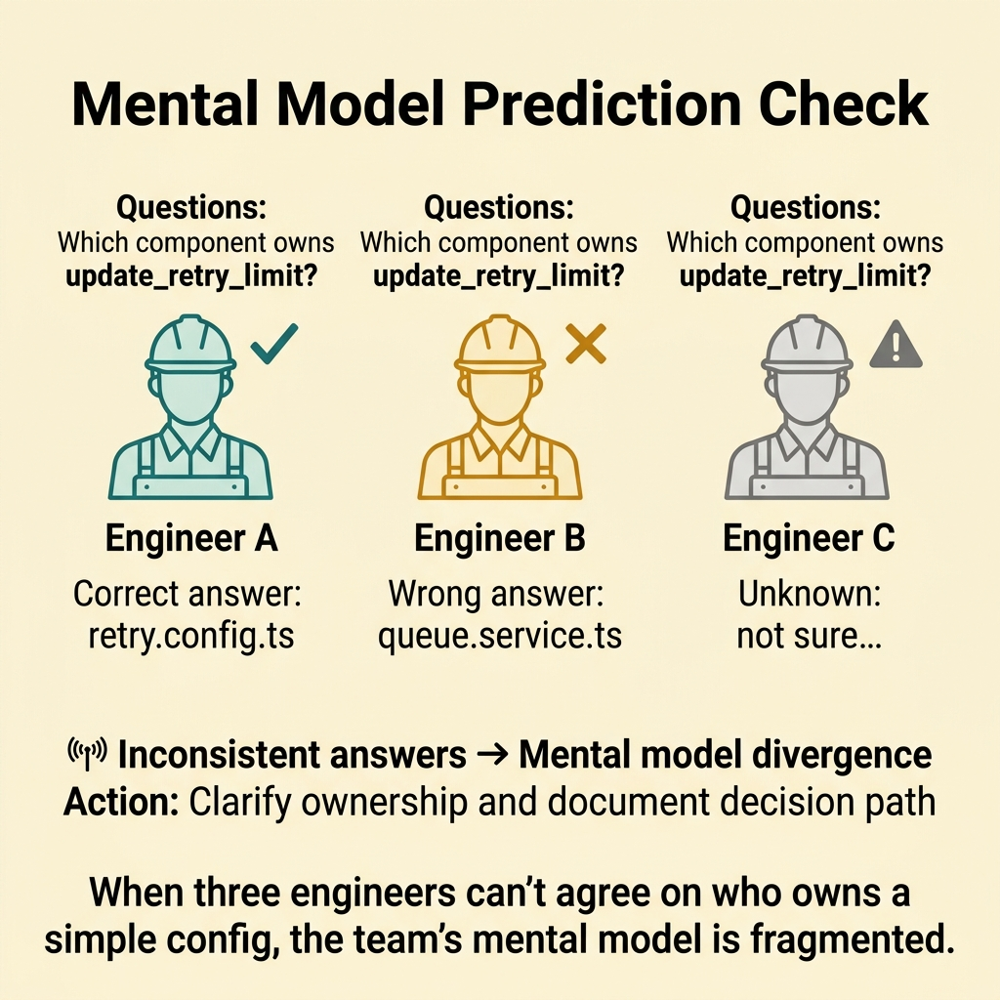
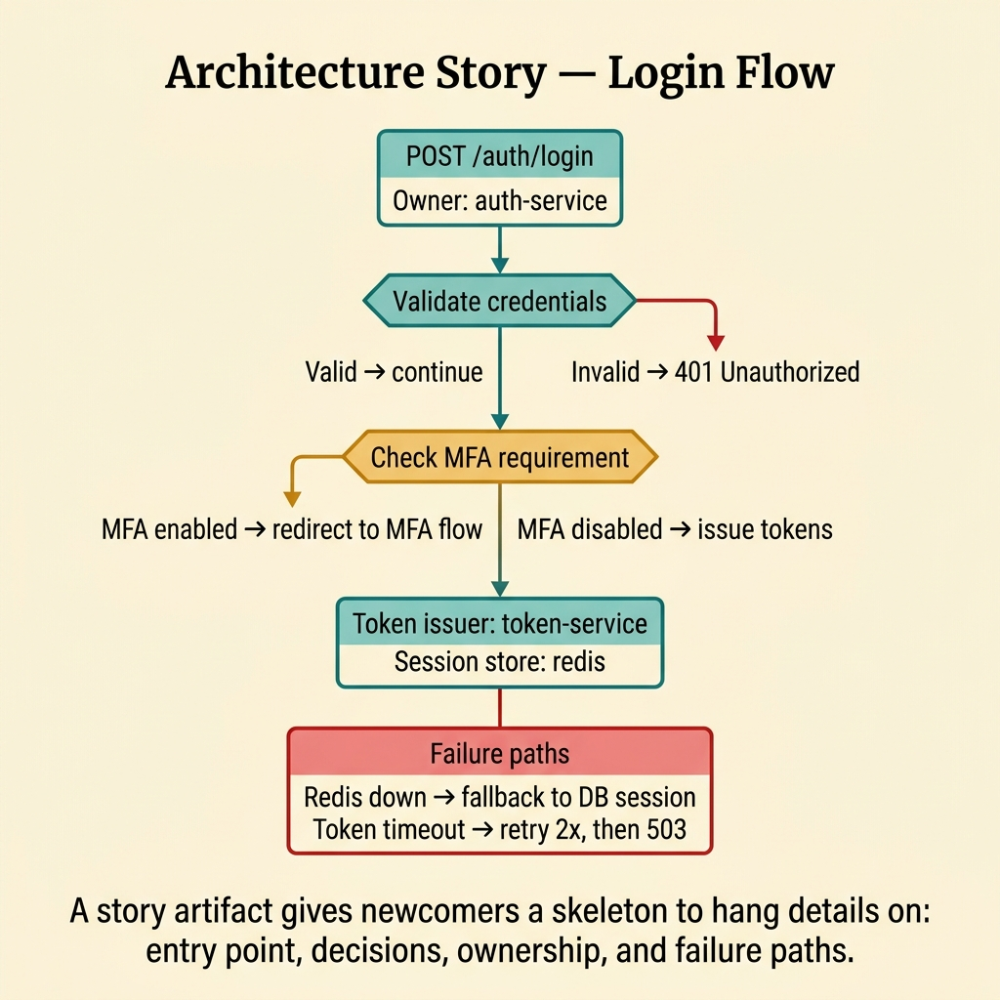
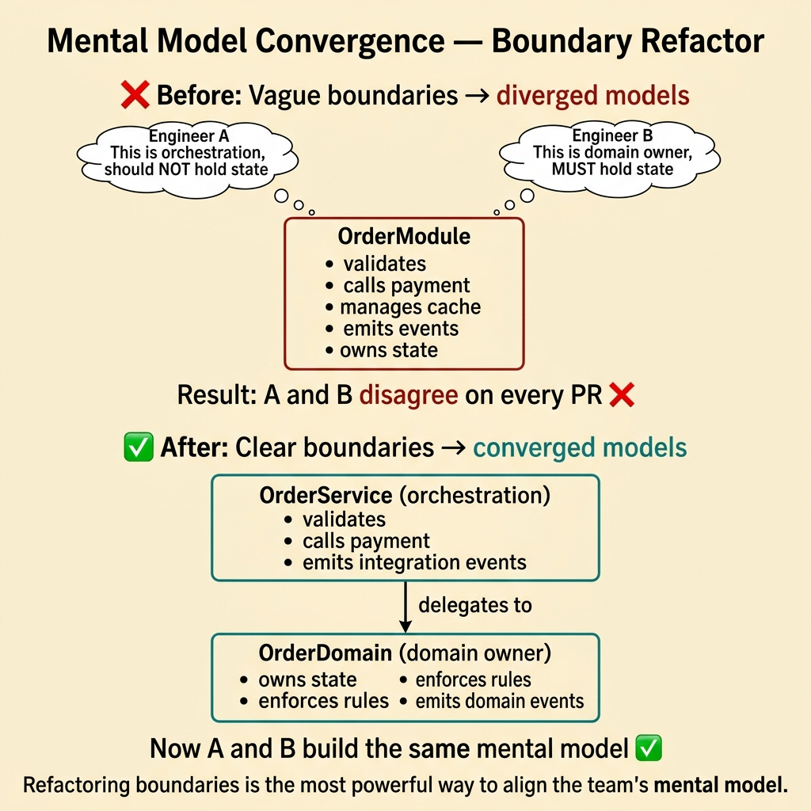
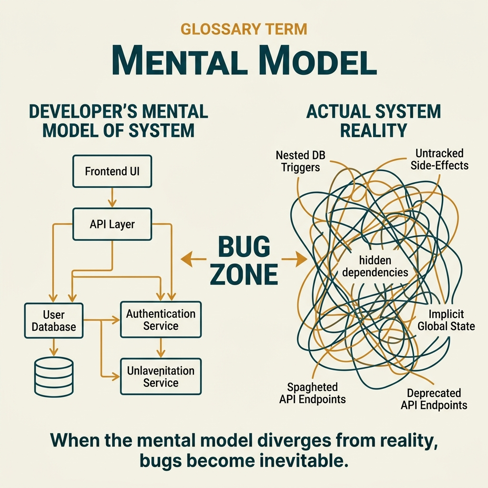

<!-- tags: glossary, reference, developer-cognition-team-dynamics, cognitive-mental-model, mental-model -->
# Mental Model

> The internal map inside a reader's head about how a system works, which part owns what, and what will happen if a specific point is changed.

| Aspect | Detail |
| --- | --- |
| **Concept** | The internal map inside a reader's head about how a system works, which part owns what, and what will happen if a specific point is changed. |
| **Audience** | Developer, reviewer, architect |
| **Primary style** | Glossary term |
| **Entry point** | Use when the team says "this code runs but is very hard to reason about," or when onboarding takes too long because newcomers cannot build the big picture in their head. |

📅 Created: 2026-03-30 · 🔄 Updated: 2026-04-17 · ⏱️ 10 min read

---

## 1. DEFINE

You cannot read the entire codebase every time you fix a small knob. Instead, you rely on a simplified picture in your head: where requests go, where state changes, which service truly owns which data. That picture is your mental model. When the mental model is wrong or fragmented, every change becomes significantly riskier.

**Mental Model** is the internal map inside a reader's head about how a system works, which part owns what, and what will happen if a specific point is changed.

| Variant | Description |
| --- | --- |
| System mental model | Understanding the overall flow, boundaries, and dependencies of the system. |
| Module mental model | Understanding how a single module operates internally. |
| Failure mental model | Understanding how the system will react when errors, timeouts, or inconsistencies appear. |

| Approach | Time | Space | When to choose |
| --- | --- | --- | --- |
| Model audit by prediction | O(n review scenarios) | O(notes) | When you need to verify whether the current mental model is accurate. |
| Architecture storytelling | O(n docs or diagrams) | O(artifacts) | When you need to help newcomers build the model faster. |
| Boundary clarification | O(n refactors) | O(design notes) | When the mental model is wrong because ownership and interfaces are vague. |

Core insight:

> The reader does not work directly on the full codebase. They work on their own simplified mental model of it. Design quality depends heavily on how accurate that model is and how quickly it can be built.

### 1.1 Invariants & Failure Modes

The key invariant: the mental model must be accurate enough to predict system behavior under common changes and common failures. When the code runs fine but maintainers consistently guess wrong about the impact of their changes, the mental model is not being supported properly.

---

## 2. CONTEXT

**Who uses it**: Developer, reviewer, architect

**When**: Use when the team says "this code runs but is very hard to reason about," or when onboarding takes too long because newcomers cannot build the big picture in their head.

**Purpose**: The reader works on their own simplified mental model, not the full codebase. Design quality depends heavily on how accurate that model is and how quickly it can be built.

**In the ecosystem**:
- Mental model differs from documentation. Docs are just one way to support model formation.
- It differs from "knowing the syntax" or "knowing the framework."
- If two engineers read the same flow and infer two different ownership models, the team has a mental-model alignment problem.

---

How the system maps inside your head is clear. But what happens when the mental model is wrong, how do you align models across the team, and when do you update?

## 3. EXAMPLES

Mental model surfaces most clearly when a developer understands the system differently from the architect, when a production bug happens because "I thought it worked differently," or when onboarding a new developer takes a month because nobody transfers the mental model. The examples below place the pattern into exactly those situations.

### Example 1: Basic — Test the mental model with simple prediction questions

A useful mental model must help the reader predict what happens when a small point changes. If every change requires debugging from scratch, the current model is too weak. At the basic level, you do not fix the architecture yet — you test whether the current model enables prediction.



*Figure: When three engineers can’t agree on who owns a simple config, the team’s mental model is fragmented.*

```text
  Prediction check for mental model accuracy:

  Change: update_retry_limit from 3 to 5

  Question 1: Which component owns this rule?
  ┌──────────────────────────────────────────────┐
  │  Engineer A:  "retry.config.ts"     ✅       │
  │  Engineer B:  "queue.service.ts"    ❌       │
  │  Engineer C:  "not sure"            ⚠️       │
  └──────────────────────────────────────────────┘

  Question 2: What side effects should change?
  ┌──────────────────────────────────────────────┐
  │  Engineer A:  "timeout and DLQ threshold"  ✅│
  │  Engineer B:  "just the retry count"       ❌│
  │  Engineer C:  "I would have to check"      ⚠️│
  └──────────────────────────────────────────────┘

  Signal: inconsistent answers → mental model divergence
  Action: clarify ownership and document decision path
```

*Figure: Three engineers answer the same question differently. The divergence reveals that the team's mental model is not aligned — a predictable source of integration bugs.*

```yaml
prediction_check:
  change: update_retry_limit
  ask:
    - which_component_owns_this_rule
    - what_side_effects_should_change
    - what_should_not_change
  signal:
    reviewers_give_consistent_answers: true
```

**Why?** A good mental model shows up through prediction ability. When multiple people predict differently or nobody dares to predict, the boundaries and story of the system are not clear enough.

**Conclusion**: You use prediction accuracy as a small test for the mental model, instead of trusting the vague feeling that "everyone probably understands by now."

**Caveat**: A prediction check does not replace testing or observability. It only reveals whether the current understanding is sufficient for safe reasoning.

**Use when**: Small changes still feel high-risk because nobody is truly confident about how the system will react.

### Example 2: Intermediate — Use architecture storytelling to help newcomers build the model faster

A newcomer can read 20 files and still have no idea how a request actually flows. Good docs do not just list files or setup steps — they tell the story of the system through flow and ownership. At the intermediate level, the goal is to deliver the mental model earlier in the onboarding process.



*Figure: A story artifact gives newcomers a skeleton to hang details on: entry point, decisions, ownership, and failure paths.*

```text
  Architecture story artifact — user_login flow:

  ┌─ Entry Point ──────────────────────────────┐
  │  POST /auth/login                          │
  │  Owner: auth-service                       │
  └──────────────┬─────────────────────────────┘
                 │
                 ▼
  ┌─ Decision Node 1 ─────────────────────────┐
  │  Validate credentials                      │
  │  ├── valid ──► continue                    │
  │  └── invalid ──► 401 Unauthorized          │
  └──────────────┬─────────────────────────────┘
                 │
                 ▼
  ┌─ Decision Node 2 ─────────────────────────┐
  │  Check MFA requirement                     │
  │  ├── MFA enabled ──► redirect to MFA flow  │
  │  └── MFA disabled ──► issue tokens         │
  └──────────────┬─────────────────────────────┘
                 │
                 ▼
  ┌─ Ownership Boundary ──────────────────────┐
  │  Token issuer: token-service               │
  │  Session store: redis (auth-service owns)  │
  └──────────────┬─────────────────────────────┘
                 │
                 ▼
  ┌─ Common Failure Path ─────────────────────┐
  │  Redis down ──► fallback to DB session     │
  │  Token-service timeout ──► retry 2x,       │
  │    then return 503                         │
  └────────────────────────────────────────────┘
```

*Figure: The story artifact gives the newcomer a skeleton to hang details on. Entry point, decisions, ownership boundaries, and failure paths — all in one readable flow.*

```yaml
story_artifact:
  flow: user_login
  include:
    - entry_point
    - main_decision_nodes
    - ownership_boundary
    - common_failure_path
```

**Why?** Newcomers do not need every detail immediately. They need the right frame so they can attach later details to it. Storytelling helps the model form much earlier than letting them self-assemble from the file tree.

**Conclusion**: You help newcomers build their mental model earlier by telling the right story of the system, instead of handing them a pile of files and saying "connect the dots yourself."

**Caveat**: A story that is too polished but does not track real boundaries and code will backfire fast. The reader loses trust the first time they debug and discover the story was fiction.

**Use when**: Newcomers read extensively but still do not know where a flow "starts and ends," or they know file names but cannot see the real ownership.

### Example 3: Advanced — Refactor boundaries so the team's mental model converges

A module validates input, calls side effects, holds cache, and emits events. One person sees it as an orchestration layer. Another sees it as the domain owner. When boundaries are this vague, the team's mental model splits into multiple incompatible versions. At the advanced level, you refactor so everyone's model is closer to the same reality.



*Figure: Refactoring boundaries is the most powerful way to align the team’s mental model.*

```text
  Mental model divergence from vague boundaries:

  ┌─ The actual module ────────────────────────┐
  │  • validates input                         │
  │  • calls payment gateway                   │
  │  • manages cache                           │
  │  • emits domain events                     │
  │  • owns transaction state                  │
  └────────────────────────────────────────────┘

  Engineer A's mental model:          Engineer B's mental model:
  ┌─────────────────────────┐         ┌─────────────────────────┐
  │  "This is orchestration"│         │  "This is domain owner" │
  │  → should NOT hold state│         │  → MUST hold state      │
  │  → side effects go here │         │  → rules live here      │
  └─────────────────────────┘         └─────────────────────────┘

  Result: A and B disagree on every PR touching this module.

  ───────────────────────────────────────────────

  After boundary refactor:

  ┌─ OrderService (orchestration) ─────────────┐
  │  • validates input                         │
  │  • calls payment gateway                   │
  │  • emits integration events                │
  └──────────────┬─────────────────────────────┘
                 │ delegates to
                 ▼
  ┌─ OrderDomain (domain owner) ───────────────┐
  │  • owns transaction state                  │
  │  • enforces business rules                 │
  │  • manages cache                           │
  │  • emits domain events                     │
  └────────────────────────────────────────────┘

  Now A and B build the same mental model. ✅
```

*Figure: Before the refactor, two engineers build incompatible mental models from the same module. After splitting orchestration from domain, both models converge.*

```yaml
boundary_refactor:
  current_smell:
    - mixed_ownership
    - unclear_source_of_truth
  target:
    - single_responsibility_boundary
    - explicit_owner_of_state
    - clearer_interface_names
```

**Why?** Mental models cannot synchronize if the system sends contradictory signals about ownership. Refactoring boundaries is the most powerful way to fix a wrong model at the root, rather than adding surface-level explanations.

**Conclusion**: You make the code tell a more consistent story about ownership, so that everyone looking at the same area does not construct three different mental models.

**Caveat**: Refactoring boundaries usually costs coordination, can break old contracts, and needs a strong safety net before cutting.

**Use when**: Reviewers and implementers consistently disagree about "where this should live" or which service is the source of truth.

### Example 4: Expert — Use the mental-model lens for incidents and system evolution

During an incident, the team reveals its real mental model. They assume a certain layer catches failures, or they assume a certain metric reflects a certain truth. When a system evolves over time, old mental models can quietly go stale. At the expert level, you use incidents and design reviews to continuously recalibrate the collective model.

```text
  Incident-driven model recalibration:

  Timeline:
  ┌─ Incident: checkout timeout spike ─────────┐
  │                                             │
  │  Assumption:  "Payment gateway retries      │
  │                are handled by the gateway"  │
  │  Reality:     retries were in our code,     │
  │                hitting rate limits ❌        │
  │                                             │
  │  Root cause:  mental model was 6 months     │
  │                stale after refactor          │
  └──────────────┬─────────────────────────────┘
                 │
                 ▼
  ┌─ Recalibration actions ────────────────────┐
  │  1. Update architecture diagram             │
  │  2. Refresh retry ownership in docs         │
  │  3. Add "who retries?" to review checklist  │
  │  4. Share updated model in team sync        │
  └────────────────────────────────────────────┘

  Before: team operated on stale map ❌
  After:  model matches current terrain ✅
```

*Figure: The incident exposed a stale assumption. Recalibration updates the artifact so the team's map matches the real terrain again.*

```yaml
model_recalibration:
  triggers:
    - incident_exposed_wrong_assumption
    - major_architecture_change
    - repeated_review_confusion
  updates:
    - diagram_refresh
    - doc_story_refresh
    - ownership_note_update
```

**Why?** Mental models degrade over time if they are not updated. Incidents are usually when wrong models are exposed most clearly, so they are also the best time to fix the model for the whole team.

**Conclusion**: You treat the mental model as a living team artifact that needs recalibration after incidents and after every significant change in system shape.

**Caveat**: If every small change triggers gratuitous doc churn, the team will get tired and abandon updates entirely. Only update the parts that change how the team reasons.

**Use when**: The system has evolved significantly, old assumptions start causing bugs or review confusion, and the team is operating with maps that no longer match the real terrain.

---

## 4. COMPARE




*Figure: Position of mental model between cognitive load, documentation, and knowledge transfer. A shared mental model means team alignment; diverged models mean bugs at integration.*

Mental model sounds like "understanding the system." Correct — but the mental model is implicit (inside the head), while documentation is explicit (on paper). Shared mental model = team aligned. Diverged mental model = bugs at integration boundaries.

### Level 1

```text
system reality
  -> simplified understanding in the reader's head
  -> predictions about changes and failures
```

*Figure: Level 1 shows the mental model as a simplified map that helps the reader predict, not a full copy of the system.*

### Level 2

```text
clear boundaries + names + diagrams + examples
  -> faster mental model formation
  -> fewer wrong assumptions
  -> safer changes
```

*Figure: Level 2 emphasizes that a good mental model does not appear by itself. It is nurtured by the right structure, naming, and artifacts placed at the right time.*

### Easily confused or boundary-slipping

You have seen at which cognitive layer Mental Model operates. The mistakes below are common misuses that leave the feeling of confusion vague and hard to improve.

| # | Severity | Mistake | Consequence | Fix |
| --- | --- | --- | --- | --- |
| 1 | 🔴 Fatal | Leaving ownership vague so each person holds a different mental model | Changes break unexpectedly and incidents are hard to debug | Clarify boundaries and source of truth. |
| 2 | 🟡 Common | Thinking setup docs are enough for onboarding | Newcomer can run the code but cannot reason about it | Add flow stories and ownership narratives. |
| 3 | 🟡 Common | Not using incidents to fix the collective model | Team repeats the same wrong assumption | Recalibrate docs and diagrams after incidents. |
| 4 | 🔵 Minor | Mental model exists only in the senior's head | Team depends on one person and reviews slow down | Externalize the model through diagrams, notes, and examples. |

### Quick scan

| If you face | Action |
| --- | --- |
| Nobody confidently predicts the impact of a small change | Test mental model with a prediction check. |
| Onboarding reads a lot but still does not understand the system | Write flow stories, not just setup docs. |
| Reviewers constantly argue about ownership | Refactor boundaries so models converge. |

---

## 5. REF

| Resource | Type | Link | Note |
| --- | --- | --- | --- |
| A Philosophy of Software Design | Book | https://web.stanford.edu/~ouster/cgi-bin/book.php | Foundation for clarity and conceptual integrity. |
| Team Topologies | Book | https://teamtopologies.com/ | Strong connection between boundaries and understanding. |
| Cognitive Load | Reference | ./01-cognitive-load.md | The closest term about the cost of building the model. |

---

## 6. RECOMMEND

Mental model solves the problem "each developer understands the system differently." The next question: what does context switching cost, and how does deep work help?

| Expand to | When | Reason | File/Link |
| --- | --- | --- | --- |
| Cognitive Load | When you want to understand why the model is hard to form | Load is the direct cost of building the model. | [Cognitive Load](./01-cognitive-load.md) |
| Context Switching | When the model keeps breaking because tasks change too fast | Switching cost prevents the model from stabilizing. | [Context Switching](./03-context-switching.md) |
| Cognitive & Mental Model | When you need to return to the subtopic hub | Preserves the context of the entire branch. | [Cognitive & Mental Model](./README.md) |

Back to the "I thought it worked differently" at the start — wrong mental model, production bug. Now you know: visualize the mental model (architecture diagrams, data flow), validate it (does code match model?), share it (reviews, pairing). Wrong model = bug factory.

**Links**: [← Previous](./01-cognitive-load.md) · [→ Next](./03-context-switching.md)
