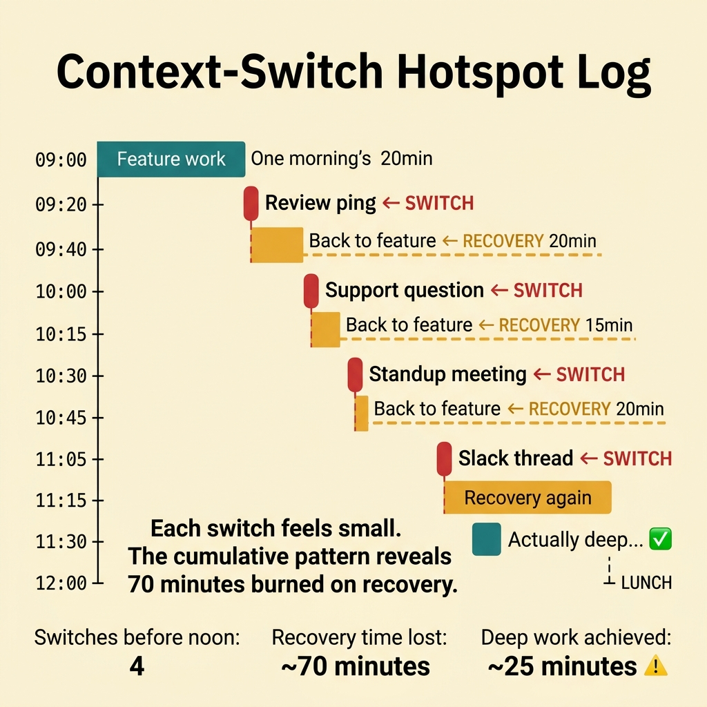
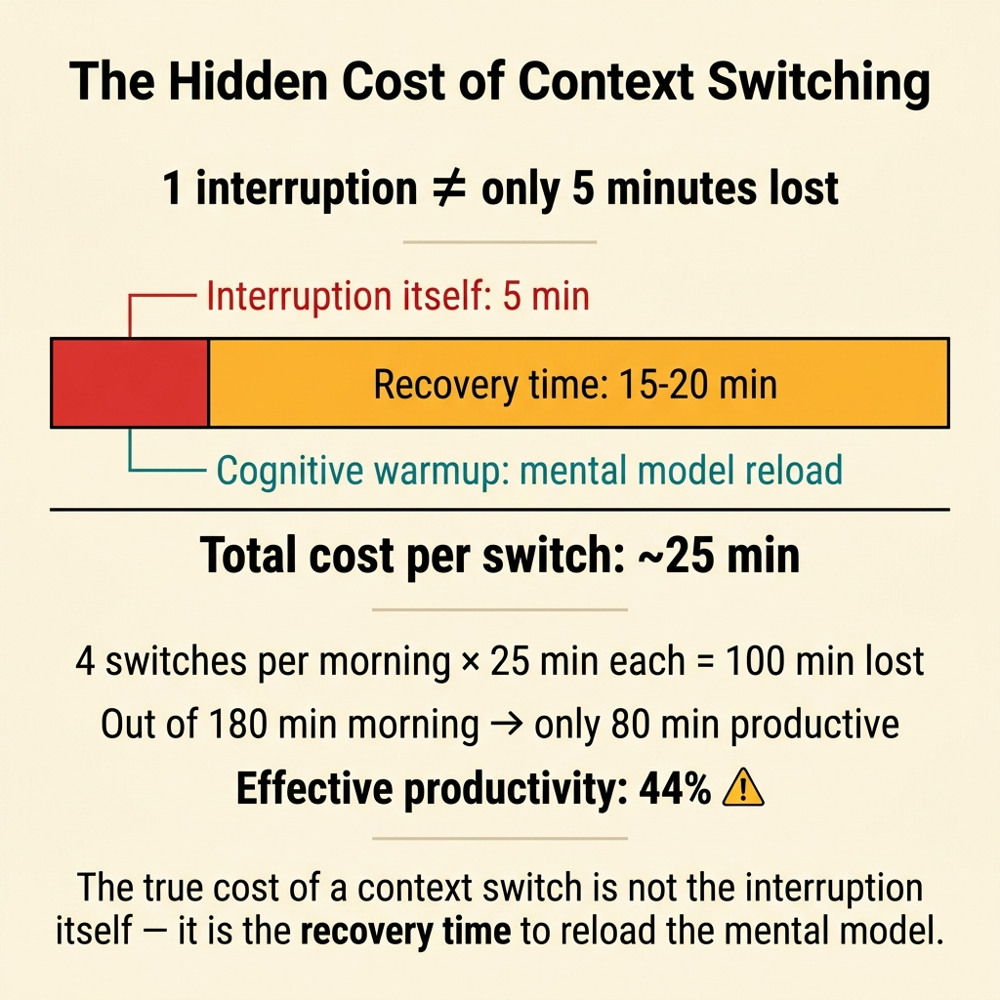
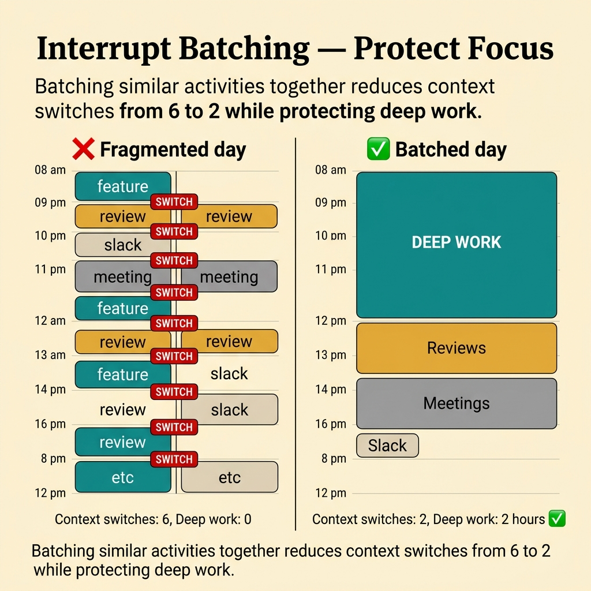
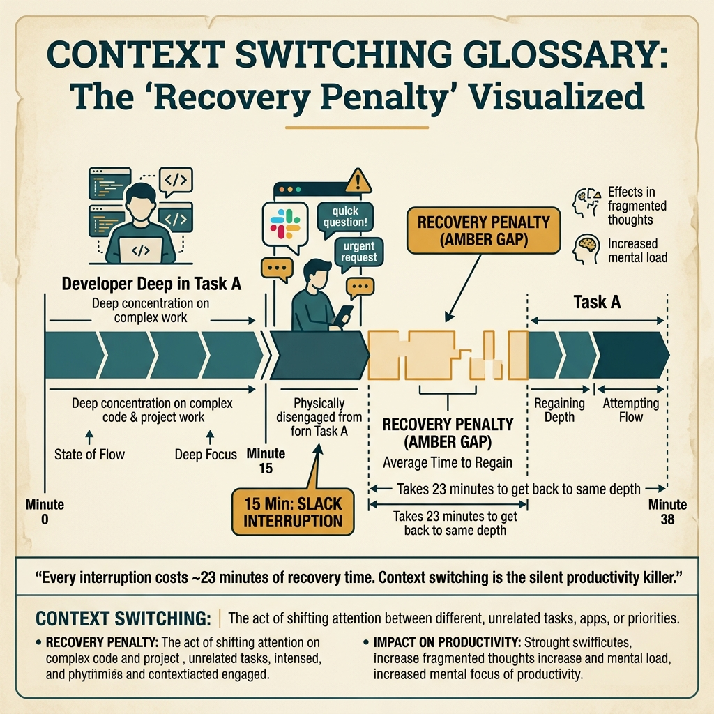

<!-- tags: glossary, reference, developer-cognition-team-dynamics, cognitive-mental-model, context-switching -->
# Context Switching

> The cognitive cost and focus-recovery time spent when switching repeatedly between tasks, codebases, roles, or work modes.

| Aspect | Detail |
| --- | --- |
| **Concept** | The cognitive cost and focus-recovery time spent when switching repeatedly between tasks, codebases, roles, or work modes. |
| **Audience** | Developer, manager, tech lead |
| **Primary style** | Glossary term |
| **Entry point** | Use when the team is busy all day but deep output is low, or when one person keeps jumping between support, code review, incidents, and feature work. |

📅 Created: 2026-03-30 · 🔄 Updated: 2026-04-17 · ⏱️ 10 min read

---

## 1. DEFINE

Picture rebuilding the context in your head to fix a race condition bug. You are halfway there when Slack pings about a red dashboard. Then a PR review needs merging. Then a 15-minute meeting cuts in. After all of that, going back to the original screen costs another 20 minutes just to remember where you were. That recovery time is the context-switching cost most teams underestimate.

**Context Switching** is the cognitive cost and focus-recovery time spent when switching repeatedly between tasks, codebases, roles, or work modes.

| Variant | Description |
| --- | --- |
| Task switching | Changing between different tasks within the same day. |
| Cognitive-mode switching | Changing between deep coding, meetings, support, review, and incidents. |
| Codebase switching | Changing between multiple repos or bounded contexts. |

| Approach | Time | Space | When to choose |
| --- | --- | --- | --- |
| Switch-cost audit | O(n work samples) | O(activity log) | When you want to see the real cost instead of a vague feeling. |
| Work batching | O(n planning cycles) | O(schedule) | When grouping similar work reduces reset cost. |
| Protected focus windows | O(n calendar blocks) | O(calendar rules) | When the team needs uninterrupted time for hard problems. |

Core insight:

> Context switching does not just "cost a few minutes." It breaks the mental model being built, increases error rate, and extends the recovery time to deep reasoning. The more knowledge-intensive the work, the higher this cost.

### 1.1 Invariants & Failure Modes

The invariant of a good workflow: the number of necessary context switches must be lower than the value they produce. When everything is "a little urgent," the team lives in a state of constant cognitive restart and loses the capacity for deep work.

---

## 2. CONTEXT

**Who uses it**: Developer, manager, tech lead

**When**: Use when the team is busy all day but deep output is low, or when one person keeps jumping between support, code review, incidents, and feature work.

**Purpose**: Context switching breaks the mental model being built, increases error rate, and extends recovery time. The more knowledge-intensive the work, the higher this cost.

**In the ecosystem**:
- Context switching differs from the multitasking myth. In most cases, it is rapid serial switching.
- It differs from healthy collaboration. Not every interaction is harmful — the problem is when the switching rhythm is too dense and undesigned.
- If metrics only measure closed tickets without seeing restoration cost, switching remains hidden.

---

Switching contexts is clear. But how much does a context switch cost, how do you minimize it, and what about meetings versus focus time?

## 3. EXAMPLES

Context switching surfaces most clearly when a developer gets interrupted 15 times a day and needs 23 minutes to recover each time, when 3 projects run simultaneously but none advances, or when scattered meetings kill every deep-work slot. The examples below place the pattern into exactly those situations.

### Example 1: Basic — Name the switch hotspots instead of just complaining about interruptions

You end a workday feeling constantly busy but without a single block that went deep. Saying "I got interrupted too much today" gives the team nothing to fix. At the basic level, the goal is to measure where switching happens most.



*Figure: Four switches before noon consumed 70 minutes in recovery. The day felt "busy" but only 25 minutes of deep work happened.*

```text
  Context-switch hotspot log — one day sample:

  09:00 ─ feature work ──────────────────────────┐
  09:20 ─ review ping ◄── SWITCH ─────────────── │
  09:40 ─ back to feature ◄── RECOVERY 20min ── │
  10:00 ─ support question ◄── SWITCH ────────── │
  10:15 ─ back to feature ◄── RECOVERY 15min ── │
  10:30 ─ standup meeting ◄── SWITCH ──────────  │
  10:45 ─ back to feature ◄── RECOVERY 20min ── │
  11:05 ─ Slack thread ◄── SWITCH ─────────────  │
  11:15 ─ back to feature ◄── RECOVERY 15min ── │
  11:30 ─ actually working deep... ✅            │
  12:00 ─ lunch                                   │
                                                  │
  Switches before noon: 4                         │
  Recovery time lost: ~70 minutes                 │
  Deep work achieved: ~25 minutes ⚠️              │
```

*Figure: Four switches before noon consumed 70 minutes in recovery alone. The day felt "busy" but only 25 minutes of deep work happened.*

```yaml
switch_hotspots:
  day_sample:
    - feature_work_interrupted_by_review_ping
    - review_interrupted_by_support_question
    - support_interrupted_by_meeting
  classify_by:
    - task_switch
    - codebase_switch
    - cognitive_mode_switch
```

**Why?** Context switching is usually invisible because each interruption is small. A simple log reveals the cumulative pattern of a workday and turns a feeling into data.

**Conclusion**: You have turned the feeling "the whole day got shredded" into a named hotspot with a pattern that the team can discuss and fix, not just complain about.

**Caveat**: A personal log does not prove every switch is bad. It only shows the density and type of interruptions so the team can distinguish what is necessary from what is waste.

**Use when**: The team consistently feels short on time for hard work despite long working hours, and everyone agrees they "can never sit still long enough."

### Example 2: Intermediate — Reduce switching with batching and clearer ownership

If the same person holds feature work, answers support, and manages the review queue, switching becomes the default state. At the intermediate level, the goal is to reduce the number of resets by grouping similar work and clarifying who is on-duty for each type.



*Figure: The true cost of a context switch is not the interruption itself — it is the 15–20 min recovery to reload the mental model.*

```text
  Before: everything interleaved

  09:00 ┬─ feature ──► review ──► support ──► feature ──► meeting
        │  switch     switch     switch      switch     switch
        │
        └─ Switches: 5   Deep blocks: 0   Recovery: ~100 min

  ─────────────────────────────────────────────────────────

  After: batched by type

  09:00 ┬─ FEATURE (protected) ─────────────────► 10:30
        │  0 switches   Deep block: 90 min ✅
        │
  10:30 ┬─ REVIEW (batched window) ─────────────► 11:00
        │  1 switch     Reviews: 3 PRs
        │
  11:00 ┬─ MEETING (batched) ───────────────────► 11:30
        │  1 switch
        │
  11:30 ┬─ SUPPORT (owner on rotation) ─────────► 12:00
        │  1 switch
        │
        └─ Switches: 3   Deep blocks: 1   Recovery: ~30 min
```

*Figure: Batching cuts switches from 5 to 3, creates a 90-minute deep-work block, and reduces recovery time from 100 to 30 minutes.*

```yaml
batching_rules:
  review_windows:
    - "11:00"
    - "16:00"
  support_owner_rotation: true
  protected_feature_blocks:
    - "09:00-10:30"
    - "14:00-15:30"
```

**Why?** Many small interruptions are worse than a few intentional mode changes. Batching does not eliminate collaboration, but it compresses reset cost into fewer, more predictable points.

**Conclusion**: You reduce switch cost by designing a clearer work rhythm, instead of leaving each person to fend for themselves against every open ping and queue.

**Caveat**: Batching too rigidly can delay support or reviews if the team has no exception rule for genuinely urgent items.

**Use when**: Reviews or support requests invade every gap in feature work and turn the day into a chain of constant restarts.

### Example 3: Advanced — Design incident and on-call flow to avoid breaking the entire team



*Figure: Batching similar activities together reduces context switches from 6 to 2 while protecting deep work.*

An incident does not just consume the on-call person's time — it often destroys the whole team's context if everyone gets pulled in. At the advanced level, you reduce switching by limiting the blast radius of interruptions through clear roles, escalation paths, and better observability.

```text
  Incident blast radius — before vs after:

  BEFORE: everyone gets pulled in
  ┌──────────────────────────────────────────────┐
  │  Incident: API latency spike                 │
  │                                              │
  │  On-call  ──► investigating        (needed)  │
  │  Dev A    ──► pulled into Slack     (wasted) │
  │  Dev B    ──► watching dashboard    (wasted) │
  │  Dev C    ──► "just in case"       (wasted) │
  │  Dev D    ──► reading thread       (wasted) │
  │                                              │
  │  People with context broken: 5 / 5 ❌        │
  └──────────────────────────────────────────────┘

  AFTER: escalation ladder limits blast radius
  ┌──────────────────────────────────────────────┐
  │  Incident: API latency spike                 │
  │                                              │
  │  On-call  ──► investigating        (needed)  │
  │  Dev A    ──► continues deep work  (safe) ✅ │
  │  Dev B    ──► continues deep work  (safe) ✅ │
  │  Dev C    ──► standby if escalated (aware)   │
  │  Dev D    ──► continues deep work  (safe) ✅ │
  │                                              │
  │  People with context broken: 1 / 5 ✅        │
  │  Escalation trigger: customer-wide impact    │
  └──────────────────────────────────────────────┘
```

*Figure: Without an escalation ladder, every incident breaks 5 people's context. With clear roles, only the on-call engineer switches; the rest continue deep work.*

```yaml
incident_flow:
  primary_owner: oncall_engineer
  escalate_when:
    - customer_impact_widespread
    - rollback_not_possible
    - dependency_owner_required
  default_rule:
    do_not_page_entire_team_for_early_triage: true
```

**Why?** If every urgent interruption spreads to the entire team, switch cost explodes. Good incident design keeps most of the team in deep work while the right people handle the hot situation.

**Conclusion**: You use role clarity to prevent a small incident from becoming a context-ripping event for the whole team, keeping most engineers focused on their own work.

**Caveat**: Calling too few people can also slow triage if the escalation rules are vague or observability is too weak for the on-call to self-assess.

**Use when**: Small incidents routinely break 5–6 people's focus even though only 1–2 are actually needed.

### Example 4: Expert — Use the context-switching lens to evaluate team design, not just individuals

An organization can accidentally build a work system optimized for fast reaction but terrible for thinking work. At the expert level, context switching becomes a lens to evaluate team topology, calendar norms, and expectations around responsiveness.

```text
  Operating model comparison:

  ┌─ Reactive-first model ─────────────────────┐
  │  Default: respond immediately to everything │
  │  Calendar: no protected blocks              │
  │  Support: everyone handles everything       │
  │                                             │
  │  Switch density: HIGH                       │
  │  Deep work capacity: NEAR ZERO ❌           │
  │  Short-term throughput: looks good          │
  │  Long-term quality: declining               │
  └─────────────────────────────────────────────┘

  ┌─ Designed-for-depth model ─────────────────┐
  │  Default: async updates, respond in windows │
  │  Calendar: protected morning blocks         │
  │  Support: dedicated rotation                │
  │                                             │
  │  Switch density: LOW                        │
  │  Deep work capacity: 2-3 hours/day ✅       │
  │  Short-term throughput: slightly lower      │
  │  Long-term quality: improving               │
  └─────────────────────────────────────────────┘
```

*Figure: The reactive model optimizes for speed but kills quality over time. The depth-designed model trades a little short-term throughput for sustained long-term quality.*

```yaml
operating_model:
  prefer:
    - async_status_updates
    - explicit_interruption_channels
    - dedicated_support_rotation
  avoid:
    - everybody_on_everything
    - always_immediate_response_culture
```

**Why?** Switching cost accumulates into an organizational trait, not just a daily annoyance. When team design pushes everyone into always-online mode, long-term technical quality declines even if short-term throughput looks high.

**Conclusion**: You turn context switching from "each person optimizes their own calendar" into a design criterion for the operating model, calendar norms, and responsiveness expectations of the whole team.

**Caveat**: Environments that need real-time reaction (incident bridges, support escalation) still need clear exceptions. The goal is to keep exceptions in their place, not make them the default.

**Use when**: The whole team feels fragmented despite everyone "working very hard," and deep throughput keeps declining over time.

---

## 4. COMPARE




*Figure: Position of context switching between deep work, flow state, and time management.*

Context switching sounds like multitasking. Close — but context switching has a measurable cost: 23 minutes average recovery (Gloria Mark, UC Irvine). Multitasking is a myth. What actually happens is rapid context switching with compounding overhead.

### Level 1

```text
focus built
  -> interruption happens
  -> context lost
  -> recovery time needed
```

*Figure: Level 1 shows the switching cost lives not at the moment of interruption but in the recovery time that follows.*

### Level 2

```text
feature work
  -> review ping
  -> support question
  -> meeting
  -> return to feature with partial memory
  -> slower reasoning and more mistakes
```

*Figure: Level 2 emphasizes that many small interruptions compound into a large loss in reasoning quality.*

### Easily confused or boundary-slipping

You have seen at which cognitive layer Context Switching operates. The mistakes below are common misuses that leave the feeling of overload vague and hard to improve.

| # | Severity | Mistake | Consequence | Fix |
| --- | --- | --- | --- | --- |
| 1 | 🔴 Fatal | Treating switching cost as an individual problem to "just manage" | Team design never gets fixed | Audit hotspots and change the workflow and ownership. |
| 2 | 🟡 Common | Keeping a "respond immediately to everything" culture | Nobody gets enough block time to go deep | Create batching windows and interruption channels. |
| 3 | 🟡 Common | Pulling the entire team into incidents too early | Collective context destroyed | Use a clear escalation ladder. |
| 4 | 🔵 Minor | Measuring productivity only by short-term output | Switch cost stays hidden | Add a lens for recovery time and fragmentation. |

### Quick scan

| If you face | Action |
| --- | --- |
| Busy all day but hard to finish deep work | Audit context-switch hotspots. |
| Reviews and support invade every task | Batch and clarify ownership. |
| Small incidents also break the whole team's focus | Design a clearer escalation flow. |

---

## 5. REF

| Resource | Type | Link | Note |
| --- | --- | --- | --- |
| Deep Work | Book | https://www.calnewport.com/books/deep-work/ | Directly connected to interruption cost. |
| Team Topologies | Book | https://teamtopologies.com/ | Excellent for ownership and team interaction modes. |
| Cognitive Load | Reference | ./01-cognitive-load.md | Context switching is a major source of load. |

---

## 6. RECOMMEND

Context switching solves the problem "developers are busy all day but deliver nothing deep." The next question: how does deep work protect focus, and what is flow state?

| Expand to | When | Reason | File/Link |
| --- | --- | --- | --- |
| Deep Work | When you want to see the positive opposite of protecting focus | Deep work is what context switching destroys directly. | [Deep Work](./04-deep-work.md) |
| Flow State | When you want to understand the "in the zone" state that gets broken | Flow is the most visible manifestation of sustained focus. | [Flow State](./05-flow-state.md) |
| Cognitive & Mental Model | When you need to return to the subtopic hub | Preserves the context of the entire branch. | [Cognitive & Mental Model](./README.md) |

Back to the 15 interrupts per day at the start — 15 × 23 minutes = ~6 hours of recovery. Now you know: batch meetings, protect focus blocks, async communication. Context switching is not free — it is a tax on productivity.

**Links**: [← Previous](./02-mental-model.md) · [→ Next](./04-deep-work.md)
