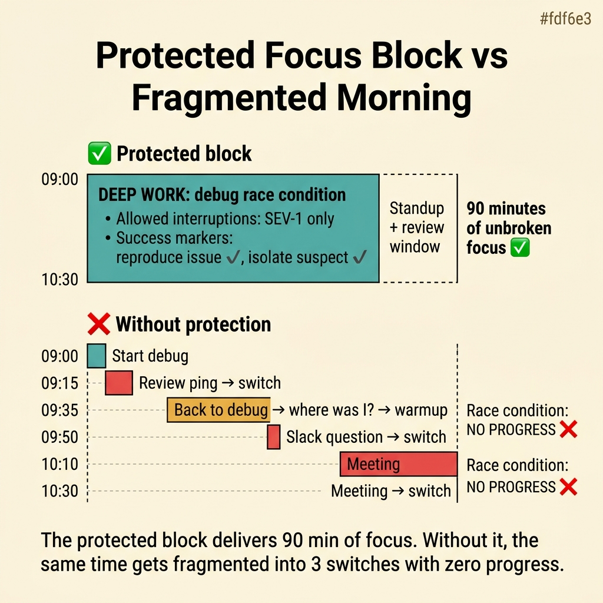
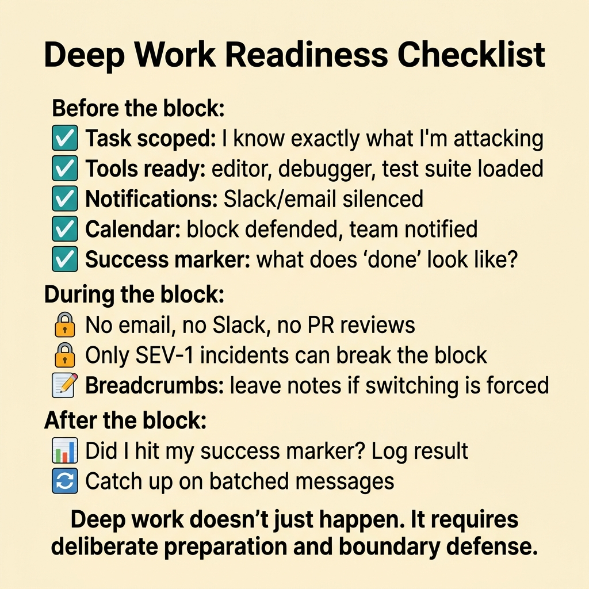
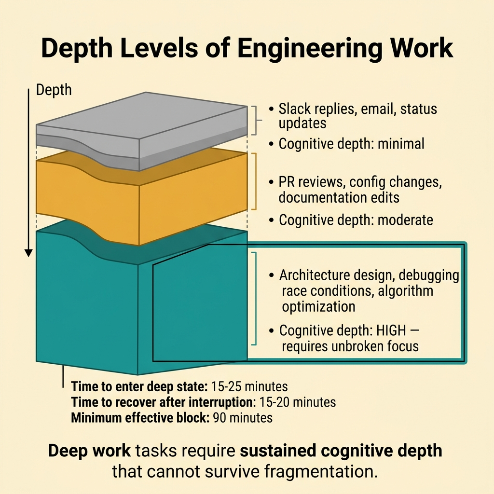
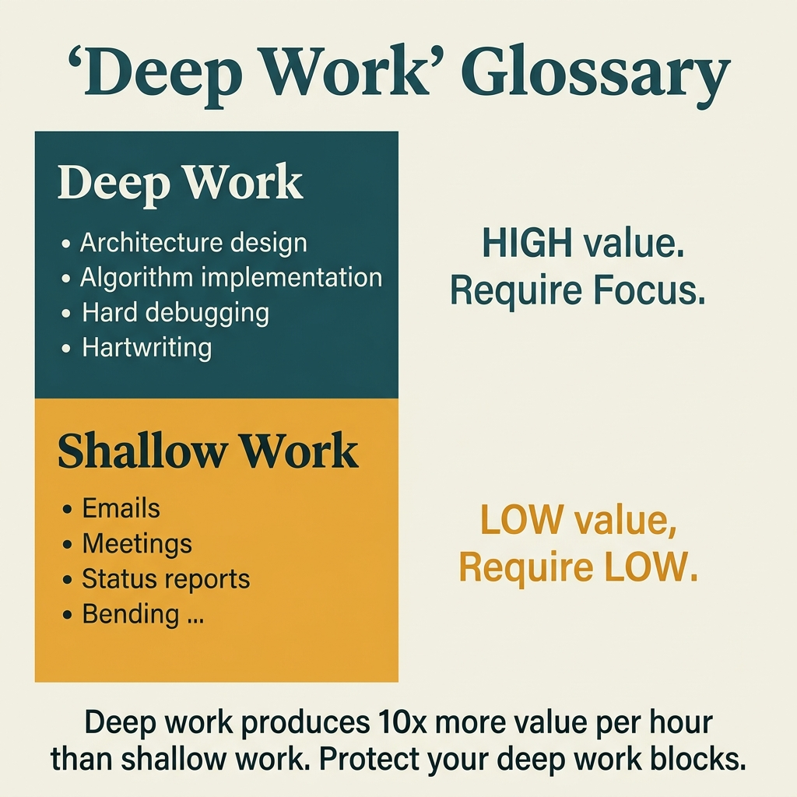

<!-- tags: glossary, reference, developer-cognition-team-dynamics, cognitive-mental-model, deep-work -->
# Deep Work

> A state of sustained, high-intensity focus that lasts long enough to solve hard problems, learn difficult material, or produce technically valuable output instead of just reacting to surface-level tasks.

| Aspect | Detail |
| --- | --- |
| **Concept** | A state of sustained, high-intensity focus that lasts long enough to solve hard problems, learn difficult material, or produce technically valuable output instead of just reacting to surface-level tasks. |
| **Audience** | Developer, manager, tech lead |
| **Primary style** | Glossary term |
| **Entry point** | Use when the team needs to protect time for architecture, hard debugging, large refactors, or high-quality documentation instead of getting shredded all day. |

📅 Created: 2026-03-30 · 🔄 Updated: 2026-04-17 · ⏱️ 10 min read

---

## 1. DEFINE

Some tasks cannot be done "in a spare 20 minutes": peeling apart a concurrency bug, redesigning a module, or understanding a new bounded context. These tasks require sustained focus long enough for the brain to get past the surface layer and reach deep reasoning. That state is deep work.

**Deep Work** is a state of sustained, high-intensity focus that lasts long enough to solve hard problems, learn difficult material, or produce technically valuable output instead of just reacting to surface-level tasks.

| Variant | Description |
| --- | --- |
| Maker deep work | Coding, refactoring, architecture, deep debugging. |
| Learning deep work | Studying a new domain or a hard technique. |
| Writing deep work | Writing design docs, ADRs, specs, or important documentation. |

| Approach | Time | Space | When to choose |
| --- | --- | --- | --- |
| Time blocking | O(n calendar blocks) | O(calendar rules) | When you need to protect focus against predictable interruptions. |
| Ritualized entry | O(n sessions) | O(personal routine) | When you want to enter the deep state faster and more reliably. |
| Interruption shielding | O(n team agreements) | O(team norms) | When the main issue is the environment breaking focus. |

Core insight:

> Deep work is not simply "sitting quietly for longer." It is a cognitive condition that the team must deliberately design and protect if they want to solve genuinely hard problems rather than just completing small tasks quickly.

### 1.1 Invariants & Failure Modes

The invariant of deep work: there must be enough continuous time to enter and sustain a deep mental model. When focus is broken the moment it forms, the team may still look "very busy" but never touches the most important layer of work.

---

## 2. CONTEXT

**Who uses it**: Developer, manager, tech lead

**When**: Use when the team needs to protect time for architecture, hard debugging, large refactors, or high-quality documentation instead of getting shredded all day.

**Purpose**: Deep work is a cognitive condition that the team must deliberately design and protect. Without it, the hardest and most important work keeps getting deferred.

**In the ecosystem**:
- Deep work differs from busy work. It may produce less visible short-term output but usually creates much higher long-term impact.
- It differs from "working alone." Deep pairing or deep design sessions still qualify.
- Not every task needs deep work. Lightweight coordination and quick support have a different mode.

---

Deep focus is clear. But how many hours per day, how do you set up the environment, and can deep work happen in an open office?

## 3. EXAMPLES

Deep work surfaces most clearly when 4 hours of morning focus produce more than 8 hours of shallow work all day, when Slack notifications every 5 minutes kill every focus window, or when the team has no convention protecting deep-work time. The examples below place the pattern into exactly those situations.

### Example 1: Basic — Protect a time block for genuinely hard work

You know today you must fix a hard race condition, but your calendar is already full of review pings and stray meetings. If you do not protect the time upfront, deep work will not "just happen." At the basic level, the most important thing is to carve out explicit space for it.



*Figure: The protected block delivers 90 min of unbroken focus. Without it, the same time gets fragmented into 3 switches with zero progress.*

```text
  Protected focus block:

  ┌─ Calendar: Tuesday morning ────────────────┐
  │                                             │
  │  09:00 ━━━━━━━━━━━━━━━━━━━━━━━━━ 10:30     │
  │  ║  DEEP WORK: debug race condition    ║    │
  │  ║                                     ║    │
  │  ║  Allowed interruptions:             ║    │
  │  ║    • SEV-1 incident only            ║    │
  │  ║                                     ║    │
  │  ║  Success markers:                   ║    │
  │  ║    • reproduce the issue            ║    │
  │  ║    • isolate suspect region         ║    │
  │  ╚═════════════════════════════════════╝    │
  │                                             │
  │  10:30  standup + review window             │
  │  11:00  open calendar resumes               │
  └─────────────────────────────────────────────┘

  Without protection:
  ┌─────────────────────────────────────────────┐
  │  09:00  start race condition debug          │
  │  09:15  review ping ──► context switch      │
  │  09:35  back to debug ──► where was I?      │
  │  09:50  Slack question ──► context switch   │
  │  10:10  meeting ──► context switch          │
  │  10:30  race condition: no progress ❌      │
  └─────────────────────────────────────────────┘
```

*Figure: The protected block delivers 90 minutes of unbroken focus. Without it, the same time gets fragmented into three switches with zero progress.*

```yaml
focus_block:
  task: debug_race_condition
  duration: 90m
  allowed_interruptions:
    - sev1_incident_only
  success_marker:
    - reproduce_issue
    - isolate_suspect_region
```

**Why?** Deep work needs a continuous stretch long enough to set up the mental model, test hypotheses, and keep reasoning unbroken. Without a protected block, hard tasks always drift to the end of the day or stretch indefinitely.

**Conclusion**: You create the minimum condition for deep work to actually begin, instead of standing at the threshold of "about to start" and getting pulled into something else.

**Caveat**: A long block without a clear goal can still drift into pseudo-focus. Protected time only has value when it is anchored to a specific problem.

**Use when**: There is a clearly hard problem that cannot be solved in scattered 10–15 minute intervals.

### Example 2: Intermediate — Design a ritual to enter the deep state faster

Having 90 minutes does not mean the brain automatically enters a good state. Many people spend the first 20–30 minutes just clearing other tasks from their head. At the intermediate level, you add a small ritual to reduce the "warm-up time" of each session.



*Figure: Deep work doesn’t just happen. It requires deliberate preparation and boundary defense.*

```text
  Entry ritual sequence:

  T-0  ──► Close chat notifications        🔕
  T+1  ──► Open ONLY the relevant doc set  📂
  T+2  ──► Write the current question      ✏️
           "What makes this retry loop
            hit the rate limit?"
  T+5  ──► Restate the problem in one      📝
           sentence
  T+7  ──► Mark known unknowns             ❓
           • retry count source?
           • timeout configuration?
  T+10 ──► Begin deep reasoning            🧠

  Without ritual:
  T-0  ──► open editor, check Slack, read email,
           glance at dashboard, refill coffee...
  T+25 ──► "wait, what was I working on?"
  T+30 ──► finally start. Maybe. ⚠️
```

*Figure: The ritual cuts entry time from 25–30 minutes to under 10 by giving the brain a familiar on-ramp into the deep state.*

```yaml
entry_ritual:
  before_start:
    - close_chat_notifications
    - open_single_relevant_doc_set
    - write_current_question
  first_10_minutes:
    - restate_problem
    - mark_known_unknowns
```

**Why?** A good ritual reduces the switching residue from the previous task and helps the brain return to the right problem faster. This is especially valuable for hard work, where the first 15 minutes often determine whether the session goes deep or stays on the surface.

**Conclusion**: You shorten the time-to-depth by giving the brain a familiar entry point, so deep work depends less on inspiration or the random state of the day.

**Caveat**: A ritual that is too complex becomes a new overhead and eats into the time that should be spent thinking. Keep it under 10 minutes.

**Use when**: You have focus blocks but still spend too long before actually starting deep reasoning, or keep circling the surface of the problem.

### Example 3: Advanced — Design team norms so culture does not break deep work

An individual can try to protect focus, but if the team culture defaults to "respond to every ping immediately," deep work will still collapse. At the advanced level, you intervene in the working conventions of the entire group, not just one person's calendar.



*Figure: Deep work tasks require sustained cognitive depth that cannot survive fragmentation.*

```text
  Team norms for deep work protection:

  ┌─ Communication defaults ───────────────────┐
  │  Default mode: async (Slack, comments)      │
  │  Sync only for: incidents, design sessions  │
  │  Expected response window: 2-4 hours        │
  │  Exception: SEV-1 pages → immediate         │
  └─────────────────────────────────────────────┘

  ┌─ Schedule structure ───────────────────────┐
  │  09:00-11:00  NO MEETING ZONE              │
  │  11:00-11:30  standup + sync window        │
  │  11:30        review batch window          │
  │  14:00-16:00  NO MEETING ZONE              │
  │  16:30        review batch window          │
  │  Support: rotating owner (not everyone)    │
  └─────────────────────────────────────────────┘

  Result:
  ┌─────────────────────────────────────────────┐
  │  Protected deep work: 4 hours/day ✅        │
  │  Reviews processed: 2x/day in batches       │
  │  Support coverage: 1 dedicated person/day   │
  │  Meetings: contained to 2 windows           │
  └─────────────────────────────────────────────┘
```

*Figure: Team norms create 4 hours of protected deep work per day by batching reviews, rotating support, and containing meetings to specific windows.*

```yaml
team_norms:
  async_default: true
  review_windows:
    - "11:30"
    - "16:30"
  no_meeting_blocks:
    - "09:00-11:00"
  support_rotation: true
```

**Why?** One person's deep work is easily destroyed by an "always available" culture. Team norms translate deep work from an individual need into a legitimate operating right of the entire group.

**Conclusion**: You make deep work sustainable by fixing the environment around it, instead of forcing each individual to resist a culture that constantly pulls them out of focus.

**Caveat**: Some operational roles still need clear exception mechanisms. Protecting deep work does not mean pretending every task can wait.

**Use when**: Multiple people complain about having no focus time despite everyone trying to "optimize their personal calendar."

### Example 4: Expert — Use deep-work capacity as a health signal for the engineering team

A team that has lost deep-work capacity will gradually abandon refactoring, docs, architecture hygiene, and learning. Over time they still ship, but system quality declines. At the expert level, deep work is not just individual productivity — it is a health signal for the entire engineering organization.

```text
  Deep work capacity as team health signal:

  ┌─ Healthy team ─────────────────────────────┐
  │  Deep work hours/week: 12-15               │
  │  Refactors happen: regularly               │
  │  Design docs written: yes                  │
  │  Tech debt trend: stable or decreasing     │
  │  Team morale: engaged                      │
  └─────────────────────────────────────────────┘

  ┌─ Depleted team ────────────────────────────┐
  │  Deep work hours/week: 0-3                 │
  │  Refactors happen: "next quarter"          │
  │  Design docs written: never                │
  │  Tech debt trend: accelerating ⚠️          │
  │  Team morale: surviving                    │
  └─────────────────────────────────────────────┘

  Warning signal: when reactive work consumes
  ALL capacity, the team can still ship features
  but is silently accumulating debt that will
  eventually become a crisis.
```

*Figure: A team with deep-work capacity maintains quality over time. A depleted team still ships but accumulates debt that eventually becomes a crisis.*

```yaml
team_health_signal:
  check:
    - protected_focus_time_exists
    - major_refactors_not_always_deferred
    - docs_and_design_work_still_happen
  warning_if:
    reactive_work_consumes_all_capacity: true
```

**Why?** Lack of deep work does not break the system immediately, but it silently kills every long-term investment. When you view deep work as team capacity, you spot the crisis before tech debt and shallow decisions pile up into something unmanageable.

**Conclusion**: You use deep-work capacity as an early indicator of technical health, before debt and shallow decisions accumulate into a major problem.

**Caveat**: Do not optimize this metric blindly to the point of neglecting support, pairing, and necessary collaboration. The goal is the right balance, not isolation.

**Use when**: The team still ships regularly but has almost no time for upgrading foundations, cleaning design debt, or solving truly hard problems.

---

## 4. COMPARE




*Figure: Position of deep work between flow state, context switching, and time management.*

Deep work sounds like flow state. Close — but deep work is a practice (scheduled, intentional). Flow state is a psychological state (spontaneous, hard to control). Deep work creates the conditions for flow state, but does not guarantee it.

### Level 1

```text
protected focus time
  -> deeper reasoning
  -> higher quality output
```

*Figure: Level 1 shows deep work as the zone where reasoning goes deeper than usual — not just time passing longer.*

### Level 2

```text
task with real complexity
  -> uninterrupted time block
  -> mental model stabilizes
  -> non-obvious solution appears
```

*Figure: Level 2 emphasizes deep work is valuable because it allows the mental model to stabilize enough to solve the class of problem that does not reveal itself in the first 5 minutes.*

### Easily confused or boundary-slipping

You have seen at which cognitive layer Deep Work operates. The mistakes below are common misuses that leave the feeling of overload vague and hard to improve.

| # | Severity | Mistake | Consequence | Fix |
| --- | --- | --- | --- | --- |
| 1 | 🔴 Fatal | Treating deep work as a personal privilege instead of a system need | The team never protects genuinely hard work | Make deep work a team norm and scheduling rule. |
| 2 | 🟡 Common | Having focus blocks but lacking goals and entry rituals | Long sessions but low quality | Add success markers and entry rituals. |
| 3 | 🟡 Common | A "respond immediately" culture breaks every focus block | Refactoring, learning, and hard debugging all stall | Set async-default and batching windows. |
| 4 | 🔵 Minor | Labeling every hard task as deep work | Loses the distinction between coordination and deep reasoning | Use only for tasks that truly need a stable model over time. |

### Quick scan

| If you face | Action |
| --- | --- |
| Hard tasks always drift to end of week or end of day | Block focus time first. |
| Have time but cannot get into the zone | Add entry ritual and clear goal. |
| Entire team lacks time for deep work | Fix norms, not just individual calendars. |

---

## 5. REF

| Resource | Type | Link | Note |
| --- | --- | --- | --- |
| Deep Work | Book | https://www.calnewport.com/books/deep-work/ | The most popular source for this concept. |
| Team Topologies | Book | https://teamtopologies.com/ | Connects team interaction modes and cognitive load. |
| Context Switching | Reference | ./03-context-switching.md | The most direct destroyer of deep work. |

---

## 6. RECOMMEND

Deep work solves the problem "developers need uninterrupted time for complex tasks." The next question: what is flow state, and what are the working memory constraints?

| Expand to | When | Reason | File/Link |
| --- | --- | --- | --- |
| Flow State | When you want to understand the "in the zone" experience inside deep work | Flow is the closest experience to good deep work. | [Flow State](./05-flow-state.md) |
| Context Switching | When you want to see the opposing force against deep focus | Context switching is what destroys deep work directly. | [Context Switching](./03-context-switching.md) |
| Cognitive & Mental Model | When you need to return to the subtopic hub | Preserves the context of the entire branch. | [Cognitive & Mental Model](./README.md) |

Back to the 4 hours vs 8 hours at the start — deep work produces more. Now you know: schedule deep work blocks, turn off notifications, signal "do not disturb." Deep work is a skill, not a luxury. You must practice it and protect it.

**Links**: [← Previous](./03-context-switching.md) · [→ Next](./05-flow-state.md)
