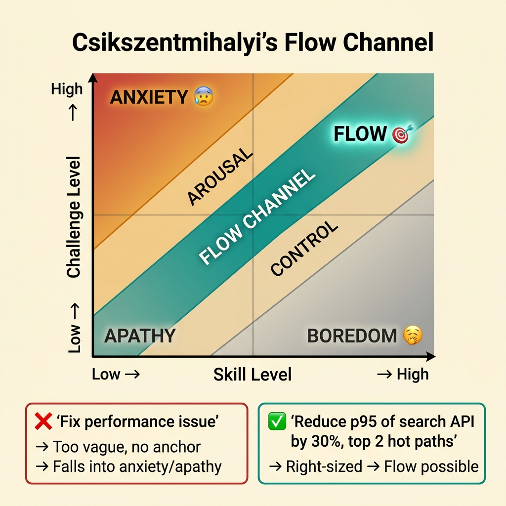
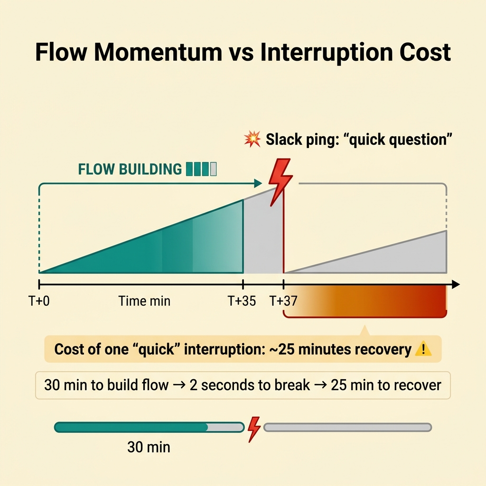
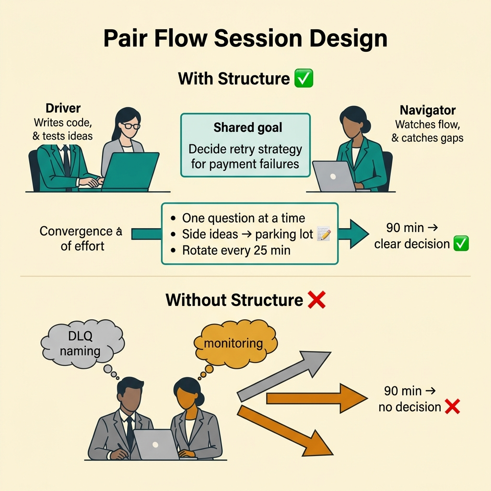
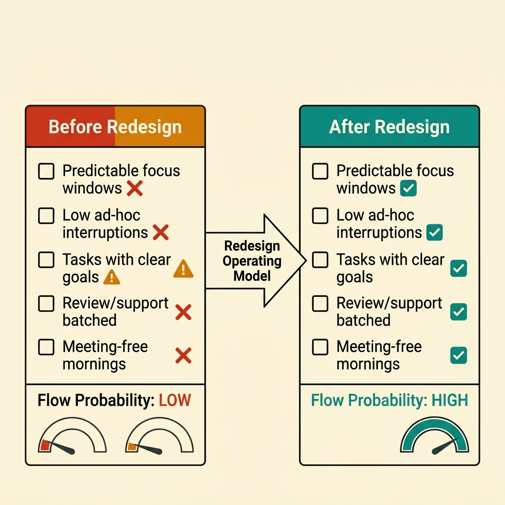
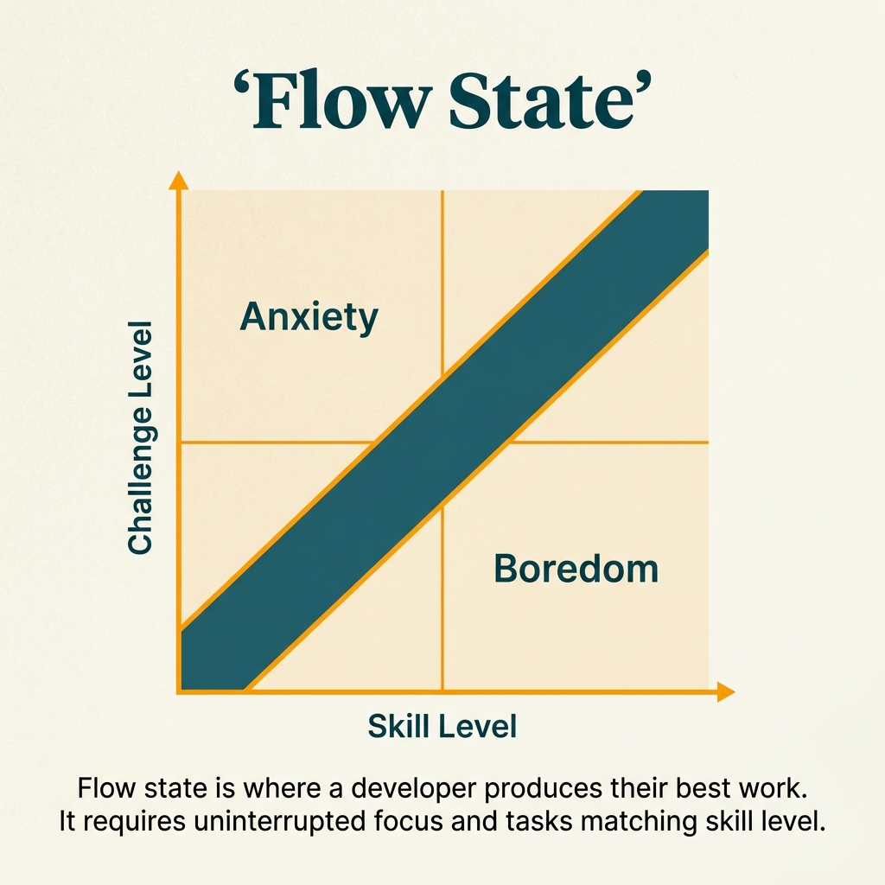

<!-- tags: glossary, reference, developer-cognition-team-dynamics, cognitive-mental-model, flow-state -->
# Flow State

> The "in the zone" state when task difficulty is just challenging enough, the goal is clear enough, and interruptions are low enough for thinking to move in a smooth, connected stream.

| Aspect | Detail |
| --- | --- |
| **Concept** | The "in the zone" state when task difficulty is just challenging enough, the goal is clear enough, and interruptions are low enough for thinking to move in a smooth, connected stream. |
| **Audience** | Developer, manager, mentor |
| **Primary style** | Glossary term |
| **Entry point** | Use when the team wants to understand why some sessions feel incredibly productive while others go nowhere despite hours of sitting. |

📅 Created: 2026-03-30 · 🔄 Updated: 2026-04-17 · ⏱️ 9 min read

---

## 1. DEFINE

Some debugging sessions last 2 hours and feel like 30 minutes. Every hypothesis connects smoothly to the next. But other days you spend 10 minutes and already need to rebuild the problem from scratch. This difference is not just mood. It is directly related to the conditions that allow flow state to appear.

**Flow State** is the "in the zone" state when task difficulty is just challenging enough, the goal is clear enough, and interruptions are low enough for thinking to move in a smooth, connected stream.

| Variant | Description |
| --- | --- |
| Solo flow | One person enters the zone on an individual problem. |
| Pair flow | Two people reason smoothly together in a pairing or design session. |
| Creative-debug flow | Flow appears during debugging or design where hypotheses are tested continuously. |

| Approach | Time | Space | When to choose |
| --- | --- | --- | --- |
| Task-scope tuning | O(n task setups) | O(task briefs) | When you want to adjust difficulty to the right level. |
| Interruption minimization | O(n focus blocks) | O(schedule) | When flow is destroyed by switching and pings. |
| Clear-goal framing | O(n sessions) | O(session notes) | When the person has time but no specific target for the session. |

Core insight:

> Flow is not random magic. It appears more often when the problem is right-sized, the goal is clear, and the environment has low noise. The team can design these conditions instead of just waiting for "inspiration."

### 1.1 Invariants & Failure Modes

The invariant of flow: there must be a goal clear enough to aim at and a challenge well-matched to skill. If the task is vague, too easy, or too hard, flow either does not form or breaks very quickly.

---

## 2. CONTEXT

**Who uses it**: Developer, manager, mentor

**When**: Use when the team wants to understand why some sessions feel incredibly productive while others go nowhere despite hours of sitting.

**Purpose**: Flow is not random magic. It appears more often when the problem is right-sized, the goal is clear, and the environment has low noise. The team can design these conditions instead of just waiting for "inspiration."

**In the ecosystem**:
- Flow differs from deep work. Deep work is the work zone that demands sustained focus. Flow is the cognitive state that can appear inside deep work.
- Flow does not mean effortless work. It can still be mentally intense, but the reasoning thread stays connected.
- Not every task should be optimized for flow. Light coordination and quick support have a different mode.

---

The state of "being in the zone" is clear. But what triggers flow, how is it different from deep work, and can flow happen in a team?

## 3. EXAMPLES

Flow state surfaces most clearly when 3 hours of coding feel like 30 minutes, when the challenge is just hard enough — not too easy (boring), not too hard (anxious) — or when a Slack ping breaks flow and it takes 30 minutes to re-enter. The examples below place the pattern into exactly those situations.

### Example 1: Basic — Tune task scope so flow has a chance to appear

You assign a task like "fix performance issue" without specifying the endpoint, metric, or boundary. The person cannot get into the zone because the problem is too wide. At the basic level, the first step is to make the task clear enough and just challenging enough.



*Figure: Flow lives in the narrow diagonal channel where challenge matches skill. A vague task lands in anxiety or apathy. A right-sized task aims for the flow zone.*

```text
  Csikszentmihalyi's Flow Channel:

  Skill Level  ──────────────────────────►
                  Low         Medium        High
  Challenge  │
    High     │  ANXIETY 😰                FLOW 🎯
             │             ╱
    Medium   │           ╱
             │  WORRY  ╱        CONTROL
    Low      │       ╱
             │  APATHY 😐      BOREDOM 🥱
             │
             ▼

  Task: "fix performance issue" ──► too vague
    → challenge unclear, no anchor → no flow

  Task: "reduce p95 of search API by 30%,
         focus on top 2 hot paths" ──► right-sized
    → challenge matched, goal clear → flow possible ✅
```

*Figure: Flow lives in the narrow channel where challenge matches skill. A vague task puts the developer in the anxiety or apathy zone. A right-sized task aims for the flow channel.*

```yaml
task_brief:
  target: reduce_p95_of_search_api
  scope:
    - inspect_top_two_hot_paths
    - ignore_non_search_endpoints
  session_goal:
    - identify_primary_bottleneck
```

**Why?** Flow rarely appears on tasks that are too vague. A clear task brief gives the brain an anchor to go deep instead of scattering in all directions. At the same time, the challenge stays real enough to maintain engagement.

**Conclusion**: You give flow a chance to appear by adjusting the size and goal of the problem, instead of waiting for a good state to randomly fall from the sky.

**Caveat**: Scoping too tightly can kill the exploration space that flow needs. Flow requires a problem clear enough to start but still challenging enough to sustain attention.

**Use when**: The person has time but cannot "get into the zone" because the task is too wide, too vague, or has no clear starting anchor.

### Example 2: Intermediate — Protect flow by reducing micro-interruptions

A session that was going well can break from just a few pings that seem trivial. At the intermediate level, the goal is to protect the thinking momentum that has already formed, because the recovery cost afterward is usually higher than people expect.



*Figure: Flow takes ~30 minutes to build. A single "quick" ping at minute 37 costs 25 minutes of recovery. The net loss dwarfs the interruption itself.*

```text
  Flow momentum and interruption cost:

  ┌─ Flow building ─────────────────────────────┐
  │                                               │
  │  T+0   ░░░░░░░░░░░  warming up               │
  │  T+10  ▓▓▓░░░░░░░░  reasoning starts         │
  │  T+20  ▓▓▓▓▓▓░░░░░  momentum growing         │
  │  T+30  ▓▓▓▓▓▓▓▓▓░░  FLOW ✅                  │
  │  T+35  ▓▓▓▓▓▓▓▓▓▓▓  deep insight forming...  │
  │  T+37  💥 Slack ping "quick question"         │
  │  T+38  ░░░░░░░░░░░  flow broken ❌            │
  │  ...                                          │
  │  T+55  ░░░░░░░░░░░  still recovering          │
  │  T+60  ▓▓▓░░░░░░░░  trying to rebuild...     │
  │                                               │
  │  Cost of one "quick" interruption:            │
  │    ~25 minutes of recovery ⚠️                 │
  └───────────────────────────────────────────────┘
```

*Figure: Flow takes ~30 minutes to build. A single "quick" interruption at minute 37 costs 25 minutes of recovery. The net loss is greater than the interruption itself.*

```yaml
flow_protection:
  during_session:
    notifications_off: true
    review_queue_paused: true
    chat_response_deferred: true
  exit_conditions:
    - session_goal_reached
    - real_incident
```

**Why?** Flow has inertia. Once broken, the brain does not return to the same point immediately. Protecting that micro-momentum is usually worth far more than responding to every small request instantly.

**Conclusion**: You do not just try to create flow — you also protect its momentum against small interruptions that seem harmless but compound into enormous cost.

**Caveat**: Do not use "I am in flow" as an excuse to avoid committed support responsibilities. What is needed is clear rules, not unlimited privileges for whoever is focused.

**Use when**: A person can enter the zone but the state keeps getting cut mid-stream by small, repetitive pings.

### Example 3: Advanced — Design pairing and design sessions for pair flow

Flow is not just a solo phenomenon. A well-matched pair can reason very fast if both see the same goal, share context, and do not have to stop to argue about basic boundaries. At the advanced level, you design collaborative flow.



*Figure: With clear roles and a shared goal, two engineers converge on a decision. Without structure, two mental models diverge and the session drifts.*

```text
  Pair flow session design:

  ┌─ Session setup ────────────────────────────┐
  │                                             │
  │  Roles:                                     │
  │    Driver  ──► writes code, tests ideas     │
  │    Navigator ──► watches flow, catches gaps  │
  │                                             │
  │  Shared goal:                               │
  │    "Decide retry strategy for payment       │
  │     failures — max 3 retry, exponential     │
  │     backoff, DLQ after exhaustion"          │
  │                                             │
  │  Session rules:                             │
  │    • One current question at a time         │
  │    • Side ideas go to parking lot 📝        │
  │    • Rotate driver every 25 min             │
  │                                             │
  │  Duration: 90 min max                       │
  └─────────────────────────────────────────────┘

  Without structure:
  ┌─────────────────────────────────────────────┐
  │  Two people, two mental models              │
  │  → tangent about DLQ naming                 │
  │  → tangent about monitoring                 │
  │  → 90 minutes, no decision ❌               │
  └─────────────────────────────────────────────┘
```

*Figure: Structured roles and a shared goal keep both engineers on the same reasoning thread. Without structure, two mental models diverge and the session drifts.*

```yaml
pair_flow_setup:
  roles:
    - driver
    - navigator
  shared_goal:
    - decide_retry_strategy_for_payment_failures
  rules:
    - one_current_question_at_a_time
    - capture_side_ideas_elsewhere
```

**Why?** Pair flow breaks when the session turns into unlimited brainstorming or when two people pull along two different mental models at the same time. Clear scope and roles help both engineers converge on a single reasoning thread.

**Conclusion**: You create conditions for flow at the pair level, where two people maintain a unified reasoning line so that learning speed and decision quality both increase.

**Caveat**: Not every pairing session should run long. Sessions without clear roles easily transition from pair flow to fatigue and rambling.

**Use when**: The problem is hard enough to need two minds but still needs a single reasoning thread instead of two trains of thought pulling in different directions.

### Example 4: Expert — Use the flow-state lens to design a sustainable work environment

If an organization continuously rewards immediate responsiveness, flow becomes a rare accident. At the expert level, flow becomes a design criterion for the workplace: meeting schedules, support models, response expectations, and even how the roadmap is sliced.



*Figure: The audit exposes which conditions are missing. After redesigning the operating model, flow probability shifts from near-zero to consistently achievable.*

```text
  Flow-supporting environment audit:

  ┌─ Condition ─────────────── Status ─ Action ┐
  │                                             │
  │  Predictable focus windows    ❌    Create  │
  │  Low ad-hoc interruptions     ❌    Batch   │
  │  Tasks with clear goals       ⚠️    Refine  │
  │  Review/support batched       ❌    Rotate  │
  │  Meeting-free mornings        ❌    Policy  │
  │                                             │
  │  Flow probability: LOW                      │
  │  Action: redesign operating model           │
  └─────────────────────────────────────────────┘

  After redesign:
  ┌─────────────────────────────────────────────┐
  │  Predictable focus windows    ✅            │
  │  Low ad-hoc interruptions     ✅            │
  │  Tasks with clear goals       ✅            │
  │  Review/support batched       ✅            │
  │  Meeting-free mornings        ✅            │
  │                                             │
  │  Flow probability: HIGH ✅                  │
  └─────────────────────────────────────────────┘
```

*Figure: The audit exposes which conditions are missing. After redesigning the operating model, flow probability increases from near-zero to consistently achievable.*

```yaml
flow_supporting_environment:
  requires:
    - predictable_focus_windows
    - fewer_ad_hoc_interruptions
    - task_scopes_with_clear_goals
    - review_and_support_batching
```

**Why?** Flow should not be seen as a random reward for a few individuals who manage themselves well. It is a byproduct of an environment designed for thinking work. When the environment is wrong, individual discipline can rarely compensate.

**Conclusion**: You view flow as a health signal of the technical work environment, not as a random gift that only a few lucky individuals manage to touch.

**Caveat**: Optimizing for flow at the expense of coordination will create soft silos. A good environment must nurture flow while still maintaining the necessary connection rhythm.

**Use when**: The team wants to improve the quality of thinking work over the long term, not just optimize a few isolated focus sessions for a few individuals.

---

## 4. COMPARE




*Figure: Position of flow state between deep work, cognitive load, and motivation.*

Flow sounds like a productivity high. Correct — but flow has conditions: clear goals, immediate feedback, challenge/skill balance (Csikszentmihalyi). It is not about "trying harder." It is about "creating the right conditions."

### Level 1

```text
clear goal
  + matched challenge
  + low interruption
  -> flow state
```

*Figure: Level 1 shows flow depends on three simple conditions that are hard to maintain simultaneously.*

### Level 2

```text
task too easy -> boredom
task too hard -> anxiety
task well matched -> sustained engaged focus
```

*Figure: Level 2 emphasizes flow usually lives in the zone between boredom and overload.*

### Easily confused or boundary-slipping

You have seen at which cognitive layer Flow State operates. The mistakes below are common misuses that leave the feeling of overload vague and hard to improve.

| # | Severity | Mistake | Consequence | Fix |
| --- | --- | --- | --- | --- |
| 1 | 🔴 Fatal | Thinking flow is just a matter of personal inspiration | Team ignores the environmental conditions that determine the state | Design scope, schedule, and interruption rules clearly. |
| 2 | 🟡 Common | Assigning tasks that are too vague or too wide | Cannot get into the zone despite having time | Split tasks and state session goals more clearly. |
| 3 | 🟡 Common | Letting micro-interruptions invade focus blocks | Flow barely forms before it breaks | Set guardrails for notifications and chat. |
| 4 | 🔵 Minor | Equating flow with working alone | Missing powerful pair flow or design flow | Design collaborative sessions with clear roles and scope. |

### Quick scan

| If you face | Action |
| --- | --- |
| Have time but still cannot get into the zone | Tune scope and goal first. |
| Just started focusing and already getting broken repeatedly | Protect the session from micro-interruptions. |
| Want flow to appear more consistently at team level | Design the environment instead of relying on individuals. |

---

## 5. REF

| Resource | Type | Link | Note |
| --- | --- | --- | --- |
| Flow | Book | https://en.wikipedia.org/wiki/Flow_(psychology) | The original concept source (Csikszentmihalyi). |
| Deep Work | Book | https://www.calnewport.com/books/deep-work/ | Directly connected to working conditions for flow. |
| Context Switching | Reference | ./03-context-switching.md | The clearest force that destroys flow in technical environments. |

---

## 6. RECOMMEND

Flow state solves the problem "developer is incredibly productive sometimes, then average the rest of the time." The next question: what are the working memory constraints, and how does chunking work?

| Expand to | When | Reason | File/Link |
| --- | --- | --- | --- |
| Deep Work | When you want to see the work framework where flow thrives most | Deep work is the zone where flow appears most powerfully. | [Deep Work](./04-deep-work.md) |
| Working Memory | When you want to understand the cognitive foundation behind flow | Working memory directly affects the ability to maintain the thinking thread. | [Working Memory](./06-working-memory.md) |
| Cognitive & Mental Model | When you need to return to the subtopic hub | Preserves the context of the entire branch. | [Cognitive & Mental Model](./README.md) |

Back to the 3 hours that felt like 30 minutes at the start — that was flow. Now you know: clear task, right difficulty, no interruptions. Flow is not random. It has a recipe. Protect the conditions and flow comes back.

**Links**: [← Previous](./04-deep-work.md) · [→ Next](./06-working-memory.md)
