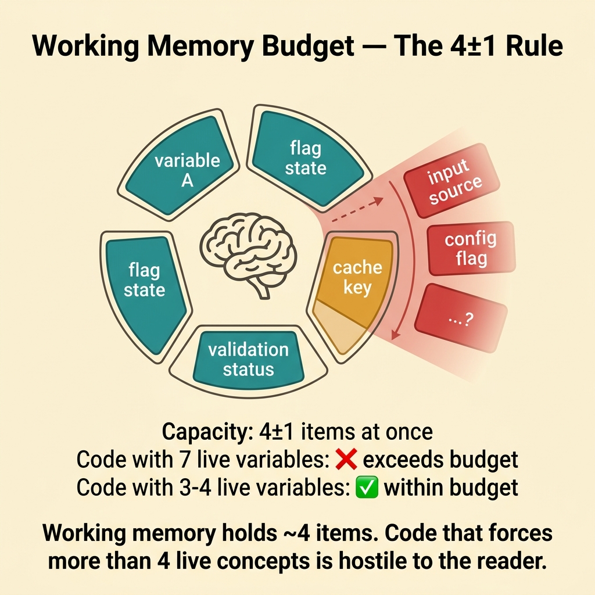
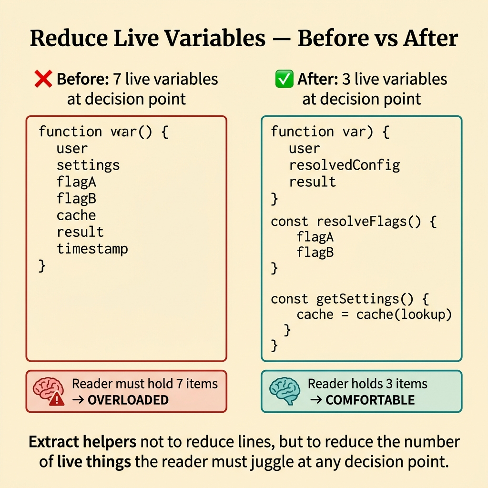
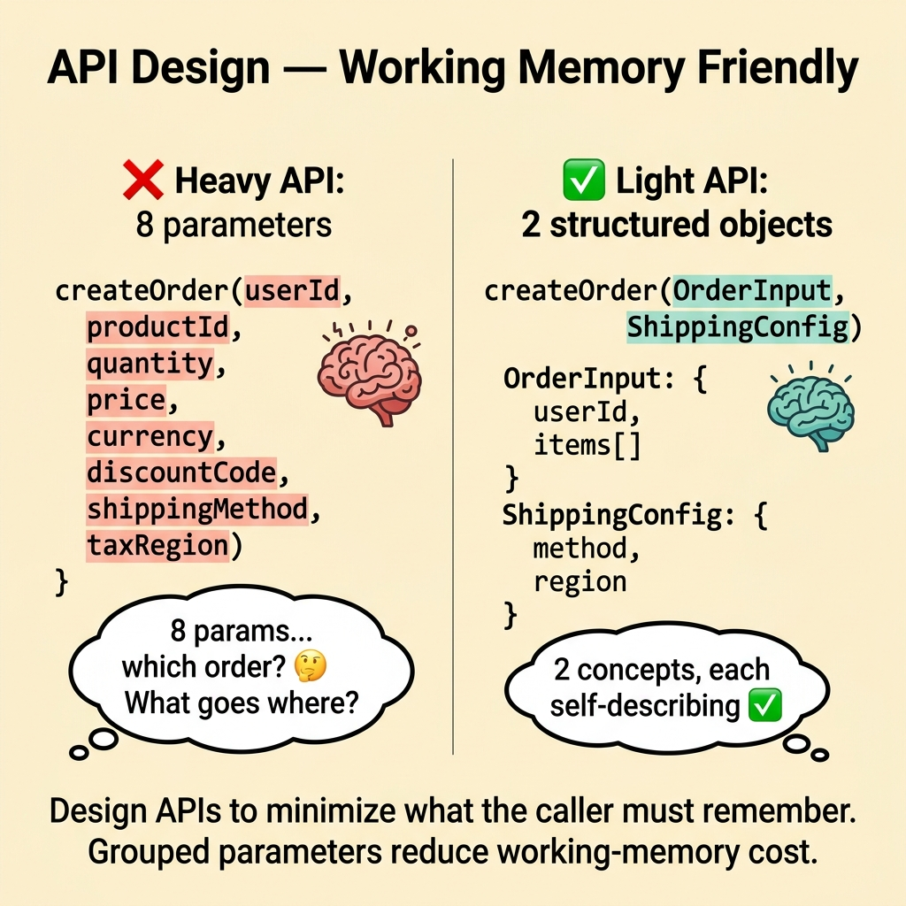
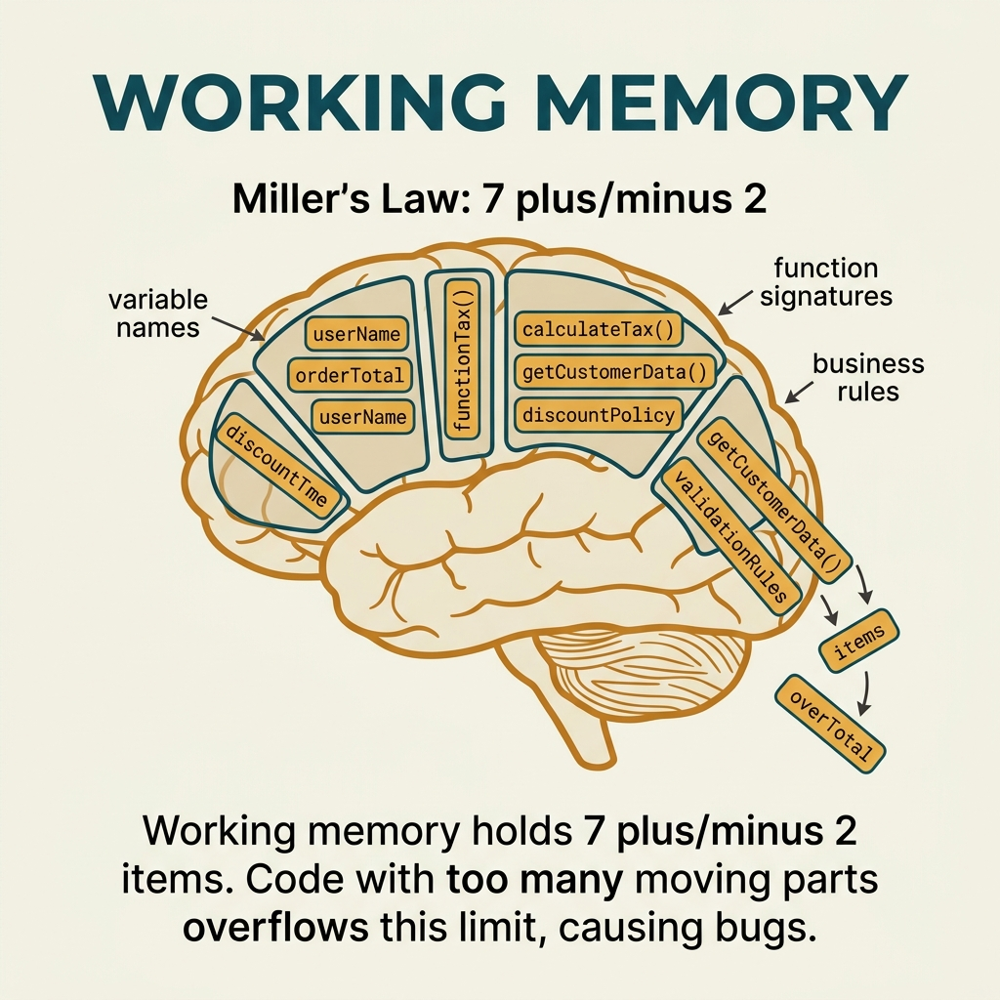

<!-- tags: glossary, reference, developer-cognition-team-dynamics, cognitive-mental-model, working-memory -->
# Working Memory

> The short-term memory buffer the reader uses to hold details they are actively manipulating while reading code, reasoning about a flow, or solving a problem.

| Aspect | Detail |
| --- | --- |
| **Concept** | The short-term memory buffer the reader uses to hold details they are actively manipulating while reading code, reasoning about a flow, or solving a problem. |
| **Audience** | Developer, reviewer, API designer |
| **Primary style** | Glossary term |
| **Entry point** | Use when code, docs, or APIs force the reader to remember too many states simultaneously just to understand something basic. |

📅 Created: 2026-03-30 · 🔄 Updated: 2026-04-17 · ⏱️ 9 min read

---

## 1. DEFINE

You are reading a long function. You must remember 4 flags, 3 temporary maps, 2 retry branches, and a timezone assumption mentioned only in a comment at the top of the file. Halfway through, your working memory is full and every reasoning step starts to slip. That is when the working memory limit becomes a design factor, not just a psychological curiosity.

**Working Memory** is the short-term memory buffer the reader uses to hold details they are actively manipulating while reading code, reasoning about a flow, or solving a problem.

| Variant | Description |
| --- | --- |
| Reading working memory | Holding state while reading code or docs. |
| Problem-solving working memory | Holding hypotheses, constraints, and outcomes while debugging or designing. |
| Interaction working memory | Holding context from multiple screens, APIs, or contracts while coordinating. |

| Approach | Time | Space | When to choose |
| --- | --- | --- | --- |
| Chunking by meaningful units | O(n refactors) | O(structure plan) | When code/docs force the reader to hold too many loose details. |
| Naming and local reasoning improvement | O(n review passes) | O(rename diff) | When load comes from constantly backtracking to look up meanings. |
| Context-window reduction | O(n workflow redesigns) | O(boundary notes) | When a small change demands too much state from too many places. |

Core insight:

> Working memory is an extremely small and expensive resource. Any design that forces the reader to hold too many things at once will slow reasoning and increase mistakes, even when the logic is theoretically "clear."

### 1.1 Invariants & Failure Modes

The invariant of good design: the reader must be able to reason in meaningful chunks without holding the entire system in their head at once. When a single function or API already exceeds that limit, mistakes increase very fast.

---

## 2. CONTEXT

**Who uses it**: Developer, reviewer, API designer

**When**: Use when code, docs, or APIs force the reader to remember too many states simultaneously just to understand something basic.

**Purpose**: Working memory is an extremely small and expensive resource. Any design that forces the reader to hold too many things at once slows reasoning and increases mistakes.

**In the ecosystem**:
- Working memory differs from long-term memory. This is the "right now" processing buffer.
- It is more specific than cognitive load. Load is the total experience; working memory is one mechanism underneath.
- If you constantly scroll up or open extra files just to recall names and states, working memory is being overloaded.

---

Short-term memory is clear. But how many items (7±2?), how does code design impact working memory, and what tools offload it?

## 3. EXAMPLES

Working memory surfaces most clearly when debugging a function with 10 parameters that all must be tracked, when nested ifs 5 levels deep exceed capacity, or when IDE autocomplete offloads memory for the developer. The examples below place the pattern into exactly those situations.

### Example 1: Basic — Recognize when code exceeds the reader's working-memory budget

You read a PR and constantly remind yourself "is this flag true or false?", "where does this map come from?", "has this input been validated upstream?" Before refactoring, the first step is to name the symptom correctly: the reader is running out of working-memory budget.



*Figure: Working memory holds ~4 items. Code that forces more than 4 live concepts is hostile to the reader.*

```text
  Working memory budget analysis:

  Function: processCheckout()

  Items reader must hold simultaneously:
  ┌──────────────────────────────────────────────┐
  │  1. feature_flag_state    (from config)      │
  │  2. retry_counter         (local var)        │
  │  3. cache_invalidation    (from middleware)   │
  │  4. timezone_assumption   (comment line 12)  │
  │  5. discount_rules        (from service)     │
  │  6. payment_state         (from gateway)     │
  │  7. user_tier             (from session)     │
  │  8. rate_limit_status     (from proxy)       │
  └──────────────────────────────────────────────┘

  Human working memory capacity: 4-7 items
  Items required: 8
  Status: OVERLOADED ❌

  Symptoms:
    • repeated scrolling back to check values
    • reviewer loses track of state mid-function
    • "I need to re-read this from the top"
```

*Figure: The function demands 8 active items while human working memory holds 4-7. The reader is guaranteed to lose track somewhere.*

```yaml
working_memory_overload:
  active_items_reader_must_hold:
    - feature_flag_state
    - retry_counter
    - cache_invalidation_rule
    - timezone_assumption
  symptoms:
    - repeated_scroll_back
    - reviewer_loses_track_of_state
```

**Why?** Readers usually describe overload as "this section is hard to follow." But that difficulty often comes from too many active states, not from hard math or complex domain logic. Naming the symptom correctly leads to a better fix.

**Conclusion**: You turn the vague feeling "hard to follow" into a specific signal that the reader's memory budget is exceeded, instead of leaving it as an unfixable complaint.

**Caveat**: Not all complexity is a defect. Some problems are intrinsically hard. The goal is to strip away extraneous friction, not pretend everything must be simple.

**Use when**: Reviewers read and re-read the same code section while losing track of state, or must constantly scroll up and down just to hold basic assumptions.

### Example 2: Intermediate — Use naming and local invariants to reduce the number of active states

Much of the overload happens not because the code does too many things, but because the reader must constantly infer the meaning of variables and conditions. At the intermediate level, you reduce the burden with better naming and local invariants that make each section self-describing.



*Figure: Extract helpers to reduce live things the reader must juggle at any decision point.*

```text
  Before: vague names consume working memory

  func process(tmp1 int, ok bool, m map[string]any) {
      // reader must remember:
      //   tmp1 = pending retry count
      //   ok   = whether cache is fresh
      //   m    = user session data
      // ⚠️ 3 items just for name translation
  }

  ──────────────────────────────────────────────────

  After: names carry meaning, freeing memory

  func process(
      pendingRetryCount int,
      hasFreshCache     bool,
      userSession       map[string]any,
  ) {
      // at this point: user is authenticated ✅
      // below this line: amount is normalized ✅
      // reader holds: 0 items for name translation
  }
```

*Figure: Vague names force the reader to spend working memory translating each variable. Clear names and explicit invariants free that budget for the logic that matters.*

```yaml
local_clarity:
  replace:
    tmp1: pending_retry_count
    ok: has_fresh_cache
  make_explicit:
    - at_this_point_user_is_authenticated
    - below_this_line_amount_is_normalized
```

**Why?** Working memory drains fast when the reader must both remember state and translate vague names into real meaning. Clear naming and invariants return that budget for the reasoning that actually matters.

**Conclusion**: You reduce the number of things the reader must hold in their head by making local meaning self-evident earlier, so working memory is preserved for more important reasoning.

**Caveat**: Long but imprecise names do not help much. More characters do not automatically mean more clarity.

**Use when**: Code is correct but the reviewer must constantly translate names and assumptions in their head before reaching the main logic.

### Example 3: Advanced — Split boundaries so the reader does not hold multiple reasoning modes at once

A module that validates input, orchestrates calls, persists data, and fires external side effects forces the reader to hold multiple "reasoning modes" at once: domain rules, I/O, transactions, and observability. At the advanced level, you split boundaries so each section carries fewer types of state.



*Figure: Design APIs to minimize what the caller must remember. Grouped parameters reduce working-memory cost.*

```text
  Before: mixed reasoning modes in one module

  ┌─ OrderProcessor ───────────────────────────┐
  │                                             │
  │  validation logic     ──► domain mode       │
  │  HTTP call to gateway ──► I/O mode          │
  │  DB transaction       ──► persistence mode  │
  │  emit event           ──► observability     │
  │  cache update         ──► infra mode        │
  │                                             │
  │  Reader must hold: 5 reasoning modes ❌     │
  └─────────────────────────────────────────────┘

  ──────────────────────────────────────────────────

  After: each boundary has one dominant mode

  ┌─ ValidateOrder ────────────────────────────┐
  │  domain mode only                    ✅     │
  └──────────────┬─────────────────────────────┘
                 ▼
  ┌─ ExecuteOrder (use case) ──────────────────┐
  │  orchestration mode only             ✅     │
  └──────────────┬─────────────────────────────┘
                 ▼
  ┌─ PersistOrder ─────────────────────────────┐
  │  persistence mode only               ✅    │
  └──────────────┬─────────────────────────────┘
                 ▼
  ┌─ NotifyOrder ──────────────────────────────┐
  │  side effects only                    ✅    │
  └─────────────────────────────────────────────┘

  Reader holds: 1 mode per boundary ✅
```

*Figure: Before the split, the reader juggles 5 reasoning modes in one module. After splitting, each boundary reduces to one dominant mode.*

```yaml
boundary_split:
  current_modes_mixed:
    - validation
    - orchestration
    - persistence
    - side_effects
  target:
    - validation_boundary
    - use_case_boundary
    - persistence_boundary
```

**Why?** Working memory is overloaded not only by the number of details but also by the number of reasoning modes mixed together. Good boundaries reduce mode-switching so the reader reasons more cleanly.

**Conclusion**: You reduce overload by lowering the number of cognitive modes active in the same place, so the reader does not have to think domain, infra, and failure handling in a single breath.

**Caveat**: Splitting blindly can create unnecessary hops. Boundaries only have value when they genuinely reduce the number of modes the reader must hold.

**Use when**: A single file forces the reader to think like 3-4 different roles at once and there is no room left in their head to check invariants.

### Example 4: Expert — Design docs, APIs, and review process around the working-memory budget

At the expert level, working memory is not just about code. An API spec, a review comment, or an onboarding doc can also bust the budget if it demands too many simultaneous assumptions. When the team uses this budget as a design criterion, every artifact becomes easier to use.

```text
  Working memory budget as design criterion:

  ┌─ API documentation ────────────────────────┐
  │                                             │
  │  ❌ Anti-pattern:                           │
  │  "Here are all 47 parameters, 12 error      │
  │   codes, and 8 edge cases. Good luck."      │
  │                                             │
  │  ✅ Budget-aware design:                    │
  │  1. Happy path first (3 parameters)         │
  │  2. Common variations (5 parameters)        │
  │  3. Edge cases (linked, not inlined)        │
  │  4. Error codes (reference table)           │
  │                                             │
  │  Progressive disclosure preserves budget.   │
  └─────────────────────────────────────────────┘
```

*Figure: The anti-pattern dumps everything at once and exceeds working memory. Budget-aware design reveals information progressively so the reader absorbs each layer before the next.*

```yaml
memory_budget_design:
  require:
    - clear_entry_point
    - progressive_disclosure
    - chunked_examples
    - explicit_assumptions
  avoid:
    - giant_unbroken_explanations
    - all_edge_cases_first
```

**Why?** Any artifact that forces the reader to remember too many things at once consumes working memory before they can learn the important part. Designing around the memory budget makes technical communication human-scaled.

**Conclusion**: You use working memory as a real design criterion for docs, APIs, and review processes, instead of treating it as an interesting psychology concept that never touches actual software practice.

**Caveat**: Over-chunking to the point of losing the overall thread also hurts. Protecting the memory budget does not mean unconditionally chopping everything into tiny pieces.

**Use when**: Docs or APIs seem "complete" but readers still cannot absorb the content before reaching the most important part.

---

## 4. COMPARE




*Figure: Position of working memory between cognitive load, chunking, and code complexity.*

Working memory sounds like RAM. The analogy is right — but human working memory holds only 4-7 items (Cowan, 2001). Code with 10 moving parts exceeds capacity. Design code for 4-5 concepts per function, not 15.

### Level 1

```text
too many active details
  -> working memory overload
  -> slower reasoning
  -> more mistakes
```

*Figure: Level 1 shows overload occurring when the number of active details exceeds the reader's short-term capacity.*

### Level 2

```text
clear chunks + strong naming + local invariants
  -> fewer active details at once
  -> working memory preserved for real reasoning
```

*Figure: Level 2 emphasizes that good design does not increase "brain capacity" — it reduces the number of things that need to be held at once.*

### Easily confused or boundary-slipping

You have seen at which cognitive layer Working Memory operates. The mistakes below are common misuses that leave the feeling of overload vague and hard to improve.

| # | Severity | Mistake | Consequence | Fix |
| --- | --- | --- | --- | --- |
| 1 | 🔴 Fatal | Packing too many active states into a single reading point | Reviewer and maintainer easily misunderstand behavior | Split chunks, clarify naming, reduce mixed modes. |
| 2 | 🟡 Common | Vague variable and flag names | Working memory is consumed by translating meanings | Rename according to semantic intent. |
| 3 | 🟡 Common | Mixing validation, orchestration, and side effects | Reader must switch modes constantly | Split boundaries more clearly. |
| 4 | 🔵 Minor | Docs dump edge cases and assumptions upfront | Newcomers cannot reach the main thread | Use progressive disclosure — main path first. |

### Quick scan

| If you face | Action |
| --- | --- |
| Reviewer constantly loses state while reading | Check for working-memory overload. |
| Must translate variable names and assumptions in your head constantly | Rename and make local invariants explicit. |
| One file does too many types of work | Split boundaries to reduce mixed modes. |

---

## 5. REF

| Resource | Type | Link | Note |
| --- | --- | --- | --- |
| A Philosophy of Software Design | Book | https://web.stanford.edu/~ouster/cgi-bin/book.php | Excellent for reducing complexity for readers. |
| Cognitive Load Theory | Reference | https://en.wikipedia.org/wiki/Cognitive_load | Broader context. |
| Chunking | Reference | ./07-chunking.md | The closest technique for reducing pressure on working memory. |

---

## 6. RECOMMEND

Working memory solves the problem "code has too many moving parts to keep track of." The next question: how does chunking work, and how does maladaptive daydreaming affect focus?

| Expand to | When | Reason | File/Link |
| --- | --- | --- | --- |
| Chunking | When you want to reduce the number of details held at once | This is the closest technique for protecting working memory. | [Chunking](./07-chunking.md) |
| Cognitive Load | When you want to zoom out to the broader picture of cognitive cost | Working memory is the mechanism underneath load. | [Cognitive Load](./01-cognitive-load.md) |
| Cognitive & Mental Model | When you need to return to the subtopic hub | Preserves the context of the entire branch. | [Cognitive & Mental Model](./README.md) |

Back to the 10 parameters at the start — they exceed working memory, and bugs are guaranteed. Now you know: 4-7 items max. Reduce parameters (group into struct), reduce nesting (early return), reduce scope (small functions). Design for the human brain, not for the compiler.

**Links**: [← Previous](./05-flow-state.md) · [→ Next](./07-chunking.md)
