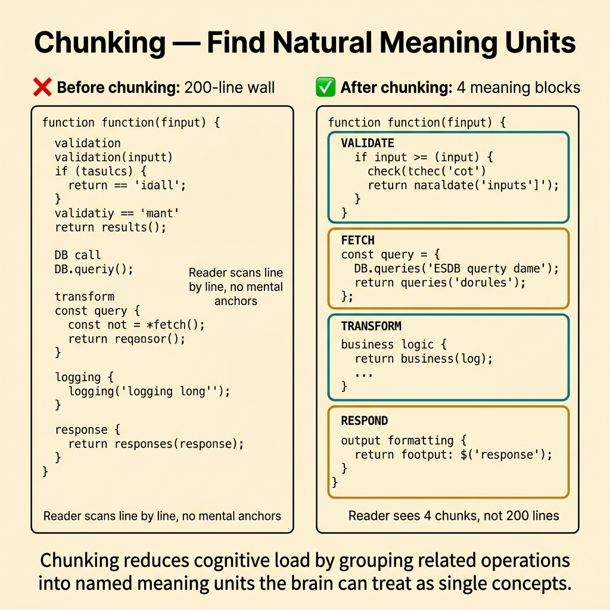
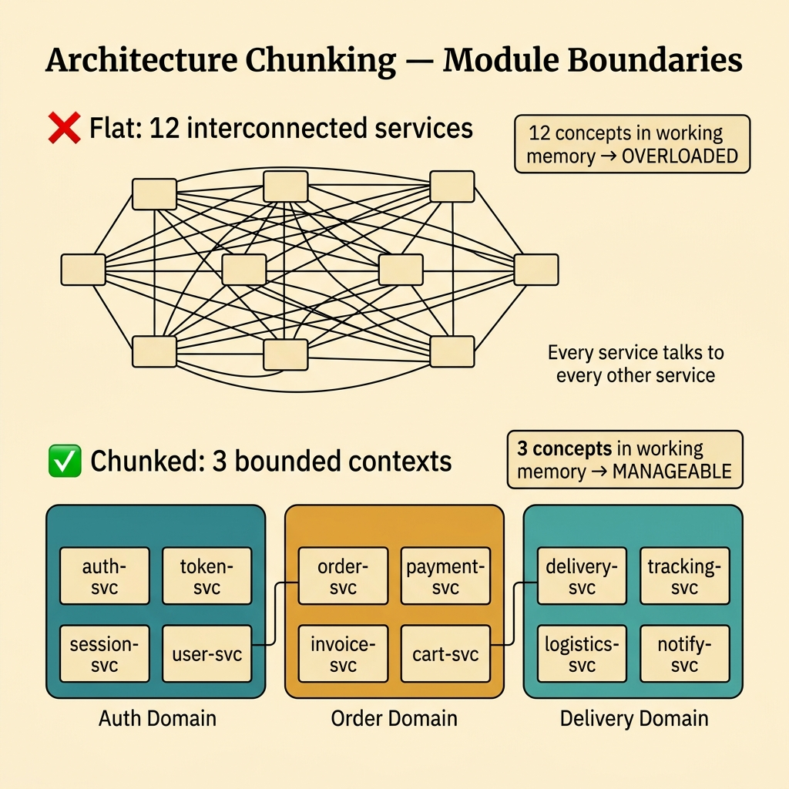
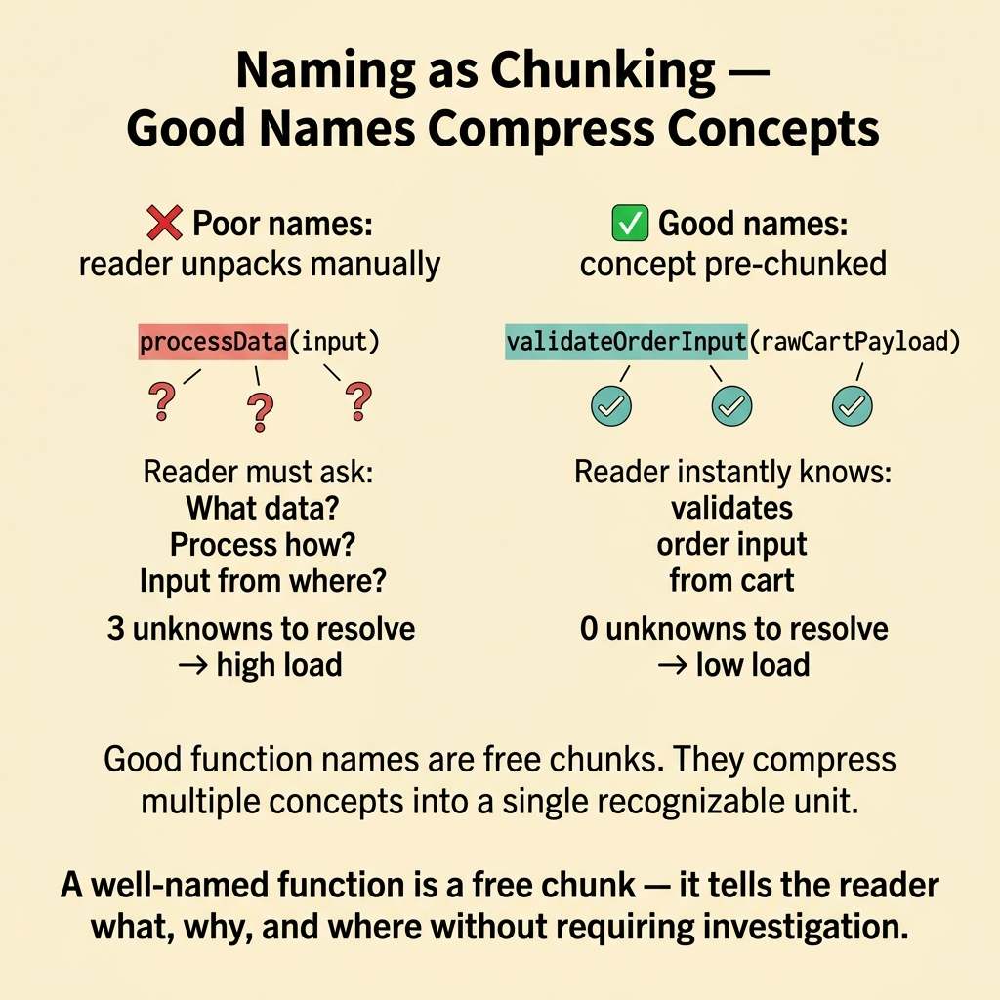
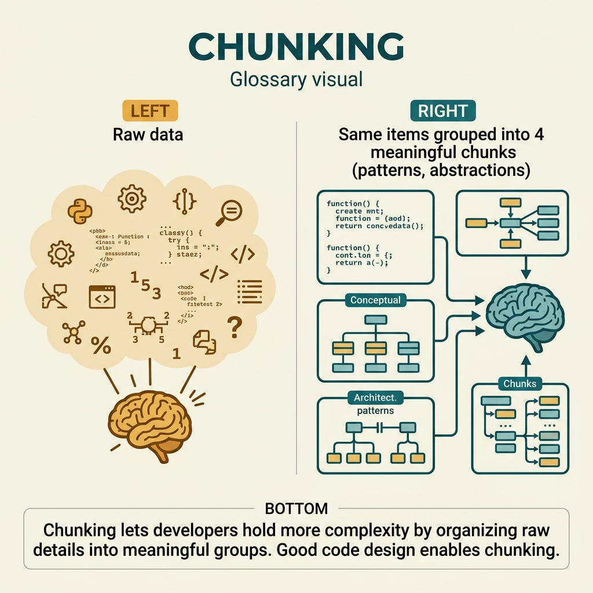

<!-- tags: glossary, reference, developer-cognition-team-dynamics, cognitive-mental-model, chunking -->
# Chunking

> The technique of grouping small details into meaningful units so the reader can understand, remember, and reason in clusters instead of disconnected fragments.

| Aspect | Detail |
| --- | --- |
| **Concept** | The technique of grouping small details into meaningful units so the reader can understand, remember, and reason in clusters instead of disconnected fragments. |
| **Audience** | Developer, documentation writer, API designer |
| **Primary style** | Glossary term |
| **Entry point** | Use when code, docs, or folder structure is too granular, forcing the reader to reassemble too many small pieces before seeing the overall meaning. |

📅 Created: 2026-03-30 · 🔄 Updated: 2026-04-17 · ⏱️ 9 min read

---

## 1. DEFINE

An 800-line file is not always bad, and a file with 20 small functions is not always good. What matters is whether the reader can see natural units of meaning. Chunking is about grouping details into clusters that the human brain can grasp as a single coherent block.

**Chunking** is the technique of grouping small details into meaningful units so the reader can understand, remember, and reason in clusters instead of disconnected fragments.

| Variant | Description |
| --- | --- |
| Code chunking | Grouping logic into functions or modules by meaning unit. |
| Documentation chunking | Dividing docs along the reader's comprehension flow. |
| Learning chunking | Organizing knowledge along a progression that is easy to absorb. |

| Approach | Time | Space | When to choose |
| --- | --- | --- | --- |
| Semantic grouping | O(n refactors) | O(new boundaries) | When related details are scattered too thin. |
| Progressive disclosure | O(n doc passes) | O(section structure) | When the reader is overwhelmed by all details at once. |
| Consistent taxonomy design | O(n content groups) | O(index + folder layout) | When the problem is how knowledge is organized overall. |

Core insight:

> Chunking is not about splitting into the maximum number of pieces. It is about finding the meaning unit the reader can hold as a single block. If you split too finely, cognitive load actually increases because the reader must reassemble the fragments.

### 1.1 Invariants & Failure Modes

The invariant of good chunking: each chunk has a relatively complete meaning and a name clear enough for the reader to predict what is inside. When boundaries are drawn by mechanical rules rather than by human comprehension units, chunking turns into fragmentation.

---

## 2. CONTEXT

**Who uses it**: Developer, documentation writer, API designer

**When**: Use when code, docs, or folder structure is too granular, forcing the reader to reassemble too many small pieces before seeing the overall meaning.

**Purpose**: Chunking is about finding the meaning unit the reader can hold as a single block. Split too finely and cognitive load increases because the reader must reassemble the fragments.

**In the ecosystem**:
- Chunking differs from "split files until they are small." The target is meaning units, not line counts.
- It differs from gratuitous abstraction. An abstraction is only worth it if it creates an easier-to-understand chunk.
- If after splitting, the reader still must open 8 places to understand a single idea, chunking has failed.

---

Grouping information into blocks is clear. But what is the right chunk size, how does chunking apply to code design, and how do you teach chunking?

## 3. EXAMPLES

Chunking surfaces most clearly when a 50-line function grouped into 5 blocks of 10 lines each suddenly becomes easier to read, when design patterns are chunked solutions for recurring problems, or when experienced developers read code faster because their chunks are larger. The examples below place the pattern into exactly those situations.

### Example 1: Basic — Find natural meaning units in code before splitting

You look at a long function and your first instinct is "I need to break this up." But if you split at random technical breakpoints, the reader may end up even more confused. At the basic level, the first step is to find where the real meaning blocks are.



*Figure: Chunking reduces cognitive load by grouping related operations into named meaning units.*

```text
  Finding semantic chunks in a checkout flow:

  ┌─ processCheckout() — 120 lines ───────────┐
  │                                             │
  │  lines  1-25:  validate request        ─┐  │
  │  lines 26-55:  compute totals          ─┤  │
  │  lines 56-85:  persist order           ─┤  │
  │  lines 86-120: trigger confirmation    ─┘  │
  │                                             │
  │  Natural semantic chunks: 4                 │
  │  Each chunk: one complete responsibility    │
  └─────────────────────────────────────────────┘

  ❌ Bad split: 6 functions at every 20 lines
     → cuts across meaning boundaries
     → reader must reassemble

  ✅ Good split: 4 functions by semantic unit
     → validate → compute → persist → notify
     → each chunk is self-contained
```

*Figure: The function has 4 natural meaning units. Splitting by line count (every 20 lines) cuts across boundaries. Splitting by semantics preserves the reasoning flow.*

```yaml
semantic_chunks:
  current_flow: checkout
  natural_units:
    - validate_request
    - compute_total
    - persist_order
    - trigger_confirmation
```

**Why?** Readers remember and reason by meaning, not by line count. When chunks align with meaning units, the mental model forms much faster than when splitting follows mechanical style-guide rules.

**Conclusion**: You start chunking from meaning and the reader's natural reasoning units, not from cutting everything up to look tidy and hoping clarity will appear on its own.

**Caveat**: Some short flows are intrinsically coupled and should not be forced apart. If a chunk does not carry a complete meaning, the reader still has to reassemble it.

**Use when**: You see long code or thick docs but are not yet sure where to split so the reader can follow the reasoning thread better.

### Example 2: Intermediate — Use names and headings to make chunks self-describing

A good chunk with a bad name still forces the reader to open it to learn what it does. At the intermediate level, you not only group but also label each chunk clearly enough to describe its role in the overall flow.



*Figure: Architecture chunking reduces system complexity from N services to N/k bounded contexts.*

```text
  Chunk labeling quality:

  ❌ Vague labels — reader must open to understand:
  ┌────────────────────────────────────┐
  │  processData()                     │  → what data?
  │  handleStep()                      │  → which step?
  │  doWork()                          │  → what work?
  └────────────────────────────────────┘

  ✅ Semantic labels — reader predicts content:
  ┌────────────────────────────────────┐
  │  validateCouponEligibility()       │  → checks coupons
  │  computeInvoiceTotals()            │  → calculates $
  │  persistOrderSnapshot()            │  → saves to DB
  └────────────────────────────────────┘

  Prediction accuracy:
    Vague names:    ~20% (must read body)
    Semantic names: ~90% (name tells the story)
```

*Figure: Vague labels destroy the prediction benefit of chunking. Semantic labels let the reader know what a chunk does before opening it.*

```yaml
chunk_labels:
  prefer:
    - validate_coupon_eligibility
    - compute_invoice_totals
    - persist_order_snapshot
  avoid:
    - process_data
    - handle_step
    - do_work
```

**Why?** Chunking only pays off when the reader can hold a chunk as a complete cognitive object. Vague names destroy that benefit because the reader must decode each chunk from scratch.

**Conclusion**: You multiply the value of chunking with labels specific enough for the reader to predict a chunk's role before even opening it.

**Caveat**: Long but imprecise names do not help much either. A good label increases signal, not just character count.

**Use when**: Code has been split but reviews still say "I do not know what this function actually does" or the reviewer must open every block to understand its role.

### Example 3: Advanced — Chunk docs and APIs by learning path, not by internal implementation

An API or doc can be perfectly structured according to the system's internals but still extremely hard to learn, because the presentation order does not follow the reader's comprehension path. At the advanced level, chunking is used to design a learning path, not just code structure.



*Figure: A well-named function is a free chunk — it tells the reader what, why, and where.*

```text
  Documentation chunking — implementation vs learning order:

  ❌ Implementation order:
  ┌─────────────────────────────────────────────┐
  │  1. Internal data model                     │
  │  2. All 12 error codes                      │
  │  3. Edge cases and race conditions          │
  │  4. Oh, here is the happy path              │
  │                                             │
  │  Reader: overwhelmed before understanding   │
  │          the basic flow ❌                   │
  └─────────────────────────────────────────────┘

  ✅ Learning order:
  ┌─────────────────────────────────────────────┐
  │  1. Happy path (3 steps)                    │
  │  2. Key concepts (2 definitions)            │
  │  3. Variants (expand when ready)            │
  │  4. Edge cases (linked, not inlined)        │
  │  5. Error codes (reference table)           │
  │                                             │
  │  Reader: builds model progressively ✅      │
  └─────────────────────────────────────────────┘
```

*Figure: Implementation order dumps complexity front-loaded. Learning order reveals knowledge progressively so the reader builds a stable model before encountering edge cases.*

```yaml
doc_chunking:
  first_show:
    - happy_path
    - key_concepts
  then_expand:
    - variants
    - edge_cases
    - failure_modes
```

**Why?** Learners rarely need every detail immediately. Good chunking preserves enough structure for them to build a model sequentially, instead of being flooded with all edge cases upfront and giving up early.

**Conclusion**: You use chunking to control the reader's knowledge absorption order, not just to make the doc look tidier on the surface.

**Caveat**: If you hide important details too deep, advanced users will find the doc shallow or must dig excessively to reach what they need.

**Use when**: Docs are "complete" but still hard to read, hard to remember, and overwhelm newcomers with too much too soon.

### Example 4: Expert — Use chunking as a principle across code, docs, folders, and taxonomy

A team can chunk code well but have a disorganized doc taxonomy, or have a clean folder structure but review comments that constantly jump between abstraction levels. At the expert level, chunking becomes a design principle that spans every technical artifact.

```text
  Cross-artifact chunking alignment:

  ┌─ Code modules ─────────────────────────────┐
  │  auth/  →  order/  →  payment/  →  notify/ │
  └─────────────────────────────────────────────┘
                    ↕ aligned?
  ┌─ Documentation ────────────────────────────┐
  │  auth/  →  order/  →  payment/  →  notify/ │
  └─────────────────────────────────────────────┘
                    ↕ aligned?
  ┌─ Folder taxonomy ──────────────────────────┐
  │  auth/  →  order/  →  payment/  →  notify/ │
  └─────────────────────────────────────────────┘
                    ↕ aligned?
  ┌─ Onboarding path ─────────────────────────┐
  │  auth → order → payment → notify           │
  └─────────────────────────────────────────────┘

  Aligned ✅ = reader reuses one mental model
  Misaligned ❌ = reader re-learns structure at each layer
```

*Figure: When code, docs, folders, and onboarding path chunk the same concepts the same way, the reader reuses one mental model everywhere.*

```yaml
cross_artifact_chunking:
  align:
    - code_module_boundaries
    - doc_sections
    - folder_taxonomy
    - onboarding_paths
  goal:
    same_concept_grouped_similarly_everywhere: true
```

**Why?** When different artifacts chunk by different logic, the reader must re-learn structure at every layer. Consistency lets them reuse the same mental model across code, docs, and onboarding.

**Conclusion**: You turn chunking into a knowledge-design principle that spans code, docs, and taxonomy, so the reader reuses the same mental model in multiple places.

**Caveat**: Synchronizing too tightly can remove flexibility where domains differ in nature. Consistency does not mean forcing every layer to look identical.

**Use when**: The team sees code, docs, and folders talking about the same system but dividing it into completely different units, making context switching expensive.

---

## 4. COMPARE




*Figure: Position of chunking between working memory, code organization, and abstraction.*

Chunking sounds like grouping. Correct — but chunking is a cognitive mechanism: grouping related items into 1 unit in working memory. "HTTP request" is 1 chunk containing method, URL, headers, body. Experts chunk larger than novices.

### Level 1

```text
many small details
  -> grouped into meaningful units
  -> easier to hold and reason about
```

*Figure: Level 1 shows chunking transforms many loose pieces into meaning units the reader can grasp.*

### Level 2

```text
bad split:
  many tiny pieces with unclear relation
good chunking:
  few coherent units with clear names and boundaries
```

*Figure: Level 2 emphasizes good chunking does not mean more pieces — it means pieces with more meaning.*

### Easily confused or boundary-slipping

You have seen at which cognitive layer Chunking operates. The mistakes below are common misuses that leave the feeling of overload vague and hard to improve.

| # | Severity | Mistake | Consequence | Fix |
| --- | --- | --- | --- | --- |
| 1 | 🔴 Fatal | Splitting mechanically instead of by meaning | Fragmentation increases; reader must reassemble | Chunk by meaning unit and responsibility. |
| 2 | 🟡 Common | Chunks have vague names | Nearly all prediction benefit is lost | Label by semantic intent. |
| 3 | 🟡 Common | Code chunking is good but docs and folders are not aligned | Mental model must reset between artifacts | Align taxonomy across code, docs, and folders. |
| 4 | 🔵 Minor | Dumping all edge cases upfront | Doc chunking fails the learning path | Use progressive disclosure. |

### Quick scan

| If you face | Action |
| --- | --- |
| Code/docs have many small pieces but are still hard to understand | Check whether chunks actually carry meaning. |
| After splitting, reviewer still must open every function | Re-set labels and boundaries. |
| Doc taxonomy is completely different from code structure | Rebalance chunking across artifacts. |

---

## 5. REF

| Resource | Type | Link | Note |
| --- | --- | --- | --- |
| A Philosophy of Software Design | Book | https://web.stanford.edu/~ouster/cgi-bin/book.php | Excellent on divide-by-meaning, not by mechanics. |
| Working Memory | Reference | ./06-working-memory.md | Chunking is the direct response to the memory budget limit. |
| Information Architecture | Reference | https://en.wikipedia.org/wiki/Information_architecture | Useful for chunking at the taxonomy and doc level. |

---

## 6. RECOMMEND

Chunking solves the problem "too many details, impossible to remember them all." The next question: how does maladaptive daydreaming affect focus?

| Expand to | When | Reason | File/Link |
| --- | --- | --- | --- |
| Working Memory | When you want to understand why chunking helps the reader so much | This is the mechanism underneath. | [Working Memory](./06-working-memory.md) |
| Mental Model | When you want to see how chunking affects the overall model | Good chunking helps the mental model form more stably. | [Mental Model](./02-mental-model.md) |
| Cognitive & Mental Model | When you need to return to the subtopic hub | Preserves the context of the entire branch. | [Cognitive & Mental Model](./README.md) |

Back to the 50-line function at the start — split into 5 blocks, each with 1 responsibility. Now you know: chunking = abstraction at the cognitive level. Good function, class, and module boundaries = good chunks. The reader's working memory is your design constraint.

**Links**: [← Previous](./06-working-memory.md) · [→ Next](./08-maladaptive-daydreaming.md)
