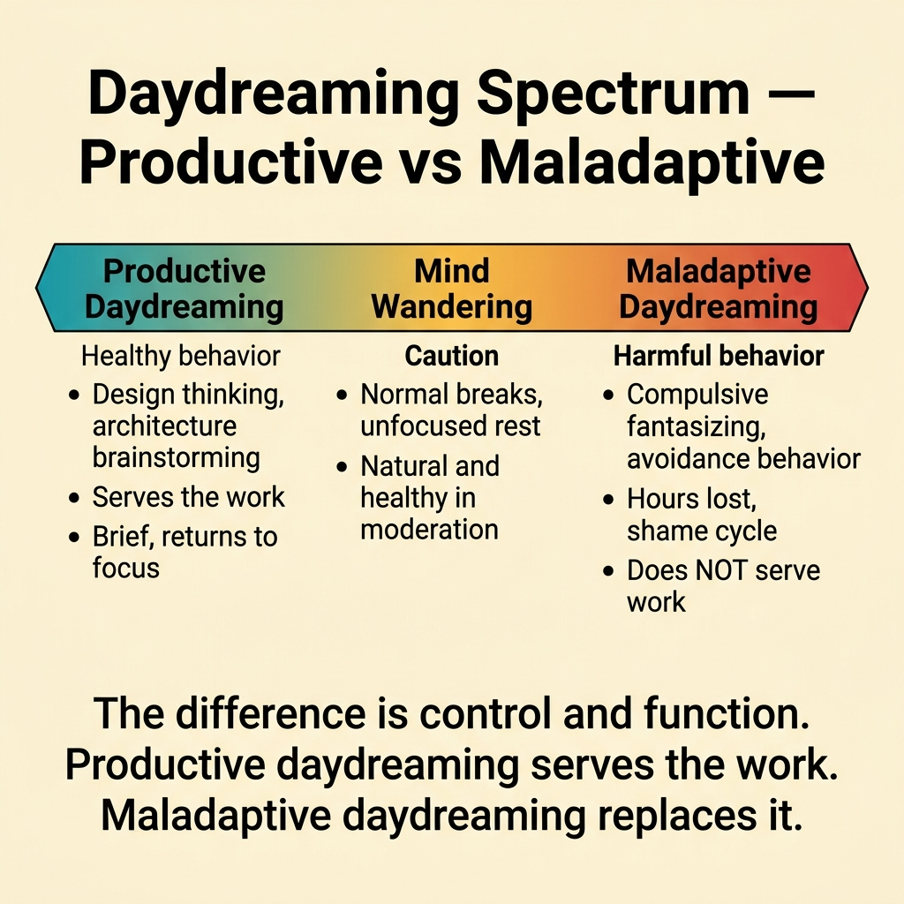
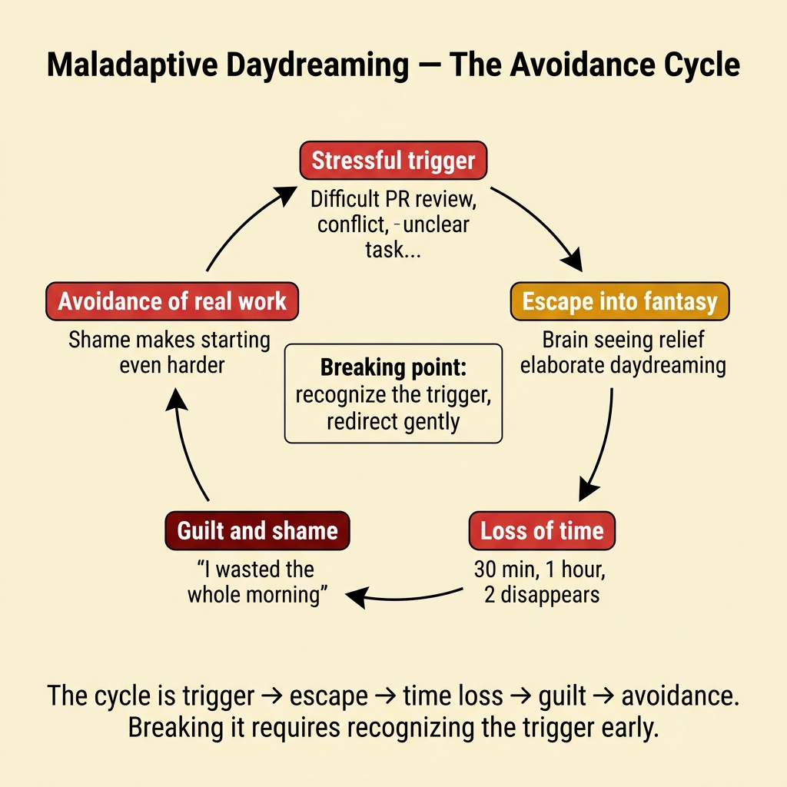
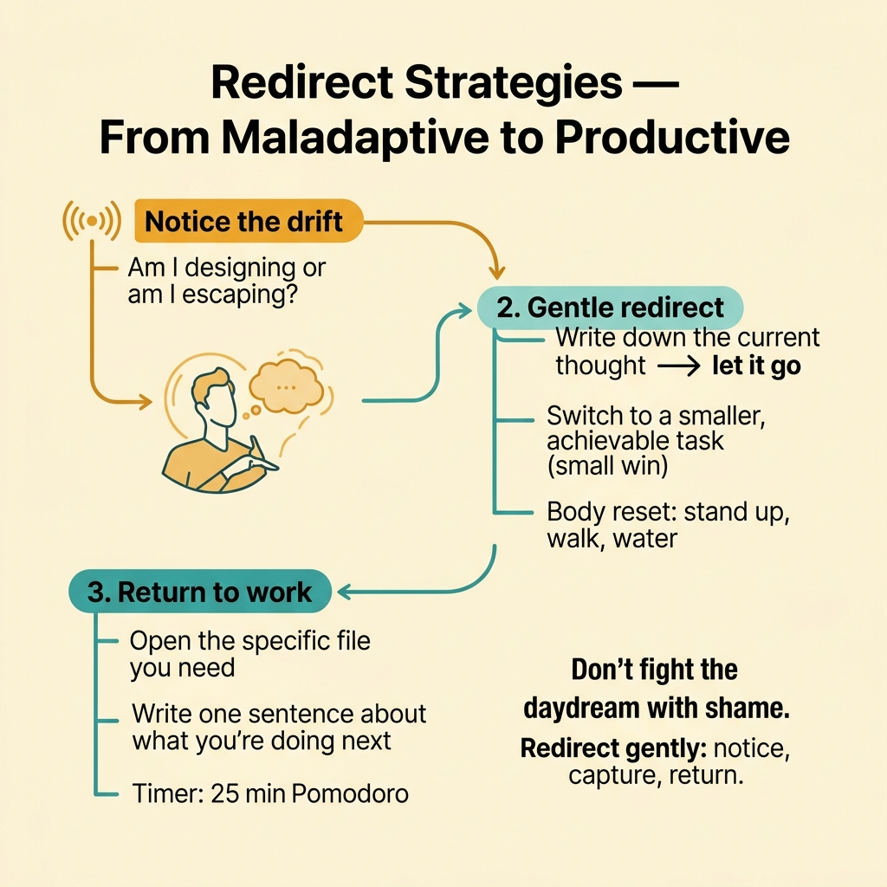
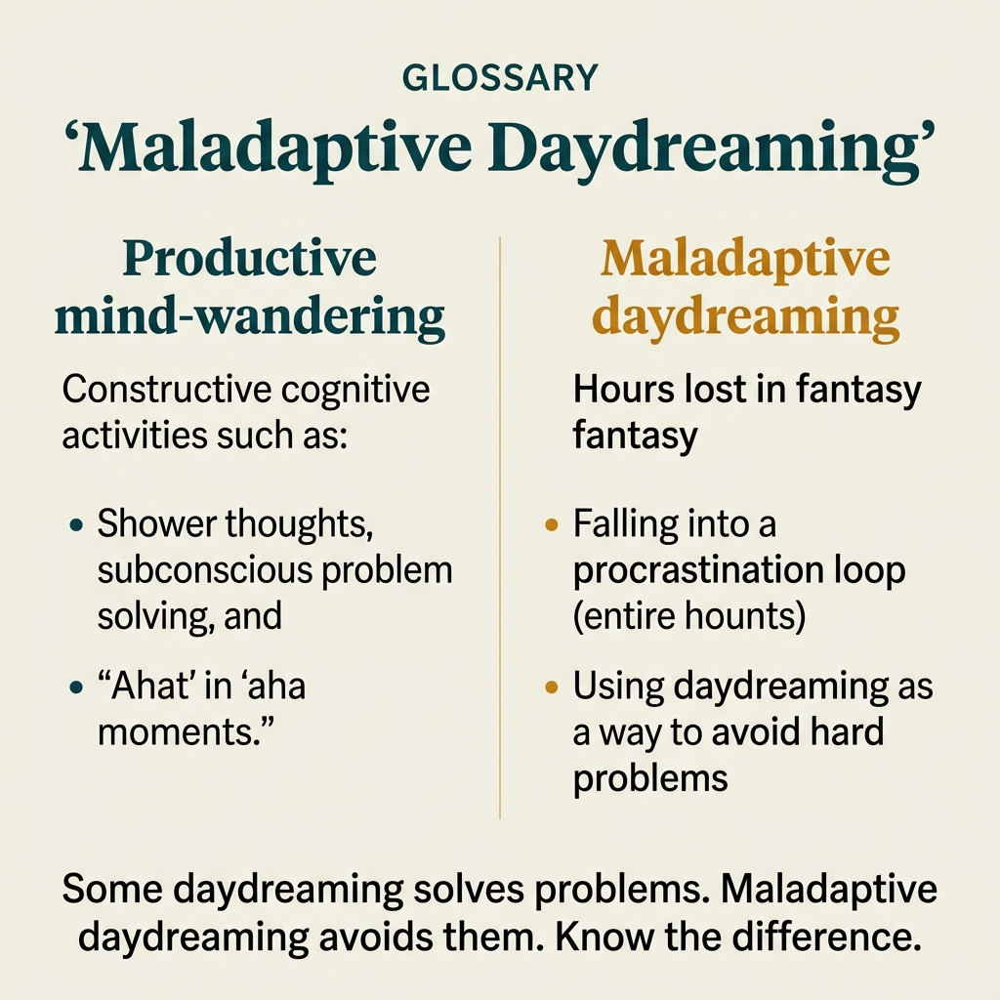

<!-- tags: glossary, reference, developer-cognition-team-dynamics, cognitive-mental-model, maladaptive-daydreaming, fake-scenario -->

# Maladaptive Daydreaming

> A state where the reader or worker repeatedly drifts into vivid imagined scenarios that loop, consume attention, and diminish the ability to focus on real work.

| Aspect            | Detail                                                                                                                                                            |
| ----------------- | ----------------------------------------------------------------------------------------------------------------------------------------------------------------- |
| **Concept**       | A state where the reader or worker repeatedly drifts into vivid imagined scenarios that loop, consume attention, and diminish the ability to focus on real work.  |
| **Audience**      | Developer, manager, anyone distinguishing creative visualization from harmful distraction                                                                         |
| **Primary style** | Glossary term                                                                                                                                                     |
| **Entry point**   | Use when the team mentions "fake scenarios" or vivid recurring daydreams and needs to distinguish them from deliberate vivid scenarios used in writing or design. |

📅 Created: 2026-04-05 · 🔄 Updated: 2026-04-17 · ⏱️ 10 min read

---

## 1. DEFINE

You open the editor to fix a small bug. A few minutes later, your mind has drifted into a vivid chain of imagined scenes: an argument that has not happened, a flawless presentation, or a worsening situation branching in several directions. This is no longer a purposeful example for reasoning — it is pulling attention away from real work. That zone is closer to **maladaptive daydreaming** than to a vivid scenario serving a purpose.

**Maladaptive Daydreaming** describes vivid imagined sequences that recur, loop, and easily drag attention away from reality or work in progress. In everyday conversation, many people call these **fake scenarios**. It belongs to the cognitive and psychological domain, **not** to technical artifacts for writing requirements or designing systems.

| Variant               | Description                                                                               |
| --------------------- | ----------------------------------------------------------------------------------------- |
| Negative loop         | Repeatedly imagining bad situations or confrontations that have not happened.             |
| Heroic/fantasy loop   | Imagining success or ideal scenarios so vividly that attention drifts far away.           |
| Stress-triggered loop | Daydreaming loops that intensify when the person is avoiding a hard task or under stress. |

| Approach        | Time          | Space       | When to choose                                                                                            |
| --------------- | ------------- | ----------- | --------------------------------------------------------------------------------------------------------- |
| Observation log | O(n episodes) | O(notes)    | When you need to recognize your own attention-drift patterns.                                             |
| Trigger mapping | O(n triggers) | O(triggers) | When you want to separate stress responses from normal creative ideation.                                 |
| Boundary check  | O(1)          | O(1)        | When you need to distinguish this from vivid scenarios, planning scenarios, or architecture storytelling. |

Core insight:

> The most important role of this term in a technical glossary is the boundary: both describe "scenarios in the head," but maladaptive daydreaming is harmful attention drift, while a vivid scenario is a deliberate tool for writing, UX, or training.

### 1.1 Invariants & Failure Modes

The most important invariant is **level of control and purpose**. A vivid scenario serves a decision. Maladaptive daydreaming pulls you away from the decision. The biggest failure mode is mistaking an attention-drift loop for "creative thinking" and ignoring its real impact on focus and execution.

> Note: This is a cognitive/psychological term at the glossary level for distinguishing concepts. It is not a diagnostic document or medical guide.

---

## 2. CONTEXT

**Who uses it**: Developer, manager, anyone distinguishing creative visualization from harmful distraction

**When**: Use when the team mentions "fake scenarios" or vivid recurring daydreams and needs to distinguish them from deliberate vivid scenarios used in writing or design.

**Purpose**: The most important role of this term in a technical glossary is the boundary: both describe "scenarios in the head," but maladaptive daydreaming is harmful attention drift, while a vivid scenario is a deliberate tool.

**In the ecosystem**:

- This is not a term for describing requirements, test cases, or design artifacts.
- If the imagined scenario is created **deliberately** to illuminate a technical problem, you are talking about **Scenario** or **Vivid Scenario**.
- If the imagined scenes recur, persist, and disrupt real work, this term is useful for naming the problem correctly.

---

Excessive daydreaming is clear. But how is it different from normal daydreaming, how does it impact productivity, and how do you manage it?

## 3. EXAMPLES

Maladaptive daydreaming surfaces most clearly when a developer loses 2 hours in a fantasy scenario instead of coding, when someone escapes into an imaginary world after a work conflict, or when productive daydreaming (design thinking) transforms into compulsive avoidance. The examples below place the pattern into exactly those situations.

### Example 1: Basic — Recognize this is not a vivid scenario serving work

The first step is to distinguish a useful imagined scene from an attention-drift loop by checking purpose, control, and the result afterward.



*Figure: Productive daydreaming serves the work. Maladaptive daydreaming replaces it.*

```text
  Boundary check — three diagnostic questions:

  ┌──────────────────────────────────────────────┐
  │  Q1: "Did I deliberately create this         │
  │       scenario to solve a problem?"          │
  │                                              │
  │       YES ──► Vivid Scenario (useful tool)   │
  │       NO  ──► possible drift ⚠️              │
  │                                              │
  │  Q2: "Can I stop it easily and return        │
  │       to my task?"                           │
  │                                              │
  │       YES ──► normal mind-wandering          │
  │       NO  ──► possible maladaptive loop ⚠️   │
  │                                              │
  │  Q3: "After a few minutes, did it produce    │
  │       a clearer decision or just take        │
  │       my attention?"                         │
  │                                              │
  │       DECISION ──► productive ideation ✅    │
  │       ATTENTION ──► attention drift ❌       │
  └──────────────────────────────────────────────┘
```

_Figure: Three questions separate purposeful scenarios from harmful loops. The key discriminators are deliberate creation, ease of exit, and whether it produces a decision._

```yaml
boundary_check:
    questions:
        - 'Did I deliberately create this scenario to solve a problem?'
        - 'Can I stop it easily and return to my task?'
        - 'After a few minutes, did it produce a clearer decision or just take my attention?'
```

**Why?** Simply naming the phenomenon correctly has enormous value. If you keep calling an attention loop "creative thinking," you will overlook the exact thing reducing your focus quality.

**Conclusion**: The basic work here is distinguishing purpose and control, not judging the content of the daydream.

### Example 2: Intermediate — Keep an observation log to see attention-drift patterns

Do not let the phenomenon remain a vague feeling. Short notes tracking trigger, timing, and work impact reveal patterns that are otherwise invisible.



*Figure: The cycle is trigger → escape → time loss → guilt → avoidance. Break it by recognizing the trigger early.*

```text
  Observation log — one week sample:

  ┌─ Episode 1 ────────────────────────────────┐
  │  Trigger:  about to start hard task         │
  │  Loop:     imagined failed code review      │
  │  Duration: 12 minutes                       │
  │  Impact:   patch not started                │
  └─────────────────────────────────────────────┘

  ┌─ Episode 2 ────────────────────────────────┐
  │  Trigger:  post-standup stress              │
  │  Loop:     imagined argument with PM        │
  │  Duration: 8 minutes                        │
  │  Impact:   missed review window             │
  └─────────────────────────────────────────────┘

  ┌─ Episode 3 ────────────────────────────────┐
  │  Trigger:  afternoon fatigue                │
  │  Loop:     heroic presentation fantasy      │
  │  Duration: 20 minutes                       │
  │  Impact:   lost entire focus block          │
  └─────────────────────────────────────────────┘

  Pattern detected:
    • Triggers cluster around hard/ambiguous tasks
    • Average duration: 13 minutes
    • Total weekly loss: ~65 minutes ⚠️
```

_Figure: Three logged episodes reveal a pattern — loops cluster around hard tasks and stress moments. Weekly loss adds up to over an hour of deep-work capacity._

```yaml
observation_log:
    episode:
        trigger: 'about to start hard task with unclear first step'
        imagined_loop: 'failed confrontation with reviewer'
        duration: '12 minutes'
        impact: 'patch not started yet'
```

**Why?** Patterns only emerge with minimal data. An observation log helps you separate "my mind is weird lately" into specific triggers and concrete impacts.

**Conclusion**: At the intermediate level, this term becomes useful as a lens for observing attention, no longer just a vague label.

### Example 3: Advanced — Separate internal drift from other workflow problems

Not every focus problem has the same root cause. At the advanced level, you compare internal attention drift with context switching, cognitive overload, and lack of task clarity to avoid treating the wrong symptom.



*Figure: Don’t fight the daydream with shame. Redirect gently: notice, capture, return.*

```text
  Focus diagnosis — separating root causes:

  ┌─ Symptom: "I cannot focus" ────────────────┐
  │                                             │
  │  Root cause 1: Internal drift               │
  │    Signal: mind drifts into imagined loops  │
  │            even in a quiet environment      │
  │    Fix: boundary check, observation log     │
  │                                             │
  │  Root cause 2: External interruptions       │
  │    Signal: pings, meetings, task switching  │
  │    Fix: batching, protected focus blocks    │
  │                                             │
  │  Root cause 3: Clarity gap                  │
  │    Signal: do not know the first step       │
  │            or who owns the decision         │
  │    Fix: task brief, ownership clarification │
  │                                             │
  │  Treating internal drift with batching      │
  │  won't work. Treating clarity gaps with     │
  │  observation logs won't work either. ⚠️     │
  └─────────────────────────────────────────────┘
```

_Figure: "I cannot focus" has at least three distinct root causes. Applying the wrong fix wastes effort and leaves the real problem untouched._

```yaml
focus_diagnosis:
    internal_drift:
        signal: 'drifts into imagined loop even in a quiet environment'
    external_interruptions:
        signal: 'pings, meetings, task switching constantly'
    clarity_gap:
        signal: 'does not know first step or ownership'
```

**Why?** If you lump everything into one word — "distracted" — the solution will be weak. Some problems need cutting interruptions, some need splitting tasks, and some need naming the internal loop first.

**Conclusion**: At the advanced level, this term helps avoid misdiagnosing focus problems and applying the wrong remedy.

---

## 4. COMPARE



_Figure: Position of maladaptive daydreaming between flow state, procrastination, and mental health._

The definition has locked the most important boundary. The visual below places this term next to the concepts it is most easily confused with.

### Level 1

```text
imagined scene in the mind
  -> purposeful artifact      -> scenario / vivid scenario
  -> uncontrolled drift loop  -> maladaptive daydreaming
```

_Figure: Level 1 separates purposeful imagination serving work from a daydream loop that steals attention._

### Level 2

```text
Symptom                                        Open which term
──────────────────────────────────────────────  ─────────────────────────────────
Need a scenario to discuss a requirement        Scenario
Need a vivid scene to build empathy              Vivid Scenario
Mind repeatedly drifts into recurring imagery    Maladaptive Daydreaming
Lose focus because tasks are constantly cut up   Context Switching
```

_Figure: Level 2 helps separate internally generated drift from deliberate writing artifacts and from external workflow interruptions._

### Easily confused or boundary-slipping

The biggest risk with this term is boundary and language.

| #   | Severity  | Mistake                                      | Consequence                                                | Fix                                                                 |
| --- | --------- | -------------------------------------------- | ---------------------------------------------------------- | ------------------------------------------------------------------- |
| 1   | 🔴 Fatal  | Using this term as a technical artifact      | Conversation slides off boundary and becomes confusing     | Only use it to describe attention drift or psychological loops.     |
| 2   | 🟡 Common | Confusing it with deliberate vivid scenarios | Team mislabels a writing tool as distraction or vice versa | Check purpose and level of control.                                 |
| 3   | 🟡 Common | Lumping it with every type of distraction    | Solution is too generic and ineffective                    | Separate from context switching, overload, and clarity gaps.        |
| 4   | 🔵 Minor  | Turning the term into a moral judgment       | People who experience it become less willing to speak up   | Keep it as a descriptive label for a phenomenon, not an accusation. |

### Quick scan

| If you face                                               | Action                                      |
| --------------------------------------------------------- | ------------------------------------------- |
| Need a deliberate scene for writing or teaching           | Open Vivid Scenario — do not use this term. |
| Mind repeatedly drifts into recurring imagined scenes     | Use the boundary check and observation log. |
| Not sure if it is internal drift or external interruption | Compare with Context Switching first.       |

---

## 5. REF

| Resource                                                                                        | Type     | Link                                                    | Note                                                                       |
| ----------------------------------------------------------------------------------------------- | -------- | ------------------------------------------------------- | -------------------------------------------------------------------------- |
| A Phenomenological Narrative Inquiry Into the Experience of Maladaptive Daydreaming             | Research | <https://www.ncbi.nlm.nih.gov/pmc/articles/PMC9091653/> | Describes the lived experience and boundaries of the phenomenon.           |
| Somer et al. — Maladaptive daydreaming: Evidence for an under-researched mental health disorder | Research | <https://pubmed.ncbi.nlm.nih.gov/27082138/>             | Commonly cited source for defining this term.                              |
| Maladaptive Daydreaming and Psychopathology: A Meta-Analysis                                    | Research | <https://pmc.ncbi.nlm.nih.gov/articles/PMC11858500/>    | Newer synthesis on the relationship between this term and psychopathology. |

---

## 6. RECOMMEND

If this term was opened because you are distinguishing between types of "scenarios in the head," the next step should be moving to the right branch — either the writing tool or the adjacent focus mechanism.

| Expand to         | When to read next                                                | Reason                                                     | File/Link                                                      |
| ----------------- | ---------------------------------------------------------------- | ---------------------------------------------------------- | -------------------------------------------------------------- |
| Vivid Scenario    | When the real goal is to craft a deliberate scene for docs or UX | The closest term but with a completely different purpose.  | [Vivid Scenario](../../requirements-product/Vivid-Scenario.md) |
| Context Switching | When most of the distraction comes from external interruptions   | Helps separate internal drift from workflow interruption.  | [Context Switching](./03-context-switching.md)                 |
| Flow State        | When you want to see the opposite: deep, sustained focus         | Helps compare the lost state with the "in the zone" state. | [Flow State](./05-flow-state.md)                               |
