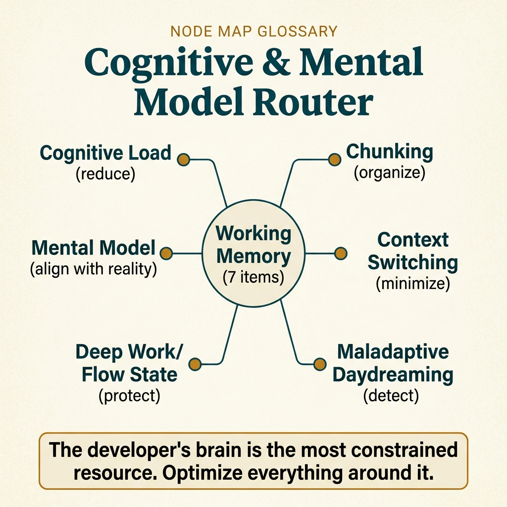

<!-- tags: glossary, reference, developer-cognition-team-dynamics, cognitive-mental-model, overview -->

# Cognitive & Mental Model

> A cluster of terms about how the brain processes information when reading code, debugging systems, and building new mental models.

| Aspect            | Detail                                                                                                                              |
| ----------------- | ----------------------------------------------------------------------------------------------------------------------------------- |
| **Concept**       | A cluster of terms about how the brain processes information when reading code, debugging systems, and building new mental models.  |
| **Audience**      | Developer, reviewer, tech lead, engineering manager                                                                                 |
| **Primary style** | Glossary hub router                                                                                                                 |
| **Entry point**   | Open when the symptom is cognitive overload, slow system comprehension, high context-switching, or the team's inability to go deep. |

📅 Created: 2026-03-30 · 🔄 Updated: 2026-04-16 · ⏱️ 7 min read

---

## 1. DEFINE

Some days the team sees no outage, yet everyone is exhausted: reviews take forever, debugging wanders, context-switching never stops, and nobody holds the complete picture in their head. This is not always a technical defect — it is often a cognitive problem. This README routes that symptom into the right term about load, memory, flow, and mental models.

**Cognitive & Mental Model** is a cluster of terms about how the brain processes information when reading code, debugging systems, and building new mental models.

| Variant                | Description                                                                                    |
| ---------------------- | ---------------------------------------------------------------------------------------------- |
| Load & memory          | Cognitive load and working memory explain the cognitive limits during reasoning.               |
| Mental model formation | Mental model and chunking describe how readers package their understanding of the system.      |
| Focus & interruption   | Context switching, deep work, and flow state name the moments when the brain loses its rhythm. |

| Approach                              | Time       | Space | When to choose                                                         |
| ------------------------------------- | ---------- | ----- | ---------------------------------------------------------------------- |
| Route by "too many things in my head" | O(1) route | O(1)  | When the symptom is specific but the team lacks vocabulary to name it. |
| Route by focus quality                | O(1) route | O(1)  | When the issue is interruptions and inability to go deep.              |
| Learn from mechanism to workflow      | O(1) route | O(1)  | When you want to move from brain limits to work organization.          |

Core insight:

> If the team cannot name cognitive debt, they will keep treating exhaustion, lost context, and slow comprehension as individual failures instead of system-design problems.

### 1.1 Signals & Boundaries

- Cognitive load is the fastest symptom to spot. Mental model is the destination behind it.
- Working memory explains why code and docs need good grouping and chunking.
- Context switching, deep work, and flow state belong to workflow-induced load — not just doc-code load.

### Coverage Map

| Entry                                                    | Role           | Note                                                                   |
| -------------------------------------------------------- | -------------- | ---------------------------------------------------------------------- |
| [Cognitive Load](01-cognitive-load.md)                   | Canonical term | Primary entry of this branch                                           |
| [Mental Model](02-mental-model.md)                       | Canonical term | Primary entry of this branch                                           |
| [Context Switching](03-context-switching.md)             | Canonical term | Primary entry of this branch                                           |
| [Deep Work](04-deep-work.md)                             | Canonical term | Primary entry of this branch                                           |
| [Flow State](05-flow-state.md)                           | Canonical term | Primary entry of this branch                                           |
| [Working Memory](06-working-memory.md)                   | Canonical term | Primary entry of this branch                                           |
| [Chunking](07-chunking.md)                               | Canonical term | Primary entry of this branch                                           |
| [Maladaptive Daydreaming](08-maladaptive-daydreaming.md) | Canonical term | When you need to distinguish attention drift from purposeful scenarios |

---

## 2. VISUAL



_Figure: Router map prioritizing quick scanning of lanes, entry points, and reading boundaries before diving into detailed prose below._

At this point, what is missing is not another definition but a diagram clear enough to show how the concept clusters sit next to each other.

### Level 1

```text
Load & memory
Mental model formation
Focus & interruption
```

_Figure: Level 1 divides this hub into the main decision lanes so the reader does not have to guess from a flat list of terms._

### Level 2

```text
If the symptom is...                                      Open first
──────────────────────────────────────────────────────    ──────────────────────
Small PR but requires holding too much info at once       Cognitive Load
Reader cannot assemble the system picture into a whole    Mental Model
Workday is shredded and nobody goes deep                  Context Switching
Want to reduce load by packaging info better              Chunking
Mind repeatedly drifts into recurring imagined scenarios  Maladaptive Daydreaming
```

_Figure: Level 2 turns the hub into a symptom router — start from the real question, then branch to the specific term._

---

## 3. CODE

The diagram just grouped this hub by cognitive load, focus states, and how the brain chunks information. From here, use the hub as a map to name the invisible pressure the reader is carrying.

### Problem 1: Basic — Route the right symptom to the right glossary entry

> **Goal**: Do not let every question about **Cognitive & Mental Model** land in the same bucket.
> **Approach**: Start from the symptom or question, then open the best matching first entry.
> **Example**: Input is a review or design question; output is the file to open first, such as `./01-cognitive-load.md`.
> **Complexity**: Basic

```yaml
router:
    - symptom: Small PR but requires holding too much info at once
      open_first: ./01-cognitive-load.md
    - symptom: Reader cannot assemble the system picture into a whole
      open_first: ./02-mental-model.md
    - symptom: Workday is shredded and nobody goes deep
      open_first: ./03-context-switching.md
    - symptom: Want to reduce load by packaging info better
      open_first: ./07-chunking.md
    - symptom: Mind repeatedly drifts into recurring imagined scenarios
      open_first: ./08-maladaptive-daydreaming.md
```

**Why?** In cognitive terms, many surface symptoms look nearly identical: fatigue when reading code, lost flow, context switching, or working-memory overload. This router helps lock the right type of mental pressure before moving to solutions.

**Conclusion**: The first value of this hub is turning a feeling of overload into a specific entry point that can be acted on.

### Problem 2: Intermediate — Use the hub as a deliberate learning path

> **Goal**: Read **Cognitive & Mental Model** in logical clusters instead of jumping between disconnected files.
> **Approach**: Follow the lane from foundation to heavier variants, then compare adjacent concepts when needed.
> **Example**: A reader wants to build a durable mental model rather than just looking up a single definition.
> **Complexity**: Intermediate

```yaml
learning_path:
    mechanics:
        - 01-cognitive-load.md
        - 06-working-memory.md
        - 07-chunking.md
    understanding_systems:
        - 02-mental-model.md
    focus_and_work:
        - 03-context-switching.md
        - 04-deep-work.md
        - 05-flow-state.md
        - 08-maladaptive-daydreaming.md
```

**Why?** Mental models are only durable when the reader sees each term supporting the next: cognitive load connects to working memory, which connects to chunking and flow state. The learning path turns these concepts into a system rather than a collection of disconnected psychology terms.

**Conclusion**: At the intermediate level, this hub turns cognitive-load concepts into a learning path usable for designing code and work rhythms.

### Problem 3: Advanced — Use the hub as a governance map for shared vocabulary

> **Goal**: Keep reviews, ADRs, runbooks, and postmortems using the same language within **Cognitive & Mental Model**.
> **Approach**: Group terms by decision lane, then use that lane as a glossary contract for the team.
> **Example**: When two people say the same word but are actually arguing at two different system layers.
> **Complexity**: Advanced

```yaml
governance_map:
    load_memory:
        - 01-cognitive-load.md
        - 06-working-memory.md
        - 07-chunking.md
    mental_model_formation:
        - 02-mental-model.md
    focus_interruption:
        - 03-context-switching.md
        - 04-deep-work.md
        - 05-flow-state.md
        - 08-maladaptive-daydreaming.md
```

**Why?** Shared vocabulary in this cluster helps the team discuss focus capacity without falling into emotion. The governance map keeps design decisions, work-rhythm choices, and reviews grounded in the real cognitive limits of humans.

**Conclusion**: At the advanced level, this hub is a cognitive-load map for designing work and code around the reader's actual capacity.

---

## 4. PITFALLS

The topic cluster is now clearly visible. The part that makes readers slip most is applying the right name but at the wrong depth or the wrong boundary.

| #   | Severity  | Mistake                                                | Consequence                                                              | Fix                                                                    |
| --- | --------- | ------------------------------------------------------ | ------------------------------------------------------------------------ | ---------------------------------------------------------------------- |
| 1   | 🔴 Fatal  | Mixing multiple concept layers in the same discussion  | Team fixes the wrong layer, arguments go off-track                       | Re-route using the lane in this README before opening a specific term. |
| 2   | 🟡 Common | Choosing a term by familiar name instead of by symptom | Deep-linking to the right file but the wrong boundary                    | Ask the symptom question first, then choose the entry point.           |
| 3   | 🟡 Common | Reading a single term while skipping the learning path | Understanding stays fragmented, missing adjacent concepts for comparison | Follow the reading clusters suggested in CODE/RECOMMEND.               |
| 4   | 🔵 Minor  | Not linking back to the parent hub or root hub         | Reader has trouble returning to the taxonomy when lost                   | Keep the hub as a router — do not turn files into islands.             |

---

## 5. REF

| Resource                        | Type | Link                                              | Note                                                       |
| ------------------------------- | ---- | ------------------------------------------------- | ---------------------------------------------------------- |
| Team Topologies                 | Book | https://teamtopologies.com/                       | Excellent for cognitive load at the team level.            |
| Deep Work                       | Book | https://www.calnewport.com/books/deep-work/       | Strong foundation for focus and distraction cost.          |
| A Philosophy of Software Design | Book | https://web.stanford.edu/~ouster/cgi-bin/book.php | Beautiful connection between complexity and mental effort. |

---

## 6. RECOMMEND

You have identified the type of cognitive pressure appearing. Move next to the term closest to the real feeling of overload, so the solution touches the actual brain mechanism rather than just reducing a symptom.

| Expand to                                                | When                                                               | Reason                                                                          | File/Link                                      |
| -------------------------------------------------------- | ------------------------------------------------------------------ | ------------------------------------------------------------------------------- | ---------------------------------------------- |
| Cognitive load first                                     | When the symptom comes from fatigue and slow reasoning             | This is the first name to use so you stop blaming individual competence.        | [Cognitive Load](./01-cognitive-load.md)       |
| Mental model next                                        | When you need to move from symptom to shaping understanding        | The issue at this point is not just reducing load but building the right frame. | [Mental Model](./02-mental-model.md)           |
| Deep work / context switching when the issue is workflow | When the problem goes beyond code shape into how work is organized | The solution at this point is not about comment formatting anymore.             | [Context Switching](./03-context-switching.md) |

---

## 7. QUICK REF

| If you face                                              | Open                                                       |
| -------------------------------------------------------- | ---------------------------------------------------------- |
| Small PR but requires holding too much info at once      | [Cognitive Load](./01-cognitive-load.md)                   |
| Reader cannot assemble the system picture into a whole   | [Mental Model](./02-mental-model.md)                       |
| Workday is shredded and nobody goes deep                 | [Context Switching](./03-context-switching.md)             |
| Want to reduce load by packaging info better             | [Chunking](./07-chunking.md)                               |
| Mind repeatedly drifts into recurring imagined scenarios | [Maladaptive Daydreaming](./08-maladaptive-daydreaming.md) |
