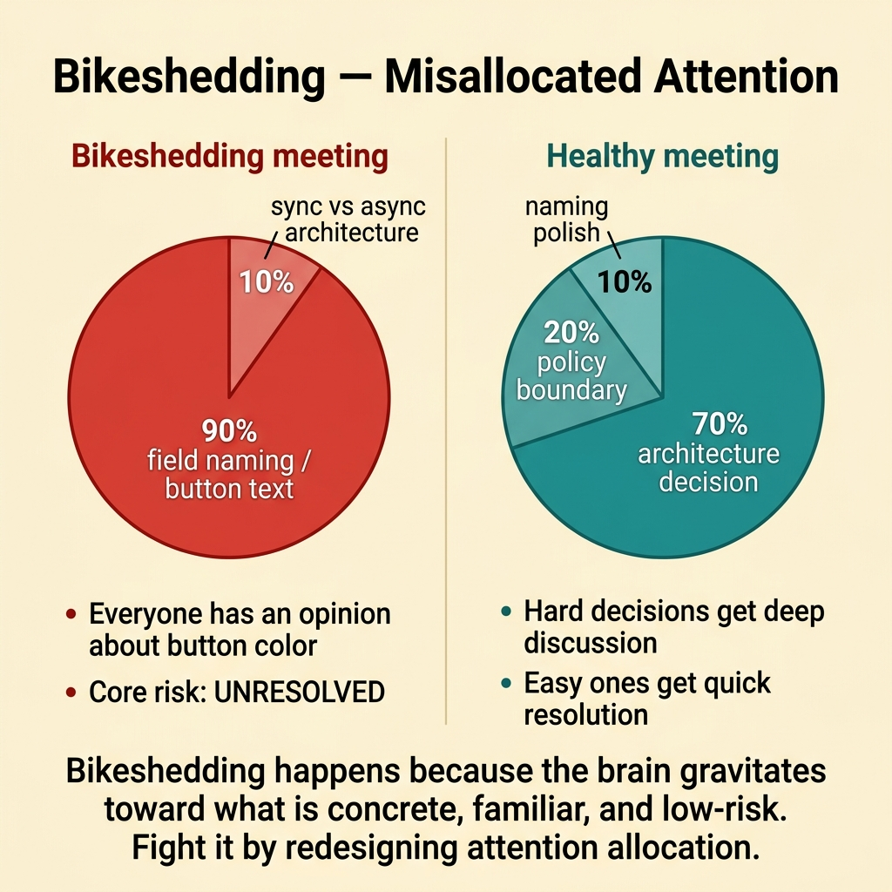
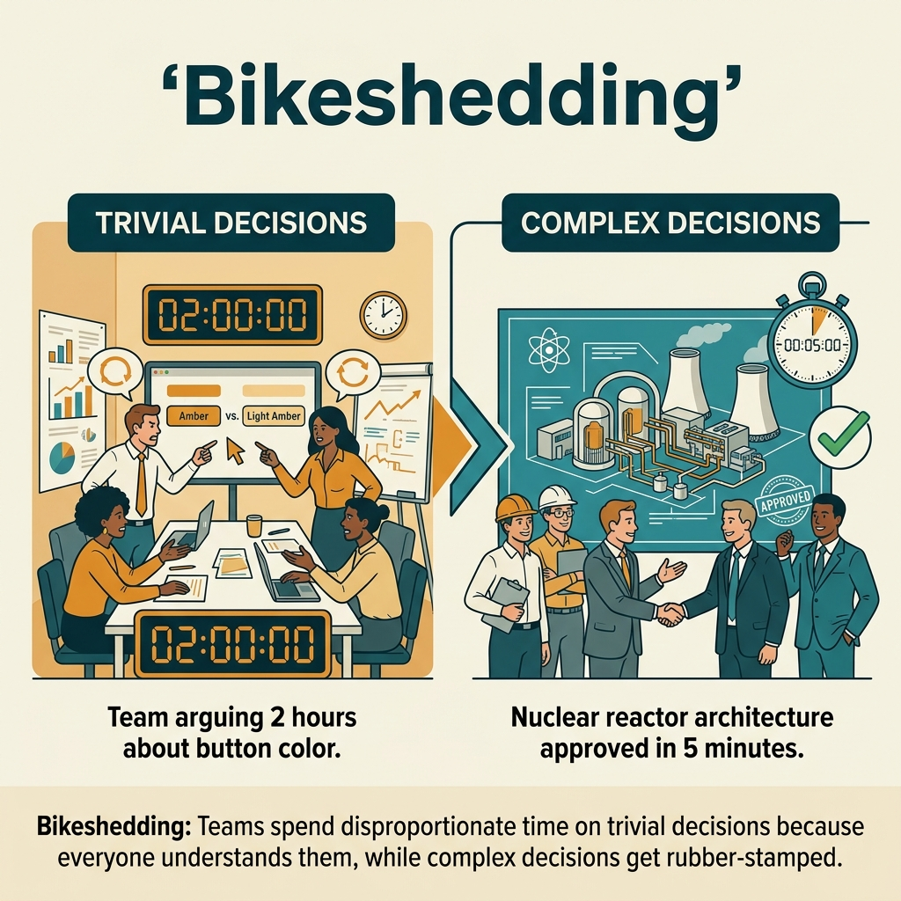

<!-- tags: glossary, reference, developer-cognition-team-dynamics, decision-making-trade-offs, bikeshedding -->
# Bikeshedding

> The phenomenon of spending disproportionate time debating small, easy-to-understand details while neglecting bigger, more impactful decisions.

| Aspect | Detail |
| --- | --- |
| **Concept** | The phenomenon of spending disproportionate time debating small, easy-to-understand details while neglecting bigger, more impactful decisions. |
| **Audience** | Developer, tech lead, facilitator |
| **Primary style** | Glossary term |
| **Entry point** | Use when the team talks extensively about button colors, enum names, or config formatting but avoids harder architecture or policy decisions. |

📅 Created: 2026-03-30 · 🔄 Updated: 2026-04-04 · ⏱️ 9 min read

---

## 1. DEFINE

Picture a design review that runs for 50 minutes. 40 of those minutes are spent on whether a field should be named `planId` or `subscriptionPlanId`, while the more important question — whether this service should be synchronous or event-driven — goes untouched. The team is not lazy; they are simply drawn to what is easy to understand and easy to have an opinion about. That is bikeshedding.

**Bikeshedding** is the phenomenon of spending disproportionate time debating small, easy-to-understand details while neglecting bigger, more impactful decisions.

| Variant | Description |
| --- | --- |
| Naming bikeshedding | Extended debate around names, styles, and labels. |
| UI bikeshedding | Excessive attention to easily visualized details like colors or wording. |
| Process bikeshedding | Spending too much time on minor processes instead of the primary risk. |

| Approach | Time | Space | When to choose |
| --- | --- | --- | --- |
| Frame decision by impact | O(n agenda items) | O(1) | When a meeting is allocating attention to the wrong items. |
| Timebox low-impact choices | O(n decisions) | O(1) | When small details still need to be decided but should not consume all the energy. |
| Escalate unresolved high-impact questions first | O(n review loops) | O(decision log) | When the team keeps avoiding the hard part by clinging to easy details. |

Core insight:

> Bikeshedding happens not because the team is incompetent, but because the human brain gravitates toward what is concrete, familiar, and low-risk. Fighting bikeshedding means redesigning how attention is allocated, not blaming individuals.

### 1.1 Invariants & Failure Modes

The invariant is that the energy spent on a decision must be proportional to its blast radius. When a low-impact detail absorbs most of the meeting time, the team is spending its attention budget in the wrong place.

---

## 2. CONTEXT

**Who uses it**: Developer, tech lead, facilitator

**When**: Use when the team talks extensively about button colors, enum names, or config formatting but avoids harder architecture or policy decisions.

**Purpose**: Bikeshedding happens not because the team is incompetent, but because the brain gravitates toward what is concrete, familiar, and low-risk. Fighting bikeshedding means redesigning attention allocation, not blaming individuals.

**In the ecosystem**:
- Not every detailed discussion is bikeshedding; naming can genuinely matter if it affects domain clarity.
- Bikeshedding is recognized when the ratio of time spent to impact is misaligned.
- This is a failure mode of facilitation and prioritization, not just communication style.

---

Debating small things while ignoring big ones is clear. But how do you recognize bikeshedding, what stops it, and when does detail actually matter?

## 3. EXAMPLES

Bikeshedding surfaces most visibly when a meeting argues about button color for 45 minutes but gives architecture decisions 5 minutes, when a PR review has 20 comments about naming and zero about logic, or when the team aligns quickly on hard decisions but gets stuck on trivial ones. The examples below place the pattern into exactly those situations.

### Example 1: Basic — A review is stuck on minor naming

You are reviewing a PR about access control, but the longest thread revolves around whether to use `allowed` or `permitted`. Both are reasonable; what truly deserves discussion is whether this policy evaluates at the controller or domain service level. At the basic level, the first step is shifting the spotlight back to impact.

The input is a review thread stuck on a small detail. The output is a prompt or checklist that reminds reviewers to return to the bigger question. Complexity is low because it is mainly reframing.

```go
type ReviewFocus struct {
	ArchitectureRisk bool
	PolicyBoundary   bool
	NamingPolish     bool
}
```

**Why?** People easily contribute opinions on what they can see immediately and feel confident about. A focus checklist forces the team to prioritize questions with higher blast radius before touching polish.

**Takeaway**: You shift the review from "everyone says something" to "the team is solving the right thing first."
**Caveat**: This does not mean naming is always minor; sometimes naming is exactly what determines clarity.
**Use when**: the longest review thread is about wording or style.

### Example 2: Intermediate — A meeting needs to timebox small details

In a design meeting, the team keeps circling back to Kafka queue naming and topic conventions. The main decision — retry semantics and ordering guarantees — remains untouched. At the intermediate level, facilitation must timebox the small part to preserve energy for the big part.

The input is a meeting agenda where low-impact topics consume most of the time. The output is a decision flow with explicit timeboxes for low-impact items. Complexity is moderate because it requires intervening in discussion dynamics.

```go
type DecisionAgenda struct {
	HighImpactQuestion string
	LowImpactQuestion  string
	LowImpactTimebox   time.Duration
}
```

**Why?** Bikeshedding intensifies when a meeting has no mechanism to limit time on small items. A timebox does not deny the value of details; it simply keeps the attention ratio proportional to actual impact.

**Takeaway**: You protect the big questions with a concrete facilitation mechanism, not just a general reminder.
**Caveat**: If the facilitator timeboxes mechanically without recording unresolved concerns, the team may feel cut off.
**Use when**: meetings repeatedly drift into naming, wording, or formatting before touching architectural risk.

### Example 3: Advanced — Bikeshedding hides a difficult trade-off

A team is choosing between a synchronous write path and eventual consistency, but the discussion gets absorbed by event naming and payload field order. At the advanced level, you need to clearly separate which layer is the core trade-off and which is an implementation detail that can be deferred.

The input is a decision with serious trade-offs. The output is a decision record that separates "must-resolve now" from "can-polish later." Complexity is high because it involves both architecture and decision hygiene.



*Figure: Bikeshedding happens because the brain gravitates toward what is concrete, familiar, and low-risk.*

```go
type ADRScope struct {
	MustResolveNow []string
	PolishLater    []string
}

var paymentSyncDecision = ADRScope{
	MustResolveNow: []string{"consistency model", "failure handling", "latency budget"},
	PolishLater:    []string{"event topic naming", "field ordering"},
}
```

**Why?** When the core trade-off is not explicitly named, the team easily drifts into easier but less important questions. An explicit scope record keeps the debate anchored to the decision layer that is actually open.

**Takeaway**: You block bikeshedding by making the core trade-off visible and clearly owned.
**Caveat**: If everything is pushed into "polish later," the team may accumulate a pile of unresolved small decisions.
**Use when**: a design discussion avoids the big architecture question by diving into implementation details.

### Example 4: Expert — Design a review culture that resists bikeshedding

Some teams repeat bikeshedding even though everyone knows it exists, because the review culture rewards whoever comments the most rather than whoever addresses the right issue. At the expert level, fighting bikeshedding is about designing norms for the entire group.

The input is a team with a repeating pattern of misallocated attention. The output is a review rubric and meeting norms that clarify priority order when giving feedback. Complexity is high because it involves work culture.

```go
type ReviewRubric struct {
	CorrectnessFirst bool
	RiskSecond       bool
	PolishLast       bool
}
```

**Why?** Individual behavior tends to follow group incentives. If the feedback system does not distinguish between architecture risk and wording tweaks, bikeshedding will recur as default behavior.

**Takeaway**: You turn fighting bikeshedding into a part of the operating norms, not just a skill of individual facilitators.
**Caveat**: A rubric is only useful if lead reviewers actually model it in their own comments and meetings.
**Use when**: multiple reviews/meetings in a row show the same misallocated attention pattern.

---

## 4. COMPARE




*Figure: Position of bikeshedding among yak shaving, decision fatigue, and meeting anti-patterns.*

Bikeshedding sounds like perfectionism. Different: perfectionism invests time in quality, bikeshedding invests time in trivial decisions because they are easier to understand than hard decisions. Everyone has an opinion about button color; few have an opinion about consistency models.

### Level 1

```text
hard question appears
  -> team shifts to easier small detail
  -> feels productive
  -> core risk remains unresolved
```

*Figure: Level 1 shows bikeshedding is an unconscious avoidance mechanism, not necessarily irresponsibility.*

### Level 2

```text
meeting agenda
  critical: sync vs async boundary         10%
  minor: field naming / button text        90%

healthy agenda
  critical decisions first
  small polish later or timeboxed
```

*Figure: Level 2 emphasizes the core issue is misallocated attention, not the topic being discussed.*

### Easy to confuse or cross the boundary

You have seen where Bikeshedding should be applied. The mistakes below are common misuses that make the team think they are analyzing when they are really just repeating inertia.

| # | Severity | Mistake | Consequence | Fix |
| --- | --- | --- | --- | --- |
| 1 | 🔴 Fatal | Spending most time on low-impact details | Core risk goes unresolved | Reframe by impact and blast radius. |
| 2 | 🟡 Common | Not timeboxing minor topics | Meeting drifts from its goal | Use an agenda with timeboxes for low-impact items. |
| 3 | 🟡 Common | Labeling every naming debate as bikeshedding | Overlooking real clarity issues | Evaluate by impact, not just topic type. |
| 4 | 🔵 Minor | Only saying "don't bikeshed" without changing norms | Pattern repeats as-is | Design a rubric and specific facilitation rules. |

### Quick scan

| If you encounter | What to do |
| --- | --- |
| Longest review thread is about minor naming | Reframe with architecture risk and correctness first. |
| Meeting gets absorbed by easy-to-discuss details | Timebox low-impact items. |
| Team avoids hard trade-offs through implementation details | Separate must-resolve-now from polish-later. |
| Bikeshedding repeats across many sprints | Design a review rubric and facilitation norms. |

---

## 5. REF

| Resource | Type | Link | Notes |
| --- | --- | --- | --- |
| Parkinson's Law of Triviality | Reference | https://en.wikipedia.org/wiki/Law_of_triviality | Classic source for this concept. |
| A Philosophy of Software Design | Book | https://web.stanford.edu/~ouster/cgi-bin/book.php | Useful for distinguishing real complexity from noise. |
| Opportunity Cost | Related term | ./07-opportunity-cost.md | Bikeshedding always carries hidden opportunity costs. |

---

## 6. RECOMMEND

Bikeshedding solves the problem of "the team spends too much time on unimportant decisions." The next question: what about yak shaving, and how do DORA metrics measure productivity?

| Expand to | When | Why | File/Link |
| --- | --- | --- | --- |
| Opportunity Cost | When you want to quantify the price of misallocated attention | Bikeshedding is a form of opportunity-cost leak. | [Opportunity Cost](./07-opportunity-cost.md) |
| Premature Optimization | When the team dives into small optimizations too early | These two failure modes often travel together. | [Premature Optimization](./08-premature-optimization.md) |
| Decision Making & Trade-offs | When you need to return to the hub | Keep context of the full topic. | [Decision Making & Trade-offs](./README.md) |

Back to that 45-minute button color debate from the beginning — architecture got 5 minutes. Now you know: timebox trivial discussions (5 minutes, then vote), invest time according to impact. Hard decisions deserve deep discussion; easy ones deserve quick resolution.

**Links**: [← Previous](./README.md) · [→ Next](./02-yak-shaving.md)
