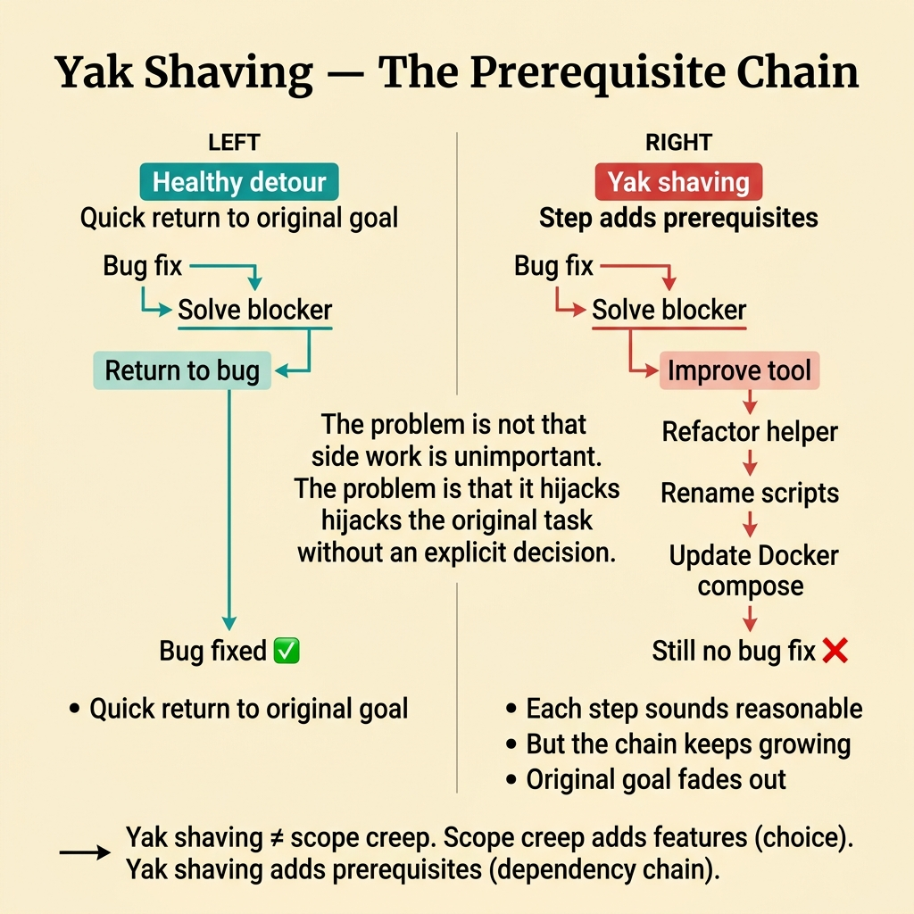
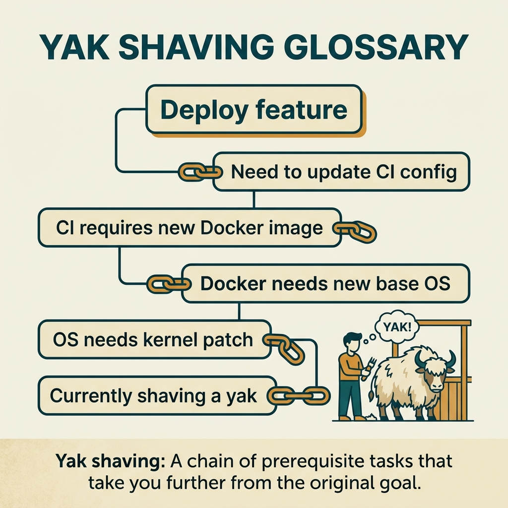

<!-- tags: glossary, reference, developer-cognition-team-dynamics, decision-making-trade-offs, yak-shaving -->
# Yak Shaving

> A chain of side tasks that keeps growing, pulling the team further and further from the original goal.

| Aspect | Detail |
| --- | --- |
| **Concept** | A chain of side tasks that keeps growing, pulling the team further and further from the original goal. |
| **Audience** | Developer, tech lead, delivery owner |
| **Primary style** | Glossary term |
| **Entry point** | Use when a small task keeps generating "but first I need to do this" until the team forgets the original outcome entirely. |

📅 Created: 2026-03-30 · 🔄 Updated: 2026-04-04 · ⏱️ 9 min read

---

## 1. DEFINE

Picture yourself about to fix a CSV export bug. But to run locally, the team decides to clean up Docker Compose; to clean Compose, they want to upgrade package scripts; upgrading scripts triggers an env loader cleanup; and two hours later, the CSV bug is still untouched. Each step sounds perfectly reasonable, but the chain of reasonable steps has bent the trajectory away from the original goal. That is yak shaving.

**Yak Shaving** is a chain of side tasks that keeps growing, pulling the team further and further from the original goal.

| Variant | Description |
| --- | --- |
| Tooling yak shave | Falling into cleaning up environments, scripts, and configs instead of addressing the primary outcome. |
| Refactor yak shave | Seizing a small fix opportunity to expand into an open-ended cleanup. |
| Process yak shave | Adding checklists, tickets, and ceremonies that distract from the main task. |

| Approach | Time | Space | When to choose |
| --- | --- | --- | --- |
| Re-anchor on target outcome | O(n detours) | O(1) | When the task starts drifting but can still be pulled back quickly. |
| Separate blocker from improvement work | O(n backlog updates) | O(backlog notes) | When the side work has real value but does not belong in the current scope. |
| Set stop conditions for side quests | O(n task reviews) | O(checklist) | When the team tends to expand scope from "while I'm at it" tasks. |

Core insight:

> Yak shaving differs from handling a real blocker. The problem is not that side work is unimportant, but that it hijacks the original task without any explicit decision.

### 1.1 Invariants & Failure Modes

The invariant is that every detour must answer "how does this detour unblock the original outcome?" When the answer is vague or the chain grows indefinitely, yak shaving has begun.

---

## 2. CONTEXT

**Who uses it**: Developer, tech lead, delivery owner

**When**: Use when a small task keeps generating "but first I need to do this" until the team forgets the original outcome entirely.

**Purpose**: Yak shaving differs from handling a real blocker. The problem is not that side work is unimportant, but that it hijacks the original task without any explicit decision.

**In the ecosystem**:
- Not every detour is bad; some blockers genuinely must be solved before progress can continue.
- Yak shaving is recognized when the chain of side tasks grows while progress toward the original outcome stays near zero.
- This is a failure mode of scope control and task framing.

---

Task A leads to task B leads to task Z — that much is clear. But when is yak shaving necessary, when should you stop, and how do you track progress?

## 3. EXAMPLES

Yak shaving surfaces most visibly when fixing one bug leads to upgrading a library, which leads to upgrading a framework and three days are lost; when "deploy a feature" turns into "set up CI/CD from scratch"; or when a developer reports "I'm making progress" but the original task has not started. The examples below place the pattern into exactly those situations.

### Example 1: Basic — Separate a real blocker from a convenient side quest

You only need to run tests to confirm a bug, but you also start cleaning up package scripts because "I'm already here." At the basic level, the first step is to clearly label what is a blocker that must be handled now and what is an improvement that should be separated.

The input is a task with an attractive side task. The output is a clear classification of blocker versus improvement. Complexity is low because it is scope hygiene.



*Figure: The problem is not that side work is unimportant. The problem is that it hijacks the original task without an explicit decision.*

```go
type TaskScope struct {
	PrimaryOutcome string
	RequiredBlocker string
	CanDefer       []string
}
```

**Why?** Yak shaving intensifies when every side task gets labeled "also needed." An explicit scope object forces the team to decide which detour truly unblocks the original outcome and which is just an improvement opportunity.

**Takeaway**: You stop the chain drift early by naming each side task correctly.
**Caveat**: Do not be so rigid that you ignore a real blocker just because it is "out of scope."
**Use when**: a small task has just begun and is already pulling in "while I'm at it" work.

### Example 2: Intermediate — Move improvement ideas to the backlog instead of keeping them in your head

A developer is fixing an export bug but keeps noticing "if I also cleaned up this helper, it would be nicer." Without a place to capture those ideas, they will easily dive in right away. At the intermediate level, you need a mechanism to park good ideas without derailing the current task.

The input is a stream of improvement ideas that surface during work. The output is backlog notes or follow-up tickets instead of expanding the current task. Complexity is moderate because it involves execution habits.

```go
type FollowUpItem struct {
	Title  string
	Reason string
}

var exportCleanupFollowUp = FollowUpItem{
	Title:  "Refactor export env loader",
	Reason: "useful, but not required to ship CSV bug fix",
}
```

**Why?** Many yak shaves exist because the brain fears "this is a good idea and I'll forget it." When improvements are captured in a trusted place, the team can return to the original outcome more easily without feeling they are wasting an opportunity.

**Takeaway**: You preserve good ideas without letting them hijack the current task.
**Caveat**: A backlog is only useful if the team actually reviews it; otherwise it just becomes a graveyard for ideas.
**Use when**: task execution keeps getting pulled toward cleanup or optimization that is not needed to ship the primary result.

### Example 3: Advanced — A valuable refactor must be consciously scoped

You are adding idempotency to payments and discover the existing abstraction is terrible. This refactor is probably worth doing, but it cannot be allowed to silently merge into the current task just because it seems related. At the advanced level, you need a decision gate for "worth doing, but not implicitly now."

The input is a large refactor discovered during feature work. The output is an explicit decision: fold into scope, split as follow-up, or stop the feature and re-scope. Complexity is high because it involves real delivery trade-offs.

```go
type ScopeDecision struct {
	KeepCurrentScope bool
	CreateFollowUp   bool
	ReScopeFeature   bool
}
```

**Why?** Yak shaving at the advanced level is more dangerous because the side work often has genuine value. Precisely because of that, it needs an explicit decision gate rather than being legitimized by "well, I'm already fixing this area."

**Takeaway**: You transform a reasonable refactor impulse into a conscious delivery choice.
**Caveat**: Mechanically cutting every refactor out of scope can create real debt if the blocker runs too deep.
**Use when**: a feature task hits significant design debt and the team is torn between "ship now" and "fix the foundation properly."

### Example 4: Expert — Team workflow must detect yak shaving early

A team full of perfectionists repeats yak shaving on nearly every task: everyone sees side work worth doing and nobody wants to leave debt behind. At the expert level, the team needs a workflow that detects drift early instead of waiting for the retrospective to notice throughput has dropped.

The input is a team with a repeating scope drift pattern. The output is a short ritual to check whether the task is still anchored to the original outcome. Complexity is high because it is an organizational habit.

```go
type DailyCheck struct {
	PrimaryOutcomeStillVisible bool
	NewDetoursThisWeek         int
	FollowUpsCreated           int
}
```

**Why?** Yak shaving usually does not explode into a single large failure; it grinds throughput through small, repeated detours. A short cadence check helps the team detect drift before it becomes the norm.

**Takeaway**: You elevate scope discipline from an individual skill to a team-level mechanism.
**Caveat**: If the ritual becomes a heavy ceremony, it ironically becomes another form of yak shaving.
**Use when**: velocity is dropping but each individual task always has a "justified reason" for taking longer.

---

## 4. COMPARE




*Figure: Position of yak shaving among bikeshedding, scope creep, and prerequisite chains.*

Yak shaving sounds like scope creep. Different: scope creep means features added, yak shaving means prerequisite chains (you must do B before you can do A). Scope creep is a choice; yak shaving is usually a dependency chain.

### Level 1

```text
goal
  -> blocker
  -> sub-blocker
  -> cleanup idea
  -> more setup work
  -> original goal fades out
```

*Figure: Level 1 shows yak shaving is a cumulating chain of diversions, not a single wrong turn.*

### Level 2

```text
healthy
  bug fix
   -> solve blocker
   -> return to bug

yak shave
  bug fix
   -> solve blocker
   -> improve tool
   -> refactor helper
   -> rename scripts
   -> still no bug fix
```

*Figure: Level 2 highlights the key difference: whether the team returns to the original goal quickly enough.*

### Easy to confuse or cross the boundary

You have seen where Yak Shaving should be applied. The mistakes below are common misuses that make the team think they are analyzing when they are really just repeating inertia.

| # | Severity | Mistake | Consequence | Fix |
| --- | --- | --- | --- | --- |
| 1 | 🔴 Fatal | Merging every detour as "also needed" into the current task | Original outcome is forgotten or severely delayed | Separate real blockers from improvements. |
| 2 | 🟡 Common | No place to capture follow-up ideas | Dev dives in immediately out of fear of forgetting | Use backlog or follow-up notes. |
| 3 | 🟡 Common | Using "while I'm at it" to legitimize a large refactor | Scope drift goes uncontrolled | Set an explicit decision gate for emergent refactors. |
| 4 | 🔵 Minor | Not measuring drift at the team level | Yak shaving repeats but is invisible | Add a lightweight cadence check on outcomes and detours. |

### Quick scan

| If you encounter | What to do |
| --- | --- |
| Task generates many side tasks | Separate real blockers from side quests. |
| Many good cleanup ideas but outside the original outcome | Capture in follow-up, do not act immediately. |
| Large refactor appears mid-feature | Set an explicit decision gate. |
| Scope drift repeats across the whole team | Add a cadence check on detours. |

---

## 5. REF

| Resource | Type | Link | Notes |
| --- | --- | --- | --- |
| Yak shaving | Reference | https://en.wiktionary.org/wiki/yak_shaving | Origin of the term. |
| Essentialism | Book | https://gregmckeown.com/books/essentialism/ | Useful for scope discipline and prioritization. |
| Opportunity Cost | Related term | ./07-opportunity-cost.md | Every detour carries an opportunity cost. |

---

## 6. RECOMMEND

Yak shaving solves the problem of "a simple task turned into a multi-day rabbit hole." The next question: how do DORA metrics measure delivery, and how does the two-pizza rule work?

| Expand to | When | Why | File/Link |
| --- | --- | --- | --- |
| Opportunity Cost | When you want to quantify the cost of detours | Yak shaving consumes time and focus. | [Opportunity Cost](./07-opportunity-cost.md) |
| Sunk Cost Fallacy | When the team clings to a detour already sunk too deep | These two failure modes often chain together. | [Sunk Cost Fallacy](./06-sunk-cost-fallacy.md) |
| Decision Making & Trade-offs | When you need to return to the hub | Keep context of the full topic. | [Decision Making & Trade-offs](./README.md) |

Back to that bug fix → framework upgrade from the beginning — three days, no bug fix. Now you know: recognize yak shaving early, ask "is there a shortcut?", timebox prerequisite tasks. Sometimes a 30-minute workaround beats a 3-day "proper fix."

**Links**: [← Previous](./01-bikeshedding.md) · [→ Next](./03-dora-metrics.md)
