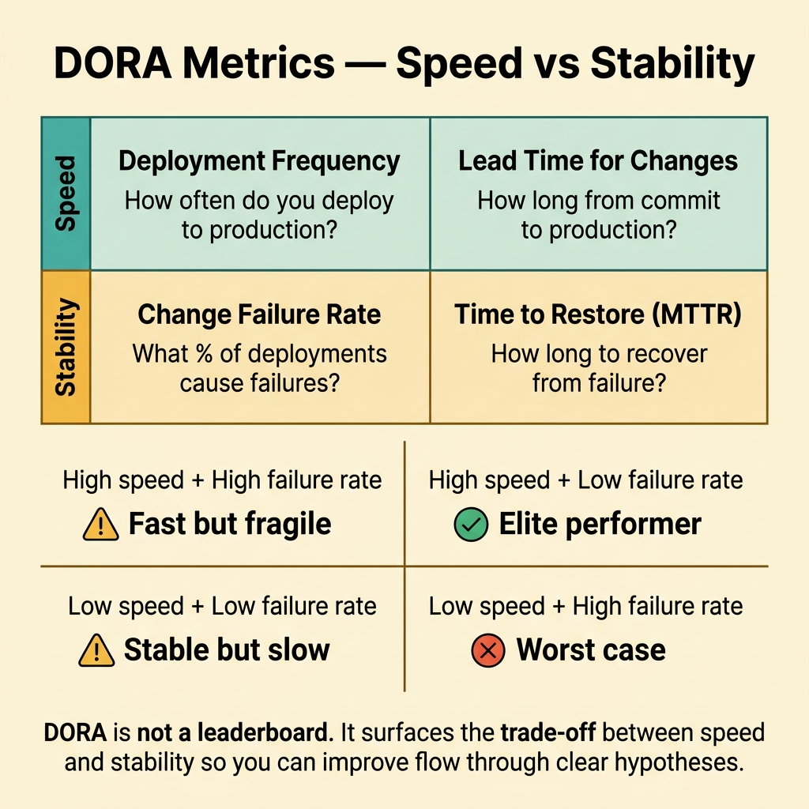
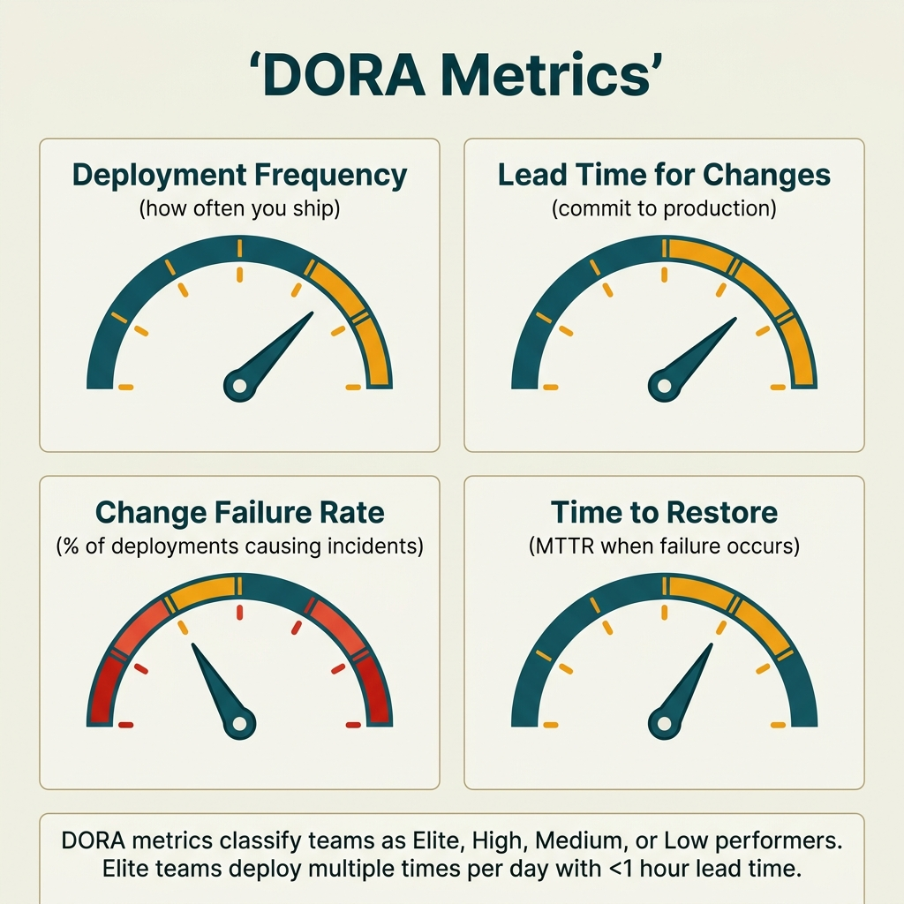

<!-- tags: glossary, reference, developer-cognition-team-dynamics, decision-making-trade-offs, dora-metrics -->
# DORA Metrics

> A set of four metrics that measure engineering delivery effectiveness: deployment frequency, lead time, change failure rate, and time to restore.

| Aspect | Detail |
| --- | --- |
| **Concept** | A set of four metrics that measure engineering delivery effectiveness: deployment frequency, lead time, change failure rate, and time to restore. |
| **Audience** | Engineering manager, tech lead, platform team |
| **Primary style** | Glossary term |
| **Entry point** | Use when the team needs to discuss delivery performance with structured data instead of feelings like "we've been deploying slowly lately." |

📅 Created: 2026-03-30 · 🔄 Updated: 2026-04-04 · ⏱️ 10 min read

---

## 1. DEFINE

Picture a team that feels like they are "doing a lot" but releases remain sparse, production fixes drag on, and every deploy is stressful. Without a shared yardstick, every argument about performance goes back to personal feelings. DORA Metrics exist to turn delivery performance into a picture that can be compared, tracked, and improved intentionally.

**DORA Metrics** is a set of four metrics that measure engineering delivery effectiveness: deployment frequency, lead time, change failure rate, and time to restore.

| Variant | Description |
| --- | --- |
| Flow metrics | Deployment frequency and lead time reflect the speed of getting changes into production. |
| Stability metrics | Change failure rate and time to restore reflect operational quality after a deploy. |
| Diagnostic view | Using all four together to avoid one-sided optimization. |

| Approach | Time | Space | When to choose |
| --- | --- | --- | --- |
| Instrument baseline delivery pipeline | O(n integrations) | O(metrics pipeline) | When the team has no baseline data about releases and incidents. |
| Read metrics as a system | O(n reviews) | O(1) | When data exists but the team tends to optimize one metric at the expense of others. |
| Tie metrics to improvement hypotheses | O(n initiatives) | O(experiment notes) | When you want metrics to drive specific action instead of just a pretty dashboard. |

Core insight:

> DORA Metrics are not a leaderboard for applying pressure. Their value lies in surfacing the trade-off between speed and stability, so the team improves flow through clear hypotheses instead of gut feeling.

### 1.1 Invariants & Failure Modes

The invariant is that all four metrics must be read together. When a team pushes deployment frequency up while ignoring change failure rate or restore time, they are optimizing the wrong system.

---

## 2. CONTEXT

**Who uses it**: Engineering manager, tech lead, platform team

**When**: Use when the team needs to discuss delivery performance with structured data instead of feelings like "we've been deploying slowly lately."

**Purpose**: DORA Metrics are not a leaderboard for applying pressure. Their value lies in surfacing the trade-off between speed and stability, so the team improves flow through clear hypotheses instead of gut feeling.

**In the ecosystem**:
- DORA is a leading lens for the delivery system, not all of engineering health.
- Good metrics do not automatically mean good product outcomes; they measure flow and stability, not business value directly.
- A single metric is very easy to misinterpret when taken out of the context of the other three.

---

The four delivery metrics are clear. But how do you measure them, how do you prevent gaming, and does DORA work for every team size?

## 3. EXAMPLES

DORA metrics surface most visibly when a team claims "we're fast" but lead time is two weeks, when deployment frequency is high but change failure rate is also high, or when MTTR is good but nobody tracks deployment frequency. The examples below place the pattern into exactly those situations.

### Example 1: Basic — The team needs a baseline instead of arguing by feeling

A team says "we deploy pretty regularly" but nobody knows whether "pretty regularly" means twice a week or 20 times a day. At the basic level, DORA starts by measuring and agreeing on definitions before discussing targets.

The input is scattered release and incident data. The output is a consistent baseline record to track trends. Complexity is low because it is just establishing measurement.



*Figure: DORA is not a leaderboard. It surfaces the trade-off between speed and stability.*

```go
type DoraBaseline struct {
	DeploymentFrequency string
	LeadTime            string
	ChangeFailureRate   string
	TimeToRestore       string
}
```

**Why?** Without a baseline, every claim about the team being "fast" or "slow" is just an impression. A baseline shifts arguments from feelings to observable system behavior.

**Takeaway**: You set a reference point so every future improvement has something concrete to compare against.
**Caveat**: A bad baseline is still more useful than no baseline; do not wait for perfect instrumentation to start measuring.
**Use when**: the team discusses delivery using feelings more than data.

### Example 2: Intermediate — One bad metric is not enough to conclude a cause

Lead time has spiked, but the team rushes to blame code review. Later they discover the real bottleneck is the staging queue and manual approval process. At the intermediate level, DORA must be read as a system, not as a blame dashboard.

The input is a metric that has worsened. The output is a hypothesis map rather than a hasty conclusion. Complexity is moderate because it requires system-level reasoning.

```go
type DoraHypothesis struct {
	Metric    string
	Suspects  []string
	Validated bool
}
```

**Why?** A metric only tells you how the system is behaving, not where the cause lies. If you jump from numbers to blame, the team will optimize the wrong bottleneck and trust will erode further.

**Takeaway**: You use the metric as an investigation signal, not as a verdict.
**Caveat**: Too many hypotheses without validation also slows the team; always include a short verification step.
**Use when**: the dashboard just showed a major change and the team wants to react immediately.

### Example 3: Advanced — DORA must be tied to specific improvement hypotheses

A platform team wants to improve deployment frequency so they plan to "automate more." But without stating exactly which part to automate, DORA stays at the decoration level. At the advanced level, every initiative needs a concrete metric hypothesis.

The input is an improvement initiative. The output is a clear hypothesis: "change X will affect metric Y in this way." Complexity is high because it requires linking data to engineering investment.

```go
type ImprovementExperiment struct {
	Change         string
	TargetMetric   string
	ExpectedImpact string
}
```

**Why?** Metrics only create value when they lead to actions that can be falsified. Otherwise the team will invest in expensive platform work without knowing whether it actually improves flow or just creates a feeling of professionalism.

**Takeaway**: You turn DORA from a measurement board into a tool for designing delivery improvement experiments.
**Caveat**: One initiative may affect multiple metrics simultaneously; do not force an oversimplified model on a complex system.
**Use when**: the team is about to invest in CI/CD, testing, incident handling, or release process improvements.

### Example 4: Expert — Prevent weaponizing DORA into a pressure tool

A leader sees low deployment frequency and immediately pushes the team to deploy more — while change failure rate is already high. At the expert level, DORA must be operated as a learning system, not as a punitive KPI.

The input is metrics being inserted into performance conversations. The output is a framing that protects the team from distorted optimization or gaming. Complexity is high because it involves leadership behavior.

```go
type MetricsUsagePolicy struct {
	SystemLearning    bool
	IndividualRanking bool
}
```

**Why?** When metrics are weaponized, the team will optimize to make the dashboard look good rather than making the system healthier. That destroys the very purpose of DORA: creating a trustworthy feedback loop to improve the delivery system.

**Takeaway**: You keep DORA in its proper role: a system learning tool, not a whip for individuals.
**Caveat**: If leadership does not share this framing, the prettier the dashboard gets, the more damage it can cause.
**Use when**: metrics start being used in individual evaluations or one-sided pressure.

---

## 4. COMPARE




*Figure: Position of DORA among velocity metrics, engineering effectiveness, and DevOps maturity.*

DORA sounds like velocity (story points). Different: velocity measures output (how many features), DORA measures throughput + stability (deliver fast + reliable). High velocity with low quality is not high DORA performance.

### Level 1

```text
delivery performance
  -> speed: deploy frequency, lead time
  -> stability: failure rate, restore time
```

*Figure: Level 1 shows DORA divides delivery into two inseparable dimensions: speed and stability.*

### Level 2

```text
high deploy frequency + high failure rate
  = fast but fragile

low deploy frequency + low failure rate
  = stable but slow

goal
  improve flow without destabilizing restore capacity
```

*Figure: Level 2 emphasizes DORA is most useful when the team reads the tension between metrics, not chasing a single number.*

### Easy to confuse or cross the boundary

You have seen where DORA Metrics should be applied. The mistakes below are common misuses that make the team think they are analyzing when they are really just repeating inertia.

| # | Severity | Mistake | Consequence | Fix |
| --- | --- | --- | --- | --- |
| 1 | 🔴 Fatal | Using DORA to rank individuals | Team games the metrics, trust drops sharply | Keep DORA at the system and team level. |
| 2 | 🟡 Common | Reading one metric then immediately concluding the cause | Optimizing the wrong point | Use metrics as a trigger for hypotheses, not a verdict. |
| 3 | 🟡 Common | Chasing only speed or only stability | Delivery system becomes lopsided | Read all four metrics together. |
| 4 | 🔵 Minor | Pretty dashboard but no connection to action | Metrics become decorations | Always tie to an improvement hypothesis. |

### Quick scan

| If you encounter | What to do |
| --- | --- |
| Team says "deploy fast/slow" based on feelings | Create a DORA baseline first. |
| A metric suddenly worsens | Write a hypothesis, do not blame immediately. |
| A large platform initiative is starting | Tie it to a clear target metric. |
| Metrics are being used to pressure individuals | Reframe as system learning. |

---

## 5. REF

| Resource | Type | Link | Notes |
| --- | --- | --- | --- |
| DORA Research | Reference | https://dora.dev/ | The official source for the model and research. |
| Accelerate | Book | https://itrevolution.com/product/accelerate/ | The foundational book for DORA metrics. |
| MTTR | Related term | /home/mvt/Repositories/Go/go-domain-driven-design/documents/assets/glosaries/observability-operations/05-mttr.md | A close component of restore time. |

---

## 6. RECOMMEND

DORA metrics solve the problem of "no objective measure for team delivery performance." The next question: how does the two-pizza rule work for team size, and what about the second system effect?

| Expand to | When | Why | File/Link |
| --- | --- | --- | --- |
| MTTR / SLO cluster | When you want to dig deeper into stability | DORA only touches the delivery surface, not all of operations. | [MTTR](/home/mvt/Repositories/Go/go-domain-driven-design/documents/assets/glosaries/observability-operations/05-mttr.md) |
| Opportunity Cost | When discussing the cost of slow releases | Delivery slowdown always has a business trade-off. | [Opportunity Cost](./07-opportunity-cost.md) |
| Decision Making & Trade-offs | When you need to return to the hub | Keep context of the full topic. | [Decision Making & Trade-offs](./README.md) |

Back to that "we're fast" from the beginning — lead time was two weeks. Now you know: four DORA metrics — deployment frequency, lead time, change failure rate, MTTR. Measure all four, optimize all four. Fast but unreliable is not fast.

**Links**: [← Previous](./02-yak-shaving.md) · [→ Next](./04-two-pizza-rule.md)
