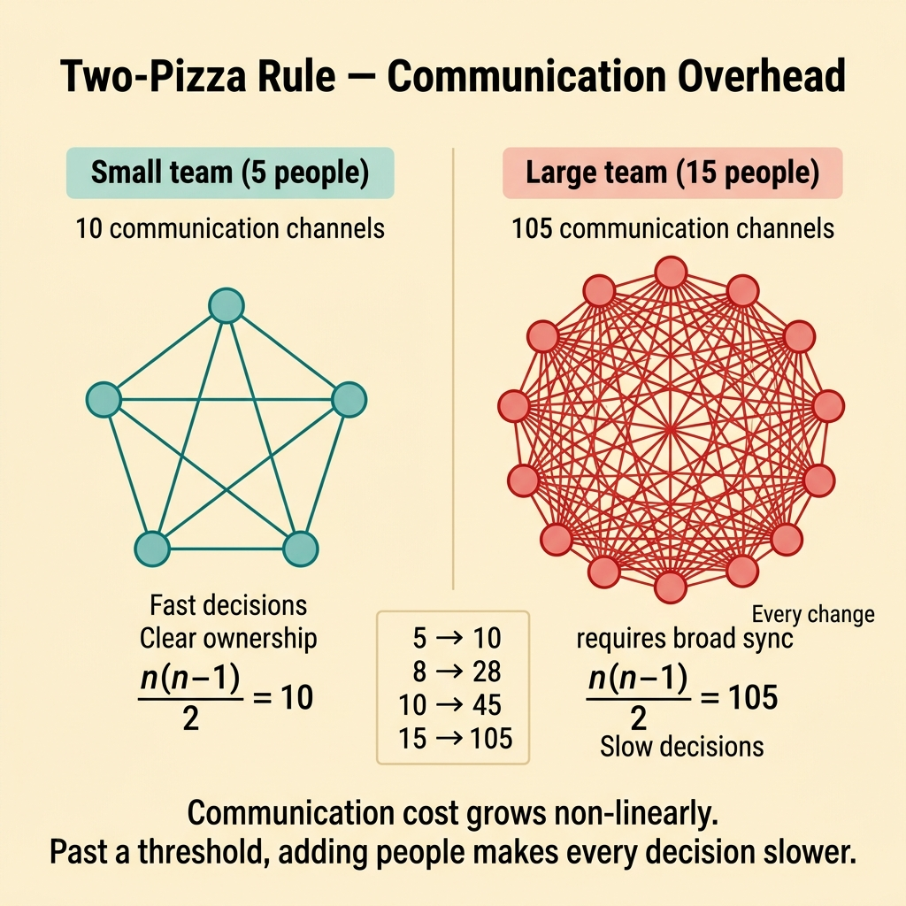
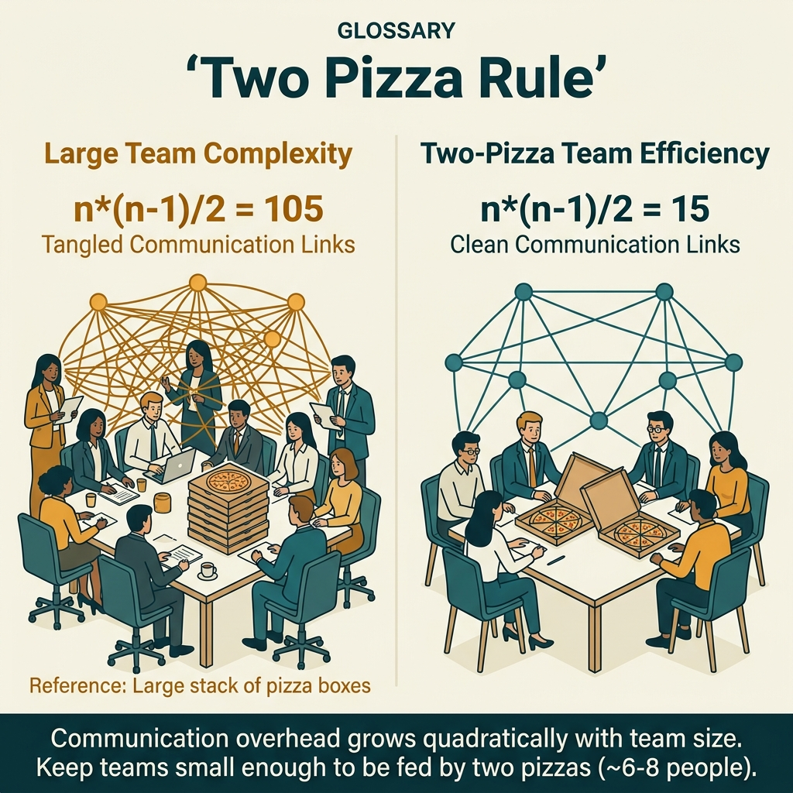

<!-- tags: glossary, reference, developer-cognition-team-dynamics, decision-making-trade-offs, two-pizza-rule -->
# Two-Pizza Rule

> The principle that a team should not be larger than the number of people who can be fed by two pizzas, to keep communication overhead manageable.

| Aspect | Detail |
| --- | --- |
| **Concept** | The principle that a team should not be larger than the number of people who can be fed by two pizzas, to keep communication overhead manageable. |
| **Audience** | Engineering manager, tech lead |
| **Primary style** | Glossary term |
| **Entry point** | Use when the team is growing and every decision is slowing down because of too much coordination overhead. |

📅 Created: 2026-03-30 · 🔄 Updated: 2026-04-04 · ⏱️ 9 min read

---

## 1. DEFINE

Picture a platform team so large that even a small change to a deployment template requires syncing across eight people, three sub-roles, and two recurring meetings. The issue is not individual ability; it is that communication overhead has started consuming throughput. The Two-Pizza Rule is a way to remind teams that group size is a design variable, not just a headcount variable.

**Two-Pizza Rule** is the principle that a team should not be larger than the number of people who can be fed by two pizzas, to keep communication overhead manageable.

| Variant | Description |
| --- | --- |
| Team size heuristic | A rough heuristic for an effective working group size. |
| Communication boundary rule | Used to warn when coordination cost starts outweighing execution. |
| Team topology trigger | A signal that the team should be split or ownership should be clarified. |

| Approach | Time | Space | When to choose |
| --- | --- | --- | --- |
| Measure coordination overhead | O(n meetings) | O(notes) | When the team feels slow but the root cause is unclear. |
| Split by ownership boundary | O(n reorganizations) | O(new interfaces) | When too many people share fuzzy responsibility over the same area. |
| Keep shared context narrow | O(n rituals) | O(1) | When the team cannot be split yet but coupling must decrease. |

Core insight:

> The Two-Pizza Rule does not say "small teams are always better." It says communication cost grows non-linearly. Past a certain threshold, adding people no longer increases throughput — it starts making every decision slower.

### 1.1 Invariants & Failure Modes

The invariant is that each person on the team must be able to maintain a small-enough shared context to coordinate without turning everything into a meeting. When every change triggers a broad sync, team size or boundary design has a problem.

---

## 2. CONTEXT

**Who uses it**: Engineering manager, tech lead

**When**: Use when the team is growing and every decision is slowing down because of too much coordination overhead.

**Purpose**: The Two-Pizza Rule does not say "small teams are always better." It says communication cost grows non-linearly. Past a certain threshold, adding people no longer increases throughput — it starts making every decision slower.

**In the ecosystem**:
- This is a heuristic about communication, not a hard rule about headcount.
- A team can be larger than this threshold if the scope is very narrow or the structure is very clear, but that is an exception that needs justification.
- The rule is most useful when decision latency increases and ownership starts to blur.

---

A team small enough for two pizzas is clear. But what is the ideal team size, how do you handle coordination overhead, and when does a team legitimately need more people?

## 3. EXAMPLES

The two-pizza rule surfaces most visibly when a 15-person team has standups lasting 45 minutes, when coordination overhead exceeds productive time, or when splitting a team creates ownership gaps. The examples below place the pattern into exactly those situations.

### Example 1: Basic — The team feels slow but has not measured communication cost

Everyone says "lately everything requires asking everyone else," but nobody has turned that feeling into a concrete signal. At the basic level, you need to measure the number of coordination touchpoints to see whether the team is too large for its current scope.

The input is a team suspected of coordination drag. The output is a simple inventory of meetings, required reviewers, and dependencies. Complexity is low because it is just identification.

```go
type CoordinationSnapshot struct {
	RequiredReviewers int
	CrossTeamDeps     int
	WeeklySyncs       int
}
```

**Why?** Coordination overhead is usually felt before it is seen. A simple snapshot gives the team evidence that the problem lies in the interaction surface, not just individual speed.

**Takeaway**: You turn the feeling of "the team is big so it is slow" into a signal that can be discussed with data.
**Caveat**: Having many meetings does not automatically mean team size is the issue; it could also be poor process design.
**Use when**: decision latency is increasing but the root cause is still described vaguely.

### Example 2: Intermediate — Split by ownership, not by headcount

A 12-person team wants to split in half to move faster, but if they just divide headcount mechanically, every sub-team will still need to ask the other all day long. At the intermediate level, the Two-Pizza Rule is only useful when paired with boundary design.

The input is a large team that needs to be split. The output is a split based on ownership and clear interfaces, not just number of people. Complexity is moderate because it involves topology.



*Figure: Communication cost grows non-linearly. Past a threshold, adding people makes every decision slower.*

```go
type TeamBoundary struct {
	OwnedSurface string
	DependsOn    []string
}
```

**Why?** A smaller team is only actually faster when it is also more autonomous. If a split does not come with ownership clarity, the communication edges remain and the team just gains additional friction.

**Takeaway**: You use small size as a tool serving autonomy, not as a goal in itself.
**Caveat**: Splitting too early when the domain is still unstable can create artificial boundaries.
**Use when**: a large team needs to split but the main problem is ownership overlap, not just headcount.

### Example 3: Advanced — Cannot split yet, need to reduce shared context

Sometimes large headcount is unavoidable: a major migration, an incident-heavy period, or a strategic program. At the advanced level, the challenge is reducing active shared context even when the team cannot be reorganized yet.

The input is a large team that cannot be reorganized. The output is rituals and boundaries that ensure not everyone needs to know everything. Complexity is high because it requires intentional information flow design.

```go
type WorkingMode struct {
	PrimaryOwners  []string
	EscalationPath []string
	WeeklyBroadcast bool
}
```

**Why?** Coordination overhead comes not just from total headcount but from the number of people who must participate in every decision. When shared context is limited by ownership and escalation paths, a large team can still operate with less inertia.

**Takeaway**: You reduce the damage of team size by narrowing the required coordination scope.
**Caveat**: Ownership boundaries that are too rigid can create silos if escalation paths are not clear.
**Use when**: the team cannot be split yet but coordination cost is already threatening throughput.

### Example 4: Expert — Two-Pizza Rule is a trigger to redesign the working system

An organization often uses this rule just to say "the team is a bit large." At the expert level, it must become a trigger for reexamining the topology, queuing patterns, and decision paths of the entire organization.

The input is multiple large, slow teams. The output is a topology-level question: is too much responsibility being packed into the same group? Complexity is high because it involves organizational design.

```go
type OrgSignal struct {
	TeamsOverloaded    bool
	DecisionQueuesLong bool
	OwnershipBlurred   bool
}
```

**Why?** If multiple teams are "big and slow" simultaneously, the problem is no longer headcount in individual groups. It is a signal that the organizational architecture is routing coordination to the wrong place. The Two-Pizza Rule then becomes an early warning for topology debt.

**Takeaway**: You elevate this heuristic from a fun saying into a signal for organizational design and decision flow.
**Caveat**: Do not deify the number of people; topology and context load are the real root causes.
**Use when**: decision speed drops simultaneously across many teams, not just one isolated group.

---

## 4. COMPARE




*Figure: Position of two-pizza rule among Conway's Law, team topology, and Brooks's Law.*

Two-pizza sounds like "small teams are better." True for communication overhead — but too small = key-person risk + limited skill diversity. 5–8 people is the sweet spot for most software teams (Jeff Bezos, Amazon).

### Level 1

```text
more people
  -> more communication edges
  -> more synchronization cost
  -> slower decisions
```

*Figure: Level 1 shows the problem with large teams is not headcount but the rapidly growing number of communication channels.*

### Level 2

```text
small clear team
  owner clarity
  fast context sharing
  fast decisions

large blurry team
  diffuse ownership
  repeated sync
  queueing for decisions
```

*Figure: Level 2 emphasizes this rule is directly about ownership clarity and decision latency.*

### Easy to confuse or cross the boundary

| # | Severity | Mistake | Consequence | Fix |
| --- | --- | --- | --- | --- |
| 1 | 🔴 Fatal | Treating two-pizza rule as a fixed headcount, ignoring context | Organization splits teams mechanically | Use it as a heuristic about coordination overhead. |
| 2 | 🟡 Common | Splitting by headcount instead of ownership | Coordination cost stays high | Split by boundary and autonomy. |
| 3 | 🟡 Common | Forcing everyone to know everything in a large team | Shared context overload | Design clear owners and escalation paths. |
| 4 | 🔵 Minor | Using this rule to romanticize small teams | Overlooking legitimate scaling needs | Keep focus on decision latency and communication edges. |

### Quick scan

| If you encounter | What to do |
| --- | --- |
| Large team where everything requires syncing | Measure coordination overhead first. |
| Want to split to move faster | Split by ownership, not just headcount. |
| Cannot reorganize yet | Reduce active shared context with owner/escalation paths. |
| Multiple teams simultaneously slow | Reexamine topology at the org level. |

---

## 5. REF

| Resource | Type | Link | Notes |
| --- | --- | --- | --- |
| Team Topologies | Book | https://teamtopologies.com/ | Directly related to boundary and team cognitive load. |
| Amazon lore — two-pizza teams | Reference | https://en.wikipedia.org/wiki/Two-pizza_team | Popular source for this heuristic. |
| Cognitive Load | Related term | ../cognitive-mental-model/01-cognitive-load.md | Large team size typically drives shared cognitive load up sharply. |

---

## 6. RECOMMEND

Two-pizza rule solves the problem of "the team is too large and coordination overhead kills productivity." The next question: how dangerous is the second system effect, and what about sunk cost fallacy?

| Expand to | When | Why | File/Link |
| --- | --- | --- | --- |
| Cognitive Load | When you want to understand why large teams make reasoning harder | Shared context and decision overhead tie closely to load. | [Cognitive Load](../cognitive-mental-model/01-cognitive-load.md) |
| DORA Metrics | When you want to measure whether throughput/stability is affected | Team topology ultimately reflects in delivery metrics. | [DORA Metrics](./03-dora-metrics.md) |
| Decision Making & Trade-offs | When you need to return to the hub | Keep context of the branch. | [Decision Making & Trade-offs](./README.md) |

Back to that 45-minute standup from the beginning — 15 people, everyone had to speak. Now you know: team of 5–8, clear ownership, minimal coordination. Add people = add communication channels = n(n-1)/2. Growth is not linear.

**Links**: [← Previous](./03-dora-metrics.md) · [→ Next](./05-second-system-effect.md)
