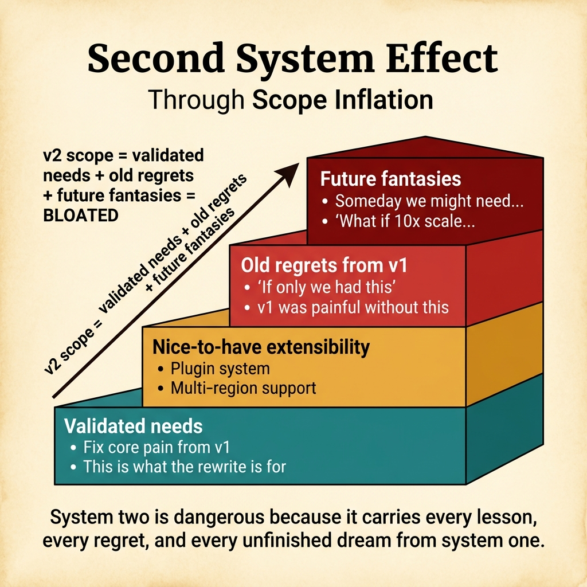
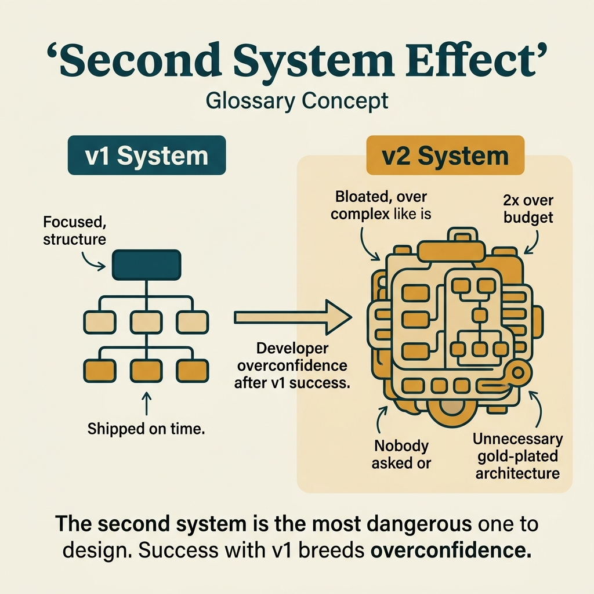

<!-- tags: glossary, reference, developer-cognition-team-dynamics, decision-making-trade-offs, second-system-effect -->
# Second System Effect

> The tendency to over-engineer the "second system" because the designer wants to fix everything they regretted about the first.

| Aspect | Detail |
| --- | --- |
| **Concept** | The tendency to over-engineer the "second system" because the designer wants to fix everything they regretted about the first. |
| **Audience** | Architect, tech lead, senior developer |
| **Primary style** | Glossary term |
| **Entry point** | Use when a rewrite or second-generation system is growing faster than actual needs because the team wants to "do it right this time." |

📅 Created: 2026-03-30 · 🔄 Updated: 2026-04-04 · ⏱️ 10 min read

---

## 1. DEFINE

Picture this: the first system was a bit simple, lacked abstractions, and was full of workarounds. When beginning the second system, the team vows to fix everything — plugin system, multi-tenant, event replay, policy engine, advanced metrics, config DSL. The result is that system two carries on its back every regret from system one, far larger than current needs demand. That is the second system effect.

**Second System Effect** is the tendency to over-engineer the "second system" because the designer wants to fix everything they regretted about the first.

| Variant | Description |
| --- | --- |
| Rewrite inflation | The new rewrite absorbs far more ambition than validated need supports. |
| Platform overreach | The next-generation platform adds extensibility too early. |
| Reactionary architecture | The new design primarily reacts to old pain instead of addressing current problems. |

| Approach | Time | Space | When to choose |
| --- | --- | --- | --- |
| Separate validated needs from old regrets | O(n design reviews) | O(decision notes) | When the rewrite is absorbing too many "would be nice to have." |
| Ship minimum credible second system | O(n milestones) | O(scope doc) | When you need to control ambition and time-to-value. |
| Re-introduce complexity only with evidence | O(n follow-ups) | O(backlog) | When advanced features have no real user or runtime signal yet. |

Core insight:

> The second system is dangerous because it does not just build for the present — it also tries to carry every lesson, every regret, and every unfinished engineering dream. If you do not separate validated needs from emotional reactions to the old system, complexity will explode.

### 1.1 Invariants & Failure Modes

The invariant is that every new capability in system two must answer "which current, proven need does this serve?" When the only answer is "we suffered from lacking this in the old system," the risk of over-design grows sharply.

---

## 2. CONTEXT

**Who uses it**: Architect, tech lead, senior developer

**When**: Use when a rewrite or second-generation system is growing faster than actual needs because the team wants to "do it right this time."

**Purpose**: The second system is dangerous because it does not just build for the present — it also tries to carry every lesson, every regret, and every unfinished engineering dream. If you do not separate validated needs from emotional reactions to the old system, complexity will explode.

**In the ecosystem**:
- Not every second system is bad; the issue is ambition growing faster than evidence.
- The second system effect commonly appears in rewrites, platformization, and "v2 from scratch."
- This is a bias in design decision-making, not just scope management.

---

A bloated v2 rewrite is clear. But how do you recognize the second system effect, how do you prevent it, and when is v2 actually necessary?

## 3. EXAMPLES

The second system effect surfaces most visibly when a v2 rewrite adds every feature v1 lacked plus dreamed features, when v2 scope triples and the deadline slips by 2x, or when v2 launches but users prefer v1 because it is simpler. The examples below place the pattern into exactly those situations.

### Example 1: Basic — Rewrite scope contains too many "would be nice"

A v2 proposal lists plugin system, rule engine, audit stream, and multi-region from day one, even though v1 has only proven the need for two of those. At the basic level, you need to split scope into validated needs and optional ambitions.

The input is a v2 feature list. The output is a table separating "must-have now" from "nice-to-have later." Complexity is low because it is scope clarification.



*Figure: System two carries every lesson, every regret, and every unfinished dream from system one.*

```go
type V2ScopeItem struct {
	Capability   string
	ValidatedNow bool
}
```

**Why?** The second system effect ignites when every good idea is treated as "should do it this time." An explicit scope split exposes items that have no evidence beyond intuition or regret.

**Takeaway**: You cool down initial ambition with evidence instead of fear of over-engineering.
**Caveat**: Do not be extreme about eliminating all extensibility; some minimal hooks are worth investing in if they are cheap and certain to be needed.
**Use when**: the v2 proposal looks very appealing but scope is growing faster than the problem statement.

### Example 2: Intermediate — Design the minimum credible second system

The team knows the rewrite is necessary, but without defining "good enough," v2 will keep expanding. At the intermediate level, you need to define the minimum credible system: enough to solve v1's core pain but not yet encompassing every future edge case.

The input is a rewrite that has been approved in principle. The output is a first milestone sufficient to prove the new architecture has value. Complexity is moderate because you must cut ambition while maintaining the team's confidence.

```go
type RewriteMilestone struct {
	CoreUseCase string
	OutOfScope  []string
}
```

**Why?** The first milestone determines whether the team will learn from the new system or drown building scaffolding for needs that have not arrived. A minimum credible system keeps the learning loop short so v2 does not die before reaching users.

**Takeaway**: You give system two its chance to prove value early, rather than demanding perfection from the start.
**Caveat**: Cutting scope so deeply that you miss v1's core pain makes the rewrite pointless.
**Use when**: the team has decided to build v2 but has not settled which milestone is enough to start learning.

### Example 3: Advanced — Only re-introduce complexity when evidence exists

A platform v2 has no second client yet but already wants to build a plugin DSL so "future changes do not touch core." At the advanced level, the key principle is that complexity should only be re-introduced when evidence is strong enough — not just because a possible future might call for it.

The input is an advanced capability proposed for v2. The output is a clear gate on evidence before adding it to the system. Complexity is high because it involves design governance.

```go
type ComplexityGate struct {
	RealConsumerExists  bool
	CurrentPainMeasured bool
	CanDeferSafely      bool
}
```

**Why?** System two often self-justifies with hypothetical futures. A complexity gate forces the team back to the present: does a real consumer exist, is the current pain significant enough, would deferring actually be dangerous?

**Takeaway**: You do not ban sophistication; you require sophistication to have evidence before entering the new system.
**Caveat**: If the gate becomes heavy bureaucracy, the team will bypass even good decisions.
**Use when**: an advanced feature is proposed primarily because "we'll probably need it later."

### Example 4: Expert — Learn from v1 without letting v1 control v2

Painful experience from system one is a real asset, but if every v2 decision is a reflex to avoid old pain, the team will design for the past more than the present. At the expert level, you need a mechanism to convert v1 pain into principles, not into reactions.

The input is a list of regrets from system one. The output is a short, stable set of design principles that are less emotional. Complexity is high because it touches how the team learns from experience.

```go
type DesignPrinciple struct {
	Principle string
	FromPain  string
}
```

**Why?** Raw regret easily triggers overreaction. In contrast, a principle abstracted just enough helps the team learn the right lesson without carrying the raw emotional pain into every v2 decision.

**Takeaway**: You transform uncomfortable memories of v1 into reusable design principles that do not bloat scope.
**Caveat**: Principles that are too generic become useless; they need to be specific enough to guide real decisions.
**Use when**: the team keeps citing "v1 was really painful" to justify many capabilities without evidence.

---

## 4. COMPARE




*Figure: Position of second system effect among scope creep, technical debt, and rewrite decisions.*

Second system effect sounds like scope creep. Close — but the second system effect is specific to rewrites: overconfidence from v1 success + suppressed desires from v1 constraints = bloated v2. Scope creep happens on any project; second system effect happens on rewrites.

### Level 1

```text
system 1 pain
  -> desire to fix everything
  -> system 2 scope expands
  -> delivery slows before value appears
```

*Figure: Level 1 shows the second system effect is an overreaction to old pain.*

### Level 2

```text
validated need
  + maybe-later extensibility
  + regrets from v1
  + future fantasies
  = bloated v2 scope
```

*Figure: Level 2 emphasizes that system two often bloats because validated needs are mixed with "if only we had this back then."*

### Easy to confuse or cross the boundary

| # | Severity | Mistake | Consequence | Fix |
| --- | --- | --- | --- | --- |
| 1 | 🔴 Fatal | Carrying every v1 regret into v2 scope | Rewrite bloats too fast | Separate validated needs from old regrets. |
| 2 | 🟡 Common | No first "good enough" milestone defined | V2 is slow to reach users | Design a minimum credible second system. |
| 3 | 🟡 Common | Adding extensibility because "we might need it later" | Complexity grows uncontrolled | Use an evidence gate for advanced capabilities. |
| 4 | 🔵 Minor | Learning from v1 through emotional reflex | Decision bias toward the past | Turn regrets into short, clear design principles. |

### Quick scan

| If you encounter | What to do |
| --- | --- |
| V2 proposal absorbs too many "nice to have" | Separate validated needs from ambitions. |
| Rewrite has no "good enough" milestone | Define the minimum credible system first. |
| Advanced feature justified only by a vague future | Use a complexity gate. |
| Team keeps citing v1 pain | Convert pain into design principles. |

---

## 5. REF

| Resource | Type | Link | Notes |
| --- | --- | --- | --- |
| The Mythical Man-Month | Book | https://en.wikipedia.org/wiki/The_Mythical_Man-Month | Where the second system effect was most famously described. |
| Premature Optimization | Related term | ./08-premature-optimization.md | Over-design and premature optimization often travel together. |
| ADR | Related term | /home/mvt/Repositories/Go/go-domain-driven-design/documents/assets/glosaries/architecture-design/ADR.md | Useful for keeping v2 decision log clear. |

---

## 6. RECOMMEND

Second system effect solves the problem of "v2 rewrite becomes a monster." The next question: how does sunk cost fallacy trap you in a failing project, and what about opportunity cost?

| Expand to | When | Why | File/Link |
| --- | --- | --- | --- |
| Premature Optimization | When v2 is adding sophistication too early | This is the closest bias at the implementation/system level. | [Premature Optimization](./08-premature-optimization.md) |
| Sunk Cost Fallacy | When the rewrite has grown so large the team cannot stop | These two biases often chain together in v2. | [Sunk Cost Fallacy](./06-sunk-cost-fallacy.md) |
| Decision Making & Trade-offs | When you need to return to the hub | Keep context of the full topic. | [Decision Making & Trade-offs](./README.md) |

Back to that v2 that tripled in scope from the beginning — every frustration from v1 poured into v2. Now you know: v2 needs stricter scope than v1, not broader. Rewrite for specific reasons, not to "do everything better." Constrain v2 harder than v1.

**Links**: [← Previous](./04-two-pizza-rule.md) · [→ Next](./06-sunk-cost-fallacy.md)
