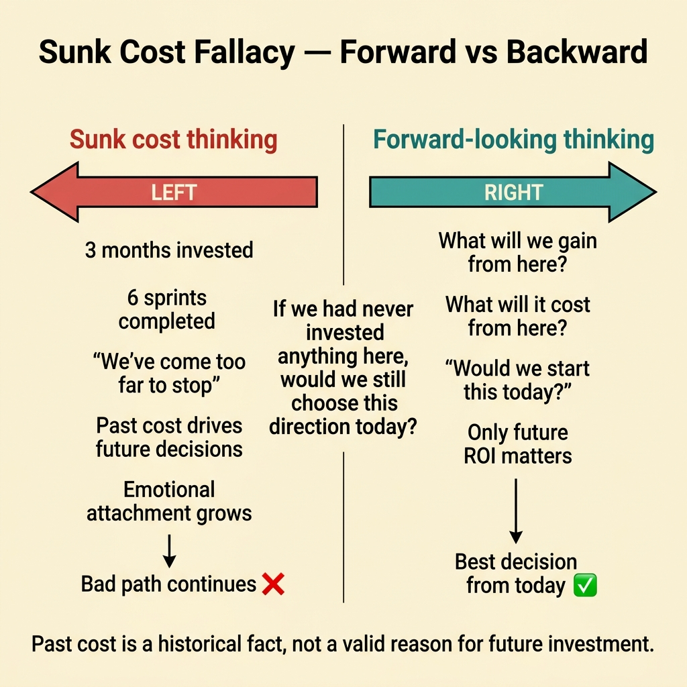
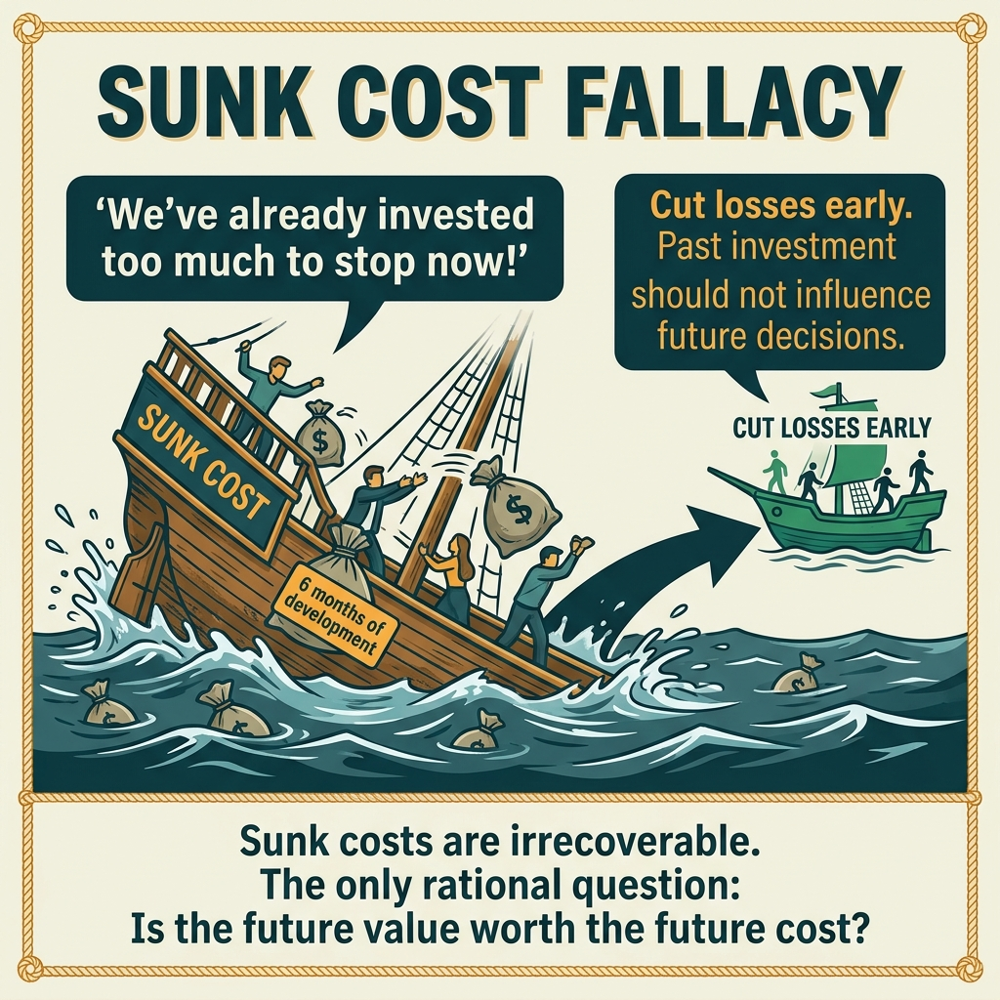

<!-- tags: glossary, reference, developer-cognition-team-dynamics, decision-making-trade-offs, sunk-cost-fallacy -->
# Sunk Cost Fallacy

> The cognitive trap of continuing to invest in a failing direction solely because too much effort has already been spent.

| Aspect | Detail |
| --- | --- |
| **Concept** | The cognitive trap of continuing to invest in a failing direction solely because too much effort has already been spent. |
| **Audience** | Tech lead, EM, architect |
| **Primary style** | Glossary term |
| **Entry point** | Use when the team knows a direction is underperforming but struggles to stop because "we've already come this far." |

📅 Created: 2026-03-30 · 🔄 Updated: 2026-04-04 · ⏱️ 9 min read

---

## 1. DEFINE

Picture a rewrite that has consumed three months. Benchmarks still do not meet targets, adoption is nonexistent, but every time someone proposes stopping, the answer is "it would be a waste to quit now." This reasoning sounds human, but it uses past cost as justification for the next decision. That is the sunk cost fallacy.

**Sunk Cost Fallacy** is the cognitive trap of continuing to invest in a failing direction solely because too much effort has already been spent.

| Variant | Description |
| --- | --- |
| Project continuation bias | Continuing a project only because of the large investment already made. |
| Refactor lock-in | Unable to roll back or stop a refactor because of effort already spent. |
| Migration inertia | Prolonging an ineffective migration because admitting it was wrong feels unacceptable. |

| Approach | Time | Space | When to choose |
| --- | --- | --- | --- |
| Evaluate only future cost/benefit | O(n reviews) | O(decision notes) | When past effort is dominating the team's thinking. |
| Define explicit kill criteria upfront | O(n initiatives) | O(1) | When starting a new project with significant risk. |
| Run stop-or-continue checkpoints | O(n milestones) | O(checkpoint notes) | When a project runs long and needs repeated re-evaluation. |

Core insight:

> Past cost is a historical fact, not a valid reason for future investment. The right decision must be based on future benefit and future cost, not on the feeling of regret over what has already been spent.

### 1.1 Invariants & Failure Modes

The invariant is that every checkpoint must answer "if we had never invested anything here, would we still choose this direction today?" When the answer is no but the team continues anyway, sunk cost is in control.

---

## 2. CONTEXT

**Who uses it**: Tech lead, EM, architect

**When**: Use when the team knows a direction is underperforming but struggles to stop because "we've already come this far."

**Purpose**: Past cost is a historical fact, not a valid reason for future investment. The right decision must be based on future benefit and future cost, not on regret over what has already been spent.

**In the ecosystem**:
- Not every decision to "keep going" is a fallacy; sometimes the short-term horizon is not enough to judge.
- The fallacy appears when the primary argument is "we've invested too much to stop."
- This is a psychological bias in decision governance, not just a financial error.

---

"Already invested so must continue" is clear. But how do you recognize sunk cost in practice, where does the courage to stop come from, and how do team dynamics play out when killing a project?

## 3. EXAMPLES

Sunk cost fallacy surfaces most visibly when "we've coded for six months so we must ship even though we know it's wrong," when a framework migration is stuck but "we've already migrated 60%," or when killing a project makes the team feel like wasted effort. The examples below place the pattern into exactly those situations.

### Example 1: Basic — Stop arguing "we've already done so much"

A continuation proposal begins by listing the number of sprints already poured into the project. At the basic level, the first step is reframing the discussion: past cost is acknowledged, but it is no longer a decision parameter.

The input is a decision memo dominated by past effort. The output is a review frame that only looks at cost and benefit from today forward. Complexity is low because it is mostly about changing how the question is framed.

```go
type ContinueDecision struct {
	FutureBenefitClear   bool
	FutureCostAcceptable bool
}
```

**Why?** Sunk cost is powerful because it mixes the emotion of regret into reasoning. A forward-only frame forces the team to separate historical pain from the logic of the next choice.

**Takeaway**: You peel past cost off the decision scale.
**Caveat**: Ignoring sunk cost does not mean ignoring the lessons from it; retrospectives are still essential.
**Use when**: the strongest reason to continue a project is "we've already done too much."

### Example 2: Intermediate — Establish kill criteria before the project starts

Teams usually only think about stopping when they are already deeply committed. At the intermediate level, one of the best ways to fight sunk cost is to define kill criteria before emotional attachment is strong.

The input is a new initiative with significant uncertainty. The output is explicit conditions to stop, pivot, or continue. Complexity is moderate because it requires upfront discipline.



*Figure: Past cost is a historical fact, not a valid reason for future investment.*

```go
type KillCriteria struct {
	AdoptionThresholdMet bool
	LatencyGoalMet       bool
	OpsCostAcceptable    bool
}
```

**Why?** Kill criteria written at the beginning have the advantage of not being distorted by the "already invested too much" effect. They create an external standard for the team to return to when emotions start interfering.

**Takeaway**: You guard against sunk cost in advance with a decision contract with yourself.
**Caveat**: Kill criteria that are too vague will not help when the project hits trouble.
**Use when**: starting a rewrite, migration, platform initiative, or any high-uncertainty project.

### Example 3: Advanced — Stop-or-continue checkpoints for long-running projects

A migration stretching across multiple quarters accumulates sunk cost without anyone noticing. Without explicit checkpoints, the default will always be to continue. At the advanced level, the team needs milestones where continuation must be re-justified from scratch.

The input is a long-running project with accumulating sunk cost. The output is a cadence of checkpoint reviews that force forward-looking re-evaluation. Complexity is high because it ties to roadmap governance.

```go
type CheckpointReview struct {
	WouldStartToday bool
	BestNextMove    string
}
```

**Why?** Default inertia is sunk cost's strongest ally. A checkpoint review breaks that inertia with a hard but clean question: if we were starting from zero today, would we still choose this path?

**Takeaway**: You create intentional moments to break the momentum of unconditional continuation.
**Caveat**: Checkpoints are only useful if leadership genuinely accepts the possibility of "stop."
**Use when**: a project spans many milestones, each accumulating more cost and attachment.

### Example 4: Expert — Build a culture where stopping is not personal failure

Many teams continue down a bad path not because they do not know it is bad, but because stopping is interpreted as admitting they chose wrong. At the expert level, fighting sunk cost means building an environment where "cutting losses" is seen as leadership capability, not as losing face.

The input is an organization with political or emotional bias around project cancellation. The output is language and rituals that make stop/pivot decisions safer. Complexity is high because it touches organizational psychology.

```go
type LearningReview struct {
	DecisionReversed  bool
	LearningsCaptured bool
	BlameAttached     bool
}
```

**Why?** If stopping a project always means "someone was wrong," the team will keep pouring money into a bad path to avoid social damage. A culture that does not punish cutting losses helps reasoning return to reality instead of ego defense.

**Takeaway**: You reduce sunk cost at the organizational level by separating learning from blame.
**Caveat**: No blame is not the same as no accountability; a learning review must still explain why the previous decision failed.
**Use when**: the team or leadership knows a direction should be stopped but nobody dares say it.

---

## 4. COMPARE




*Figure: Position of sunk cost among opportunity cost, decision making, and project management.*

Sunk cost sounds like risk assessment. Different: sunk cost is backward-looking ("how much did we spend?"), while correct thinking is forward-looking ("what will we gain or lose by continuing?"). Sunk cost should not influence future decisions, but human bias makes it.

### Level 1

```text
past investment increases
  -> emotional attachment grows
  -> objective reassessment weakens
  -> bad path continues
```

*Figure: Level 1 shows sunk cost is letting the past force the present decision.*

### Level 2

```text
bad logic
  spent 3 months -> must continue

healthy logic
  from today forward:
    does more investment still make sense?
```

*Figure: Level 2 emphasizes the right question always looks forward, not backward at past regret.*

### Easy to confuse or cross the boundary

| # | Severity | Mistake | Consequence | Fix |
| --- | --- | --- | --- | --- |
| 1 | 🔴 Fatal | Using past effort as the reason to continue | Bad project keeps consuming more resources | Re-evaluate using only future cost/benefit. |
| 2 | 🟡 Common | No kill criteria from the start | Default is always "continue" | Write stop/pivot conditions upfront. |
| 3 | 🟡 Common | Checkpoint only reports progress, does not re-decide | Inertia is never broken | Add the question "would we start this today?" |
| 4 | 🔵 Minor | Stopping a project is seen as personal failure | Nobody dares cut losses | Design learning reviews without blame. |

### Quick scan

| If you encounter | What to do |
| --- | --- |
| Strongest reason to continue is "already invested a lot" | Switch to future cost/benefit framing. |
| New project with high uncertainty | Set kill criteria from day one. |
| Long-running migration hard to stop | Add checkpoints with "would we start this today?" |
| Nobody dares say "stop" | Use blame-free learning reviews. |

---

## 5. REF

| Resource | Type | Link | Notes |
| --- | --- | --- | --- |
| Sunk cost | Reference | https://en.wikipedia.org/wiki/Sunk_cost | Economics/behavioral science foundation. |
| Thinking, Fast and Slow | Book | https://en.wikipedia.org/wiki/Thinking,_Fast_and_Slow | Useful on decision-making biases. |
| Opportunity Cost | Related term | ./07-opportunity-cost.md | Continuing a bad path always means missing another path. |

---

## 6. RECOMMEND

Sunk cost fallacy solves the problem of "continuing a project because of investment, not because it is right." The next question: how do you evaluate opportunity cost, and what about premature optimization?

| Expand to | When | Why | File/Link |
| --- | --- | --- | --- |
| Opportunity Cost | When you want to see the price of not stopping | Every minute continuing is a resource not spent on another option. | [Opportunity Cost](./07-opportunity-cost.md) |
| Second System Effect | When sunk cost comes from a bloated rewrite or v2 | These two biases often chain together. | [Second System Effect](./05-second-system-effect.md) |
| Decision Making & Trade-offs | When you need to return to the hub | Keep context of the full branch. | [Decision Making & Trade-offs](./README.md) |

Back to that "we've been coding for six months" from the beginning — sunk cost. Now you know: the question is not "how much did we invest?" but "if we started fresh today, would we still do this?" No? Stop. Past investment is gone regardless.

**Links**: [← Previous](./05-second-system-effect.md) · [→ Next](./07-opportunity-cost.md)
