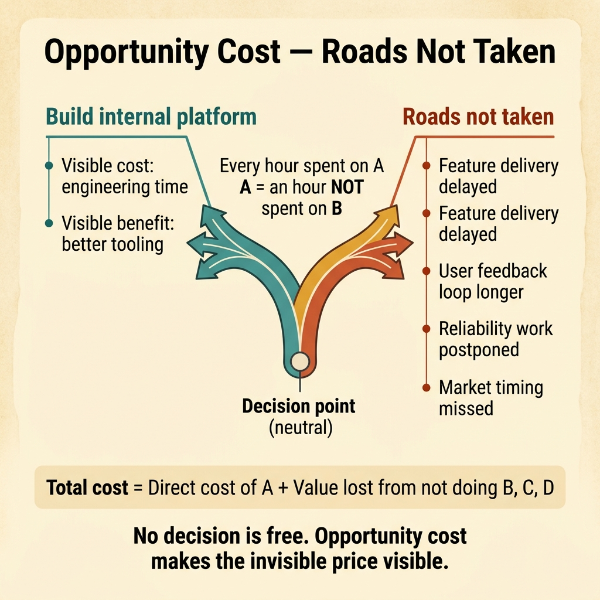
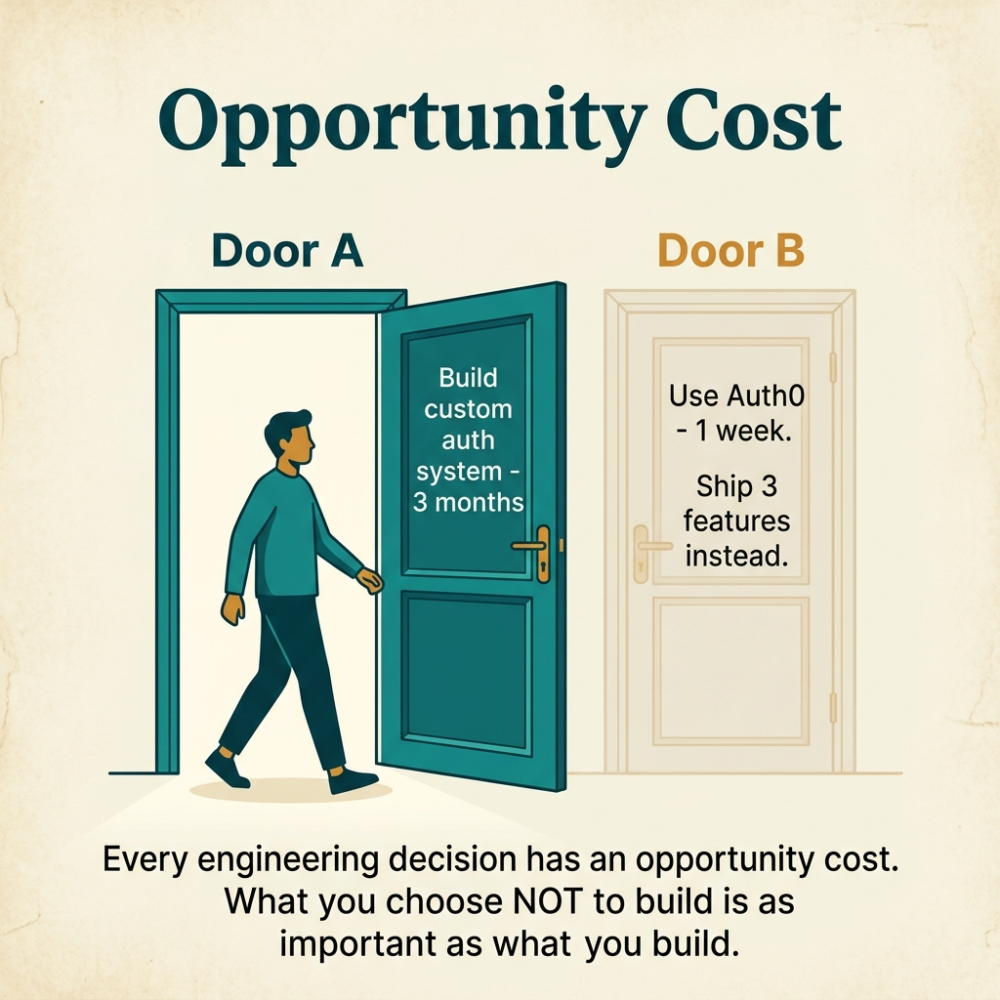

<!-- tags: glossary, reference, developer-cognition-team-dynamics, decision-making-trade-offs, opportunity-cost -->
# Opportunity Cost

> The value of the option forgone when the team decides to spend time and resources on a different direction.

| Aspect | Detail |
| --- | --- |
| **Concept** | The value of the option forgone when the team decides to spend time and resources on a different direction. |
| **Audience** | Product lead, tech lead, engineering manager |
| **Primary style** | Glossary term |
| **Entry point** | Use when the team debates investing in one direction but forgets that "not doing the other thing" is also an expensive decision. |

📅 Created: 2026-03-30 · 🔄 Updated: 2026-04-04 · ⏱️ 9 min read

---

## 1. DEFINE

Picture a team that decides to spend an entire quarter building a new internal framework. That decision might be good or not, but what is usually forgotten is: that quarter is also when onboarding is still slow, a critical query remains untouched, and a revenue feature is sitting in the backlog. Opportunity cost is the value of those roads left behind.

**Opportunity Cost** is the value of the option forgone when the team decides to spend time and resources on a different direction.

| Variant | Description |
| --- | --- |
| Delivery opportunity cost | Slower feature shipping or bug fixing due to investing in another direction. |
| Learning opportunity cost | Missing the chance to learn from users because internal optimization takes too long. |
| Focus opportunity cost | Attention locked into one initiative, causing other needs to fade from view. |

| Approach | Time | Space | When to choose |
| --- | --- | --- | --- |
| List explicit alternatives before choosing | O(n options) | O(decision notes) | When the team is leaning toward one option too quickly. |
| Quantify what is being deferred | O(n backlog slices) | O(roadmap notes) | When you need to see the price of the current decision. |
| Revisit cost as context changes | O(n checkpoints) | O(review notes) | When the original decision stretches on and the environment has shifted. |

Core insight:

> No decision is "free" just because the team is not spending extra money right now. Every hour, every sprint, every engineer-week put into direction A means it cannot go into direction B. Opportunity cost makes that invisible price visible.

### 1.1 Invariants & Failure Modes

The invariant is that before a major decision, the team must know which options they are giving up. When only the upside of the preferred option is visible and the downside of abandoned options stays hidden, decision quality drops sharply.

---

## 2. CONTEXT

**Who uses it**: Product lead, tech lead, engineering manager

**When**: Use when the team debates investing in one direction but forgets that "not doing the other thing" is also an expensive decision.

**Purpose**: No decision is "free" just because the team is not spending extra money right now. Every hour, every sprint, every engineer-week put into direction A means it cannot go into direction B. Opportunity cost makes that invisible price visible.

**In the ecosystem**:
- Opportunity cost does not need to be calculated with absolute precision to be useful.
- This is not just a financial concept; it applies to attention, learning time, release windows, and user trust.
- Ignoring opportunity cost often leads to over-investment in attractive internal projects that are far from outcomes.

---

Opportunity cost is clear. But how do you evaluate it, what about technical opportunity cost, and how does team capacity factor in?

## 3. EXAMPLES

Opportunity cost surfaces most visibly when a team spends three months building an internal tool instead of using SaaS, when optimizing a function by 5ms instead of building a new feature, or when choosing a tech stack without considering alternatives. The examples below place the pattern into exactly those situations.

### Example 1: Basic — Before choosing, name the options being abandoned

A proposal sounds very appealing so the whole team wants to commit quickly. At the basic level, opportunity cost starts with a very simple question: if we do this, specifically what will have to be pushed back?

The input is a preferred option. The output is an explicit list of things being deferred by choosing it. Complexity is low because it is mostly reframing.

```go
type TradeOffView struct {
	ChosenOption    string
	DeferredOptions []string
}
```

**Why?** People are very good at seeing the value of what they like, but easily forget the price of what they must give up. Naming the deferred options makes opportunity cost harder to ignore.

**Takeaway**: You make the decision less blind by forcing the "not doing" part into the light.
**Caveat**: A defer list that is too long but vague is insufficient; you need genuinely competing alternatives.
**Use when**: a proposal is getting strong support but the trade-off is barely discussed.

### Example 2: Intermediate — Compare framework work with feature work fairly

A platform initiative may be correct long-term, but without comparing it to the feature work being deferred, the team will evaluate unevenly. At the intermediate level, opportunity cost helps place two investment directions on the same table.

The input is a choice between internal improvement and outward delivery. The output is a comparison table that clearly shows the value being delayed on each side. Complexity is moderate because it requires seeing both technical and product impact.



*Figure: No decision is free. Opportunity cost makes the invisible price visible.*

```go
type RoadmapChoice struct {
	Option        string
	ValueNow      string
	ValueDeferred string
}
```

**Why?** Many internal initiatives look "free" because there is no immediate customer-facing backlash. But their cost often lies in delayed feature learning, longer feedback loops, and missed market timing.

**Takeaway**: You see the price of choosing internal work, not just its technical benefit.
**Caveat**: Feature work does not always win; reliability and platform work also has opportunity cost if not done.
**Use when**: the team is weighing between infrastructure investment and shipping outcomes for users.

### Example 3: Advanced — Re-evaluate opportunity cost when context has changed

A project that was reasonable three months ago may no longer be reasonable today if customer priorities have shifted or the market has changed. At the advanced level, opportunity cost must be recalculated against the new context, not forever anchored to the old snapshot.

The input is an initiative stretching across multiple milestones. The output is a checkpoint that re-evaluates the cost of continuing versus pivoting. Complexity is high because it involves dynamic prioritization.

```go
type RecheckDecision struct {
	ContextChanged   bool
	BestUseOfTeamNow string
}
```

**Why?** Opportunity cost is a living variable that changes over time. A decision that was right in Q1 can become very expensive in Q2 if the neglected options have changed in relative value.

**Takeaway**: You keep the decision current instead of letting it stay anchored to an outdated context.
**Caveat**: Re-evaluating too constantly can also cause the team to thrash and never finish anything.
**Use when**: a long-running initiative continues mainly by inertia rather than because of the current context.

### Example 4: Expert — Opportunity cost must appear in leadership review language

Many organizations are very good at talking about the ROI of what they are doing, but rarely articulate what is being sacrificed to do it. At the expert level, opportunity cost needs to become a default question in every major proposal.

The input is a roadmap or architecture proposal at the team/org level. The output is a review template that mandates stating "what are we not doing because of this?" Complexity is high because it requires changing leadership decision language.

```go
type ProposalReview struct {
	MainBet                string
	NotDoingBecauseOfThis []string
}
```

**Why?** What is not asked usually goes unseen. When opportunity cost becomes a required field in the review template, the team is forced to see both the upside and the sacrifice of every decision.

**Takeaway**: You turn opportunity cost from a side insight into a mandatory part of decision hygiene.
**Caveat**: If every proposal requires heavy quantification, the review becomes bureaucracy; keep it at a useful level.
**Use when**: the organization frequently commits to large bets and only later realizes it missed other important work.

---

## 4. COMPARE




*Figure: Position of opportunity cost among sunk cost, ROI analysis, and prioritization.*

Opportunity cost sounds like budget constraint. Different: budget constraint means "not enough money," opportunity cost means "money spent on A means losing the chance for B." Every decision carries opportunity cost, even when the budget is unlimited.

### Level 1

```text
choose A
  -> cannot fully pursue B and C
  -> hidden cost lives in omitted alternatives
```

*Figure: Level 1 shows opportunity cost lives in the roads not taken, not inside the option chosen.*

### Level 2

```text
invest in internal platform
  cost visible: engineering time
  cost hidden:
    - slower feature delivery
    - delayed user feedback
    - postponed reliability work
```

*Figure: Level 2 emphasizes the biggest cost is often the invisible cost of things that can no longer be done.*

### Easy to confuse or cross the boundary

| # | Severity | Mistake | Consequence | Fix |
| --- | --- | --- | --- | --- |
| 1 | 🔴 Fatal | Only seeing the upside of the preferred option | Real trade-off is hidden | Mandate listing deferred alternatives. |
| 2 | 🟡 Common | Treating internal work as "free" | Feature learning and delivery are silently delayed | Compare fairly with deferred work. |
| 3 | 🟡 Common | Not re-evaluating when context has changed | A good old decision becomes an expensive new one | Add checkpoints based on context. |
| 4 | 🔵 Minor | Opportunity cost is only mentioned verbally | Proposals easily skip the sacrifice section | Include it in the review template. |

### Quick scan

| If you encounter | What to do |
| --- | --- |
| Proposal only talks about upside | Mandate listing deferred alternatives. |
| Platform work seems "obviously right" | Compare with feature/reliability work being deferred. |
| Initiative stretches into a new context | Re-evaluate opportunity cost against the current environment. |
| Roadmap review says nothing about sacrifice | Add a required field in the template. |

---

## 5. REF

| Resource | Type | Link | Notes |
| --- | --- | --- | --- |
| Opportunity cost | Reference | https://en.wikipedia.org/wiki/Opportunity_cost | Economics foundation for this term. |
| Essentialism | Book | https://gregmckeown.com/books/essentialism/ | Useful for choosing what matters most. |
| Bikeshedding | Related term | ./01-bikeshedding.md | Bikeshedding is a way of burning opportunity cost through misallocated attention. |

---

## 6. RECOMMEND

Opportunity cost solves the problem of "choosing A means losing what at B." The next question: what does premature optimization waste, and what does bikeshedding waste?

| Expand to | When | Why | File/Link |
| --- | --- | --- | --- |
| Bikeshedding | When attention is consumed by small things | Opportunity cost here is the big question being skipped. | [Bikeshedding](./01-bikeshedding.md) |
| Sunk Cost Fallacy | When the team sticks with an old choice too long | That is when opportunity cost grows the most. | [Sunk Cost Fallacy](./06-sunk-cost-fallacy.md) |
| Decision Making & Trade-offs | When you need to return to the hub | Keep context of the full branch. | [Decision Making & Trade-offs](./README.md) |

Back to that three-month internal tool from the beginning — SaaS at $500/month, 3 devs × 3 months = $150k+ in opportunity cost. Now you know: always ask "what else could we do with this time/money?" Build vs buy = compare opportunity costs, not just direct costs.

**Links**: [← Previous](./06-sunk-cost-fallacy.md) · [→ Next](./08-premature-optimization.md)
