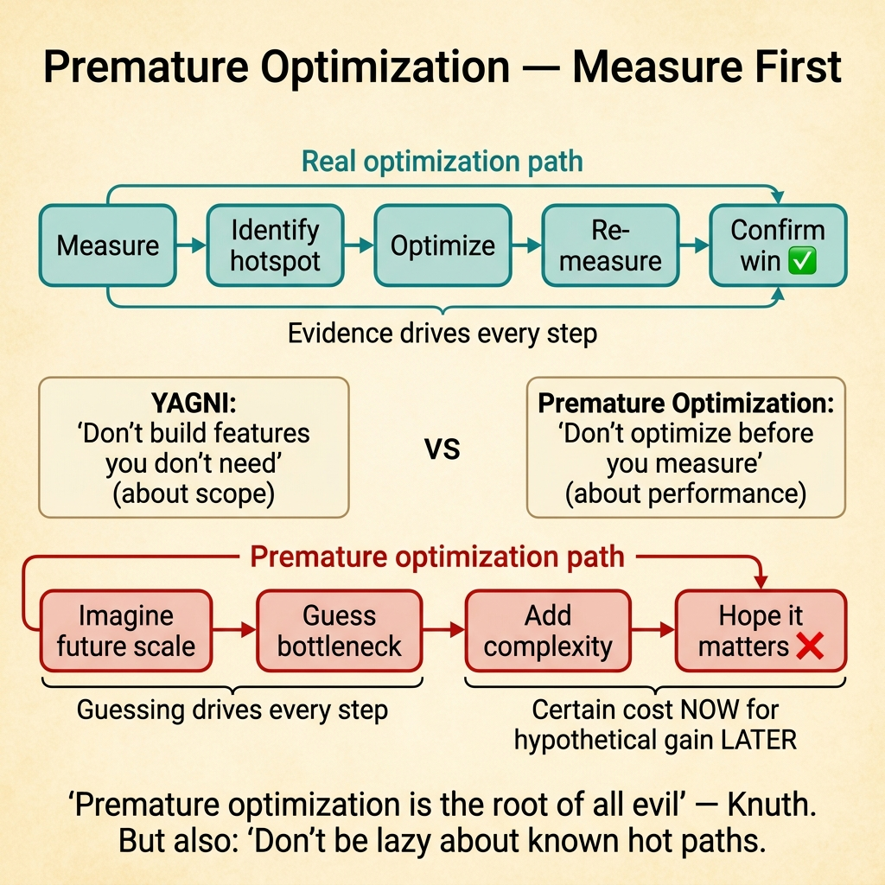
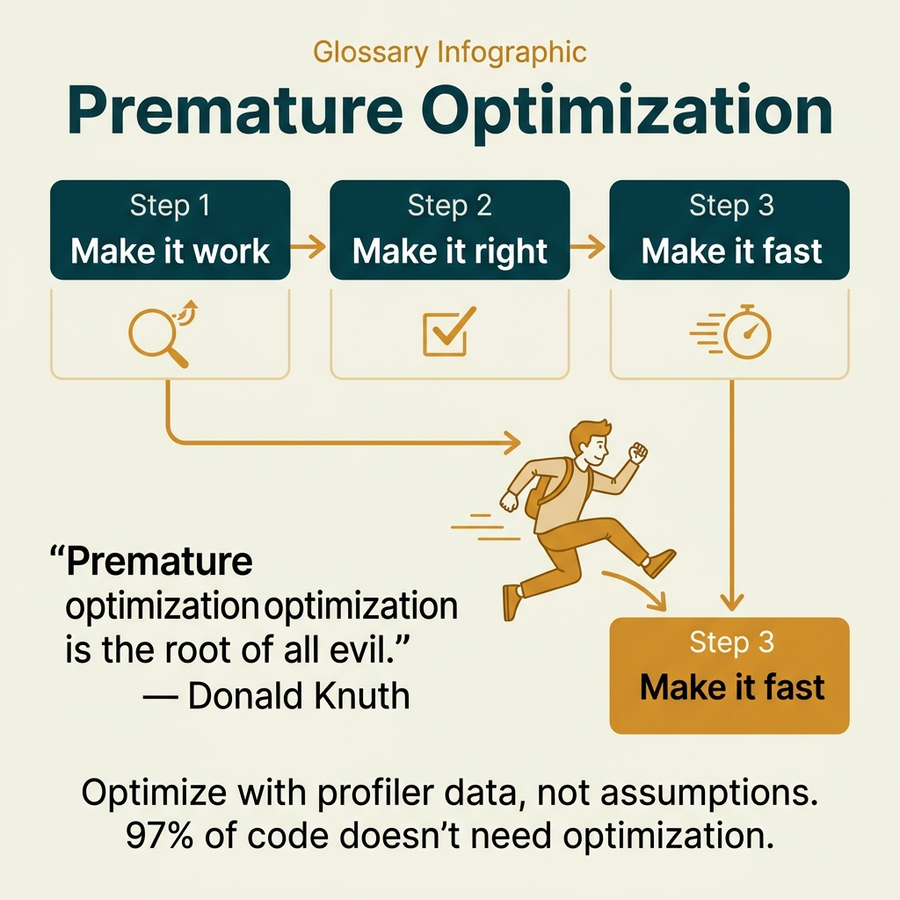

<!-- tags: glossary, reference, developer-cognition-team-dynamics, decision-making-trade-offs, premature-optimization -->
# Premature Optimization

> Optimizing too early before there is data proving the target is actually a bottleneck worth addressing.

| Aspect | Detail |
| --- | --- |
| **Concept** | Optimizing too early before there is data proving the target is actually a bottleneck worth addressing. |
| **Audience** | Developer, performance-minded engineer, tech lead |
| **Primary style** | Glossary term |
| **Entry point** | Use when the team wants to add complexity to "make it faster" but has no evidence that the target is actually slow or expensive. |

📅 Created: 2026-03-30 · 🔄 Updated: 2026-04-04 · ⏱️ 10 min read

---

## 1. DEFINE

Picture an endpoint that just shipped with low traffic, but the team already wants to replace a simple list query with multi-layer caching, connection pool tuning, and async fan-out because "we'll need it eventually." The problem is not that optimization is bad; the problem is that complexity is being added before the real bottleneck has been seen. That is premature optimization.

**Premature Optimization** is optimizing too early before there is data proving the target is actually a bottleneck worth addressing.

| Variant | Description |
| --- | --- |
| Performance overdesign | Adding optimization structures before there is load evidence. |
| Scalability theater | Building scale capability far beyond current need just out of fear of the future. |
| Micro-optimization distraction | Focusing on nanoseconds while the real bottleneck is in network, I/O, or product flow. |

| Approach | Time | Space | When to choose |
| --- | --- | --- | --- |
| Measure before optimizing | O(n benchmarks) | O(metrics/trace data) | When the team suspects a bottleneck but has no evidence. |
| Optimize highest-cost path only | O(n hot paths) | O(profile notes) | When there are many "could be improved" spots but budget is limited. |
| Pay complexity only after proof | O(n reviews) | O(decision notes) | When an optimization carries long-term maintenance cost. |

Core insight:

> Premature optimization is dangerous not because it is "morally wrong," but because it trades simplicity for complexity before knowing whether that trade-off is needed. When proof is absent, new complexity is usually just expensive guessing.

### 1.1 Invariants & Failure Modes

The invariant is that every major optimization must answer "which bottleneck is being proven, and is the complexity cost justified yet?" If the answer relies mainly on future assumptions, the risk of over-design grows sharply.

---

## 2. CONTEXT

**Who uses it**: Developer, performance-minded engineer, tech lead

**When**: Use when the team wants to add complexity to "make it faster" but has no evidence that the target is actually slow or expensive.

**Purpose**: Premature optimization is dangerous not because it is "morally wrong," but because it trades simplicity for complexity before knowing whether that trade-off is needed. When proof is absent, new complexity is usually just expensive guessing.

**In the ecosystem**:
- Not all preparation for scale is premature optimization; some cheap and obvious guardrails are still worth having.
- The term is most powerful when optimization pulls in significant abstraction, caching, concurrency, or infrastructure complexity.
- This is a problem of evidence and prioritization, not just performance engineering.

---

Optimizing too early is clear. But when is it premature, when is it necessary early investment, and how do you measure before optimizing?

## 3. EXAMPLES

Premature optimization surfaces most visibly when a developer spends two days optimizing a function that runs 10 times per day, when benchmarking micro while the bottleneck is a DB query, or when building custom data structures instead of using the standard library. The examples below place the pattern into exactly those situations.

### Example 1: Basic — Something "feels slow" but nothing has been measured

A handler "seems slow," so the team plans to add caching immediately. At the basic level, the right first step is to measure latency and the breakdown of that path before touching architecture.

The input is a feeling of a bottleneck. The output is a measurement baseline sufficient to know whether the problem is real. Complexity is low because it is just the measurement step.

```go
type LatencySample struct {
	Path string
	P95  time.Duration
}
```

**Why?** The feeling of "slow" is easily fooled by a single local test or by code that "looks heavy." A measurement baseline prevents the team from paying real complexity for an imaginary bottleneck.

**Takeaway**: You shift from guessing to observing before paying the cost of optimization.
**Caveat**: Bad measurements that do not reflect real traffic can also mislead; the baseline must be representative.
**Use when**: someone proposes optimization but the current evidence is only a feeling.

### Example 2: Intermediate — Only optimize the actual hot path, not everything "just in case"

A profile shows 80% of time is spent on an N+1 query, but the team is pouring effort into micro-optimizing JSON marshalling. At the intermediate level, premature optimization is avoided by sticking to the most expensive spot.

The input is a profile with many candidate improvements. The output is optimization priority based on the real hot path. Complexity is moderate because focus must be maintained against many tempting ideas.



*Figure: Measure first, optimize second. Evidence drives every step.*

```go
type HotPathDecision struct {
	Hotspot string
	WhyNow  string
}
```

**Why?** Optimization is only worthwhile when it cuts a genuinely large portion of the system's real cost. Polishing the cheap part while leaving the most expensive part untouched turns performance work into theater.

**Takeaway**: You keep optimization tied to the system's real cost distribution.
**Caveat**: Some small optimizations are worth doing if they are extremely cheap and improve readability, but they should not be called major performance wins.
**Use when**: the team has measurements but is scattering effort in the wrong places.

### Example 3: Advanced — An optimization carries long-term maintenance cost

To save a few dozen milliseconds, the team wants to add multi-tier caching with complex invalidation. This might be right, but at the advanced level, the optimization must be weighed alongside the operational and reasoning cost it creates.

The input is an optimization with architectural blast radius. The output is a decision record stating the trade-off between gain and complexity cost. Complexity is high because it involves long-term maintenance.

```go
type OptimizationTradeOff struct {
	ExpectedLatencyGain string
	AddedComplexity     string
	Reversibility       string
}
```

**Why?** Performance gains are not free; they are usually purchased with invalidation logic, concurrency issues, observability burden, or harder debugging. If the gain is not proven to be large enough, that complexity cost is too expensive.

**Takeaway**: You put maintenance cost on the same scale as performance gain before choosing to optimize.
**Caveat**: Not every complex optimization is wrong; some production bottlenecks genuinely justify the price.
**Use when**: the proposed optimization will add caching, async pipelines, sharding, or significant abstraction.

### Example 4: Expert — Build a "measure first" culture instead of worshipping cleverness

Some teams love solutions that look clever: lock-free, zero-copy, concurrent fan-out everywhere. If the culture rewards cleverness over evidence, premature optimization will recur continuously. At the expert level, the team's entire feedback loop needs to change.

The input is a team that habitually proposes optimizations by instinct. The output is a review norm that requires benchmarks, profiles, or production signals before approving major complexity. Complexity is high because it is an operating norm.

```go
type PerfReviewGate struct {
	HasMeasurement    bool
	HasBaseline       bool
	HasComplexityNote bool
}
```

**Why?** Culture determines default behavior. If the review default asks "where are the numbers?", the team learns to measure before optimizing. If the review default praises clever solutions, complexity will grow faster than real value.

**Takeaway**: You turn "measure first" into a team habit rather than just advice from a book.
**Caveat**: Do not make every small optimization a heavy procedure; the evidence bar should match the level of complexity being added.
**Use when**: the repo or review culture consistently rewards clever solutions before data exists.

---

## 4. COMPARE




*Figure: Position of premature optimization among performance profiling, YAGNI, and architecture decisions.*

Premature optimization sounds like YAGNI. Close — but YAGNI says "don't build features you don't need yet," premature optimization says "don't optimize before you measure." YAGNI is about scope; premature optimization is about performance.

### Level 1

```text
no measurement
  -> guess bottleneck
  -> add complexity
  -> system harder to change
```

*Figure: Level 1 shows premature optimization adds certain cost right now in exchange for still-hypothetical benefit.*

### Level 2

```text
real optimization path
  measure -> identify hotspot -> optimize -> remeasure

premature path
  imagine future scale -> optimize anyway -> hope it matters
```

*Figure: Level 2 emphasizes the core difference is whether there is a measurement loop or not.*

### Easy to confuse or cross the boundary

| # | Severity | Mistake | Consequence | Fix |
| --- | --- | --- | --- | --- |
| 1 | 🔴 Fatal | Optimizing before any measurement | Complexity increases while the real bottleneck remains | Start with baseline and profile. |
| 2 | 🟡 Common | Optimizing what "looks slow" instead of the hot path | Effort goes to the wrong place | Prioritize by real cost distribution. |
| 3 | 🟡 Common | Only seeing gain, forgetting maintenance cost | System becomes harder to understand and debug | Write a trade-off note for major optimizations. |
| 4 | 🔵 Minor | Rewarding cleverness over evidence | Premature optimization becomes culture | Add a performance review gate based on evidence. |

### Quick scan

| If you encounter | What to do |
| --- | --- |
| Feeling of bottleneck but nothing measured | Measure baseline first. |
| Many "could optimize" spots | Stick to the profiled hot path. |
| Optimization adds significant complexity | Write a trade-off note about gain vs maintenance cost. |
| Team loves clever solutions too early | Gate with measurement and baseline. |

---

## 5. REF

| Resource | Type | Link | Notes |
| --- | --- | --- | --- |
| Donald Knuth quote context | Reference | https://stackify.com/premature-optimization-evil/ | Helps understand the classic quote in proper context. |
| DORA Metrics | Related term | ./03-dora-metrics.md | Perf work should tie to delivery outcomes, not just micro wins. |
| Performance & Caching hub | Related topic | /home/mvt/Repositories/Go/go-domain-driven-design/documents/assets/glosaries/performance-caching/README.md | Expands into cache, pooling, N+1. |

---

## 6. RECOMMEND

Premature optimization solves the problem of "optimizing the wrong thing, wasting effort." The next question: how do DORA metrics measure overall delivery?

| Expand to | When | Why | File/Link |
| --- | --- | --- | --- |
| Performance & Caching | When you need to learn proper optimization patterns | This topic provides concrete patterns and trade-offs. | [Performance & Caching](/home/mvt/Repositories/Go/go-domain-driven-design/documents/assets/glosaries/performance-caching/README.md) |
| DORA Metrics | When you want to keep optimization tied to broader outcomes | Local performance should connect to delivery/system performance. | [DORA Metrics](./03-dora-metrics.md) |
| Second System Effect | When early optimization is becoming platform overdesign | These two failure modes easily chain together. | [Second System Effect](./05-second-system-effect.md) |

Back to that two-day optimization of a function running 10 times per day — 99% of time was elsewhere. Now you know: measure first, optimize second. Profile → identify bottleneck → optimize hot path. "Premature optimization is the root of all evil" — Knuth, but also "don't be lazy about known hot paths."

**Links**: [← Previous](./07-opportunity-cost.md) · [→ Next](./README.md)
