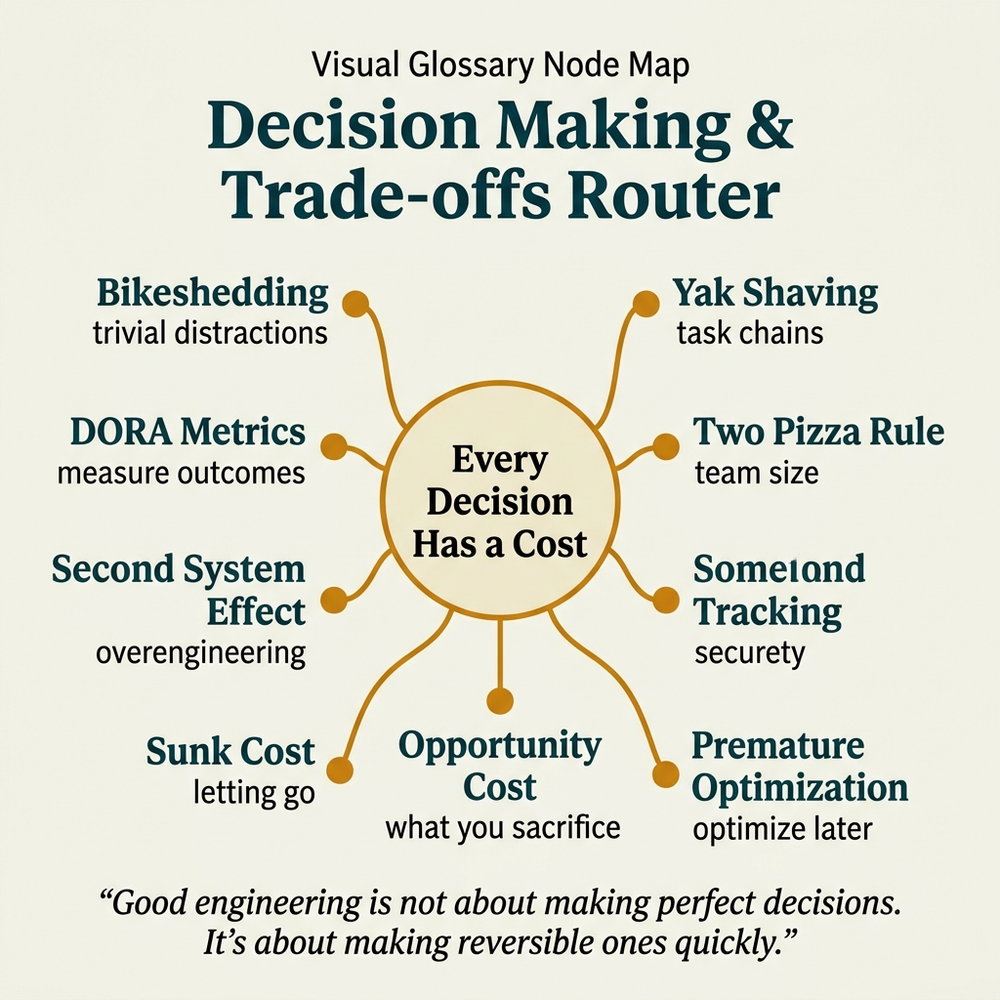

<!-- tags: glossary, reference, developer-cognition-team-dynamics, decision-making-trade-offs, overview -->
# Decision Making & Trade-offs

> A cluster of terms that names the common derailments in technical decision-making: bikeshedding, yak shaving, sunk cost, and misplaced optimization.

| Aspect | Detail |
| --- | --- |
| **Concept** | A cluster of terms that names the common derailments in technical decision-making: bikeshedding, yak shaving, sunk cost, and misplaced optimization. |
| **Audience** | Tech lead, reviewer, engineer making decisions under delivery pressure |
| **Primary style** | Glossary hub router |
| **Entry point** | Open when the problem is not a lack of information but the way the team is allocating attention and evaluating trade-offs. |

📅 Created: 2026-03-30 · 🔄 Updated: 2026-04-04 · ⏱️ 6 min read

---

## 1. DEFINE

There are meetings full of smart people that still produce bad decisions, because the team spends most of its energy on the secondary part and overlooks the part that truly determines the outcome. In those moments, what is needed is vocabulary for decision anti-patterns, not more technical facts. This README routes those symptoms into the right term so the team can examine how it chooses direction.

**Decision Making & Trade-offs** is a cluster of terms that names the common derailments in technical decision-making: bikeshedding, yak shaving, sunk cost, and misplaced optimization.

| Variant | Description |
| --- | --- |
| Attention traps | Bikeshedding and yak shaving identify moments when the team drifts away from high-value problems. |
| Measurement & prioritization | DORA metrics and opportunity cost help decisions start with feedback and the price of each choice. |
| Strategy failures | Second-system effect, sunk cost fallacy, and premature optimization name misalignments at the architecture/delivery level. |

| Approach | Time | Space | When to choose |
| --- | --- | --- | --- |
| Route by meeting symptom | O(1) route | O(1) | When the team debates heavily but cannot identify the root problem. |
| Route by cost of choice | O(1) route | O(1) | When decisions need to be seen as trade-offs rather than slogans. |
| Learn from trap to metric | O(1) route | O(1) | When moving from recognizing bias to building better feedback mechanisms. |

Core insight:

> Many bad technical decisions happen not because of lack of intelligence, but because the team has no language to recognize it is optimizing the wrong thing.

### 1.1 Signals & Boundaries

- Bikeshedding and yak shaving are terms about allocation of attention, not just meeting attitude.
- Opportunity cost reveals the price of "do it later" and "do more."
- Premature optimization and second-system effect belong to the strategy error group and need to be named early to cut scope.

### Coverage Map

| Entry | Role | Notes |
| --- | --- | --- |
| [Bikeshedding](01-bikeshedding.md) | Canonical term | Primary entry for this branch. |
| [Yak Shaving](02-yak-shaving.md) | Canonical term | Primary entry for this branch. |
| [DORA Metrics](03-dora-metrics.md) | Canonical term | Primary entry for this branch. |
| [Two-Pizza Rule](04-two-pizza-rule.md) | Canonical term | Primary entry for this branch. |
| [Second System Effect](05-second-system-effect.md) | Canonical term | Primary entry for this branch. |
| [Sunk Cost Fallacy](06-sunk-cost-fallacy.md) | Canonical term | Primary entry for this branch. |
| [Opportunity Cost](07-opportunity-cost.md) | Canonical term | Primary entry for this branch. |
| [Premature Optimization](08-premature-optimization.md) | Canonical term | Primary entry for this branch. |

---

## 2. VISUAL




*Figure: Router map prioritizes quick lane scanning, entry points, and boundaries before diving into detailed prose below.*

DEFINE has locked the main lanes. The visual below pulls that taxonomy into a map compact enough for the reader to know where to turn first.

### Level 1

```text
Attention traps
Measurement & prioritization
Strategy failures
```

*Figure: Level 1 splits this hub into the main decision lanes so the reader does not have to grope through a flat list of terms.*

### Level 2

```text
If the phenomenon is...                                        Open first
-----------------------------------------------------------    ------------------------------------------
Meeting gets stuck on small details, everyone has opinions     Bikeshedding
Team falls into side tasks to avoid the hard core problem      Yak Shaving
Need a framework to measure delivery impact, not argue by feel DORA Metrics
Want to stop the habit of optimizing too early                 Premature Optimization
```

*Figure: Level 2 turns the hub into a symptom router: start from the real question, then branch to the specific term.*

---

## 3. CODE

The diagram just separated this group by decision bias, opportunity cost, and common derailment types. From here, use the hub as a trade-off lens to understand which type of misalignment the team is stuck in.

### Problem 1: Basic — Route the right symptom to the right glossary entry

> **Goal**: Do not let every question about **Decision Making & Trade-offs** get thrown into the same bucket.
> **Approach**: Start from the symptom or question, then open the most fitting entry first.
> **Example**: The input is a review/design question; the output is the file to open first, like `./01-bikeshedding.md`.
> **Complexity**: Basic

```yaml
router:
  - symptom: Meeting gets stuck on small details, everyone has opinions
    open_first: ./01-bikeshedding.md
  - symptom: Team falls into side tasks to avoid the hard core problem
    open_first: ./02-yak-shaving.md
  - symptom: Need a framework to measure delivery impact instead of arguing by feel
    open_first: ./03-dora-metrics.md
  - symptom: Want to stop the habit of optimizing too early
    open_first: ./08-premature-optimization.md
```

**Why?** In decision-making, many phenomena look like "the team keeps debating with no conclusion" but the root cause differs: bikeshedding, sunk cost, or premature optimization do not lead to the same action. This router helps lock onto the right bias.

**Takeaway**: The hub's first value is helping meetings and reviews name the right type of decision derailment.

### Problem 2: Intermediate — Use the hub as an intentional learning path

> **Goal**: Read **Decision Making & Trade-offs** in logical clusters instead of jumping between isolated files.
> **Approach**: Follow lanes from foundational to heavier variants, then compare adjacent concepts when needed.
> **Example**: A reader wants to build a durable mental model rather than just looking up a single definition.
> **Complexity**: Intermediate

```yaml
learning_path:
  attention_traps:
    - 01-bikeshedding.md
    - 02-yak-shaving.md
  feedback_and_cost:
    - 03-dora-metrics.md
    - 07-opportunity-cost.md
  strategy_biases:
    - 05-second-system-effect.md
    - 06-sunk-cost-fallacy.md
    - 08-premature-optimization.md
```

**Why?** Trade-off patterns only illuminate when the reader sees them chaining together through a decision sequence. The learning path keeps this cluster from becoming a list of isolated psychology anti-patterns.

**Takeaway**: At the intermediate level, this hub helps the reader distinguish between types of trade-off misalignment before every long debate gets called by the same name.

### Problem 3: Advanced — Use the hub as a governance map for shared vocabulary

> **Goal**: Keep reviews, ADRs, runbooks, or postmortems using the same language within **Decision Making & Trade-offs**.
> **Approach**: Group terms by decision lane, then use that lane as a glossary contract for the team.
> **Example**: When two people use the same word but are actually arguing at two different layers of the system.
> **Complexity**: Advanced

```yaml
governance_map:
  attention_traps:
    - 01-bikeshedding.md
    - 02-yak-shaving.md
  measurement_prioritization:
    - 03-dora-metrics.md
    - 07-opportunity-cost.md
  strategy_failures:
    - 05-second-system-effect.md
    - 06-sunk-cost-fallacy.md
    - 08-premature-optimization.md
```

**Why?** Shared vocabulary in this cluster creates guardrails for decision hygiene. The governance map keeps the team distinguishing between bias, metric, and cost structure before choosing a technical or organizational direction.

**Takeaway**: At the advanced level, this hub is a decision lens that helps the team argue more sharply with less inertia.

---

## 4. PITFALLS

The topic cluster is fairly clear by now. The most common place readers slip is applying the right name but at the wrong depth or across the wrong boundary.

| # | Severity | Mistake | Consequence | Fix |
| --- | --- | --- | --- | --- |
| 1 | 🔴 Fatal | Mixing multiple concept layers in the same discussion | Team fixes the wrong layer of the problem | Re-route using the lanes in this README before opening a specific term. |
| 2 | 🟡 Common | Choosing a term by familiar name instead of by symptom | Deep-links to the right file but the wrong boundary | Ask the symptom question first, then choose the entry point. |
| 3 | 🟡 Common | Reading a term in isolation, skipping the learning path | Fragmented understanding, missing adjacent concepts for comparison | Follow the suggested reading clusters in CODE/RECOMMEND. |
| 4 | 🔵 Minor | Not linking back to the parent hub or root hub | Reader cannot navigate back to the taxonomy when lost | Keep the hub as a router; do not turn files into islands. |

---

## 5. REF

| Resource | Type | Link | Notes |
| --- | --- | --- | --- |
| Accelerate | Book | https://itrevolution.com/product/accelerate/ | Excellent source for DORA and delivery metrics. |
| The Design of Design | Book | https://www.informit.com/store/design-of-design-essays-from-a-computer-scientist-9780201362985 | Very relevant for trade-offs and design judgement. |
| Thinking, Fast and Slow | Book | https://us.macmillan.com/books/9780374533557/thinkingfastandslow | Foundation for bias in decision making. |

---

## 6. RECOMMEND

You now know which type of trade-off misalignment the debate is stuck on. Move on to the term that most closely describes that mechanism, to fix the way decisions are made rather than just fixing the meeting surface.

| Expand to | When | Why | File/Link |
| --- | --- | --- | --- |
| Bikeshedding first | When the symptom comes from how the team allocates attention | This is the most visible anti-pattern in technical discussions. | [Bikeshedding](./01-bikeshedding.md) |
| Opportunity cost next | When the price of the choice needs to be surfaced | It shifts the debate to trade-offs that can be weighed. | [Opportunity Cost](./07-opportunity-cost.md) |
| Premature optimization when the system gets complex for no reason | When someone wants to optimize before having evidence | This is a very useful scope-cutting term. | [Premature Optimization](./08-premature-optimization.md) |

---

## 7. QUICK REF

| If you encounter | Open first |
| --- | --- |
| Meeting gets stuck on small details, everyone has opinions | [Bikeshedding](./01-bikeshedding.md) |
| Team falls into side tasks to avoid the hard core problem | [Yak Shaving](./02-yak-shaving.md) |
| Need a framework to measure delivery impact instead of arguing by feel | [DORA Metrics](./03-dora-metrics.md) |
| Want to stop the habit of optimizing too early | [Premature Optimization](./08-premature-optimization.md) |
