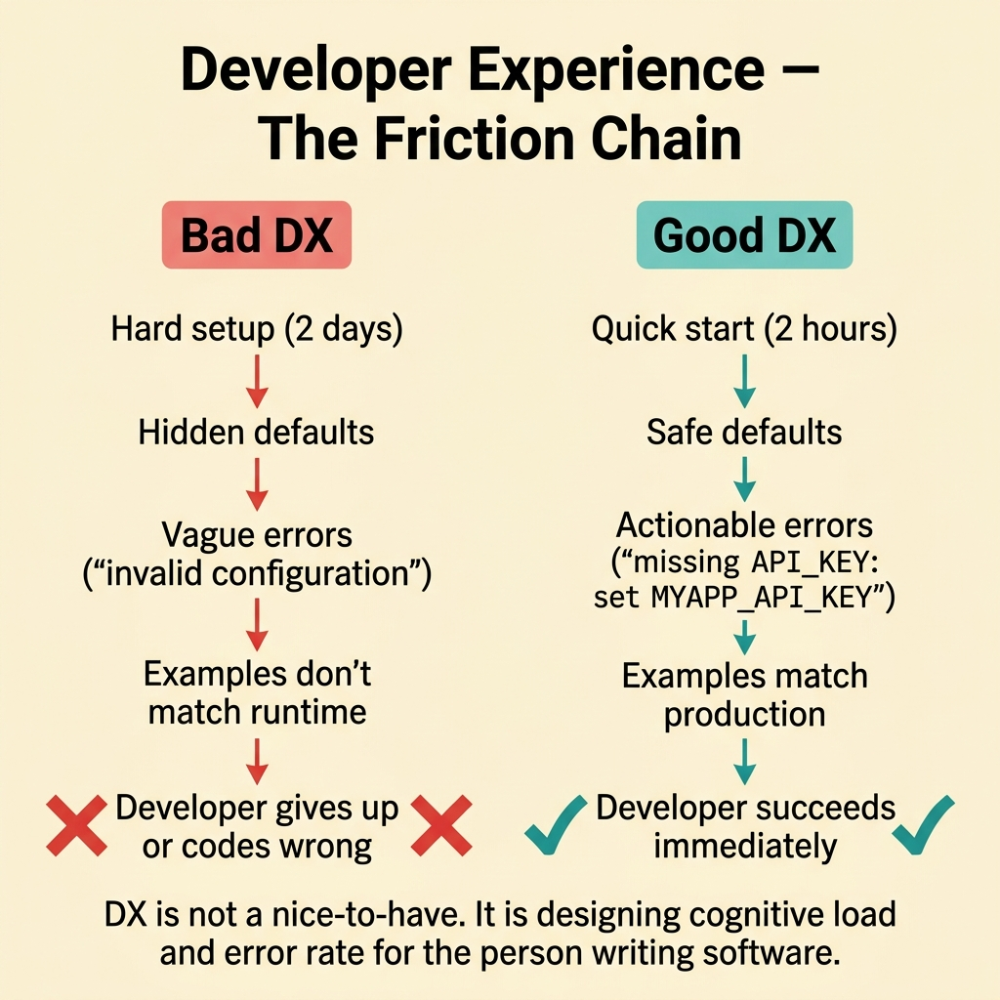
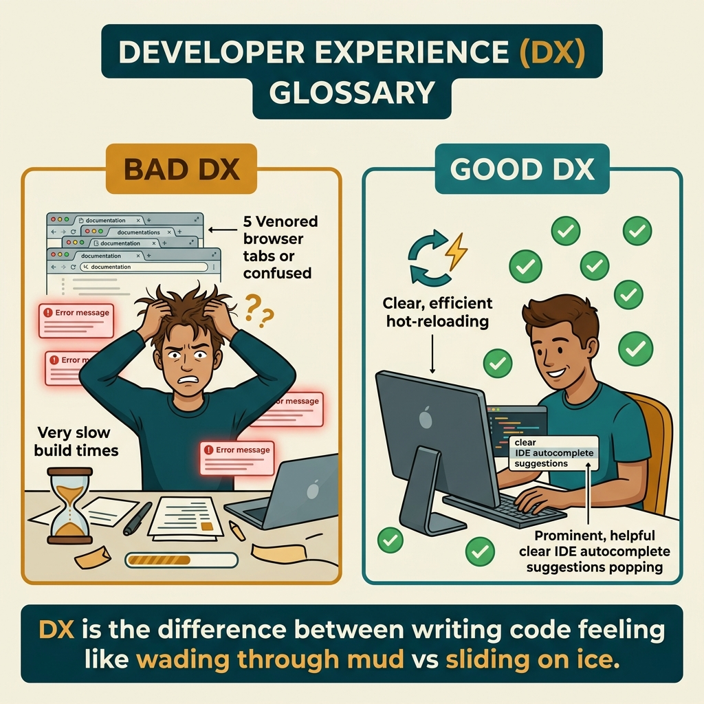

<!-- tags: glossary, reference, developer-cognition-team-dynamics, design-for-humans, developer-experience -->
# Developer Experience

> The overall experience a developer has when using an API, SDK, tool, framework, or working within a codebase.

| Aspect | Detail |
| --- | --- |
| **Concept** | The overall experience a developer has when using an API, SDK, tool, framework, or working within a codebase. |
| **Audience** | API designer, platform team, tech lead |
| **Primary style** | Glossary term |
| **Entry point** | Use when the team needs to view an internal product from the perspective of the person writing code, not just from the perspective of a system that runs correctly. |

📅 Created: 2026-03-30 · 🔄 Updated: 2026-04-04 · ⏱️ 10 min read

---

## 1. DEFINE

Picture an API that is technically very powerful, but every time a developer uses it they need to open three browser tabs for docs, guess error semantics, and copy a long config block just to run anything. The developer slows down and easily misuses it. Developer Experience exists to remind us that the person writing code is also a "user" of the system, and their experience has a direct impact on delivery speed and integration correctness.

**Developer Experience** is the overall experience a developer has when using an API, SDK, tool, framework, or working within a codebase.

| Variant | Description |
| --- | --- |
| API/SDK DX | The experience of the integrator working with contracts, docs, error messages, and examples. |
| Internal platform DX | The experience of teams using internal tools, CI/CD, templates, and scaffolds. |
| Codebase DX | The experience of reading, modifying, debugging, and extending the existing system. |

| Approach | Time | Space | When to choose |
| --- | --- | --- | --- |
| Remove setup friction | O(n setup steps) | O(tooling/docs) | When onboarding or first-run is too heavy. |
| Design for correct defaults | O(n API/tool decisions) | O(1) | When users are more likely to pick the wrong path than the right one. |
| Improve feedback quality | O(n errors/docs/examples) | O(doc/runtime messages) | When developers spend too much time guessing the cause of failure. |

Core insight:

> Developer Experience is not "a nice to have." It is designing cognitive load and error rate for the person writing software. Good DX helps the user code correctly faster; bad DX turns correctness into a war of attrition.

### 1.1 Invariants & Failure Modes

The invariant is that the user must be able to go from "I want to do X" to "I correctly did X" with reasonable friction. When setup is long, errors are vague, and docs do not match runtime behavior, DX drops fast even if the API is feature-rich.

---

## 2. CONTEXT

**Who uses it**: API designer, platform team, tech lead

**When**: Use when the team needs to view an internal product from the perspective of the person writing code, not just from the perspective of a system that runs correctly.

**Purpose**: Developer Experience is not "a nice to have." It is designing cognitive load and error rate for the person writing software. Good DX helps the user code correctly faster; bad DX turns correctness into a war of attrition.

**In the ecosystem**:
- DX is not just pretty docs; it also includes defaults, tooling, debugging paths, and feedback quality.
- DX does not oppose power-user capability; the issue is whether the basic path is clear and safe enough.
- This is a layer of product thinking applied to developer-facing systems.

---

Good DX is clear. But how do you measure DX, how does DX differ from UX, and how much should you invest?

## 3. EXAMPLES

Developer experience surfaces most visibly when setting up a project takes two days instead of two hours, when documentation is wrong and the developer has to read source code, or when an SDK is so complex that Hello World requires 50 lines. The examples below place the pattern into exactly those situations.

### Example 1: Basic — The user takes too long to run "hello world"

An SDK requires copying seven environment variables and three auth steps just to make the first request. At the basic level, DX starts by shortening the first-success path for new users.

The input is the developer's first-run experience. The output is a short quick-start that reaches the first result faster. Complexity is low because it mainly optimizes the entry path.

```go
type QuickStart struct {
	Endpoint string
	APIKey   string
}
```

**Why?** Early success is the most powerful lubricant for DX. If the first step is too heavy, the user will judge the entire tool/API as "hard to use" before even seeing its real value.

**Takeaway**: You shorten the distance from curiosity to first success.
**Caveat**: A quick-start that is too minimal and hides truly important constraints can cause misunderstandings later.
**Use when**: new onboarding or first-time experimentation requires too many manual steps.

### Example 2: Intermediate — Error messages do not help the user self-fix

A CLI returns `invalid configuration` and exits. The developer still does not know which field is missing or where to fix it. At the intermediate level, DX demands feedback that is actionable, not just technically correct.

The input is a common failure case. The output is error feedback that points out the error, its consequence, and the nearest fix step. Complexity is moderate because it requires thinking from the perspective of the person receiving the error.



*Figure: DX is not a nice-to-have. It is designing cognitive load and error rate for the person writing software.*

```go
func validateConfig(apiKey string) error {
	if apiKey == "" {
		return errors.New("missing API key: set MYAPP_API_KEY before running `myapp sync`")
	}
	return nil
}
```

**Why?** Error messages are part of the interface. When they only say "there was an error" without suggesting a way out, the user must do detective work and DX drops even if the validation logic is perfectly correct.

**Takeaway**: You turn errors from dead ends into guiding signals.
**Caveat**: Actionable does not mean infinitely verbose; feedback still needs to be short and close to the root cause.
**Use when**: support or onboarding keeps receiving the same question "what does this error mean?"

### Example 3: Advanced — A powerful API where the correct path is too hard to find

A library has full configuration capability, hooks, and extensibility, but newcomers easily fall into the wrong path because defaults are unsafe and docs open with advanced use cases. At the advanced level, DX is the problem of designing the correct trail first, then opening power shortcuts.

The input is an API with many capabilities but painful adoption. The output is a safe default path so users succeed before touching customizations. Complexity is high because it involves product design philosophy for developers.

```go
type ClientConfig struct {
	Timeout    time.Duration
	RetryCount int
}

func DefaultClientConfig() ClientConfig {
	return ClientConfig{
		Timeout:    5 * time.Second,
		RetryCount: 2,
	}
}
```

**Why?** Good DX does not force the user to understand every advanced knob from the start. Safe defaults let them build a successful mental model first, then gradually learn more complex capabilities.

**Takeaway**: You create a pit of success for the developer instead of making them navigate through a forest of options.
**Caveat**: Defaults that are too "safe" but do not reflect common real use cases will also backfire.
**Use when**: a feature-rich API has slow onboarding and repeating integration errors.

### Example 4: Expert — DX is the product surface of the entire internal platform

An organization has internal tools for deploying, scaffolding services, and viewing logs, but each tool has its own UX, vocabulary, and error style. At the expert level, DX must be viewed as a unified product line, not a pile of individual utilities.

The input is multiple internal tools with fragmented UX. The output is shared philosophy and standards for the developer experience across the platform. Complexity is high because it involves governance and shared design language.

```go
type PlatformUXPolicy struct {
	SharedVocabulary bool
	ActionableErrors bool
	SafeDefaults     bool
}
```

**Why?** Developers do not experience each tool in isolation; they experience the entire platform as an ecosystem. If the tools do not share a mental model, the total DX will be much worse than the quality of any individual tool.

**Takeaway**: You elevate DX from local optimization to a product strategy for the internal platform.
**Caveat**: Standardization should not kill the specific needs of each tool; unify at the principles level, not by mechanically cloning UI/UX.
**Use when**: the organization has many developer-facing tools and friction comes from the overall experience rather than a single tool.

---

## 4. COMPARE




*Figure: Position of DX among pit of success, affordance, and API design.*

DX sounds like UX for developers. Correct — but DX focuses on API ergonomics, tooling, documentation, error messages, and onboarding. UX is for end users, DX is for developer users. Both need empathy for the person using your thing.

### Level 1

```text
developer goal
  -> discover correct path
  -> try it
  -> get clear feedback
  -> succeed quickly
```

*Figure: Level 1 shows good DX is a seamless chain from intent to first success.*

### Level 2

```text
bad DX
  hard setup
  hidden defaults
  vague errors
  examples drift from reality

good DX
  quick start
  safe defaults
  actionable errors
  examples match runtime
```

*Figure: Level 2 emphasizes DX is the sum of many small frictions, not just a layer of documentation.*

### Easy to confuse or cross the boundary

| # | Severity | Mistake | Consequence | Fix |
| --- | --- | --- | --- | --- |
| 1 | 🔴 Fatal | Only measuring DX by docs or pretty interface | Missing defaults, errors, tooling flow | Audit the entire path from intent to success. |
| 2 | 🟡 Common | Error messages are technically correct but not actionable | Support load increases, users guess randomly | Write feedback tied to a specific fix step. |
| 3 | 🟡 Common | Starting with advanced capability | Newcomers fall into the wrong path | Design quick-start and safe defaults first. |
| 4 | 🔵 Minor | Optimizing each tool individually, ignoring the ecosystem | Fragmented mental model across tools | Set shared DX principles for the platform. |

### Quick scan

| If you encounter | What to do |
| --- | --- |
| First-run takes too long | Shorten the quick-start path. |
| Error messages do not help self-fix | Make feedback actionable. |
| Powerful API but correct use is too hard | Design safe defaults. |
| Platform with many fragmented tools | Set shared DX principles. |

---

## 5. REF

| Resource | Type | Link | Notes |
| --- | --- | --- | --- |
| Developer Experience (DX) | Reference | https://increment.com/development/developer-experience-dx/ | Useful overview for this framing. |
| Pit of Success | Related term | ./02-pit-of-success.md | A core principle for building good DX. |
| Affordance | Related term | ./03-affordance.md | Helps understand how design guides users to the correct path. |

---

## 6. RECOMMEND

DX solves the problem of "developers struggling when using tools/APIs/SDKs." The next question: how does pit of success design work, and what about affordance?

| Expand to | When | Why | File/Link |
| --- | --- | --- | --- |
| Pit of Success | When you want to concretize "the correct path is the easiest path" | This is how DX is realized at the API/tool design level. | [Pit of Success](./02-pit-of-success.md) |
| Explicit over Implicit | When DX is bad because there is too much hidden behavior | Explicitness is a pillar of good DX. | [Explicit over Implicit](./08-explicit-over-implicit.md) |
| Design for Humans | When you need to return to the hub | Keep context of the full topic. | [Design for Humans](./README.md) |

Back to that two-day setup from the beginning — bad DX. Now you know: good DX = fast setup, clear docs, helpful errors, sensible defaults. DX investment = developer productivity × number of developers. ROI is very high if many devs use your tool.

**Links**: [← Previous](./README.md) · [→ Next](./02-pit-of-success.md)
