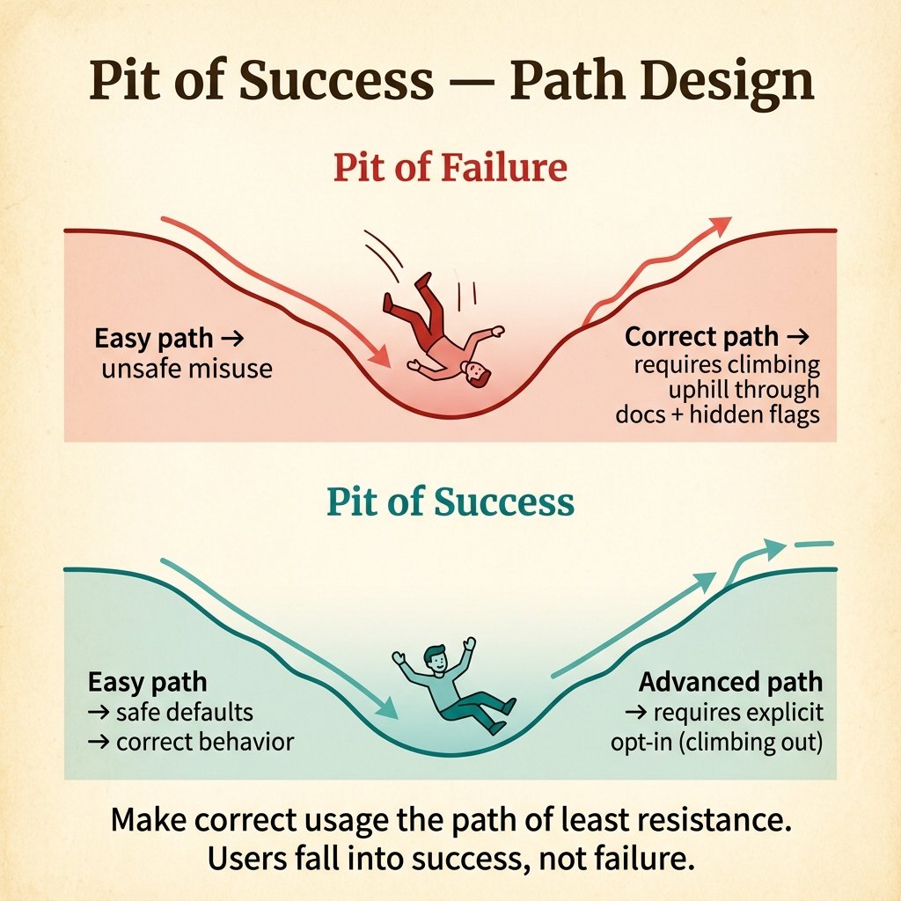
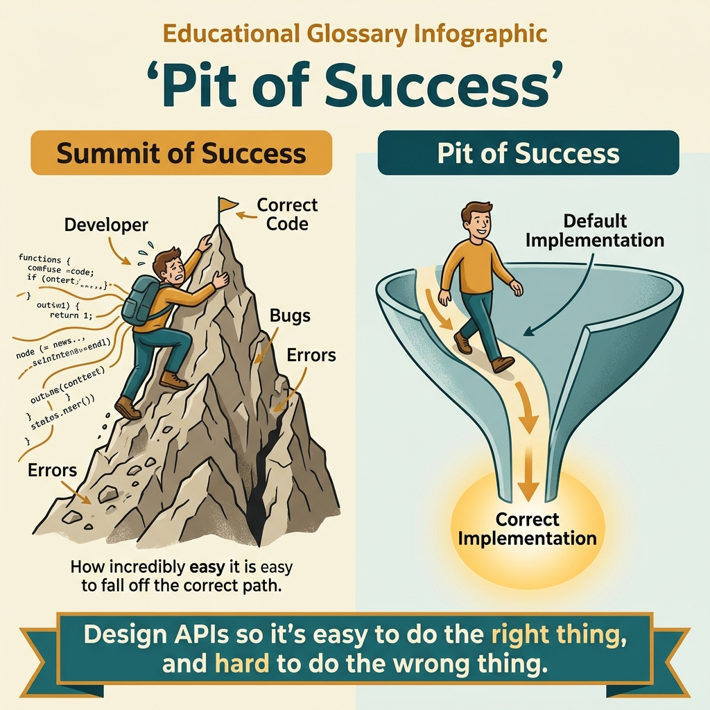

<!-- tags: glossary, reference, developer-cognition-team-dynamics, design-for-humans, pit-of-success -->
# Pit of Success

> A design philosophy where the easiest path for using an API or tool is also the most correct path.

| Aspect | Detail |
| --- | --- |
| **Concept** | A design philosophy where the easiest path for using an API or tool is also the most correct path. |
| **Audience** | API designer, framework maintainer |
| **Primary style** | Glossary term |
| **Entry point** | Use when the team wants to reduce user errors through the design of the default path, not just through warnings and docs. |

📅 Created: 2026-03-30 · 🔄 Updated: 2026-04-04 · ⏱️ 9 min read

---

## 1. DEFINE

Picture this: to use an API correctly, a user has to go through five "expert" steps, while the quickest path leads to an invalid state. The product is pushing users into a "pit of failure." Pit of Success reverses the problem: the lowest-friction path must also be the safe and semantically correct one.

**Pit of Success** is a design philosophy where the easiest path for using an API or tool is also the most correct path.

| Variant | Description |
| --- | --- |
| Safe defaults | The default path automatically avoids common mistakes. |
| Guardrail design | The interface makes the dangerous path harder to reach than the safe one. |
| Success-biased onboarding | The first example already follows the correct pattern, with no "read the caveats later" needed. |

| Approach | Time | Space | When to choose |
| --- | --- | --- | --- |
| Make the safe path the shortest path | O(n API/tool decisions) | O(1) | When misuse happens because the correct path is too cumbersome. |
| Add friction only to dangerous actions | O(n risky operations) | O(guardrails) | When you need to prevent users from falling into a dangerous path. |
| Teach advanced options after first success | O(n docs/examples) | O(doc structure) | When newcomers are overloaded by too many knobs. |

Core insight:

> Users do not always take the "most logical" path; they usually take the path of least friction. Designing a pit of success means making correct behavior coincide with the most convenient behavior.

### 1.1 Invariants & Failure Modes

The invariant is that the default path must not lead the user into a dangerous or hard-to-rollback state. When common misuse requires fewer steps than correct use, the design has gone wrong.

---

## 2. CONTEXT

**Who uses it**: API designer, framework maintainer

**When**: Use when the team wants to reduce user errors through the design of the default path, not just through warnings and docs.

**Purpose**: Users do not always take the "most logical" path; they usually take the path of least friction. Designing a pit of success means making correct behavior coincide with the most convenient behavior.

**In the ecosystem**:
- This is not about "hiding complexity at all costs"; advanced options still have their place.
- Pit of success is strongest at defaults, quick-starts, and the API surface.
- This term relates more directly to error prevention than error recovery.

---

Designing for correct defaults is clear. But how does pit of success differ from pit of failure, how does it apply to API design, and what about framework examples?

## 3. EXAMPLES

Pit of success surfaces most visibly when a framework defaults to secure behavior and the developer must opt-in for insecure, when an API is easier to use correctly than incorrectly, or when the default configuration is production-ready rather than dev-only. The examples below place the pattern into exactly those situations.

### Example 1: Basic — The user easily calls an API but forgets timeout

An HTTP client has an empty constructor and if the user forgets to set timeout, the request can hang indefinitely. At the basic level, pit of success demands the default constructor leads to safe behavior first.

The input is an API with dangerous defaults. The output is a constructor with defaults safe enough for common use cases. Complexity is low because it is just changing the default path.

```go
func NewClient() *http.Client {
	return &http.Client{
		Timeout: 5 * time.Second,
	}
}
```

**Why?** New users very often copy the default constructor and move on. If the default path is dangerous, misuse will repeat at scale no matter how carefully the docs warn about it.

**Takeaway**: You make the "quickest copy-paste" also the lowest-risk path.
**Caveat**: Defaults must fit the majority of use cases; a timeout that is too short can also become a different trap.
**Use when**: common misuse stems from users skipping a basic safety configuration.

### Example 2: Intermediate — Destructive operations need explicit opt-in

A CLI has a `cleanup` command that by default deletes both local cache and remote artifacts. A user who only wants to clean local cache can easily cause more damage than expected. At the intermediate level, pit of success requires destructive actions to need an extra opt-in step.

The input is a command with destructive behavior that is too easy to trigger. The output is a safe default with destructive mode made explicit. Complexity is moderate because it balances convenience with safety.



*Figure: Make correct usage the path of least resistance. Users fall into success, not failure.*

```go
type CleanupOptions struct {
	LocalOnly    bool
	DeleteRemote bool
}
```

**Why?** Good design does not treat all actions equally. Actions with a large blast radius need more friction so the user does not fall into them through habit.

**Takeaway**: You keep the everyday path clean, but do not let the dangerous path pretend to be the normal path.
**Caveat**: Adding friction indiscriminately to every action also makes DX worse.
**Use when**: a destructive or expensive operation is too easy to trigger accidentally.

### Example 3: Advanced — Documentation must teach the correct path first

A framework's docs open with an advanced setup showing 12 options, while new users only need a happy path of 3 steps. At the advanced level, pit of success must be encoded in the structure of docs and examples as well.

The input is documentation structure that teaches newcomers in the wrong order. The output is docs that open with a simple success path and place advanced options later. Complexity is high because it involves content architecture.

```go
type QuickStartExample struct {
	ShowsDefaultPath     bool
	AdvancedFlagsOmitted bool
}
```

**Why?** Readers very often treat the first example as "the standard way to do it." If the first example is heavy on edge cases, the docs are pulling them out of the pit of success from minute one.

**Takeaway**: You make documentation also part of the safe path, not just the source code.
**Caveat**: Do not completely hide advanced options; just let them appear after the user has a basic mental model.
**Use when**: slow onboarding is mainly caused by docs leading newcomers into complexity too early.

### Example 4: Expert — Design the platform so the organization defaults to correct

At the internal platform level, pit of success is not just a constructor or a CLI flag. It is service templates, default CI, secrets flow, and observability hooks. At the expert level, the organization can make every new service born inside the "pit of success."

The input is a platform wanting to reduce repeating mistakes across dozens of teams. The output is a golden path where scaffolds, defaults, and checks automatically push teams into the correct setup. Complexity is high because it involves ecosystem design.

```go
type ServiceTemplatePolicy struct {
	HealthChecksEnabled bool
	LoggingConfigured   bool
	TimeoutsSet         bool
}
```

**Why?** Platform-level mistakes are rarely solved well by documentation alone. When the default scaffold already includes reasonable guardrails, dozens of teams will succeed without having to repeat the same painful lesson.

**Takeaway**: You elevate pit of success from a local API philosophy to a platform design strategy.
**Caveat**: A golden path that is too rigid can make unusual use cases hard to implement; there must be a clear escape hatch.
**Use when**: the same class of setup or best-practice errors repeats across many teams or services.

---

## 4. COMPARE




*Figure: Position of pit of success among developer experience, affordance, and API design.*

Pit of success sounds like "make it easy." Correct — but more specific: make doing the right thing easier than doing the wrong thing. Default = correct. Deviation requires effort. Users fall into success, not failure.

### Level 1

```text
easy path
  -> safe
  -> valid
  -> likely to succeed
```

*Figure: Level 1 shows pit of success is aligning convenience and correctness in the same direction.*

### Level 2

```text
bad design
  easy path -> unsafe misuse
  correct path -> long docs + hidden flags

good design
  easy path -> safe default
  advanced path -> explicit opt-in
```

*Figure: Level 2 emphasizes advanced paths can still exist, but they must not be the unintended default.*

### Easy to confuse or cross the boundary

| # | Severity | Mistake | Consequence | Fix |
| --- | --- | --- | --- | --- |
| 1 | 🔴 Fatal | Default path leads to dangerous state | Misuse becomes normal | Set safe defaults at the constructor/default path. |
| 2 | 🟡 Common | Dangerous path is easier than the correct path | Users slip into mistakes through habit | Add explicit opt-in for risky actions. |
| 3 | 🟡 Common | Docs open with advanced use case | Newcomers learn in the wrong order | Teach happy path first, advanced later. |
| 4 | 🔵 Minor | Golden path too rigid | Special use cases need hacks to proceed | Provide a clear and intentional escape hatch. |

### Quick scan

| If you encounter | What to do |
| --- | --- |
| Dangerous default constructor | Set safe defaults. |
| Destructive command too easy to run | Require explicit opt-in. |
| Docs teach advanced path first | Flip to quick-start first. |
| Setup errors repeating across many teams | Create a golden path at the platform level. |

---

## 5. REF

| Resource | Type | Link | Notes |
| --- | --- | --- | --- |
| Pit of Success | Reference | https://blog.codinghorror.com/falling-into-the-pit-of-success/ | The blog post that popularized this concept. |
| Developer Experience | Related term | ./01-developer-experience.md | Pit of success is a core strategy for raising DX. |
| Explicit over Implicit | Related term | ./08-explicit-over-implicit.md | The correct path often needs explicitness at dangerous points. |

---

## 6. RECOMMEND

Pit of success solves the problem of "users default to wrong behavior because of bad API design." The next question: how does affordance guide users, and how dangerous is a leaky abstraction?

| Expand to | When | Why | File/Link |
| --- | --- | --- | --- |
| Developer Experience | When you need the broader picture | Pit of success is one pattern of good DX. | [Developer Experience](./01-developer-experience.md) |
| Explicit over Implicit | When discussing defaults and opt-in | Explicitness helps prevent dangerous paths from accidental activation. | [Explicit over Implicit](./08-explicit-over-implicit.md) |
| Design for Humans | When you need to return to the hub | Keep context of the full topic. | [Design for Humans](./README.md) |

Back to that framework with secure defaults from the beginning — dev has to opt-in for insecure. Now you know: design default = best practice. Make correct usage obvious, make wrong usage hard. If the user has to try hard to succeed, the design has failed.

**Links**: [← Previous](./01-developer-experience.md) · [→ Next](./03-affordance.md)
