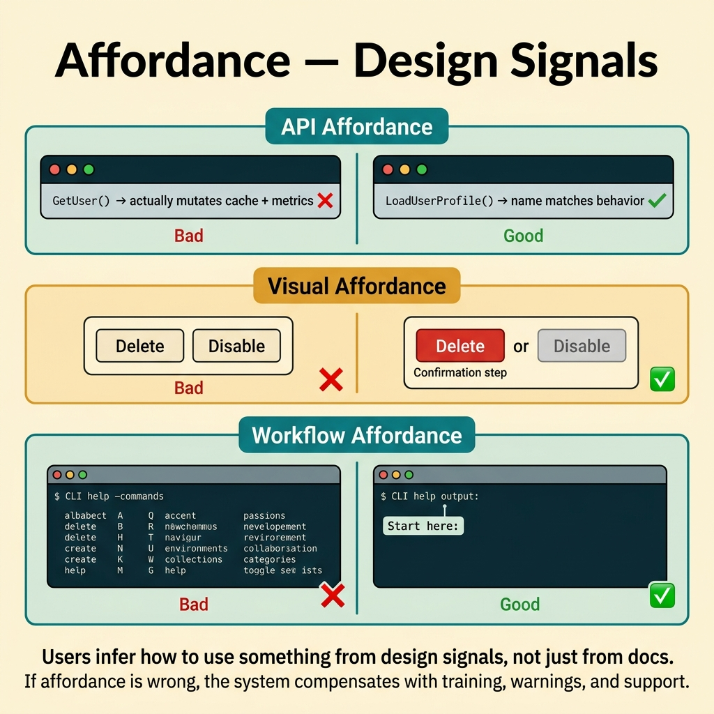
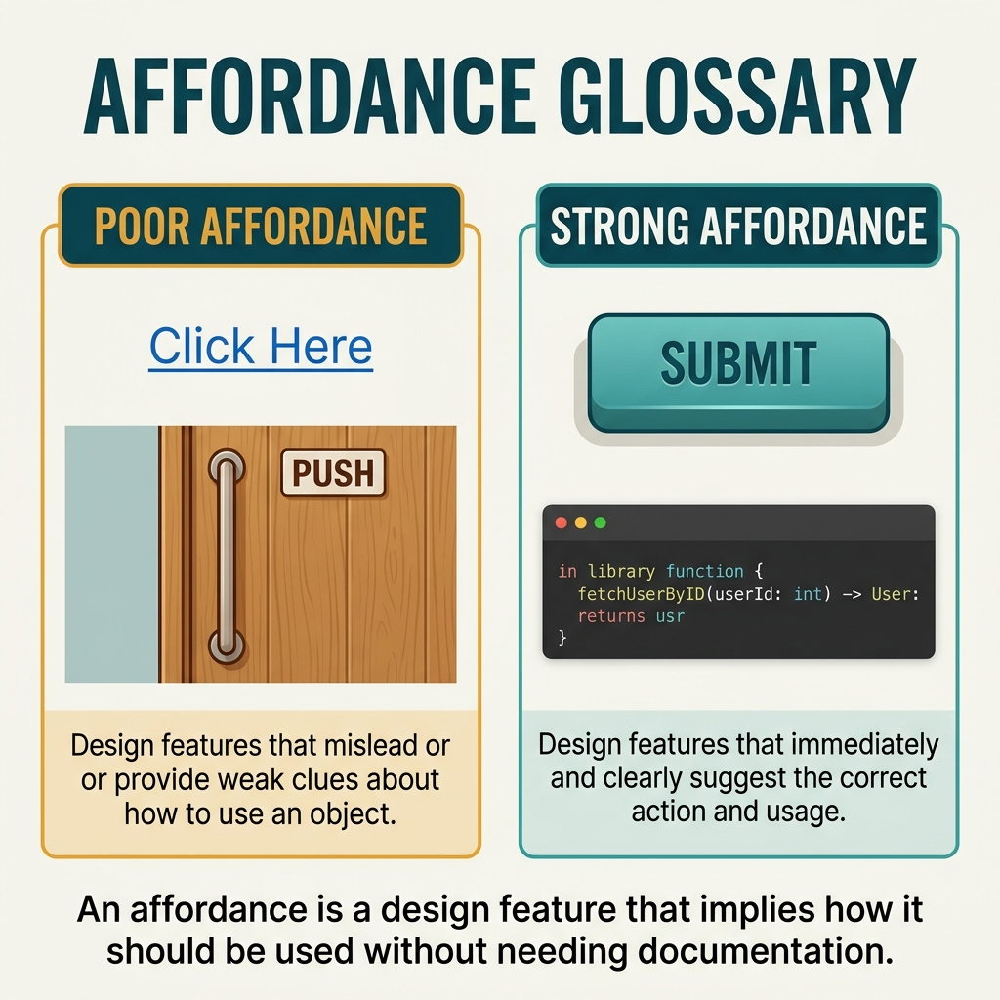

<!-- tags: glossary, reference, developer-cognition-team-dynamics, design-for-humans, affordance -->
# Affordance

> A design cue that suggests to the user how a component should be used.

| Aspect | Detail |
| --- | --- |
| **Concept** | A design cue that suggests to the user how a component should be used. |
| **Audience** | API designer, UI/tool designer |
| **Primary style** | Glossary term |
| **Entry point** | Use when users keep misusing an API or tool despite documentation existing, because the interface itself does not suggest the correct way to use it. |

📅 Created: 2026-03-30 · 🔄 Updated: 2026-04-04 · ⏱️ 9 min read

---

## 1. DEFINE

Picture a button that looks like a link, a function named like a pure getter that actually mutates state, a CLI option that looks like a harmless flag but triggers deletion. Users do not always read docs carefully; they read the signals the interface emits. Affordance is exactly those signals.

**Affordance** is a design cue that suggests to the user how a component should be used.

| Variant | Description |
| --- | --- |
| Visual affordance | Shape, position, and style suggest how to interact. |
| API affordance | Function names, parameters, and type shapes suggest expected behavior. |
| Workflow affordance | Processes, button order, and CLI help suggest the logical next action. |

| Approach | Time | Space | When to choose |
| --- | --- | --- | --- |
| Strengthen visible cues | O(n interface elements) | O(1) | When users do not know which button/call/step to take first. |
| Align naming with action semantics | O(n API reviews) | O(refactor notes) | When the interface creates wrong expectations. |
| Make dangerous actions look dangerous | O(n risky paths) | O(guardrails) | When users accidentally trigger the wrong action. |

Core insight:

> Users do not just follow docs; they infer how to use something from the signals the design puts out. If affordance is wrong or weak, the entire system must compensate with training, warnings, and support.

### 1.1 Invariants & Failure Modes

The invariant is that the interface must emit signals consistent with its actual behavior. When the surface signals and the underlying behavior diverge, users will misuse the system in a completely understandable way.

---

## 2. CONTEXT

**Who uses it**: API designer, UI/tool designer

**When**: Use when users keep misusing an API or tool despite documentation existing, because the interface itself does not suggest the correct way to use it.

**Purpose**: Users do not just follow docs; they infer how to use something from the signals the design puts out. If affordance is wrong or weak, the entire system must compensate with training, warnings, and support.

**In the ecosystem**:
- Affordance is not just a UI concept; API names and parameter shapes are also affordance.
- It is closer to expectation design than correctness logic.
- Strong affordance helps users go right even when they have not finished reading the documentation.

---

Design cues that suggest action are clear. But what does affordance look like in code APIs, what is false affordance, and how does design affordance work?

## 3. EXAMPLES

Affordance surfaces most visibly when a button looks like a button (click me), when an API method returns error but its affordance suggests success, or when a function signature misleads about parameter order. The examples below place the pattern into exactly those situations.

### Example 1: Basic — The function name does not suggest the right behavior

You see `GetUser()` and think it is a read-only call, but the function actually updates cache and metrics. At the basic level, the affordance of the name must match the actual action.

The input is an API name that creates wrong expectations. The output is a new name or split action so users guess more correctly. Complexity is low because it mainly fixes the surface signal.

```go
func LoadUserProfile(userID string) (UserProfile, error) {
	return repo.GetUserProfile(userID)
}
```

**Why?** A function name is the first affordance of an API. If the name suggests the wrong thing, users will use the API based on incorrect assumptions no matter how "correct" the implementation is.

**Takeaway**: You fix the signal at the entry point so users do not have to guess backward from the implementation.
**Caveat**: A surface rename does not save a contract that is ambiguous at a deeper level.
**Use when**: API names are creating expectations different from actual behavior.

### Example 2: Intermediate — CLI help does not suggest the right next step

A CLI has many subcommands but the help text does not indicate which command is the main path for newcomers. At the intermediate level, workflow affordance must make the first step stand out.

The input is a CLI/tooling path that causes confusion for newcomers. The output is help text and command naming that suggest the basic flow more clearly. Complexity is moderate because it involves task flow.



*Figure: Users infer how to use something from design signals, not just from docs.*

```go
type CommandHelp struct {
	Command string
	UseWhen string
}
```

**Why?** Users often rely on help as an instant map. If help does not suggest the next step clearly enough, they will try random commands and easily produce unnecessary errors.

**Takeaway**: You turn help text into a workflow affordance, not just a list of commands.
**Caveat**: Help that is too long also weakens affordance because the eye does not know where to look.
**Use when**: a powerful tool still causes repeating confusion on first-time use.

### Example 3: Advanced — Destructive path is not visually different enough

A dashboard has two buttons side by side: `Disable` and `Delete`, same style, same weight. The user can very easily click the wrong one. At the advanced level, affordance must make the risky path look distinctly different from the safe path.

The input is an interface with actions that have very different blast radii. The output is design signals that make the dangerous action hard to confuse. Complexity is high because it involves safety design.

```go
type ActionAffordance struct {
	Label         string
	IsDestructive bool
	NeedsConfirm  bool
}
```

**Why?** When two actions look the same, users default to treating them as equally weighted. Risky actions need different affordance so the brain recognizes "this is not an everyday operation."

**Takeaway**: You use surface signals to protect users before the mistake happens.
**Caveat**: Overusing red warnings for too many actions makes affordance lose its effectiveness.
**Use when**: the same area contains both safe and destructive actions.

### Example 4: Expert — Affordance must be consistent across the ecosystem

A platform has a CLI, dashboard, and SDK but each suggests behavior in a different way. What users learn in one place does not transfer to another. At the expert level, affordance must be consistent across the entire ecosystem.

The input is multiple touchpoints using different signals for the same class of action. The output is a shared interaction language. Complexity is high because it involves design systems and product governance.

```go
type InteractionPattern struct {
	PrimaryActionLabel string
	DestructiveLabel   string
	ConfirmPhrase      string
}
```

**Why?** Affordance is only powerful when it repeats consistently enough to become reflexive. If each tool in the ecosystem suggests behavior differently, users have to relearn from scratch everywhere.

**Takeaway**: You elevate affordance from a local technique to a shared interaction language for the entire platform.
**Caveat**: Consistency should not become rigidity if the context is genuinely different.
**Use when**: users work with multiple touchpoints of the same platform but still make mistakes because their mental model does not transfer.

---

## 4. COMPARE




*Figure: Position of affordance among pit of success, UX design, and API ergonomics.*

Affordance sounds like a UI design concept. True in origin (Don Norman) — but affordance applies to code: function name suggests behavior, type system constrains usage, error message guides fix. Code affordance = "it suggests how you should use it."

### Level 1

```text
interface cue
  -> user forms expectation
  -> user acts
  -> outcome should match that expectation
```

*Figure: Level 1 shows good affordance makes expectation and action align from the start.*

### Level 2

```text
weak affordance
  dangerous action looks normal
  pure-looking API mutates state

strong affordance
  safe path is obvious
  risky path is clearly marked
```

*Figure: Level 2 emphasizes affordance is the bridge between appearance and behavior.*

### Easy to confuse or cross the boundary

| # | Severity | Mistake | Consequence | Fix |
| --- | --- | --- | --- | --- |
| 1 | 🔴 Fatal | Interface suggests behavior different from runtime behavior | Users misuse in a completely logical way | Align cues with actual behavior. |
| 2 | 🟡 Common | Risky action looks like a normal operation | Misclicks and misuse increase | Increase signal and confirmation for risky paths. |
| 3 | 🟡 Common | Help/docs do not suggest next step | Newcomers get lost | Design stronger workflow affordance. |
| 4 | 🔵 Minor | Each tool uses different affordance | Mental model does not transfer | Standardize interaction language across the ecosystem. |

### Quick scan

| If you encounter | What to do |
| --- | --- |
| API name suggests wrong behavior | Fix the signal at the interface first. |
| User does not know the next step | Increase workflow affordance in help/docs/UI. |
| Dangerous action too easy to reach | Make the risky path visually different. |
| Multiple tools in one platform but inconsistent cues | Standardize the interaction language. |

---

## 5. REF

| Resource | Type | Link | Notes |
| --- | --- | --- | --- |
| The Design of Everyday Things | Book | https://en.wikipedia.org/wiki/The_Design_of_Everyday_Things | The classic foundation for affordance. |
| Pit of Success | Related term | ./02-pit-of-success.md | Good affordance is often a prerequisite for a pit of success. |
| Explicit over Implicit | Related term | ./08-explicit-over-implicit.md | Explicitness is a way to strengthen affordance. |

---

## 6. RECOMMEND

Affordance solves the problem of "users cannot tell how to use a tool or API just by looking." The next question: how does leaky abstraction expose internals, and what about explicit over implicit?

| Expand to | When | Why | File/Link |
| --- | --- | --- | --- |
| Pit of Success | When you want to turn correct signals into correct paths | Good affordance is the first step; pit of success is the consequence. | [Pit of Success](./02-pit-of-success.md) |
| Explicit over Implicit | When the interface is too implicit | Increasing explicitness usually makes affordance clearer. | [Explicit over Implicit](./08-explicit-over-implicit.md) |
| Design for Humans | When you need to return to the hub | Keep context of the full topic. | [Design for Humans](./README.md) |

Back to that misleading function signature from the beginning — parameter order was misleading. Now you know: good affordance = the signature tells you how to use it. Named parameters, builder pattern, option struct — all improve affordance. If the user guesses wrong, your API has bad affordance.

**Links**: [← Previous](./02-pit-of-success.md) · [→ Next](./04-leaky-abstraction.md)
