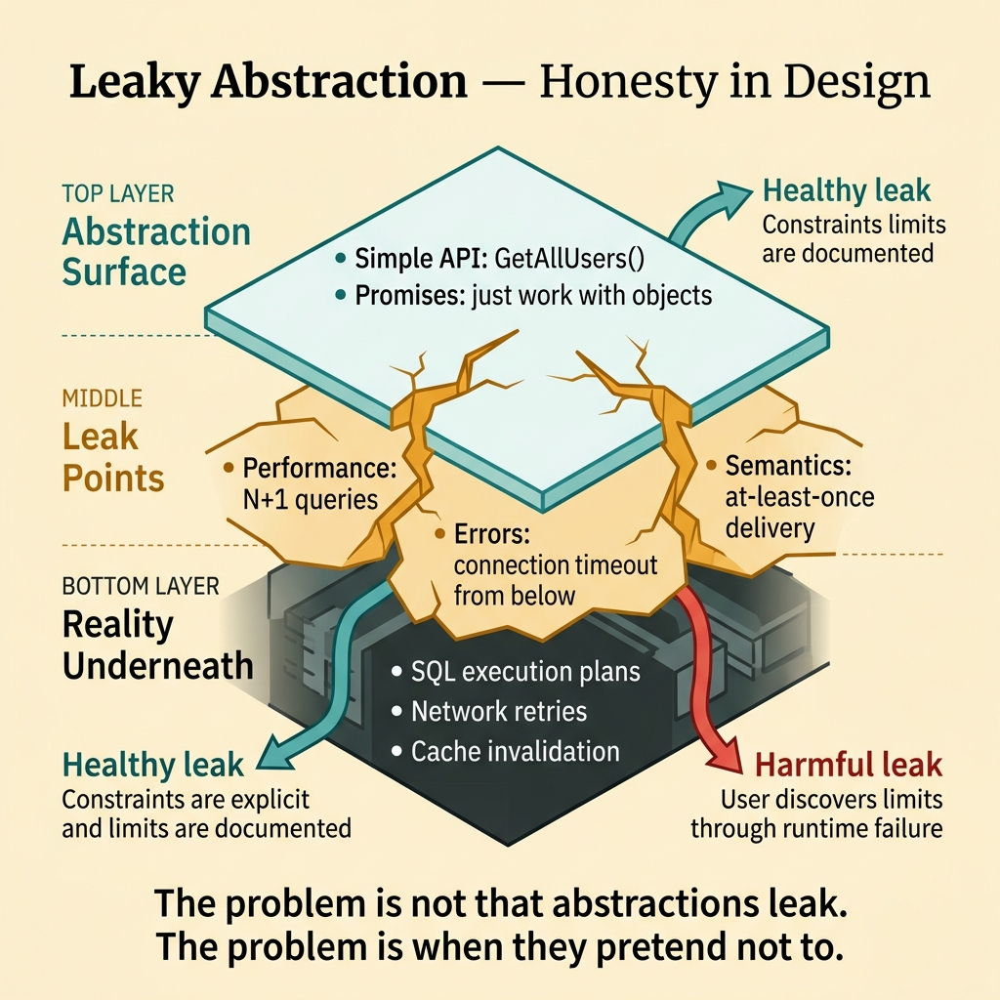
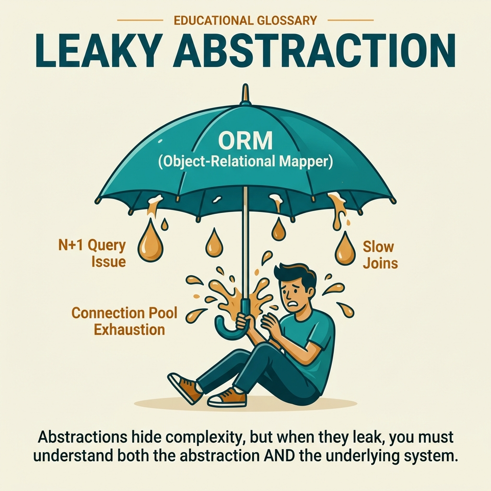

<!-- tags: glossary, reference, developer-cognition-team-dynamics, design-for-humans, leaky-abstraction -->
# Leaky Abstraction

> A situation where an abstraction fails to fully hide implementation details, forcing the user to understand the layer beneath it.

| Aspect | Detail |
| --- | --- |
| **Concept** | A situation where an abstraction fails to fully hide implementation details, forcing the user to understand the layer beneath it. |
| **Audience** | Library author, platform engineer |
| **Primary style** | Glossary term |
| **Entry point** | Use when an abstraction looks convenient but the user still needs to know far too much about its internals to use it correctly. |

📅 Created: 2026-03-30 · 🔄 Updated: 2026-04-04 · ⏱️ 9 min read

---

## 1. DEFINE

Picture an ORM that promises you "just work with objects," but when a query runs slowly everyone still has to understand indexes, N+1 patterns, and execution plans. The abstraction is not strictly wrong; it just leaks where important behavior is no longer fully hidden. That is a leaky abstraction.

**Leaky Abstraction** is a situation where an abstraction fails to fully hide implementation details, forcing the user to understand the layer beneath it.

| Variant | Description |
| --- | --- |
| Performance leak | The user must understand internals to avoid slow paths. |
| Error leak | Failure modes from the lower layer surface even though the surface API looks simple. |
| Semantics leak | Surface concepts are not enough to explain the actual behavior. |

| Approach | Time | Space | When to choose |
| --- | --- | --- | --- |
| Surface constraints explicitly | O(n docs/contracts) | O(1) | When the leak is unavoidable but can be stated clearly. |
| Reduce hidden footguns | O(n abstraction redesigns) | O(refactor plan) | When the leak is causing widespread misuse. |
| Teach the right underlying mental model | O(n examples) | O(doc updates) | When the abstraction is still useful but needs clear boundaries. |

Core insight:

> The problem is not that an abstraction leaks a little. The problem is when an abstraction pretends to cover everything but runtime reality keeps forcing users to learn the layer below — painfully and too late.

### 1.1 Invariants & Failure Modes

The invariant is that an abstraction must be honest about its important limitations. When an API advertises absolute simplicity but actually requires users to understand internals to avoid basic errors, trust in the abstraction collapses.

---

## 2. CONTEXT

**Who uses it**: Library author, platform engineer

**When**: Use when an abstraction looks convenient but the user still needs to know far too much about its internals to use it correctly.

**Purpose**: The problem is not that an abstraction leaks a little. The problem is when an abstraction pretends to cover everything but runtime reality keeps forcing users to learn the layer below — painfully and too late.

**In the ecosystem**:
- Every complex abstraction can leak somewhere; the question is how it leaks and whether there is a clear signal.
- Leaky abstractions become dangerous when users discover the leak only after having committed their design to it.
- This is a problem of honesty in interface design.

---

Abstractions leaking internals is clear. But since all abstractions leak, how do you manage leaks, and when is leakiness acceptable?

## 3. EXAMPLES

Leaky abstraction surfaces most visibly when an ORM generates a slow query and the developer has to write raw SQL, when an HTTP client abstracts away retry but timeout behavior surprises, or when "it works on my machine" happens because the abstraction layer differs. The examples below place the pattern into exactly those situations.

### Example 1: Basic — An API looks simple but has hidden constraints

A helper `GetAllUsers()` looks convenient, but is actually only safe for small datasets. At the basic level, if the abstraction has such limitations, the limitation must be visible near the API.

The input is a convenience API with a hidden constraint. The output is a contract or naming that states the safe scope clearly. Complexity is low because it mainly makes the interface more honest.

```go
func ListUsersPage(limit int, offset int) ([]User, error) {
	// Pagination is surfaced immediately so users do not wrongly assume full scan is always fine.
	return repo.ListUsers(limit, offset)
}
```

**Why?** Hidden constraints are a form of surprise. When the user sees a full-read API but runtime only handles small datasets, the abstraction is trapping users with false convenience.

**Takeaway**: You change the abstraction from "convenient but deceptive" to "straightforward and durable."
**Caveat**: Exposing too much detail too early can also make the API hard to use if the constraint is not yet truly important.
**Use when**: a convenience API easily leads users to choose a path that does not scale.

### Example 2: Intermediate — A leak is unavoidable but must be properly explained

A queue abstraction still requires users to understand at-least-once delivery to write safe consumers. At the intermediate level, the goal is not to hide the leak at all costs, but to make the leak an official part of the mental model.

The input is an abstraction with an operational property that cannot be fully hidden. The output is docs and examples that explicitly encode that property. Complexity is moderate because it involves both API and pedagogy.



*Figure: The problem is not that abstractions leak. The problem is when they pretend not to.*

```go
type ConsumerContract struct {
	AtLeastOnceDelivery bool
	RequiresIdempotency bool
}
```

**Why?** Some internals directly affect correctness and cannot be eliminated by abstraction alone. Good design acknowledges this early, rather than letting users discover it through duplicate events or data corruption.

**Takeaway**: You turn an unavoidable leak into official knowledge instead of a runtime accident.
**Caveat**: If every underlying detail is pushed to the surface, the abstraction loses its reason to exist.
**Use when**: core behavior like delivery semantics, consistency, or retries directly affects correctness.

### Example 3: Advanced — A leak is making the default path dangerous

A caching layer abstraction hides the difficulty of invalidation, so users follow the default path and trust that data is always fresh. At the advanced level, if a leak makes the default path incorrect, the abstraction needs to be redesigned.

The input is a leak causing repeating footguns on the common path. The output is a redesign that reduces the chance of users falling into the leak. Complexity is high because it touches core design.

```go
type CacheReadResult struct {
	Value     string
	FromCache bool
	Stale     bool
}
```

**Why?** A leak becomes especially dangerous when it breaks the default path. If users must understand internals just to avoid the most common error, the abstraction has failed at its primary job: making the common case safer.

**Takeaway**: You do not just document the leak; you redesign so the leak does less harm on the commonly used path.
**Caveat**: Redesigning a large abstraction can be expensive; prioritize leaks with the highest blast radius first.
**Use when**: support or load issues show the same misunderstanding repeating across many users.

### Example 4: Expert — The organization must decide which abstractions are allowed to leak and how much

No platform hides everything completely. At the expert level, the team needs a clear philosophy: which types of details are allowed to leak to users, and which must be absorbed by the platform at all costs.

The input is multiple abstractions with different levels of leakage. The output is a guideline for acceptable leak budget. Complexity is high because it is architectural policy.

```go
type LeakBudget struct {
	CorrectnessDetailsExplicit bool
	OperationalDetailsGuided   bool
	IncidentalDetailsHidden    bool
}
```

**Why?** If every abstraction is judged by the standard of "hide as much as possible," the team can easily hide details that users actually need to behave safely. A leak budget balances convenience and honesty.

**Takeaway**: You turn the question "how much leaking is acceptable?" into an intentional design policy.
**Caveat**: A leak budget too abstract and not tied to real examples will be hard to use in review.
**Use when**: multiple teams are building abstractions and the quality of honesty across them is very uneven.

---

## 4. COMPARE




*Figure: Position of leaky abstraction among law of leaky abstractions, separation of concerns, and API design.*

Leaky abstraction sounds like bad abstraction. Not entirely: Joel Spolsky's law says ALL abstractions leak. The question is not "does it leak" but "where does it leak and what does the user need to know." Document the leaks.

### Level 1

```text
abstraction promises simplicity
  -> user relies on it
  -> edge/perf behavior leaks
  -> user must learn underlying layer anyway
```

*Figure: Level 1 shows leaks become painful when they appear after the user has placed too much trust in the surface layer.*

### Level 2

```text
healthy leak
  abstraction stays useful
  limits are explicit

harmful leak
  abstraction hides limits
  user discovers them through failure
```

*Figure: Level 2 emphasizes not all leaks are equally bad; a leak that is clearly signaled is still acceptable.*

### Easy to confuse or cross the boundary

| # | Severity | Mistake | Consequence | Fix |
| --- | --- | --- | --- | --- |
| 1 | 🔴 Fatal | Pretending the abstraction covers everything | Users discover limitations through runtime errors | State important constraints clearly from the contract/docs. |
| 2 | 🟡 Common | Pushing all underlying details to the surface | The abstraction loses its value | Only expose details that affect correctness or carry high cost. |
| 3 | 🟡 Common | Leak makes the default path wrong but no redesign | Misuse keeps repeating | Reduce footguns on the most common path. |
| 4 | 🔵 Minor | No shared philosophy about leak budget | Each abstraction is "honest" in a different way | Write a guideline for acceptable leak levels. |

### Quick scan

| If you encounter | What to do |
| --- | --- |
| Convenience API hides an important constraint | Make the contract more honest. |
| Operational property cannot be fully hidden | Encode it into the official mental model. |
| Leak makes default path dangerous | Redesign the common path first. |
| Multiple abstractions with uneven "honesty" | Define a shared leak budget. |

---

## 5. REF

| Resource | Type | Link | Notes |
| --- | --- | --- | --- |
| The Law of Leaky Abstractions | Reference | https://www.joelonsoftware.com/2002/11/11/the-law-of-leaky-abstractions/ | The classic source on this topic. |
| Law of Leaky Abstractions | Related term | ./05-law-of-leaky-abstractions.md | The more general statement. |
| Explicit over Implicit | Related term | ./08-explicit-over-implicit.md | One way to handle leaks is to make constraints more explicit. |

---

## 6. RECOMMEND

Leaky abstraction solves the problem of "abstraction hides complexity but leaks at edge cases." The next question: what does the law of leaky abstractions say, and how does separation of concerns work?

| Expand to | When | Why | File/Link |
| --- | --- | --- | --- |
| Law of Leaky Abstractions | When you want to view this phenomenon as a general law | Helps place each specific leak into the bigger picture. | [Law of Leaky Abstractions](./05-law-of-leaky-abstractions.md) |
| Explicit over Implicit | When leaks happen because constraints are too implicit | Increasing explicitness helps users understand boundaries earlier. | [Explicit over Implicit](./08-explicit-over-implicit.md) |
| Design for Humans | When you need to return to the hub | Keep context of the full topic. | [Design for Humans](./README.md) |

Back to that slow ORM query from the beginning — abstraction leaked, had to write raw SQL. Now you know: abstraction is a tool, not magic. Understand the layer below because it will leak. Good abstraction minimizes the leak surface; a great developer knows what is behind the curtain.

**Links**: [← Previous](./03-affordance.md) · [→ Next](./05-law-of-leaky-abstractions.md)
