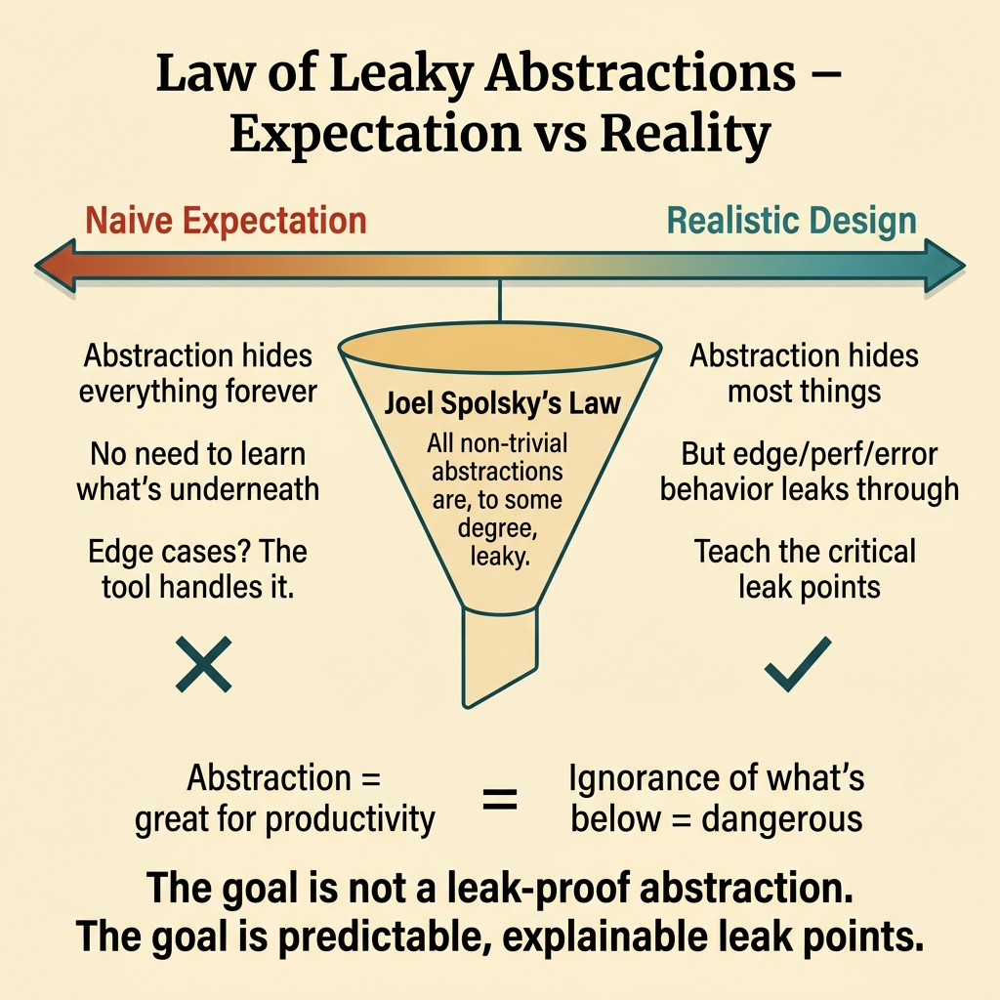
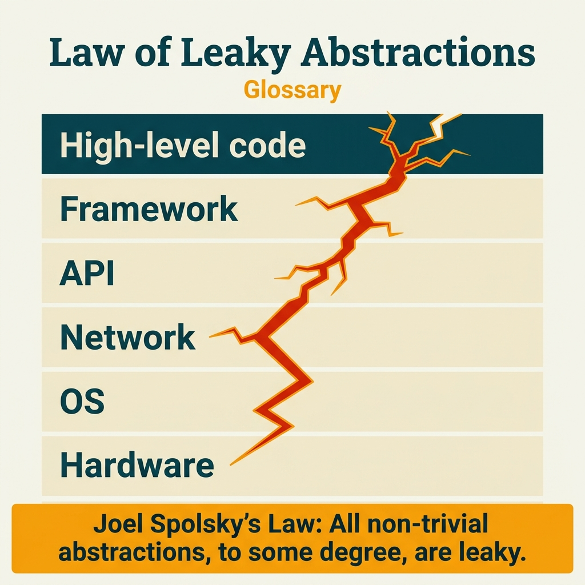

<!-- tags: glossary, reference, developer-cognition-team-dynamics, design-for-humans, law-of-leaky-abstractions -->
# Law of Leaky Abstractions

> The observation that every sufficiently complex abstraction will eventually leak somewhere.

| Aspect | Detail |
| --- | --- |
| **Concept** | The observation that every sufficiently complex abstraction will eventually leak somewhere. |
| **Audience** | Architect, library author, platform engineer |
| **Primary style** | Glossary term |
| **Entry point** | Use when the team expects an abstraction to completely erase all complexity from the layer below. |

📅 Created: 2026-03-30 · 🔄 Updated: 2026-04-04 · ⏱️ 9 min read

---

## 1. DEFINE

Picture an abstraction that initially hides a great deal of complexity, but the longer you use it the more corners you find that require understanding internals: performance edge cases, retry semantics, memory behavior, SQL plans, network quirks. The Law of Leaky Abstractions is not pessimistic; it simply reminds us that no layer of abstraction is powerful enough to completely erase the underlying reality.

**Law of Leaky Abstractions** is the observation that every sufficiently complex abstraction will eventually leak somewhere.

| Variant | Description |
| --- | --- |
| Inevitable leak | Leaking is the nature of any sufficiently complex abstraction. |
| Managed leak | The leak is accepted and clearly guided. |
| Harmful leak | The leak appears unexpectedly on a critical path without prior signal. |

| Approach | Time | Space | When to choose |
| --- | --- | --- | --- |
| Design with honest limits | O(n abstraction reviews) | O(doc/contracts) | When the team is over-promising the "transparency" of an abstraction. |
| Teach underlying mental model selectively | O(n examples) | O(doc notes) | When users need to understand certain internals to use the abstraction safely. |
| Monitor recurring leak points | O(n support cycles) | O(issue logs) | When the same leak causes confusion over and over. |

Core insight:

> The goal is not to create an abstraction that never leaks. The goal is to make the leak points predictable, explainable, and as minimally disruptive to the experience as possible.

### 1.1 Invariants & Failure Modes

The invariant is that the team must not promise an abstraction erases all complexity if reality says otherwise. When the promise vastly exceeds reality, leaks appear as shocks rather than as predicted limitations.

---

## 2. CONTEXT

**Who uses it**: Architect, library author, platform engineer

**When**: Use when the team expects an abstraction to completely erase all complexity from the layer below.

**Purpose**: The goal is not to create an abstraction that never leaks. The goal is to make the leak points predictable, explainable, and as minimally disruptive to the experience as possible.

**In the ecosystem**:
- This law does not say abstractions are useless; it says abstractions always have boundaries.
- Different leaks vary in how dangerous they are: some only require extra learning, some break correctness.
- This is a principle that shapes expectations, not a reason to abandon abstraction altogether.

---

All abstractions leak — Joel Spolsky made that clear. But what are the implications for API design, team knowledge, and hiring?

## 3. EXAMPLES

The law of leaky abstractions surfaces most visibly when a junior developer uses an ORM proficiently but production queries are slow because they do not understand the SQL underneath, when a framework update breaks an app because it depended on undocumented behavior, or when "AWS is down" but the team does not understand the networking below. The examples below place the pattern into exactly those situations.

### Example 1: Basic — The team expects the abstraction to solve every detail

A database wrapper is introduced as the way to "never think about SQL again." At the basic level, this law warns that such messaging is dangerous if performance still depends on query shape.

The input is an abstraction described as omnipotent. The output is a more honest description and scope. Complexity is low because it is mainly fixing expectations.

```go
type RepositoryContract struct {
	HidesBoilerplate         bool
	StillNeedsQueryAwareness bool
}
```

**Why?** Wrong expectations are the biggest source of disappointment. If users believe the abstraction covers everything, they will be shocked when edge cases demand understanding the internals.

**Takeaway**: You fix the abstraction's promise so it better matches reality.
**Caveat**: Being honest does not mean scaring users with the full complexity upfront.
**Use when**: an abstraction is being promoted as "eliminating the need to understand the layer below."

### Example 2: Intermediate — The same leak point keeps repeating

Support keeps receiving questions about timeout, retry, or transaction behavior of the same abstraction. At the intermediate level, this law suggests that a repeating leak point should be brought into the docs and examples.

The input is recurring confusion around the same leak. The output is targeted docs and examples for that leak point. Complexity is moderate because it requires looking at support reality.



*Figure: The goal is not a leak-proof abstraction. The goal is predictable, explainable leak points.*

```go
type LeakPoint struct {
	Name       string
	WhyItLeaks string
	SafeUsage  string
}
```

**Why?** When the same leak causes pain multiple times, the problem is no longer that users "did not read carefully." It is a signal that the abstraction has not taught the right mental model at its most critical point.

**Takeaway**: You use repeating issues as indicators to re-teach the abstraction's real boundaries.
**Caveat**: Not every support ticket deserves to be elevated to docs; prioritize leaks with clear blast radius.
**Use when**: the same misunderstanding about the abstraction repeats across multiple teams or users.

### Example 3: Advanced — A leak affecting correctness needs redesign

If a queue abstraction keeps causing users to forget about idempotency and produce duplicate writes, that is no longer a harmless leak. At the advanced level, this law is not an excuse to accept pain; it is a reason to redesign leaks with high impact.

The input is a leak that is breaking correctness or reliability. The output is a new abstraction or new guardrails so the leak causes less harm. Complexity is high because it touches core design.

```go
type ConsumerGuardrail struct {
	IdempotencyRequired bool
	RetryBehaviorClear  bool
}
```

**Why?** Accepting that leaks exist is normal; accepting that harmful leaks keep repeating is not. This law helps the team be more humble about abstraction, but does not exempt them from improving dangerous paths.

**Takeaway**: You use this law to design more realistically, not to rationalize bad experiences.
**Caveat**: Redesigning the abstraction can be expensive; focus on leaks causing correctness or reliability pain first.
**Use when**: a specific leak is leading to repeating bugs or incidents.

### Example 4: Expert — The organization must know which abstractions require which background knowledge

An organization has many platform layers. If no one states clearly which layer requires infrastructure knowledge and which layer genuinely hides it, onboarding will be chaotic. At the expert level, this law suggests mapping "required background knowledge" for each critical abstraction.

The input is multiple abstractions with different leak levels. The output is a knowledge map helping the team know where to dig into internals. Complexity is high because it involves both taxonomy and training.

```go
type KnowledgeMap struct {
	Abstraction         string
	NeedsInfraKnowledge bool
	NeedsDBKnowledge    bool
}
```

**Why?** When knowledge expectations are not explicit, newcomers are easily surprised by leaks that "everyone implicitly knows." A knowledge map turns the platform's leak budget into something that can be taught and learned.

**Takeaway**: You turn leaks from word-of-mouth knowledge into structured expectations.
**Caveat**: A map that is too detailed and not updated will quickly become stale.
**Use when**: onboarding or cross-team work keeps stumbling over internals "thought to be fully abstracted away."

---

## 4. COMPARE




*Figure: Position of the law of leaky abstractions among leaky abstraction, separation of concerns, and knowledge depth.*

The law of leaky abstractions sounds like "abstractions are bad." Wrong: Spolsky says abstraction is necessary but developers must understand the layer below because leaks will happen. Abstraction is great for productivity, dangerous for ignorance.

### Level 1

```text
abstraction adds convenience
  but underlying reality still exists
  and eventually surfaces somewhere
```

*Figure: Level 1 shows abstraction does not erase reality; it just changes where and how the user encounters it.*

### Level 2

```text
naive view
  abstraction hides everything forever

realistic view
  abstraction hides most things
  but some edge/perf/error behavior still leaks through
```

*Figure: Level 2 emphasizes this law is most useful when it recalibrates the team's design expectations.*

### Easy to confuse or cross the boundary

| # | Severity | Mistake | Consequence | Fix |
| --- | --- | --- | --- | --- |
| 1 | 🔴 Fatal | Promising abstraction covers all complexity | Leaks become runtime shocks | Design honest limits and matching docs. |
| 2 | 🟡 Common | Using this law as an excuse to fix nothing | Pain is normalized as repeating | Prioritize redesigning harmful leaks. |
| 3 | 🟡 Common | Not teaching repeating leak points | Support load increases | Write examples/docs targeted at the leak point. |
| 4 | 🔵 Minor | Not making knowledge expectations explicit | Chaotic onboarding | Map abstractions to required background knowledge. |

### Quick scan

| If you encounter | What to do |
| --- | --- |
| Team expects abstraction to cover everything | Recalibrate the promise and scope. |
| Same leak point keeps repeating | Write targeted docs and examples. |
| Leak is causing real bugs | Redesign the harmful path first. |
| Onboarding keeps hitting implicitly-known internals | Create a knowledge map for abstractions. |

---

## 5. REF

| Resource | Type | Link | Notes |
| --- | --- | --- | --- |
| The Law of Leaky Abstractions | Essay | https://www.joelonsoftware.com/2002/11/11/the-law-of-leaky-abstractions/ | The most famous original post about this law. |
| Leaky Abstraction | Related term | ./04-leaky-abstraction.md | The specific term for a concrete leak. |
| Separation of Concerns | Related term | ./06-separation-of-concerns.md | Good boundaries make leaks more manageable. |

---

## 6. RECOMMEND

The law of leaky abstractions solves the problem of "developers using tools without understanding what is underneath." The next question: how does separation of concerns manage complexity, and what about single source of truth?

| Expand to | When | Why | File/Link |
| --- | --- | --- | --- |
| Leaky Abstraction | When you want to zoom into a specific API/tool leak | This is the implementation-level manifestation of the law. | [Leaky Abstraction](./04-leaky-abstraction.md) |
| Explicit over Implicit | When you want to make the abstraction's limits clearer | Explicitness makes leaks less surprising. | [Explicit over Implicit](./08-explicit-over-implicit.md) |
| Design for Humans | When you need to return to the hub | Keep context of the full topic. | [Design for Humans](./README.md) |

Back to that junior ORM user from the beginning — proficient with the tool, does not understand SQL, production queries slow. Now you know: abstractions save time, leaks cost time. Learn the layer below. Not all of it — but enough to debug when (not if) the abstraction leaks.

**Links**: [← Previous](./04-leaky-abstraction.md) · [→ Next](./06-separation-of-concerns.md)
