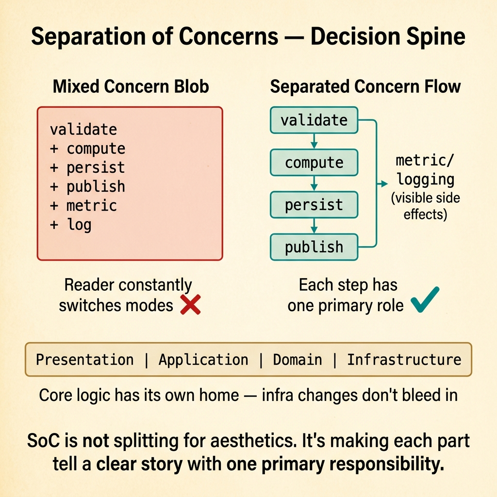
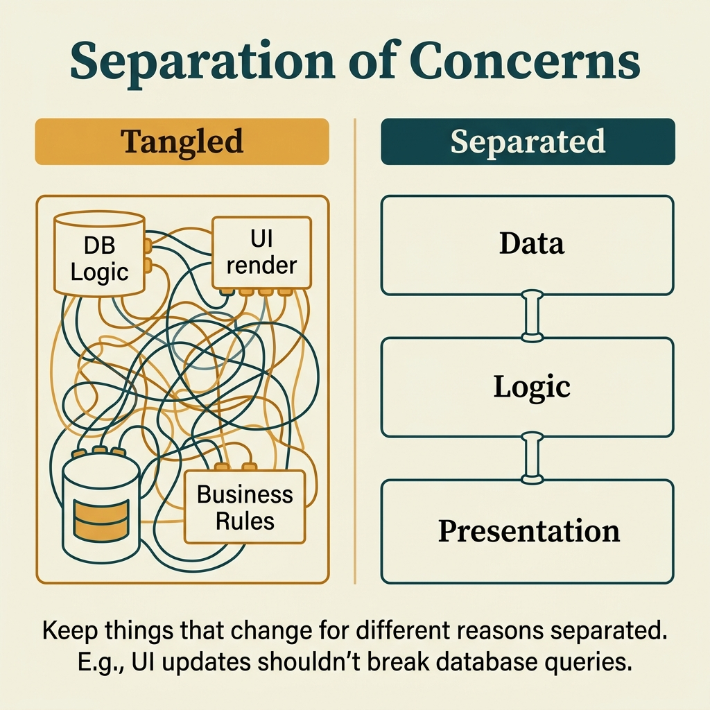

<!-- tags: glossary, reference, developer-cognition-team-dynamics, design-for-humans, separation-of-concerns -->
# Separation of Concerns

> The principle of dividing different concerns into separate modules, layers, or workflows to reduce coupling and increase clarity.

| Aspect | Detail |
| --- | --- |
| **Concept** | The principle of dividing different concerns into separate modules, layers, or workflows to reduce coupling and increase clarity. |
| **Audience** | Developer, architect |
| **Primary style** | Glossary term |
| **Entry point** | Use when a module, service, or workflow is holding too many fundamentally different types of responsibility, making it hard for the reader to reason about. |

📅 Created: 2026-03-30 · 🔄 Updated: 2026-04-04 · ⏱️ 9 min read

---

## 1. DEFINE

Picture a function that validates input, calculates price, writes to the database, sends an event, and logs analytics. All of these "relate" to the same request, but when crammed into one place, the reader can no longer tell what is a business decision, what is a side effect, and what is instrumentation. Separation of Concerns reminds us that being related to the same use case does not mean having to live in the same block of code.

**Separation of Concerns** is the principle of dividing different concerns into separate modules, layers, or workflows to reduce coupling and increase clarity.

| Variant | Description |
| --- | --- |
| Functional separation | Separating validate, compute, persist, and publish into clear roles. |
| Layer separation | Separating concerns by presentation, application, domain, and infrastructure. |
| Operational separation | Separating build, deploy, observe, and remediate workflows instead of blending them into one blob process. |

| Approach | Time | Space | When to choose |
| --- | --- | --- | --- |
| Split by reason to change | O(n refactors) | O(refactor plan) | When a module changes for too many different kinds of reasons. |
| Expose orchestration spine clearly | O(n use cases) | O(1) | When the flow is correct but responsibilities are stuck together. |
| Separate side effects from core decision | O(n boundary redesigns) | O(interface changes) | When the user or reviewer cannot see where the business core is. |

Core insight:

> Separation of Concerns is not about splitting for aesthetics. It is about making each part of the code tell a clear enough story, with one primary type of responsibility, so the reader does not have to process too many cognitive modes at the same time.

### 1.1 Invariants & Failure Modes

The invariant is that each module or step should have one primary reason to change. When a single spot changes for business rules, infrastructure, observability, and compliance all at once, the boundary is too dirty.

---

## 2. CONTEXT

**Who uses it**: Developer, architect

**When**: Use when a module, service, or workflow is holding too many fundamentally different types of responsibility, making it hard for the reader to reason about.

**Purpose**: Separation of Concerns is not about splitting for aesthetics. It is about making each part of the code tell a clear enough story, with one primary type of responsibility, so the reader does not have to process too many cognitive modes at the same time.

**In the ecosystem**:
- Different concerns do not always need to be in different files, but they must be separated enough for local reasoning to remain feasible.
- Too much false separation can also hurt if the reader must jump too many places to understand one flow.
- This is a balance between local clarity and end-to-end coherence.

---

Separating responsibilities is clear. But where is the boundary, when does SoC become over-engineering, and when is tight coupling OK?

## 3. EXAMPLES

SoC surfaces most visibly when business logic lives inside a UI handler, when changing the database requires editing the controller, or when one change propagates across 10 files because of excessive SoC. The examples below place the pattern into exactly those situations.

### Example 1: Basic — A function does too many things at once

You open a 40-line function and have to constantly switch thinking modes: one moment it is business rules, then DB, then metrics. At the basic level, separation starts by naming and splitting the concerns that share the same space.

The input is a mixed-concern function. The output is steps with clearer roles. Complexity is low because it mainly reveals structure.

```go
func checkout(cmd CheckoutCommand) error {
	if err := validateCheckout(cmd); err != nil {
		return err
	}
	finalPrice := calculateFinalPrice(cmd)
	return persistOrder(cmd.UserID, finalPrice)
}
```

**Why?** When many concerns live crammed inside the same block, the reader must hold multiple types of questions in their head simultaneously. Splitting steps by concern makes local reasoning less expensive.

**Takeaway**: You reduce cognitive switching within a function by making roles clearer.
**Caveat**: Splitting too aggressively into dozens of generic helpers can also make the flow harder to follow in a different way.
**Use when**: a small function still causes reviewers to switch context constantly.

### Example 2: Intermediate — Side effects obscure the business core

In a use case, metrics and event publishing are interleaved right between business logic lines. At the intermediate level, separation demands that the business decision spine is visible first, with side effects placed after or clearly signaled.

The input is a flow where side effects are mixed with the decision core. The output is orchestration where core logic is easier to see. Complexity is moderate because flow coherence must be maintained.



*Figure: SoC is not splitting for aesthetics. It is making each part tell a clear story with one primary responsibility.*

```go
func executePayment(cmd PaymentCommand) error {
	decision, err := evaluatePayment(cmd)
	if err != nil {
		return err
	}
	if err := persistPaymentDecision(decision); err != nil {
		return err
	}
	return publishPaymentCreated(decision)
}
```

**Why?** Good separation lets the reader see "what is the system deciding" first, then "how is it announcing or recording that." If both are mixed, the business core easily drowns in noise.

**Takeaway**: You make the use case backbone clearer by placing side effects in their proper position.
**Caveat**: Do not pretend side effects do not exist; they must be clearly signaled, not hidden.
**Use when**: the business flow is correct but very hard to read because logging, metrics, and notifications are densely interleaved.

### Example 3: Advanced — Layer separation so infrastructure changes do not touch logic

A business module knows too much about SQL schemas and HTTP serialization. At the advanced level, separation means keeping the core decision minimally dependent on transport or storage details.

The input is an application/domain boundary that is tightly coupled with infrastructure details. The output is a clear interface between core and infrastructure. Complexity is high because it touches architecture.

```go
type OrderRepository interface {
	Save(order Order) error
}

type CreateOrderUseCase struct {
	repo OrderRepository
}
```

**Why?** When core logic and infrastructure details are tightly coupled, every change in transport or storage bleeds into business reasoning. Layer separation reduces the blast radius of change and makes core logic easier to read.

**Takeaway**: You give business reasoning its own home, with less noise from infrastructure.
**Caveat**: Indiscriminate interface-ification can also create meaningless thin abstractions.
**Use when**: domain logic is currently interleaved with serialization, SQL shapes, or vendor SDK code.

### Example 4: Expert — Separation of concerns must also apply to workflow and organization

A team simultaneously builds, deploys, handles incidents, and designs platform — everything jammed into the same lane. At the expert level, separation does not stop at code; it extends to how workflow is organized so concerns do not pile on top of each other.

The input is a workflow where one person or team holds too many operating concerns. The output is clearer ownership and lanes between build, run, and evolve. Complexity is high because it involves team design.

```go
type OwnershipLane struct {
	PrimaryConcern string
	OwnerTeam      string
}
```

**Why?** Concerns do not only live in code; they live in work schedules, review queues, and ownership too. If every operating and development concern layers on top of each other, the organization's cognitive load increases exactly like a mixed-concern function.

**Takeaway**: You expand separation from a code-level rule into a design principle for the system of work.
**Caveat**: Splitting lanes too rigidly can create handoff costs and silos; coordination paths must always be clear.
**Use when**: team throughput is dropping because too many different types of work are competing for the same attention bandwidth.

---

## 4. COMPARE




*Figure: Position of SoC among SOLID (SRP), hexagonal architecture, and modular design.*

SoC sounds like SRP. Close — SRP (a class has one reason to change) is an application of SoC at class level. SoC is broader: modules, layers, and services all need separation. SRP ⊂ SoC.

### Level 1

```text
one concern per main boundary
  -> easier reasoning
  -> clearer changes
```

*Figure: Level 1 shows good separation reduces the number of question types the reader must answer in the same place.*

### Level 2

```text
mixed concern blob
  validate + compute + persist + publish + metric

separated concern flow
  validate -> compute -> persist -> publish
  metric/logging as visible side effects
```

*Figure: Level 2 emphasizes the goal is not infinite splitting, but making the role of each part clear enough.*

### Easy to confuse or cross the boundary

| # | Severity | Mistake | Consequence | Fix |
| --- | --- | --- | --- | --- |
| 1 | 🔴 Fatal | Mixing many concerns into the same boundary | Reader must reason in multiple modes simultaneously | Split by reason-to-change. |
| 2 | 🟡 Common | Over-splitting, shredding the flow | Too many jumps needed to understand the story | Keep the decision spine clear at the orchestration layer. |
| 3 | 🟡 Common | Hiding side effects to "look clean" | Runtime behavior becomes hard to see | Signal side effects clearly, do not blend blindly. |
| 4 | 🔵 Minor | Only applying separation to code, ignoring workflow | Team is still overloaded at the organizational level | Design ownership and lanes appropriately. |

### Quick scan

| If you encounter | What to do |
| --- | --- |
| A function that makes you constantly switch thinking modes | Split by reason-to-change. |
| Side effects swallowing the business core | Surface the decision spine first. |
| Domain logic tightly coupled with infrastructure | Build a clearer core/infra boundary. |
| Team workflow also has mixed concerns | Separate ownership lanes appropriately. |

---

## 5. REF

| Resource | Type | Link | Notes |
| --- | --- | --- | --- |
| Separation of concerns | Reference | https://en.wikipedia.org/wiki/Separation_of_concerns | Foundational concept. |
| A Philosophy of Software Design | Book | https://web.stanford.edu/~ouster/cgi-bin/book.php | Useful on complexity and module design. |
| Cognitive Load | Related term | ../cognitive-mental-model/01-cognitive-load.md | Good separation directly reduces cognitive load. |

---

## 6. RECOMMEND

SoC solves the problem of "change one thing, break five others." The next question: how does single source of truth work, and what about explicit over implicit?

| Expand to | When | Why | File/Link |
| --- | --- | --- | --- |
| Explicit over Implicit | When poor separation is caused by implicit boundaries | Making roles explicit is usually the first fix. | [Explicit over Implicit](./08-explicit-over-implicit.md) |
| Single Source of Truth | When concerns overlap because data is duplicated many places | SSOT helps keep boundaries cleaner. | [Single Source of Truth](./07-single-source-of-truth.md) |
| Design for Humans | When you need to return to the hub | Keep context of the full topic. | [Design for Humans](./README.md) |

Back to that business logic inside the handler from the beginning — changing DB required editing the controller. Now you know: separate concerns = separate reasons to change. Domain logic, infrastructure, presentation — each changes for different reasons. Separate them.

**Links**: [← Previous](./05-law-of-leaky-abstractions.md) · [→ Next](./07-single-source-of-truth.md)
