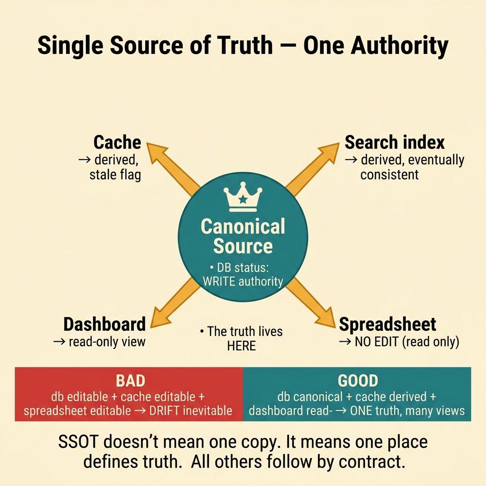
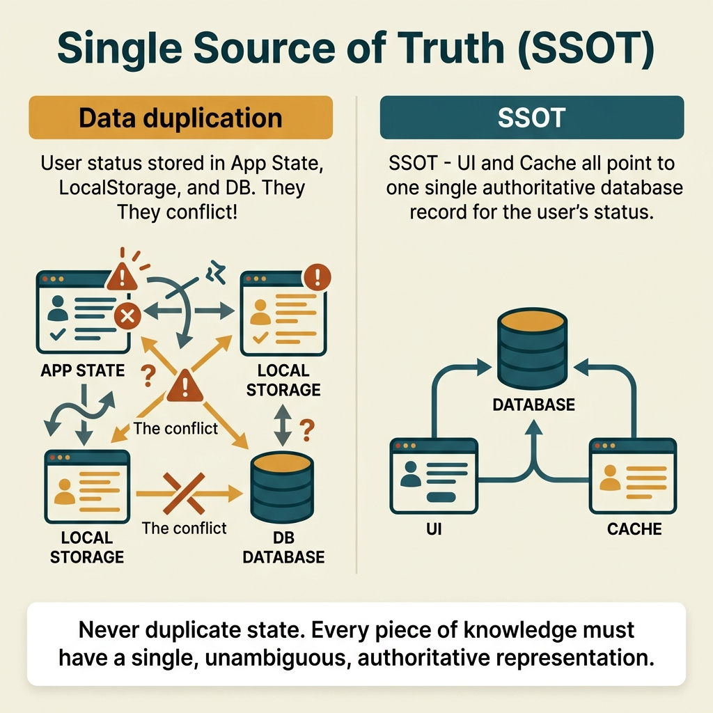

<!-- tags: glossary, reference, developer-cognition-team-dynamics, design-for-humans, single-source-of-truth -->
# Single Source of Truth

> The principle that each important piece of information should have exactly one canonical location to prevent data drift and cognitive drift.

| Aspect | Detail |
| --- | --- |
| **Concept** | The principle that each important piece of information should have exactly one canonical location to prevent data drift and cognitive drift. |
| **Audience** | Backend engineer, data engineer, tech lead |
| **Primary style** | Glossary term |
| **Entry point** | Use when the same information is duplicated across multiple places and the team starts arguing "which one is the truth." |

📅 Created: 2026-03-30 · 🔄 Updated: 2026-04-04 · ⏱️ 9 min read

---

## 1. DEFINE

Picture subscription status stored in the database, cache, search index, and dashboard config. Each copy might be justified for performance or product reasons, but if nobody knows which is canonical, people will debug by looking at the wrong replica. Single Source of Truth exists to settle which location defines "the truth," while all other locations are merely projections or caches.

**Single Source of Truth** is the principle that each important piece of information should have exactly one canonical location to prevent data drift and cognitive drift.

| Variant | Description |
| --- | --- |
| Data SSOT | One canonical location for the actual data value. |
| Policy SSOT | One canonical location for rules, config, or decision logic. |
| Documentation SSOT | One canonical location for definitions or processes to prevent knowledge drift. |

| Approach | Time | Space | When to choose |
| --- | --- | --- | --- |
| Declare canonical owner explicitly | O(n data domains) | O(doc) | When the team is unclear about the real source. |
| Treat replicas as derived views | O(n boundaries) | O(sync rules) | When multiple copies are needed but roles must not be confused. |
| Remove duplicated editable sources | O(n cleanups) | O(migration plan) | When drift occurs because multiple places are allowed to write. |

Core insight:

> SSOT does not mean only one copy exists. It means only one place has the authority to define "what is true," and all other places must follow it through a clear contract.

### 1.1 Invariants & Failure Modes

The invariant is that every replica must be able to answer "where does it originate from, and when there is a discrepancy, which one is trusted?" If that answer is vague, drift will soon become a bug or a knowledge argument.

---

## 2. CONTEXT

**Who uses it**: Backend engineer, data engineer, tech lead

**When**: Use when the same information is duplicated across multiple places and the team starts arguing "which one is the truth."

**Purpose**: SSOT does not mean only one copy exists. It means only one place has the authority to define "what is true," and all other places must follow it through a clear contract.

**In the ecosystem**:
- You can have many caches, read models, or exports and still maintain SSOT if the canonical owner is clear.
- The problem starts when multiple places are editable as peer sources.
- SSOT applies to data as well as docs, config, and workflow decisions.

---

A single trusted source is clear. But does SSOT apply differently for config, data, and documentation?

## 3. EXAMPLES

SSOT surfaces most visibly when the same config lives in three places with different values, when two databases hold the same data but conflict, or when documentation says A but code does B. The examples below place the pattern into exactly those situations.

### Example 1: Basic — The same field is being updated in two places

A service updates `status` in the database, but the admin panel allows editing status directly in cache "for speed." At the basic level, SSOT starts by locking down the single location allowed to write.

The input is a value with multiple write paths. The output is a clear canonical owner with other write paths removed or converted into requests to the owner. Complexity is low because it is mainly boundary clarification.

```go
type SubscriptionRecord struct {
	Status string
}

func updateSubscriptionStatus(id string, status string) error {
	return repo.UpdateStatus(id, status)
}
```

**Why?** When multiple places are allowed to write, drift is not a rare possibility but an inevitable outcome. A canonical write path is the cheapest way to prevent divergence at the root.

**Takeaway**: You settle "who has the authority to speak the truth" for a piece of data.
**Caveat**: Centralizing the write path does not mean everything must be synchronous; projections still have their place.
**Use when**: the same field is being mutated in multiple places for convenience or local optimization.

### Example 2: Intermediate — Allow many copies but keep roles clear

A search index or cache is necessary, but if the team starts debugging by looking at a projection first and trusting it as truth, SSOT is blurred. At the intermediate level, derived views must be clearly marked as derived.

The input is a system with read models, caches, or projections. The output is language and contracts that distinguish the canonical source from derived copies. Complexity is moderate because it involves data flow reasoning.



*Figure: SSOT does not mean one copy. It means one place defines truth. All others follow by contract.*

```go
type ProjectionState struct {
	SourceVersion int64
	Stale         bool
}
```

**Why?** Replicas and projections are very useful, but only safe when users understand they are derived copies. Metadata like version or stale flags helps maintain the correct mental model when reading data outside the canonical source.

**Takeaway**: You keep the benefits of multiple copies without losing the concept of canonical truth.
**Caveat**: If the stale status is not reliably updated, the metadata becomes yet another source of confusion.
**Use when**: the system needs caches, read models, or exports but the team keeps confusing their roles.

### Example 3: Advanced — SSOT for policy and config, not just for data

A rate limit rule is duplicated in code, docs, and dashboard config. When one place is updated but the others are not, system behavior and team knowledge start to diverge. At the advanced level, SSOT must also cover policy and configuration.

The input is a policy living in multiple editable artifacts. The output is one canonical location for the rule, with other places only displaying or consuming it. Complexity is high because it involves governance.

```go
type RateLimitPolicy struct {
	RequestsPerMinute int
}
```

**Why?** Policy drift is often more dangerous than data drift because it makes the team think the system follows one set of rules while runtime actually follows another. A canonical policy source keeps alignment between code, docs, and operations more durable.

**Takeaway**: You expand SSOT from data to rules and behavior definitions.
**Caveat**: A canonical policy source that is too hard to edit can also spawn shadow copies elsewhere; tooling must remain convenient.
**Use when**: docs, dashboards, and code describe the same rule through different editable sources.

### Example 4: Expert — SSOT is an information architecture for the entire organization

A large organization has wiki, Notion, runbooks, code comments, and dashboards all talking about the same system. If there is no canonical location for each type of knowledge, onboarding and incident handling get pulled into a game of "which version is correct." At the expert level, SSOT is an information architecture policy.

The input is system knowledge fragmented across many tools. The output is a map of "which type of knowledge has its canonical source where." Complexity is high because it is no longer a pure code problem.

```go
type KnowledgeSource struct {
	Kind      string
	Canonical string
}
```

**Why?** Organizations do not run on code alone; they run on knowledge. If canonical knowledge is not named and assigned, every incident or onboarding will spend energy verifying sources.

**Takeaway**: You turn SSOT into a mechanism for preventing cognitive drift at the organizational level, not just data drift at the system level.
**Caveat**: SSOT for docs does not mean stuffing everything into a single file; the issue is ownership and precedence, not file count.
**Use when**: the team frequently argues about whether docs, the dashboard, or code is the correct source for a given issue.

---

## 4. COMPARE




*Figure: Position of SSOT among DRY, data consistency, and configuration management.*

SSOT sounds like DRY. Close — but DRY says "don't duplicate logic," SSOT says "each fact has exactly one authoritative place." DRY is about code; SSOT is about data and truth ownership. Config derives from one source, not copied to three places.

### Level 1

```text
canonical source
  -> derived views
  -> caches / replicas / docs
```

*Figure: Level 1 shows SSOT clearly separates the real source from copies serving other purposes.*

### Level 2

```text
bad
  db status editable
  admin cache editable
  spreadsheet editable

good
  db status canonical
  cache derived
  dashboard read-only view
```

*Figure: Level 2 emphasizes the problem is not the number of copies, but truth-defining authority being duplicated.*

### Easy to confuse or cross the boundary

| # | Severity | Mistake | Consequence | Fix |
| --- | --- | --- | --- | --- |
| 1 | 🔴 Fatal | Multiple places have write authority over "the truth" | Drift is inevitable | Lock down canonical owner and write path. |
| 2 | 🟡 Common | Mistaking a projection or cache for the source of truth | Debugging and reasoning go wrong | Clearly label the role of derived views. |
| 3 | 🟡 Common | Only applying SSOT to data, ignoring policy and docs | Cognitive drift remains high | Extend SSOT to config and knowledge artifacts. |
| 4 | 🔵 Minor | Forcing everything into one hard-to-use location | Shadow copies sprout again | Design the canonical source to be both clear and convenient to update. |

### Quick scan

| If you encounter | What to do |
| --- | --- |
| A field being edited in multiple places | Lock down the canonical write path. |
| Projection mistaken for the real source | Clearly attach derived metadata. |
| Policy or docs drifting from runtime | Create a canonical policy source. |
| Organizational knowledge is fragmented | Build a knowledge-source map. |

---

## 5. REF

| Resource | Type | Link | Notes |
| --- | --- | --- | --- |
| Single source of truth | Reference | https://en.wikipedia.org/wiki/Single_source_of_truth | Concept overview. |
| Separation of Concerns | Related term | ./06-separation-of-concerns.md | Clean boundaries help SSOT stay clear. |
| Explicit over Implicit | Related term | ./08-explicit-over-implicit.md | Canonical ownership needs to be stated explicitly, not assumed. |

---

## 6. RECOMMEND

SSOT solves the problem of "multiple sources conflicting with each other." The next question: how does explicit over implicit work, and what about code readability?

| Expand to | When | Why | File/Link |
| --- | --- | --- | --- |
| Separation of Concerns | When SSOT is blurry because responsibilities overlap | Correct boundaries help source-of-truth stay clearer. | [Separation of Concerns](./06-separation-of-concerns.md) |
| Explicit over Implicit | When the source owner is an implicit assumption | Explicit ownership and precedence are needed. | [Explicit over Implicit](./08-explicit-over-implicit.md) |
| Design for Humans | When you need to return to the hub | Keep context of the full topic. | [Design for Humans](./README.md) |

Back to those three config locations from the beginning — each with a different value. Now you know: define one source, derive the rest. Config: env vars → app reads. Schema: DB migration → ORM generates. Doc: code → generates. One truth, many views.

**Links**: [← Previous](./06-separation-of-concerns.md) · [→ Next](./08-explicit-over-implicit.md)
