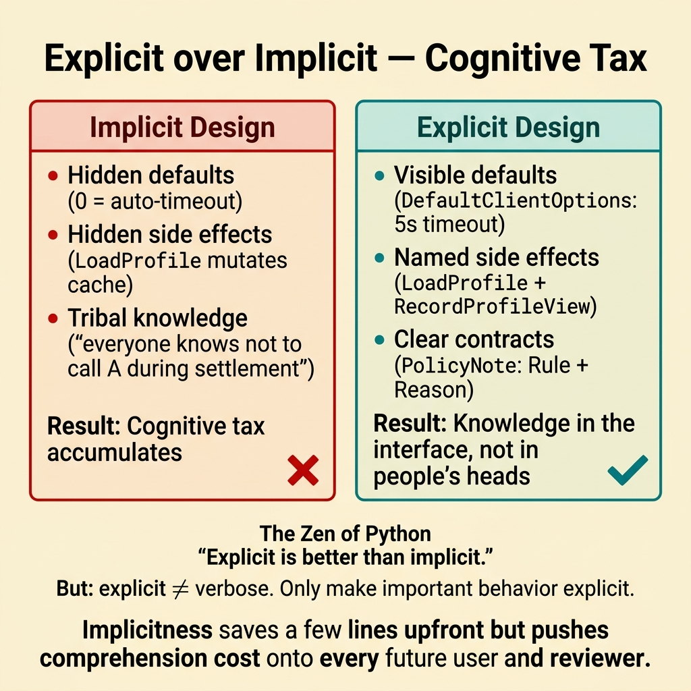
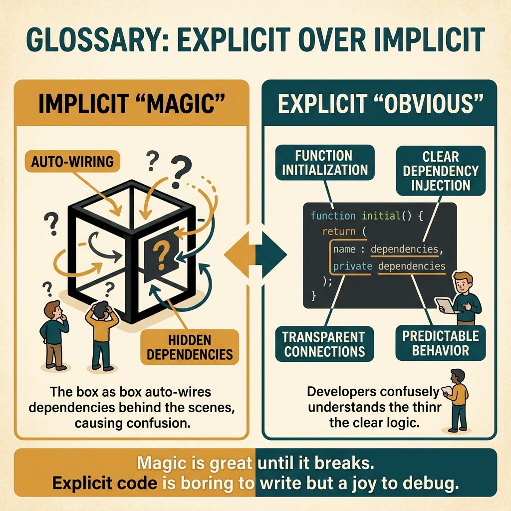

<!-- tags: glossary, reference, developer-cognition-team-dynamics, design-for-humans, explicit-over-implicit -->
# Explicit over Implicit

> The principle of favoring explicitness in behavior, data flow, and API contracts instead of relying on implicit conventions.

| Aspect | Detail |
| --- | --- |
| **Concept** | The principle of favoring explicitness in behavior, data flow, and API contracts instead of relying on implicit conventions. |
| **Audience** | API designer, backend engineer, tech lead |
| **Primary style** | Glossary term |
| **Entry point** | Use when users or reviewers constantly have to guess implicit rules, implicit defaults, or implicit side effects to understand the system. |

📅 Created: 2026-03-30 · 🔄 Updated: 2026-04-04 · ⏱️ 9 min read

---

## 1. DEFINE

Picture an API that says passing `0` means "use the default timeout automatically"; leaving a field empty "implicitly" enables retry; calling a read function sometimes mutates the cache. All of these might be logical from the author's perspective. But for the user, the system is demanding they know too many hidden rules. Explicit over implicit is the reminder that important behavior should be stated outright.

**Explicit over Implicit** is the principle of favoring explicitness in behavior, data flow, and API contracts instead of relying on implicit conventions.

| Variant | Description |
| --- | --- |
| Explicit contract | Inputs, outputs, side effects, and defaults are stated clearly. |
| Explicit flow | Processing sequence and ownership path are easy to trace. |
| Explicit policy | Rules and assumptions are not hidden behind "people in the field will just know." |

| Approach | Time | Space | When to choose |
| --- | --- | --- | --- |
| Surface important defaults | O(n API reviews) | O(1) | When implicit defaults cause misunderstanding or misuse. |
| Name side effects and boundaries honestly | O(n refactors) | O(refactor notes) | When actual behavior is not visible at the interface. |
| Make policy visible where it matters | O(n docs/contracts) | O(doc updates) | When the team relies too much on tribal knowledge. |

Core insight:

> Implicitness often saves a few lines upfront but pushes comprehension cost onto every user and reviewer who comes after. Explicitness is not about being verbose; it is about preventing important assumptions from hiding beneath the surface.

### 1.1 Invariants & Failure Modes

The invariant is that users should not have to guess rules with high blast radius. When correctness depends on an implicit convention only "old-timers" know, the system owes an explicitness debt.

---

## 2. CONTEXT

**Who uses it**: API designer, backend engineer, tech lead

**When**: Use when users or reviewers constantly have to guess implicit rules, implicit defaults, or implicit side effects to understand the system.

**Purpose**: Implicitness often saves a few lines upfront but pushes comprehension cost onto every user and reviewer who comes after. Explicitness is not about being verbose; it is about preventing important assumptions from hiding beneath the surface.

**In the ecosystem**:
- Not every detail needs to be explicit; what deserves explicitness is whatever affects correctness, safety, or reasoning cost.
- Explicit over implicit is strongest at defaults, side effects, ownership, and policy.
- This is a principle for reducing surprise and reducing tribal knowledge.

---

Explicit is better than implicit — that is clear. But when does explicit become verbose, when is an implicit convention OK, and what about the Zen of Python?

## 3. EXAMPLES

Explicit over implicit surfaces most visibly when Go requires checking errors instead of implicitly throwing exceptions, when dependencies are injected explicitly instead of magic auto-wiring, or when a config key states `DATABASE_URL` explicitly instead of `DB`. The examples below place the pattern into exactly those situations.

### Example 1: Basic — An important default is hidden behind a special value

A constructor uses `0` to mean "pick a suitable timeout automatically." New users do not know that and think `0` means no timeout. At the basic level, important defaults should be explicit rather than hidden behind sentinel values.

The input is an API using special values to trigger defaults. The output is a more explicit constructor or option. Complexity is low because it mainly fixes interface semantics.

```go
type ClientOptions struct {
	Timeout time.Duration
}

func DefaultClientOptions() ClientOptions {
	return ClientOptions{Timeout: 5 * time.Second}
}
```

**Why?** Sentinel values like `0`, `nil`, or `""` are only really clear to the original author. An explicit default lets the user see the actual behavior immediately without having to reason from implicit conventions.

**Takeaway**: You bring an important assumption out of the implicit zone.
**Caveat**: Not every zero value is bad; just be explicit with values that control important behavior.
**Use when**: an API overloads special values in ways that easily cause misunderstanding.

### Example 2: Intermediate — Side effects are not visible at the call site

A function `LoadProfile()` not only reads a profile but also refreshes the cache and writes an audit event. At the intermediate level, explicitness requires the name or flow to clearly state significant side effects.

The input is a call site with hidden behavior. The output is new naming or flow that makes side effects more visible. Complexity is moderate because it usually requires refactoring boundaries.



*Figure: Implicitness saves a few lines upfront but pushes comprehension cost onto every future user and reviewer.*

```go
func LoadProfile(userID string) (Profile, error) {
	return repo.GetProfile(userID)
}

func RecordProfileView(userID string) error {
	return audit.LogProfileViewed(userID)
}
```

**Why?** Implicit side effects break the mental model of callers and reviewers. Explicitness does not necessarily mean exposing every detail, but behavior with business or operational significance must be visible enough.

**Takeaway**: You make the flow tell the truth about what actually happens.
**Caveat**: If every tiny side effect is split into its own call, the flow can become too fragmented; balance at the right abstraction level.
**Use when**: hidden side effects are creating review surprises or repeating misuse.

### Example 3: Advanced — The team relies on tribal knowledge about policy

Everyone "just knows" that service A must not be called concurrently with service B during settlement, but that rule does not appear anywhere in code or docs. At the advanced level, explicitness demands that critical policies live in shared artifacts.

The input is a policy currently living in the heads of a few veterans. The output is an explicit contract, doc, or guardrail. Complexity is high because it involves knowledge organization.

```go
type PolicyNote struct {
	Rule   string
	Reason string
}
```

**Why?** Tribal knowledge makes the system most fragile during onboarding, incidents, and ownership transfers. Explicit policy turns what "everyone on the team knows" into something newcomers can learn without guessing or asking privately.

**Takeaway**: You move critical knowledge from human memory into the team's shared interface.
**Caveat**: Explicitness must come with maintenance; an outdated policy note is worse than no note.
**Use when**: many important decisions are currently preserved through word-of-mouth habit.

### Example 4: Expert — Explicitness as a strategy for reducing cognitive tax across the platform

An organization has many tools where implicit defaults, implicit retry, implicit ownership, and implicit rollback semantics pile up. Each individual case might be "acceptable," but the cumulative effect creates a very large cognitive tax. At the expert level, explicitness must become a platform-level design principle.

The input is an ecosystem with many scattered implicit rules. The output is standards requiring important behavior to be clearly signaled. Complexity is high because it involves platform governance.

```go
type PlatformClarityStandard struct {
	DefaultsDocumented    bool
	SideEffectsNamed      bool
	OwnershipPathVisible  bool
}
```

**Why?** The largest cognitive tax usually does not come from a single implicit rule but from the total number of hidden rules users must remember when navigating multiple tools. Platform-level clarity standards help block this tax at ecosystem scale.

**Takeaway**: You use explicitness as a strategy for reducing cognitive tax across the entire developer journey.
**Caveat**: Extreme explicitness on every detail can make interfaces bloated; focus on high-impact behavior.
**Use when**: individual tools are "fine," but the overall platform is still hard to learn and hard to predict.

---

## 4. COMPARE




*Figure: Position of explicit over implicit among code readability, Go philosophy, and convention over configuration.*

Explicit sounds like verbose. True trade-off — but explicit in Go (error handling, no magic) avoids surprise. Implicit in Rails (convention over configuration) reduces boilerplate. Choose by ecosystem: Go values explicit, Rails values convention.

### Level 1

```text
important behavior
  -> named explicitly
  -> easier to predict
  -> easier to review
```

*Figure: Level 1 shows explicitness primarily increases predictability and reviewability.*

### Level 2

```text
implicit design
  hidden defaults
  hidden side effects
  tribal knowledge

explicit design
  visible defaults
  named side effects
  clear contracts
```

*Figure: Level 2 emphasizes explicitness helps critical knowledge leave individual heads and enter the shared interface.*

### Easy to confuse or cross the boundary

| # | Severity | Mistake | Consequence | Fix |
| --- | --- | --- | --- | --- |
| 1 | 🔴 Fatal | Hiding important defaults or side effects behind implicit conventions | Users easily misuse based on reasonable assumptions | Make important behavior explicit at the interface. |
| 2 | 🟡 Common | Forcing everything to be explicit to the point of verbosity | Interface bloats unnecessarily | Only be explicit about parts with high impact. |
| 3 | 🟡 Common | Keeping policy as tribal knowledge | Onboarding and transfers are very painful | Move policy into shared artifacts. |
| 4 | 🔵 Minor | Explicitness standards are inconsistent across tools | Cumulative cognitive tax is high | Standardize at the platform level. |

### Quick scan

| If you encounter | What to do |
| --- | --- |
| Important default hidden behind `0` or `nil` | Make the default explicit. |
| Large side effect not visible at the call site | Name it or split the flow more clearly. |
| Policy only lives in veterans' heads | Move it into a shared artifact. |
| Many tools accumulating many hidden rules | Set a platform clarity standard. |

---

## 5. REF

| Resource | Type | Link | Notes |
| --- | --- | --- | --- |
| Zen of Python — Explicit is better than implicit | Reference | https://peps.python.org/pep-0020/ | The famous aphorism reflecting this spirit. |
| Principle of Least Surprise | Related term | ../code-readability-comprehension/02-principle-of-least-surprise.md | Explicitness is a powerful way to reduce surprise. |
| Single Source of Truth | Related term | ./07-single-source-of-truth.md | Explicit ownership is an important form of explicitness. |

---

## 6. RECOMMEND

Explicit over implicit solves the problem of "code behavior is surprising because of too much magic." The next question: how does developer experience balance explicit vs. convenience?

| Expand to | When | Why | File/Link |
| --- | --- | --- | --- |
| Principle of Least Surprise | When you want to connect explicitness with predictability | These two principles directly complement each other. | [Principle of Least Surprise](../code-readability-comprehension/02-principle-of-least-surprise.md) |
| Single Source of Truth | When implicitness comes from vague ownership | SSOT helps state the real source clearly. | [Single Source of Truth](./07-single-source-of-truth.md) |
| Design for Humans | When you need to return to the hub | Keep context of the full topic. | [Design for Humans](./README.md) |

Back to that Go error check from the beginning — verbose but clear, every error path visible. Now you know: explicit = readable = debuggable. Implicit = convenient = surprising when breaking. Choose by team size: small teams can be implicit (convention), large teams need explicit (documentation in code).

**Links**: [← Previous](./07-single-source-of-truth.md) · [→ Next](./README.md)
