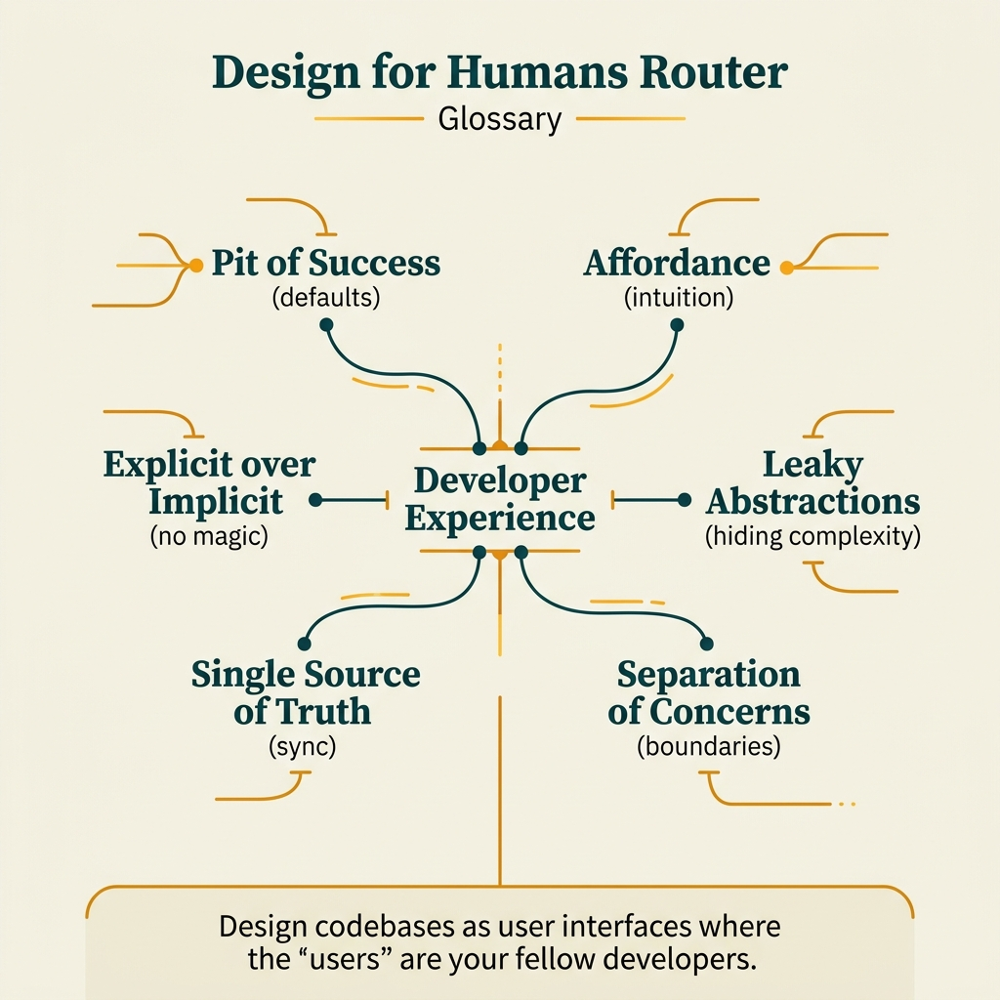

<!-- tags: glossary, reference, developer-cognition-team-dynamics, design-for-humans, overview -->
# Design for Humans

> A cluster of terms that describe how to design APIs, tools, and systems so developers use them correctly, misuse them less, and encounter fewer abstraction leaks.

| Aspect | Detail |
| --- | --- |
| **Concept** | A cluster of terms that describe how to design APIs, tools, and systems so developers use them correctly, misuse them less, and encounter fewer abstraction leaks. |
| **Audience** | API designer, platform engineer, framework author, reviewer |
| **Primary style** | Glossary hub router |
| **Entry point** | Open when the issue is not in pure logic but in the interface, convention, and abstraction pushing users to do the wrong thing |

📅 Created: 2026-03-30 · 🔄 Updated: 2026-04-04 · ⏱️ 6 min read

---

## 1. DEFINE

Picture being able to write a technically correct API that still pushes the team into bug after bug, simply because the interface is hard to predict and easy to misuse. At that point the problem is not "add more docs" — it is design for humans. This README routes that symptom into the right term about DX, pit of success, affordance, and abstraction leakage.

**Design for Humans** is a cluster of terms that describe how to design APIs, tools, and systems so developers use them correctly, misuse them less, and encounter fewer abstraction leaks.

| Variant | Description |
| --- | --- |
| Developer experience | Developer experience and pit of success describe how easy it is to use a system correctly. |
| Interface cues | Affordance and explicit over implicit describe how an interface signals behavior to users. |
| Abstraction boundaries | Leaky abstraction, law of leaky abstractions, and separation of concerns lock the design boundary. |

| Approach | Time | Space | When to choose |
| --- | --- | --- | --- |
| Route by misuse pattern | O(1) route | O(1) | When an API or tool is consistently misused in the same way |
| Route by interface signal | O(1) route | O(1) | When naming, shape, and defaults do not suggest the right thinking in users |
| Learn from DX to boundary | O(1) route | O(1) | When you want to go from system usage experience to abstraction discipline |

Core insight:

> Good design for humans does not just reduce Q&A; it reduces the number of bugs generated by an interface that misleads users.

### 1.1 Signals & Boundaries

- Pit of success is a design force, not a marketing slogan.
- Affordance and explicitness determine whether users guess the next action correctly.
- Leaky abstraction and separation of concerns reveal where boundaries are broken.

### Coverage Map

| Entry | Role | Notes |
| --- | --- | --- |
| [Developer Experience](01-developer-experience.md) | Canonical term | Primary entry for this branch |
| [Pit of Success](02-pit-of-success.md) | Canonical term | Primary entry for this branch |
| [Affordance](03-affordance.md) | Canonical term | Primary entry for this branch |
| [Leaky Abstraction](04-leaky-abstraction.md) | Canonical term | Primary entry for this branch |
| [Law of Leaky Abstractions](05-law-of-leaky-abstractions.md) | Canonical term | Primary entry for this branch |
| [Separation of Concerns](06-separation-of-concerns.md) | Canonical term | Primary entry for this branch |
| [Single Source of Truth](07-single-source-of-truth.md) | Canonical term | Primary entry for this branch |
| [Explicit over Implicit](08-explicit-over-implicit.md) | Canonical term | Primary entry for this branch |

---

## 2. VISUAL




*Figure: Router map prioritizing quick-scan of lanes, entry points, and boundaries before diving into detailed prose below.*

If the README stays as text-only description, readers can easily get lost between lanes. The figure above turns this hub into a real router.

### Level 1

```text
Developer experience
Interface cues
Abstraction boundaries
```

*Figure: Level 1 divides this hub into primary decision lanes so readers do not have to search through a flat term list.*

### Level 2

```text
If the symptom is...                                       Open this first
-------------------------------------------------------   ------------------------------------------
Tool/framework works when used correctly, very easy to     Pit of Success
  misuse
Interface does not signal clearly to the user              Affordance
Abstraction looks great on paper but production exposes    Leaky Abstraction
  operational reality
Need to divide the system into clearer concerns            Separation of Concerns
```

*Figure: Level 2 turns the hub into a symptom router: start from the real question, then branch to the specific term.*

---

## 3. CODE

The diagram above groups this cluster by internal user experience, action visibility, and abstraction boundary. From here, use the hub as a filter to see whether the design is serving humans or forcing them to bear hidden costs.

### Problem 1: Basic — Route the right symptom to the right glossary entry

> **Goal**: Do not let every question about **Design for Humans** be thrown into the same bucket.
> **Approach**: Start from the reader's symptom or question, then open the most relevant entry first.
> **Example**: The input is a review or design question; the output is the file to open first, such as `./02-pit-of-success.md`.
> **Complexity**: Basic

```yaml
router:
  - symptom: Tool/framework works when used correctly, very easy to misuse
    open_first: ./02-pit-of-success.md
  - symptom: Interface does not signal clearly to the user
    open_first: ./03-affordance.md
  - symptom: Abstraction looks great on paper but production exposes operational reality
    open_first: ./04-leaky-abstraction.md
  - symptom: Need to divide the system into clearer concerns
    open_first: ./06-separation-of-concerns.md
```

**Why?** In design-for-humans, much pain is disguised as user error when the root cause lies in affordance, explicitness, or abstraction leakage. This router starts from the real friction the tool user experiences.

**Takeaway**: The hub's first value is pointing to exactly the type of experience friction the design is imposing on users or developers.

### Problem 2: Intermediate — Use the hub as an intentional learning path

> **Goal**: Read **Design for Humans** in logical clusters instead of jumping between disconnected files.
> **Approach**: Follow a lane from foundations to heavier variants, then return to compare adjacent concepts when needed.
> **Example**: A reader wants to build a more durable mental model rather than just looking up a single definition.
> **Complexity**: Intermediate

```yaml
learning_path:
  developer_experience:
    - 01-developer-experience.md
    - 02-pit-of-success.md
    - 08-explicit-over-implicit.md
  interface_cues:
    - 03-affordance.md
  abstraction_boundaries:
    - 04-leaky-abstraction.md
    - 05-law-of-leaky-abstractions.md
    - 06-separation-of-concerns.md
    - 07-single-source-of-truth.md
```

**Why?** The terms in this cluster only carry weight when placed next to each other as a causal chain. The learning path helps the reader see why DX, pit of success, and leaky abstraction are actually telling the same story.

**Takeaway**: At the intermediate level, this hub connects DX, affordance, and abstraction leak into a design-for-humans story with clear logic.

### Problem 3: Advanced — Use the hub as a governance map for shared vocabulary

> **Goal**: Keep reviews, ADRs, runbooks, or post-mortems using the same language within **Design for Humans**.
> **Approach**: Group terms by decision lane, then use that lane as a glossary contract for the team.
> **Example**: When two people use the same word but are actually arguing about two different system layers.
> **Complexity**: Advanced

```yaml
governance_map:
  developer_experience:
    - 01-developer-experience.md
    - 02-pit-of-success.md
    - 08-explicit-over-implicit.md
  interface_cues:
    - 03-affordance.md
  abstraction_boundaries:
    - 04-leaky-abstraction.md
    - 05-law-of-leaky-abstractions.md
    - 06-separation-of-concerns.md
```

**Why?** Shared vocabulary in this cluster directly affects API, tooling, and platform design. The governance map keeps the team reasoning about humans in a technical way, not through friendly slogans.

**Takeaway**: At the advanced level, this hub is a design-for-humans map that helps the team see the hidden costs abstractions are pushing onto users.

---

## 4. PITFALLS

Taxonomy is clear, but correct routing is not enough to avoid common slips when using or interpreting this concept cluster.

| # | Severity | Mistake | Consequence | Fix |
| --- | --- | --- | --- | --- |
| 1 | 🔴 Fatal | Mixing multiple concept layers in the same discussion | Team fixes the wrong problem layer, discussion goes off track | Re-route by the correct lane in the README before opening a specific term |
| 2 | 🟡 Common | Choosing a term by familiar name instead of by symptom | Deep-links to the right file but the wrong boundary | Ask the symptom question first, then choose the entry point |
| 3 | 🟡 Common | Reading a term in isolation, skipping the learning path | Fragmented understanding, missing adjacent concepts for comparison | Follow the reading clusters suggested in CODE/RECOMMEND |
| 4 | 🔵 Minor | Not linking back to parent hub or root hub | Readers have difficulty returning to the taxonomy when lost | Keep the hub as a router; do not turn files into islands |

---

## 5. REF

| Resource | Type | Link | Notes |
| --- | --- | --- | --- |
| The Design of Everyday Things | Book | https://www.nngroup.com/articles/design-of-everyday-things/ | Foundation for affordance and user signaling |
| A Philosophy of Software Design | Book | https://web.stanford.edu/~ouster/cgi-bin/book.php | Very strong on abstraction and complexity for humans |
| The Law of Leaky Abstractions | Essay | https://www.joelonsoftware.com/2002/11/11/the-law-of-leaky-abstractions/ | Clear entry point for abstraction leakage |

---

## 6. RECOMMEND

You have locked down the type of friction the design is causing. Now proceed to the term that describes that friction to make sure the improvement touches the right spot.

| Expand to | When | Why | File/Link |
| --- | --- | --- | --- |
| Pit of success first | When the team wants to design so that correct is the default | This is a very useful term for evaluating interface quality | [Pit of Success](./02-pit-of-success.md) |
| Affordance next | When the issue is in how the interface signals | The reader needs to study what signals the interface is sending | [Affordance](./03-affordance.md) |
| Leaky abstraction when production does not match the brochure | When the abstraction hides too much until it breaks | This is the moment to examine boundaries instead of adding wrappers | [Leaky Abstraction](./04-leaky-abstraction.md) |

---

## 7. QUICK REF

| If you encounter | Open this |
| --- | --- |
| Tool/framework works when used correctly, very easy to misuse | [Pit of Success](./02-pit-of-success.md) |
| Interface does not signal clearly to the user | [Affordance](./03-affordance.md) |
| Abstraction looks great on paper but production exposes operational reality | [Leaky Abstraction](./04-leaky-abstraction.md) |
| Need to divide the system into clearer concerns | [Separation of Concerns](./06-separation-of-concerns.md) |
