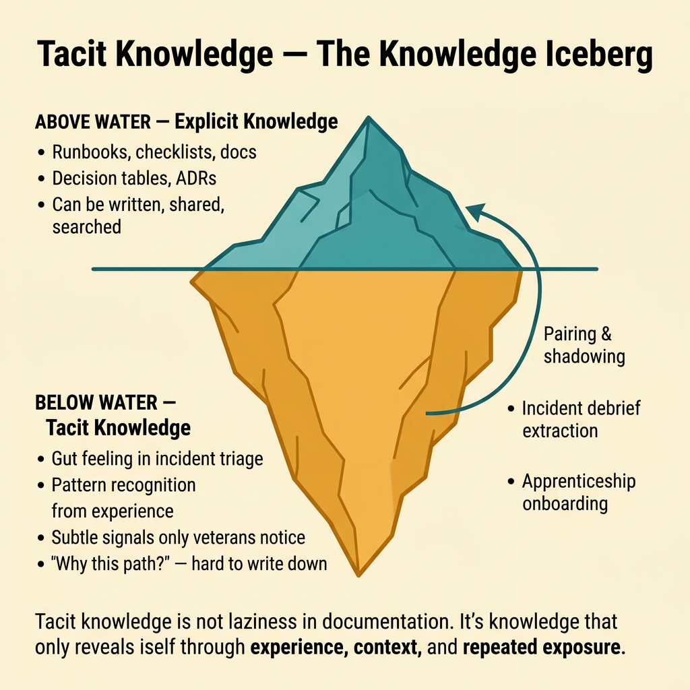
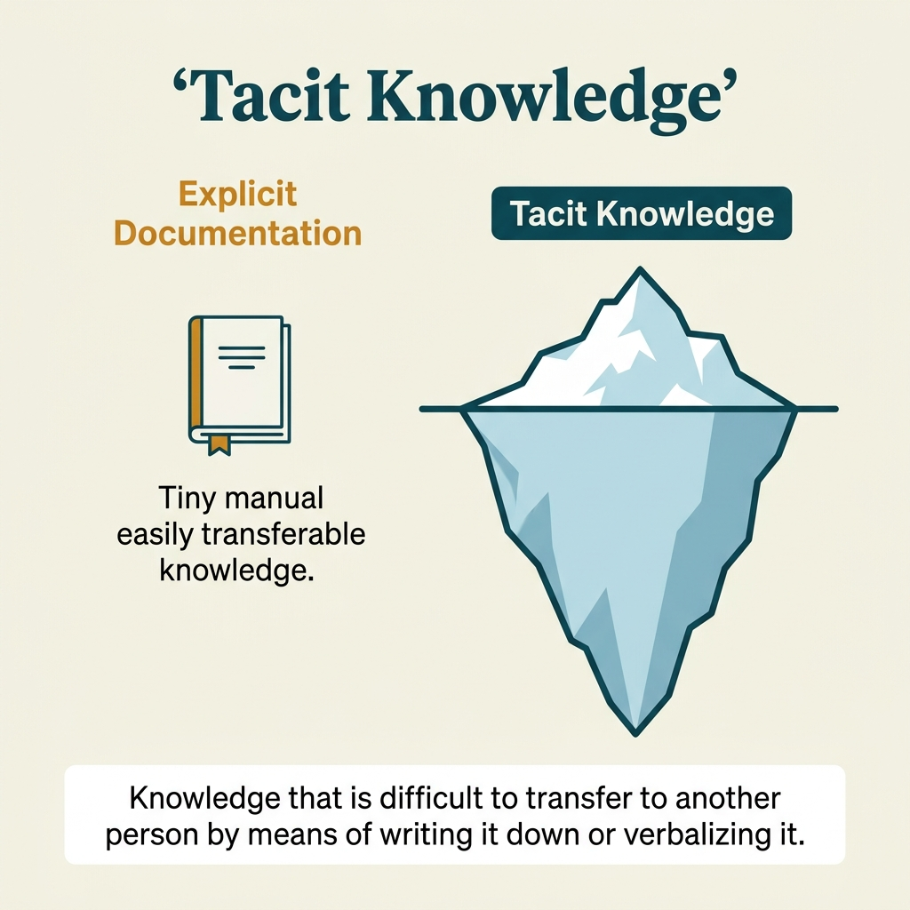

<!-- tags: glossary, reference, developer-cognition-team-dynamics, knowledge-learning, tacit-knowledge -->
# Tacit Knowledge

> Knowledge accumulated through hands-on work, real situation handling, and contextual intuition, but very difficult to write down fully as a checklist or document.

| Aspect | Detail |
| --- | --- |
| **Concept** | Knowledge accumulated through hands-on work, real situation handling, and contextual intuition, but very difficult to write down fully as a checklist or document. |
| **Audience** | Team lead, senior engineer, onboarding owner |
| **Primary style** | Glossary term |
| **Entry point** | Use when the team is overly dependent on "the person who knows," but has not named the type of knowledge stuck inside a few individuals' heads. |

📅 Created: 2026-03-30 · 🔄 Updated: 2026-04-04 · ⏱️ 9 min read

---

## 1. DEFINE

Picture a senior who looks at logs for 30 seconds and guesses the root cause, while a newcomer reads the runbook but still cannot handle the situation. The problem is not necessarily the runbook being bad; often the decisive part lies in subtle signals only someone who has been through it before can recognize. That is the territory of tacit knowledge.

**Tacit Knowledge** is knowledge accumulated through hands-on work, real situation handling, and contextual intuition, but very difficult to write down fully as a checklist or document.

| Variant | Description |
| --- | --- |
| Operational tacit knowledge | Signals, intuition, and judgments that only emerge when operating a real system. |
| Team-process tacit knowledge | The way "things actually get done" within the team but without any formal documentation. |
| Product-domain tacit knowledge | Implicit understanding of users, edge cases, and business nuances that has not been formalized. |

| Approach | Time | Space | When to choose |
| --- | --- | --- | --- |
| Pairing and shadowing | O(n sessions) | O(shared notes) | When the knowledge lives mostly in real-time actions and judgment. |
| Incident debrief extraction | O(n incidents) | O(retro artifacts) | When you want to pull tacit knowledge from real incidents into lessons. |
| Apprenticeship-style onboarding | O(n weeks) | O(playbooks + mentors) | When the domain is hard, the runtime is hard, and docs alone cannot teach. |

Core insight:

> Tacit knowledge is not something "we were just too lazy to document." Much of it truly only reveals itself through experience, context, and repeated exposure. The team's challenge is finding ways to transmit it early enough before it becomes a bus factor.

### 1.1 Invariants & Failure Modes

The invariant of tacit knowledge is that it is always tied to context and judgment. If the team tries to force all of it into mechanical checklists, they usually keep the surface but lose the real decision-making underneath.

---

## 2. CONTEXT

**Who uses it**: Team lead, senior engineer, onboarding owner

**When**: Use when the team is overly dependent on "the person who knows," but has not named the type of knowledge stuck inside a few individuals' heads.

**Purpose**: Tacit knowledge is not something "we were just too lazy to document." Much of it truly only reveals itself through experience, context, and repeated exposure. The team's challenge is finding ways to transmit it early enough before it becomes a bus factor.

**In the ecosystem**:
- Tacit knowledge differs from explicit knowledge: explicit can be written as clear docs, tacit usually needs context and experience alongside it.
- Tacit knowledge is not the same as "personal secrets" worth being proud of.
- If something can only be done when "you call person A," that is usually a sign tacit knowledge is overly concentrated.

---

Knowledge that is hard to transmit is clear. But how do you capture tacit knowledge — pairing, mentoring — and what about knowledge silos?

## 3. EXAMPLES

Tacit knowledge surfaces most visibly when a senior dev "knows" a service tends to fail at 2 AM but nobody documented it, when deploy procedures depend on "experience" that was never written down, or when a key person leaves taking tribal knowledge with them. The examples below place the pattern into exactly those situations.

### Example 1: Basic — Identify where tacit knowledge is stuck in the team

> **Goal**: Instead of vaguely saying "we depend on veterans," pinpoint where tacit knowledge is actually stuck.
> **Approach**: Build an inventory of flows that only a few people can handle smoothly.
> **Example**: Incident on-call, release rollback, data fix, customer escalation.
> **Complexity**: Basic

```yaml
tacit_inventory:
  hotspots:
    - production_incident_triage
    - release_rollback
    - data_repair_sql
    - enterprise_customer_escalation
  signals:
    - only_two_people_can_do_it_without_help
    - docs_exist_but_others_still_stuck
```

**Why?** Teams often only feel "dependent on veterans" in a vague way. An inventory turns that feeling into observable bottlenecks, giving knowledge transfer a clear target instead of generic training.

**Takeaway**: Basic tacit-knowledge work starts by naming exactly where tacit knowledge is stuck.

### Example 2: Intermediate — Transfer tacit knowledge through intentional pairing and shadowing

> **Goal**: Do not just hand documents to newcomers; let them see how real decisions happen.
> **Approach**: Pair or shadow on real workflows, pausing at critical decision points to explain.
> **Example**: Incident triage or rollout review shadowed by a newcomer for 2-3 consecutive rounds.
> **Complexity**: Intermediate



*Figure: Tacit knowledge is not laziness in documentation. It is knowledge that only reveals itself through experience, context, and repeated exposure.*

```yaml
transfer_loop:
  format: live_shadowing
  steps:
    - observe_real_work
    - stop_at_decision_points
    - explain_hidden_signals
    - let_learner_drive_next_time
  evidence:
    - learner_can_handle_similar_case_with_light_support
```

**Why?** Tacit knowledge lives largely in small signals and judgment, not just in step sequences. Intentional shadowing helps the learner see "why this path was chosen," not just "what was clicked."

**Takeaway**: Intermediate transfer is effective when the learner gets to observe, ask, and retry on near-real situations.

### Example 3: Advanced — Extract tacit knowledge from incidents into reusable artifacts

> **Goal**: After each major incident, pull key tacit knowledge out of individuals' heads.
> **Approach**: During the debrief, specifically ask "what signal made you choose this direction" and turn it into a heuristic or runbook note.
> **Example**: Add sections like "subtle signals" and "don't trust this metric alone" to the post-mortem.
> **Complexity**: Advanced

```yaml
incident_extraction:
  ask:
    - what_subtle_signal_changed_the_decision
    - what_was_not_obvious_from_existing_runbook
  persist_as:
    - heuristics
    - anti_patterns
    - annotated_runbook_notes
```

**Why?** Incidents are where tacit knowledge surfaces most clearly because they force all implicit judgments to appear. If the debrief only records the timeline without capturing the reasoning, the team misses the chance to turn experience into lasting leverage.

**Takeaway**: Advanced tacit-knowledge work turns incident review into a site for mining judgment, not just logging events.

### Example 4: Expert — Design the organization so tacit knowledge does not become personal power

> **Goal**: Reduce bus factor without naively thinking all knowledge can be documented.
> **Approach**: Combine explicit docs, rotating ownership, pairing, rehearsal, and review rituals.
> **Example**: Do not let a single person hold the release key path or the data-fix playbook.
> **Complexity**: Expert

```yaml
organizational_controls:
  require:
    - rotating_oncall
    - paired_releases
    - backup_owner_for_critical_flows
    - rehearsal_of_rare_operations
  avoid:
    - hero_only_knowledge_paths
```

**Why?** Tacit knowledge cannot disappear, but the team can decide whether it is distributed or monopolized. Organizational controls help tacit knowledge become a team asset instead of a source of individual power.

**Takeaway**: Expert practice does not try to eliminate tacit knowledge; it reduces the risk from tacit knowledge being overly concentrated.

---

## 4. COMPARE




*Figure: Position of tacit knowledge among explicit knowledge, knowledge transfer, and documentation.*

Tacit sounds like "not yet documented." Partly true — but tacit knowledge is hard to document because it lives in experience, intuition, and muscle memory. Explicit knowledge can be written down immediately; tacit knowledge needs pairing and mentoring to transfer.

### Level 1

```text
experience in real work
  -> patterns noticed
  -> judgments formed
  -> hard to write down fully
```

*Figure: Level 1 shows tacit knowledge arises from repeated experience, not just from reading documentation.*

### Level 2

```text
incident / onboarding / code review
  -> senior notices subtle signal
  -> decision made quickly
  -> junior asks "why that?"
  -> explanation is partial unless context is shared live
```

*Figure: Level 2 emphasizes tacit knowledge usually surfaces when there is a real situation and someone else observes how an expert makes a decision.*

### Easy to confuse or cross the boundary

| # | Severity | Mistake | Consequence | Fix |
| --- | --- | --- | --- | --- |
| 1 | 🔴 Fatal | Accepting "only veterans can handle this" as normal | Extremely high bus factor for incidents or releases | Inventory critical tacit hotspots and redistribute ownership. |
| 2 | 🟡 Common | Trying to force all tacit knowledge into mechanical checklists | Newcomers have docs but still cannot make decisions | Combine docs with pairing, shadowing, and heuristics. |
| 3 | 🟡 Common | Incident debrief only records the timeline | Critical tacit knowledge is not retained | Specifically ask about subtle signals and reasoning. |
| 4 | 🔵 Minor | Glorifying "hero knowledge" as a sign of seniority | Team depends on individuals, onboarding slows | Reward transfer and leverage, not just firefighting. |

### Quick scan

| If you encounter | What to do |
| --- | --- |
| Only a few people can handle a critical flow | You have a tacit-knowledge hotspot. |
| Docs exist but newcomers are still stuck | Add shadowing and pairing instead of just writing more docs. |
| Incident review reveals a senior's "gut feeling" | Extract it into a heuristic or runbook note. |

---

## 5. REF

| Resource | Type | Link | Notes |
| --- | --- | --- | --- |
| The Knowledge-Creating Company | Book | https://global.oup.com/academic/product/the-knowledge-creating-company-9780195092691 | Foundation for tacit vs explicit knowledge. |
| A Philosophy of Software Design | Book | https://web.stanford.edu/~ouster/cgi-bin/book.php | Very good for hidden complexity and knowledge transfer. |
| Google re:Work | Reference | https://rework.withgoogle.com/ | Many perspectives on learning and team effectiveness. |

---

## 6. RECOMMEND

Tacit knowledge solves the problem of "critical knowledge only lives in one person's head." The next question: how is explicit knowledge managed, and what about T-shaped developers?

| Expand to | When | Why | File/Link |
| --- | --- | --- | --- |
| Explicit Knowledge | When you want to contrast which parts have been documented | The closest conceptual pair to tacit knowledge. | [Explicit Knowledge](./02-explicit-knowledge.md) |
| Curse of Knowledge | When someone with deep knowledge communicates ineffectively to newcomers | Directly connects to knowledge transfer. | [Curse of Knowledge](./06-curse-of-knowledge.md) |
| Knowledge & Learning | When you need to return to the subtopic hub | Keep context of the full branch. | [Knowledge & Learning](./README.md) |

Back to that senior leaving from the beginning — tribal knowledge lost. Now you know: pair programming, documented decision records, runbooks, video walkthroughs. Convert tacit → explicit wherever possible. The rest = cross-training.

**Links**: [← Previous](./README.md) · [→ Next](./02-explicit-knowledge.md)
