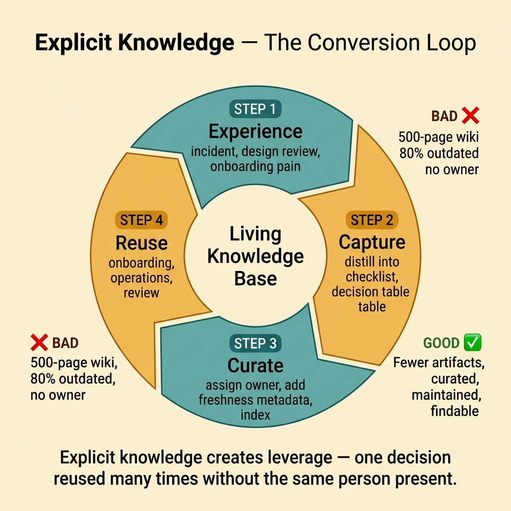
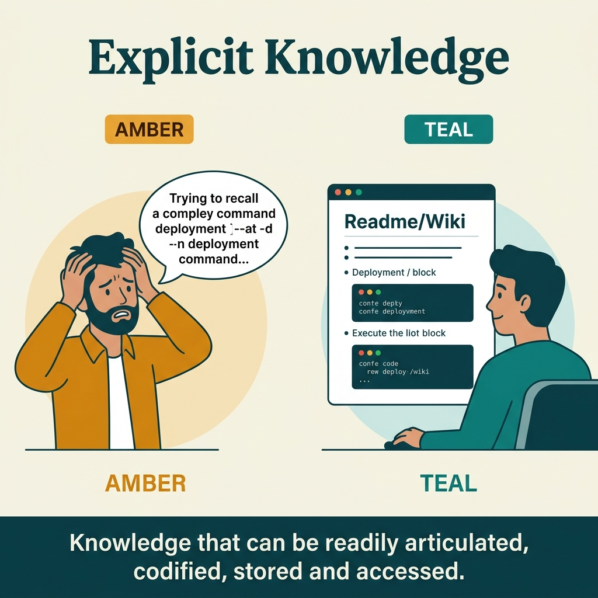

<!-- tags: glossary, reference, developer-cognition-team-dynamics, knowledge-learning, explicit-knowledge -->
# Explicit Knowledge

> Knowledge that has been clarified enough to be written as documentation, checklists, runbooks, decision templates, or repeatable processes.

| Aspect | Detail |
| --- | --- |
| **Concept** | Knowledge that has been clarified enough to be written as documentation, checklists, runbooks, decision templates, or repeatable processes. |
| **Audience** | Documentation owner, tech lead, onboarding owner |
| **Primary style** | Glossary term |
| **Entry point** | Use when the team wants to reduce dependence on individual memory by turning important knowledge into artifacts that can be found, read, and reused. |

📅 Created: 2026-03-30 · 🔄 Updated: 2026-04-04 · ⏱️ 9 min read

---

## 1. DEFINE

Picture a well-written runbook that lets a newcomer handle 80% of situations without calling a veteran. That only happens when the knowledge is clear enough to travel from a person's head into an artifact. Explicit knowledge is the portion of knowledge that has crossed that threshold.

**Explicit Knowledge** is knowledge that has been clarified enough to be written as documentation, checklists, runbooks, decision templates, or repeatable processes.

| Variant | Description |
| --- | --- |
| Procedural knowledge | Knowing how to follow steps in order. |
| Decision knowledge | Knowing which condition leads to which decision. |
| Institutional knowledge | Knowing the conventions by which the team, system, and processes operate. |

| Approach | Time | Space | When to choose |
| --- | --- | --- | --- |
| Documentation-first capture | O(n artifacts) | O(docs + links) | When the knowledge is clear enough to write as instructions. |
| Template and checklist standardization | O(n recurring tasks) | O(playbooks) | When the team repeats many activities of the same shape. |
| Knowledge base curation | O(n updates) | O(index + owners) | When there are many documents and reliable findability is needed. |

Core insight:

> Explicit knowledge creates leverage because it allows a decision, a correct method, or a lesson learned to be reused many times without needing the same person present everywhere.

### 1.1 Invariants & Failure Modes

The invariant of explicit knowledge is the ability to find, understand, and reapply it. If documentation exists but nobody trusts it or nobody can find it at the right time, the team does not truly own valuable explicit knowledge.

---

## 2. CONTEXT

**Who uses it**: Documentation owner, tech lead, onboarding owner

**When**: Use when the team wants to reduce dependence on individual memory by turning important knowledge into artifacts that can be found, read, and reused.

**Purpose**: Explicit knowledge creates leverage because it allows a decision, a correct method, or a lesson learned to be reused many times without needing the same person present everywhere.

**In the ecosystem**:
- Explicit knowledge differs from tacit knowledge in how codifiable it is.
- A long document does not equal good explicit knowledge; if it is hard to find or apply, leverage remains low.
- If knowledge changes fast without an owner updating it, explicit knowledge quickly becomes misinformation.

---

Knowledge that can be written down is clear. But how do you manage a knowledge base, handle knowledge decay, and determine update frequency?

## 3. EXAMPLES

Explicit knowledge surfaces most visibly when an accurate README helps a dev onboard in one day instead of one week, when a 500-page wiki is 80% outdated, or when a well-structured knowledge base exists but nobody maintains it. The examples below place the pattern into exactly those situations.

### Example 1: Basic — Turn a recurring task into a shared checklist

> **Goal**: A repeating task should not depend on memory every single time.
> **Approach**: Package the task into a short checklist with the correct step order and verification points.
> **Example**: Release checklist, post-incident checklist, service onboarding checklist.
> **Complexity**: Basic

```yaml
checklist:
  name: release-readiness
  steps:
    - verify_migrations
    - verify_rollback_path
    - verify_alerting
    - verify_owner_on_call
  done_when:
    all_steps_checked: true
```

**Why?** Checklists reduce knowledge dependence on immediate memory. They are especially useful for repeating work where forgetting one small step can have large consequences.

**Takeaway**: Basic explicit knowledge usually starts with a small checklist that has high usage frequency.

### Example 2: Intermediate — Record decision knowledge, not just procedures

> **Goal**: Know not just "what to do" but "when to choose which option."
> **Approach**: Write decision tables or runbook notes with conditions and corresponding actions.
> **Example**: If queue lag is high but CPU is normal, prioritize checking consumer bottleneck instead of scaling the API.
> **Complexity**: Intermediate



*Figure: Explicit knowledge creates leverage — one decision reused many times without the same person present.*

```yaml
decision_table:
  signal: queue_lag_high
  if:
    cpu_normal: true
    db_normal: true
  then:
    investigate_consumer_backpressure: true
  else:
    inspect_shared_dependency_first: true
```

**Why?** Many documents fail because they only record procedures without recording the decision logic. Decision knowledge makes artifacts far more useful in real situations where the reader needs to reason, not just copy-paste.

**Takeaway**: Intermediate explicit knowledge is powerful when it captures both the procedure and the decision logic.

### Example 3: Advanced — Build a knowledge base with clear owners and search paths

> **Goal**: Have many documents but still find the right one at the right time.
> **Approach**: Standardize taxonomy, links, owners, and freshness signals for each artifact.
> **Example**: Runbooks, ADRs, onboarding notes, and incident heuristics all indexed in a hub with clear owners.
> **Complexity**: Advanced

```yaml
knowledge_base:
  artifact_types:
    - runbook
    - adr
    - onboarding_note
    - incident_playbook
  metadata:
    - owner
    - last_reviewed_at
    - topic_tag
  rule:
    no_orphan_doc_without_owner: true
```

**Why?** Explicit knowledge only has leverage when the person who needs it can find and trust it. Owners, taxonomy, and freshness signals prevent the knowledge base from drifting into "I think there is a doc somewhere."

**Takeaway**: Advanced explicit knowledge is an information architecture problem, not just a matter of writing more markdown.

### Example 4: Expert — Create a conversion loop between tacit and explicit knowledge

> **Goal**: Do not let explicit knowledge stand still while real-world operations keep generating new lessons.
> **Approach**: Every incident, design review, or onboarding pain includes a step to distill into a new or updated artifact.
> **Example**: After every sev-2 incident, the team must update the related runbook or decision table.
> **Complexity**: Expert

```yaml
knowledge_conversion_loop:
  triggers:
    - major_incident
    - repeated_onboarding_question
    - architecture_review_confusion
  required_action:
    - create_or_update_artifact
    - assign_owner
    - announce_change
```

**Why?** Explicit knowledge does not grow by itself. It needs a continuous conversion mechanism from real experience. Without it, docs only reflect the past, and the team returns to depending on individual memory.

**Takeaway**: Expert explicit knowledge is a living loop between experience, capture, curation, and reuse.

---

## 4. COMPARE




*Figure: Position of explicit knowledge among tacit knowledge, documentation, and knowledge management.*

Explicit sounds like documentation. Close — but explicit knowledge is broader: code, tests, specs, ADRs, and runbooks are all explicit knowledge. Documentation is just one format. Code = most reliable explicit knowledge because it is executable.

### Level 1

```text
experience clarified
  -> written artifact
  -> shared and reused
  -> team dependency on one person decreases
```

*Figure: Level 1 shows explicit knowledge is knowledge packaged into artifacts that can be reused.*

### Level 2

```text
incident lesson / design choice / workflow
  -> distilled into checklist or runbook
  -> indexed and owned
  -> reused in onboarding, review and operations
```

*Figure: Level 2 emphasizes explicit knowledge is valuable when it is standardized, findable, and has an owner maintaining it.*

### Easy to confuse or cross the boundary

| # | Severity | Mistake | Consequence | Fix |
| --- | --- | --- | --- | --- |
| 1 | 🔴 Fatal | Docs exist but have no owner | Outdated documents become a source of misinformation | Assign an owner and a clear review cadence. |
| 2 | 🟡 Common | Recording procedures but skipping decision logic | Readers follow mechanically but cannot handle deviations | Add decision tables or heuristics. |
| 3 | 🟡 Common | Knowledge base is hard to search | Team returns to asking veterans instead of using docs | Standardize taxonomy, index, and links. |
| 4 | 🔵 Minor | Writing too many rarely-used docs | High maintenance cost but low leverage | Prioritize artifacts for recurring workflows and critical paths. |

### Quick scan

| If you encounter | What to do |
| --- | --- |
| A recurring task still depends on memory | Create a checklist or runbook. |
| Docs exist but are hard to apply in real situations | Add decision logic, not just steps. |
| Nobody knows which document is still trustworthy | Attach an owner and freshness metadata. |

---

## 5. REF

| Resource | Type | Link | Notes |
| --- | --- | --- | --- |
| The Knowledge-Creating Company | Book | https://global.oup.com/academic/product/the-knowledge-creating-company-9780195092691 | Foundation for explicit vs tacit. |
| A Philosophy of Software Design | Book | https://web.stanford.edu/~ouster/cgi-bin/book.php | Very strong on clarity and hidden dependencies. |
| Information Architecture | Reference | https://en.wikipedia.org/wiki/Information_architecture | Perspective on organizing a knowledge base. |

---

## 6. RECOMMEND

Explicit knowledge solves the problem of "knowledge needs to be accessible to the whole team." The next question: what about T-shaped developers, and how does the Dunning-Kruger effect work?

| Expand to | When | Why | File/Link |
| --- | --- | --- | --- |
| Tacit Knowledge | When you want to understand the knowledge portion that cannot be fully written down | The directly parallel conceptual pair. | [Tacit Knowledge](./01-tacit-knowledge.md) |
| Curse of Knowledge | When docs exist but newcomers still do not understand | Connects to the quality of communicating explicit knowledge. | [Curse of Knowledge](./06-curse-of-knowledge.md) |
| Knowledge & Learning | When you need to return to the subtopic hub | Keep context of the full branch. | [Knowledge & Learning](./README.md) |

Back to that 500-page wiki from the beginning — 80% outdated. Now you know: fewer, curated, maintained > many, neglected, outdated. A knowledge base needs a gardener, not just an author. Review cadence, ownership, freshness indicator.

**Links**: [← Previous](./01-tacit-knowledge.md) · [→ Next](./03-t-shaped-developer.md)
