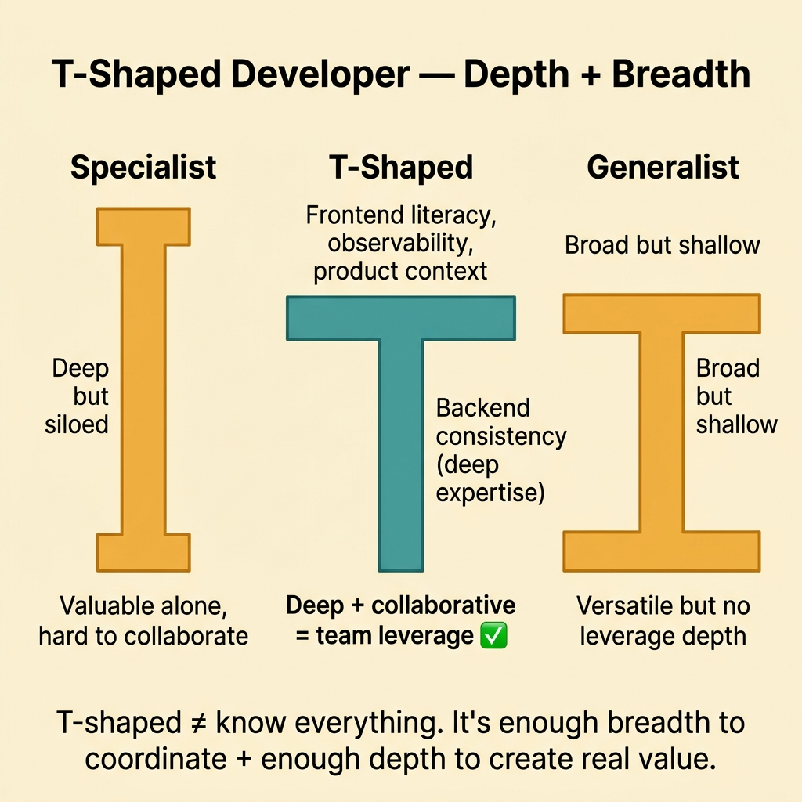
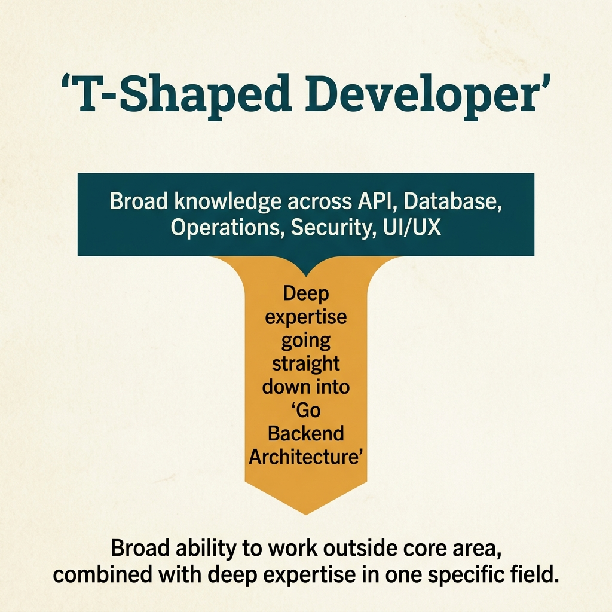

<!-- tags: glossary, reference, developer-cognition-team-dynamics, knowledge-learning, t-shaped-developer -->
# T-Shaped Developer

> A developer model with enough horizontal breadth to collaborate across multiple areas, while maintaining deep vertical expertise in one or a few core specialties.

| Aspect | Detail |
| --- | --- |
| **Concept** | A developer model with enough horizontal breadth to collaborate across multiple areas, while maintaining deep vertical expertise in one or a few core specialties. |
| **Audience** | Engineering manager, staff engineer, IC growing their capabilities |
| **Primary style** | Glossary term |
| **Entry point** | Use when the team is discussing skill mix, growth paths, bus factor, or cross-functional collaboration without wanting to fall into the slogan "everyone knows everything." |

📅 Created: 2026-03-30 · 🔄 Updated: 2026-04-04 · ⏱️ 9 min read

---

## 1. DEFINE

Picture a developer deeply skilled in backend but constantly stuck when reading a dashboard, communicating with frontend, or understanding production impact. Another person knows many things at surface level but cannot truly lead any of them. T-shaped is the balanced way of describing breadth for coordination and depth for real value creation.

**T-Shaped Developer** is a developer model with enough horizontal breadth to collaborate across multiple areas, while maintaining deep vertical expertise in one or a few core specialties.

| Variant | Description |
| --- | --- |
| Breadth-heavy T-shape | Good at broad coordination, moderate depth. |
| Depth-heavy T-shape | Has a clearly deep domain or technique, but still understands adjacent context. |
| Team-level T-shape | Viewing T-shape as a team capability distribution, not forcing every individual to be identical. |

| Approach | Time | Space | When to choose |
| --- | --- | --- | --- |
| Primary-discipline + adjacent literacy | O(n skill-building cycles) | O(learning plan) | When you want to improve collaboration without diluting expertise. |
| Rotation-based growth | O(n rotations) | O(shadowing notes) | When breadth needs to be expanded through real experience. |
| Team capability mapping | O(n people × capabilities) | O(skill matrix) | When deciding on hiring, staffing, or succession planning. |

Core insight:

> T-shaped does not mean every person must be equally good at everything. Its value is creating enough breadth to understand context and coordinate, while still maintaining a depth zone real enough to create leverage.

### 1.1 Invariants & Failure Modes

The invariant of T-shape is that breadth must serve coordination, while depth must be real enough to create quality and leverage. If breadth is just knowing buzzwords and depth does not exist, the model loses its practical value.

---

## 2. CONTEXT

**Who uses it**: Engineering manager, staff engineer, IC growing their capabilities

**When**: Use when the team is discussing skill mix, growth paths, bus factor, or cross-functional collaboration without wanting to fall into the slogan "everyone knows everything."

**Purpose**: T-shaped does not mean every person must be equally good at everything. Its value is creating enough breadth to understand context and coordinate, while still maintaining a depth zone real enough to create leverage.

**In the ecosystem**:
- T-shaped differs from "full-stack knows everything": T-shape emphasizes collaboration breadth, not mastery at every layer.
- T-shaped does not negate specialists; it simply opposes absolute silos.
- If the team uses T-shape to rationalize the lack of deep experts, they are misunderstanding the model.

---

Deep expertise plus broad knowledge is clear. But T-shaped vs generalist vs specialist — what is the bar for each dimension, and how do you grow?

## 3. EXAMPLES

T-shaped developer surfaces most visibly when a backend dev also debugs frontend CSS issues, when a Go specialist cannot communicate with the mobile team, or when someone is "full-stack" but shallow at everything. The examples below place the pattern into exactly those situations.

### Example 1: Basic — Distinguish useful breadth from "knowing a little of everything"

> **Goal**: Do not use T-shaped as a euphemism for surface-level knowledge.
> **Approach**: Clearly identify one depth zone and the adjacent literacy areas that serve coordination.
> **Example**: A backend engineer with depth in data consistency, breadth in frontend flow, observability, and product context.
> **Complexity**: Basic

```yaml
t_shape_profile:
  depth:
    - backend_consistency
  breadth:
    - frontend_flow_literacy
    - observability_basics
    - product_metric_awareness
```

**Why?** T-shape is useful when breadth helps a person coordinate better around an area of real depth. Without being able to name the core depth, the team easily calls any vague generalist "T-shaped."

**Takeaway**: Basic T-shape starts by clearly naming the "deep enough" part and the "broad enough" part of a person.

### Example 2: Intermediate — Use T-shape to reduce handoff friction within the team

> **Goal**: Fewer handoff errors, fewer review misunderstandings when roles can understand each other's language.
> **Approach**: Set breadth development goals around the adjacent areas that create the most friction.
> **Example**: Backend dev learns UX flow enough to read frontend pain; frontend dev learns API contracts and caching enough to review better.
> **Complexity**: Intermediate



*Figure: T-shaped ≠ know everything. It is enough breadth to coordinate + enough depth to create real value.*

```yaml
collaboration_growth:
  friction_points:
    - backend_frontend_handoff
    - product_engineering_translation
  breadth_targets:
    - api_contract_literacy
    - ux_flow_literacy
    - incident_reading_basics
```

**Why?** Breadth is most useful when it reduces a specific type of friction in daily work. Learning broadly without direction easily turns into an enjoyable activity that does not create real collaboration leverage.

**Takeaway**: Intermediate T-shape should be tied to the team's actual friction, not to a technology list for resume decoration.

### Example 3: Advanced — Use T-shape to design better staffing and succession

> **Goal**: Do not let a critical path depend on one single specialist.
> **Approach**: Map depth owners, backup breadth, and growth paths for areas with high bus factor.
> **Example**: Only one person is deeply skilled in the data pipeline, so the team intentionally grows breadth in two others around that area.
> **Complexity**: Advanced

```yaml
staffing_map:
  critical_capability: data_pipeline_reliability
  primary_depth_owner: engineer_a
  adjacent_growth:
    - engineer_b_shadowing
    - engineer_c_incident_participation
  goal:
    reduce_single_point_expertise: true
```

**Why?** T-shape has significant organizational value when it helps the team avoid depending on a few sole specialists without sacrificing depth. Capability mapping turns learning into an intentional staffing decision.

**Takeaway**: Advanced T-shape is a tool for designing team capability, not just an individual development story.

### Example 4: Expert — Prevent T-shape from becoming pressure to "know everything"

> **Goal**: Use T-shape to expand leverage, not to create unrealistic expectations for every individual.
> **Approach**: View T-shape at both the individual and the team portfolio level, accepting that different profiles complement each other.
> **Example**: A team has a few deep specialists, a few strong generalists, and capability overlap designed intentionally.
> **Complexity**: Expert

```yaml
team_portfolio_view:
  allowed_profiles:
    - deep_specialist_with_enough_breadth
    - strong_generalist_with_clear_anchor_depth
  anti_goal:
    everyone_must_master_every_layer: false
  planning_rule:
    optimize_team_shape_not_individual_uniformity: true
```

**Why?** When misunderstood, T-shape becomes pressure for "everyone to be full-stack at everything." That is both unrealistic and erodes the quality of depth. The expert view sees T-shape as a capability portfolio of the team.

**Takeaway**: Expert T-shape optimizes collective capability; it does not force everyone to become copies of each other.

---

## 4. COMPARE




*Figure: Position of T-shaped among specialist, generalist, Pi-shaped, and team composition.*

T-shaped sounds like generalist. Different: generalist is broad + shallow (wide I-shape), specialist is deep + narrow (tall I-shape), T-shaped is deep in one + broad enough to collaborate. T = collaborative specialist.

### Level 1

```text
breadth across adjacent areas
  +
deep expertise in one area
  = T-shaped developer
```

*Figure: Level 1 shows T-shape is the combination of breadth for coordination and depth for leverage.*

### Level 2

```text
backend depth
  + enough frontend / infra / product literacy
  -> better collaboration
  -> fewer handoff misunderstandings
  -> still has a clear specialty
```

*Figure: Level 2 emphasizes breadth does not replace depth; it helps depth be used more effectively in the system and the team.*

### Easy to confuse or cross the boundary

| # | Severity | Mistake | Consequence | Fix |
| --- | --- | --- | --- | --- |
| 1 | 🔴 Fatal | Using T-shape to rationalize the lack of deep experts | Quality of technical decisions drops in critical areas | Keep a clear depth zone that truly needs deep ownership. |
| 2 | 🟡 Common | Breadth goals not tied to actual friction | Broad learning but low leverage | Choose adjacent skills based on the team's pain points. |
| 3 | 🟡 Common | Turning T-shape into the expectation of "knowing everything" | Burnout and shallow expertise | View T-shape at the team portfolio level. |
| 4 | 🔵 Minor | Not updating the skill map for new needs | Growth plan drifts from reality | Review the capability map periodically. |

### Quick scan

| If you encounter | What to do |
| --- | --- |
| A person with deep skills but difficult cross-team coordination | Open breadth in the necessary adjacent areas. |
| Team too dependent on one specialist | Use capability mapping and shadowing. |
| T-shape is being interpreted as "know everything" | Return to team-portfolio view. |

---

## 5. REF

| Resource | Type | Link | Notes |
| --- | --- | --- | --- |
| The T-Shaped Professional | Reference | https://en.wikipedia.org/wiki/T-shaped_skills | General concept foundation. |
| Team Topologies | Book | https://teamtopologies.com/ | Directly connects to skill mix and collaboration. |
| Google re:Work | Reference | https://rework.withgoogle.com/ | Perspectives on capability and team effectiveness. |

---

## 6. RECOMMEND

T-shaped developer solves the problem of "specialist cannot collaborate, generalist is not deep." The next question: how does the Dunning-Kruger effect influence self-assessment, and what is a 10x developer really?

| Expand to | When | Why | File/Link |
| --- | --- | --- | --- |
| Dunning-Kruger Effect | When the team's self-assessment is not calibrated | Directly connects to self-assessment. | [Dunning-Kruger Effect](./04-dunning-kruger-effect.md) |
| Tacit Knowledge | When breadth/depth heavily depends on learning through real work | Connects to practical knowledge transfer. | [Tacit Knowledge](./01-tacit-knowledge.md) |
| Knowledge & Learning | When you need to return to the subtopic hub | Keep context of the full branch. | [Knowledge & Learning](./README.md) |

Back to that backend dev debugging CSS from the beginning — not an expert but unblocks the team. Now you know: deep in your domain (vertical bar), broad enough to collaborate (horizontal bar). T-shaped = valuable in a team, specialist = valuable alone.

**Links**: [← Previous](./02-explicit-knowledge.md) · [→ Next](./04-dunning-kruger-effect.md)
