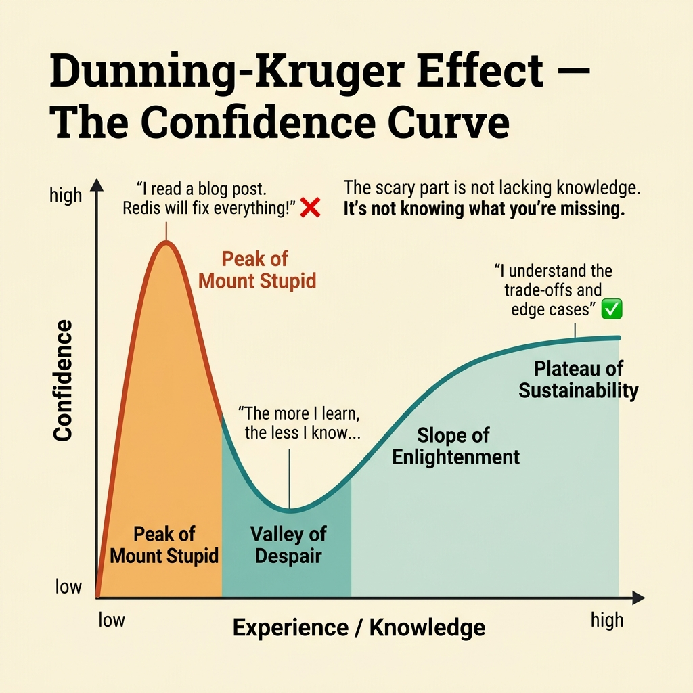
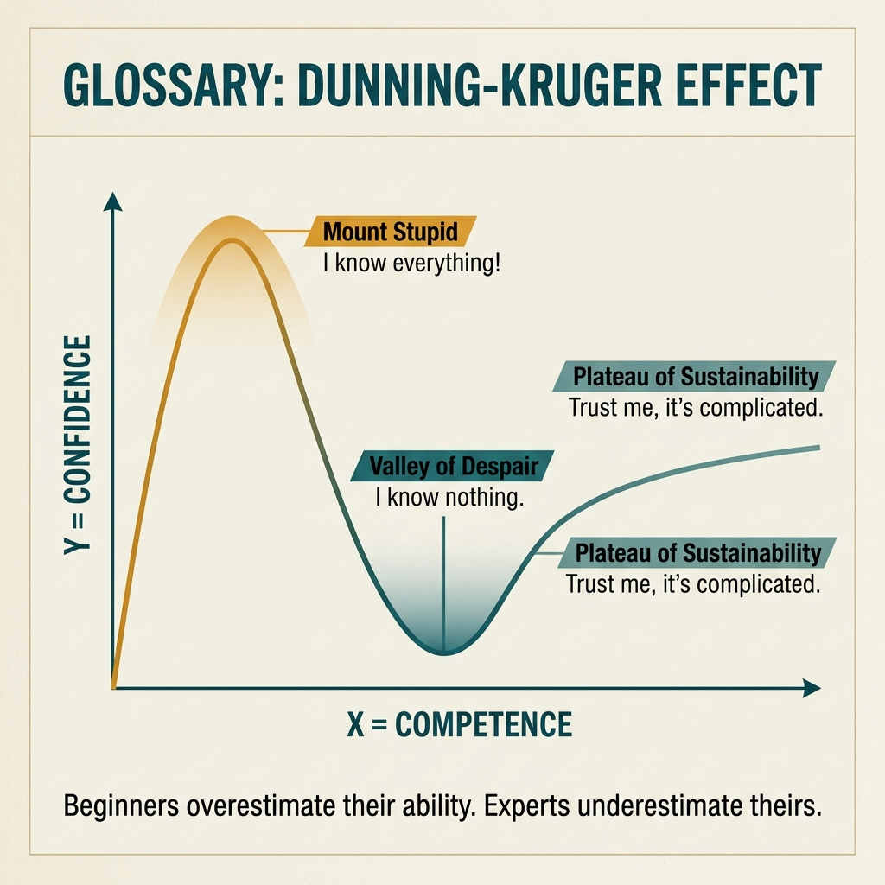

<!-- tags: glossary, reference, developer-cognition-team-dynamics, knowledge-learning, dunning-kruger-effect -->
# Dunning-Kruger Effect

> A cognitive bias where less experienced people tend to be overconfident about their understanding, while those with deeper knowledge recognize complexity and become more cautious.

| Aspect | Detail |
| --- | --- |
| **Concept** | A cognitive bias where less experienced people tend to be overconfident about their understanding, while those with deeper knowledge recognize complexity and become more cautious. |
| **Audience** | Reviewer, mentor, engineering manager |
| **Primary style** | Glossary term |
| **Entry point** | Use when the team needs to name the gap between confidence level and actual understanding in reviews, mentoring, or self-assessment. |

📅 Created: 2026-03-30 · 🔄 Updated: 2026-04-04 · ⏱️ 9 min read

---

## 1. DEFINE

Picture a newcomer who reads a few blog posts about caching and is very certain that "just adding Redis" will fix performance. A staff engineer keeps saying "there are many edge cases to consider." That gap is not just a skill difference; it is a difference in awareness of complexity. Dunning-Kruger helps name this calibration gap.

**Dunning-Kruger Effect** is a cognitive bias where less experienced people tend to be overconfident about their understanding, while those with deeper knowledge recognize complexity and become more cautious.

| Variant | Description |
| --- | --- |
| Early-learning overconfidence | Just learned a concept but thinks they have mastered the entire domain. |
| Mid-journey recalibration | Understands more deeply and starts seeing complexity and personal limitations. |
| Review-context miscalibration | Mismatch between confidence in arguments and actual grounding in review. |

| Approach | Time | Space | When to choose |
| --- | --- | --- | --- |
| Calibration through feedback loops | O(n feedback cycles) | O(review notes) | When you want to adjust self-assessment through real evidence. |
| Mentoring with visible reasoning | O(n mentoring sessions) | O(examples + questions) | When you need to help newcomers see the hidden complexity. |
| Decision review with evidence | O(n decisions) | O(artifacts + metrics) | When technical debates need to be anchored with data and context. |

Core insight:

> The scary part of Dunning-Kruger is not that newcomers lack knowledge; it is that they do not yet know what they are missing. In technical teams, this directly affects review quality, estimation, and architecture decisions.

### 1.1 Invariants & Failure Modes

The invariant when using this concept is that it must be tied to evidence and learning loops. When it is turned into a label to put others down, the team loses both psychological safety and fails to improve actual calibration.

---

## 2. CONTEXT

**Who uses it**: Reviewer, mentor, engineering manager

**When**: Use when the team needs to name the gap between confidence level and actual understanding in reviews, mentoring, or self-assessment.

**Purpose**: The scary part of Dunning-Kruger is not that newcomers lack knowledge; it is that they do not yet know what they are missing. In technical teams, this directly affects review quality, estimation, and architecture decisions.

**In the ecosystem**:
- Dunning-Kruger does not mean "juniors are always wrong."
- This is a calibration phenomenon, not a character judgment.
- If the term is used to label others instead of improving feedback loops, trust will erode very quickly.

---

Overconfidence when knowing little is clear. But how do you recognize where you are, how does impostor syndrome differ, and what is the team impact?

## 3. EXAMPLES

Dunning-Kruger surfaces most visibly when a junior finishes a tutorial and claims "I know React," when a new architect reads a blog and redesigns the entire system, or when an experienced dev doubts themselves despite being competent (impostor syndrome). The examples below place the pattern into exactly those situations.

### Example 1: Basic — Identify the gap between confidence and evidence

> **Goal**: Do not argue based on a feeling of "this person is too confident"; point to the mismatch with real grounding.
> **Approach**: Compare the level of assertion with the amount of experience, metrics, or case coverage available.
> **Example**: A solution is stated as "definitely simple" but has not considered concurrency, rollback, or failure modes.
> **Complexity**: Basic

```yaml
calibration_check:
  claim: caching_will_fix_latency
  evidence_missing:
    - no_profile_data
    - no_hot_path_trace
    - no_failure_mode_analysis
  risk:
    overconfidence_detected: true
```

**Why?** Confidence is not wrong; confidence without grounding is what is dangerous. A calibration check helps the team move debates from "who feels right" to "what evidence is still missing."

**Takeaway**: Basic handling of Dunning-Kruger is anchoring confidence to evidence instead of to the volume of the statement.

### Example 2: Intermediate — Use mentoring to reveal hidden complexity

> **Goal**: Do not crush a newcomer's confidence, but help them see the real picture is broader.
> **Approach**: Ask questions about edge cases, hidden constraints, and trade-offs instead of directly contradicting.
> **Example**: "How does this solution handle duplicate events, timeouts, and rollback?"
> **Complexity**: Intermediate



*Figure: The scary part is not lacking knowledge. It is not knowing what you are missing.*

```yaml
mentoring_prompt:
  instead_of: "you don't have enough experience"
  ask:
    - what_happens_if_event_is_duplicated
    - what_is_the_rollback_path
    - what_assumptions_about_load_are_hidden
```

**Why?** Newcomers rarely lack energy; what they lack is exposure to real complexity. Good questions help them see their own knowledge gaps without destroying the motivation to learn.

**Takeaway**: Good intermediate mentoring recalibrates confidence through discovery, not through humiliation.

### Example 3: Advanced — Use the review process to reduce miscalibration in technical decisions

> **Goal**: Do not let important decisions be driven by whoever speaks with the most certainty instead of whoever has the most accurate model.
> **Approach**: Design reviews requiring minimum assumptions, trade-offs, and evidence for major proposals.
> **Example**: Every architecture proposal must state alternatives, risks, rollback, and unknowns.
> **Complexity**: Advanced

```yaml
decision_template:
  required_sections:
    - assumptions
    - alternatives_considered
    - risks
    - rollback
    - unknowns
  goal:
    force_calibration_before_commitment: true
```

**Why?** Good process does not depend on anyone being "naturally humble." It forces everyone, even the very skilled, to expose assumptions and knowledge gaps before a decision is finalized.

**Takeaway**: Advanced teams reduce Dunning-Kruger risk through review scaffolding, not just through expecting individuals to know themselves.

### Example 4: Expert — Distinguish useful confidence from dangerous overconfidence in the organization

> **Goal**: Do not mistakenly penalize healthy decisiveness, but also do not mistakenly reward hollow certainty.
> **Approach**: Evaluate decision quality through reasoning, follow-up learning, and hit rate over time.
> **Example**: Someone who proposes strongly but always exposes assumptions, updates their view with data, and learns from misses is completely different from someone who speaks with certainty but never recalibrates.
> **Complexity**: Expert

```yaml
organizational_calibration:
  reward:
    - explicit_reasoning
    - willingness_to_update_belief
    - postmortem_learning
  discourage:
    - certainty_without_evidence
    - refusal_to_recalibrate
```

**Why?** A healthy organization does not optimize for silence or for blind confidence; it optimizes for calibrated confidence. That is where decisiveness and the ability to update beliefs coexist.

**Takeaway**: Expert use of this concept is designing culture for calibration, not turning it into an argument weapon.

---

## 4. COMPARE




*Figure: Position of Dunning-Kruger among impostor syndrome, growth mindset, and expertise.*

Dunning-Kruger sounds like "noob is overconfident." Half true — but the effect also applies in reverse: experts underestimate ("everyone knows this"). Peak of confidence at beginner, valley at intermediate, plateau at expert.

### Level 1

```text
little experience
  -> high confidence
more experience
  -> awareness of complexity
  -> confidence becomes more calibrated
```

*Figure: Level 1 shows the core issue is the gap between confidence and understanding.*

### Level 2

```text
new concept learned
  -> feels simple
  -> strong opinion formed
  -> real edge cases appear
  -> confidence drops
  -> deeper model forms over time
```

*Figure: Level 2 emphasizes the learning curve often passes through a phase of premature confidence before being recalibrated by reality.*

### Easy to confuse or cross the boundary

| # | Severity | Mistake | Consequence | Fix |
| --- | --- | --- | --- | --- |
| 1 | 🔴 Fatal | Using "Dunning-Kruger" as a label to put others down | Trust and psychological safety are destroyed | Only use this concept to improve the calibration loop. |
| 2 | 🟡 Common | Equating confidence with competence | Decisions get driven by whoever speaks loudest | Require evidence, assumptions, and trade-offs clearly. |
| 3 | 🟡 Common | Countering newcomers with authority instead of good questions | They learn less and become more defensive | Use mentoring questions to reveal complexity. |
| 4 | 🔵 Minor | Not recording misses and lessons learned | Calibration does not improve over time | Use retros and post-mortems to update mental models. |

### Quick scan

| If you encounter | What to do |
| --- | --- |
| A proposal sounds very certain but has no evidence | Run a calibration check. |
| Want to help a newcomer see complexity without crushing them | Use mentoring questions. |
| Team is rewarding certainty instead of reasoning | Fix the review template and reward signals. |

---

## 5. REF

| Resource | Type | Link | Notes |
| --- | --- | --- | --- |
| Original Dunning-Kruger paper summary | Reference | https://en.wikipedia.org/wiki/Dunning%E2%80%93Kruger_effect | Concept background. |
| Thinking, Fast and Slow | Book | https://en.wikipedia.org/wiki/Thinking,_Fast_and_Slow | Broader perspective on cognitive bias. |
| A Philosophy of Software Design | Book | https://web.stanford.edu/~ouster/cgi-bin/book.php | Good connection to complexity and false simplicity. |

---

## 6. RECOMMEND

Dunning-Kruger solves the problem of "team member is overconfident or underconfident." The next question: is the 10x developer myth or reality, and what about the curse of knowledge?

| Expand to | When | Why | File/Link |
| --- | --- | --- | --- |
| 10x Developer | When the team is labeling capability through raw output or myth | These two terms often get pulled into the same capability debate. | [10x Developer](./05-ten-x-developer.md) |
| T-Shaped Developer | When you want to move from judgment to a concrete growth path | Helps the team think about capability in a constructive way. | [T-Shaped Developer](./03-t-shaped-developer.md) |
| Knowledge & Learning | When you need to return to the subtopic hub | Keep context of the full branch. | [Knowledge & Learning](./README.md) |

Back to that junior claiming "I know React" from the beginning — one tutorial. Now you know: awareness of ignorance is progress. Peak of "Mount Stupid" → Valley of Despair → Slope of Enlightenment → Plateau of Sustainability. The intermediate phase is the most uncomfortable but the most valuable growth phase.

**Links**: [← Previous](./03-t-shaped-developer.md) · [→ Next](./05-ten-x-developer.md)
