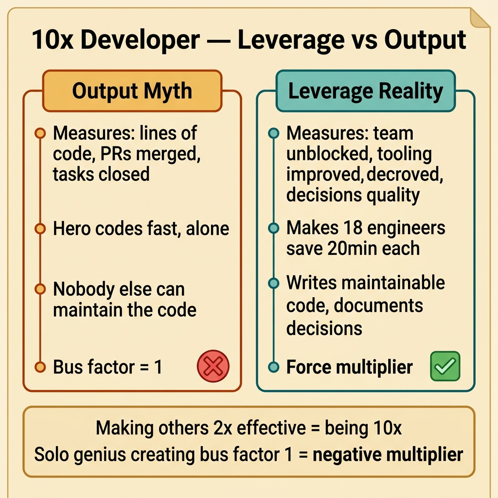
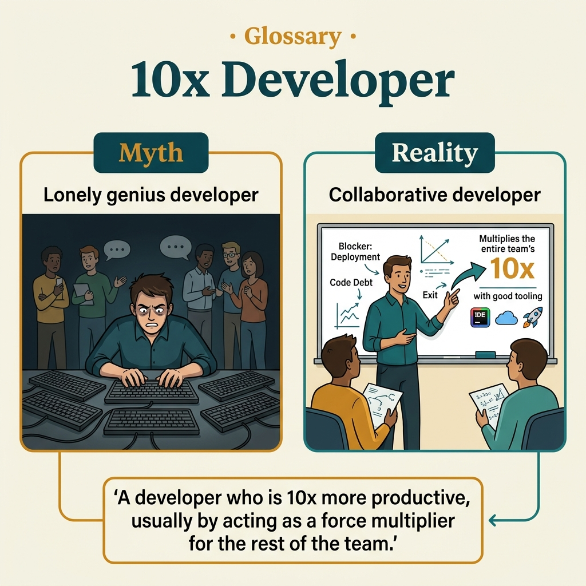

<!-- tags: glossary, reference, developer-cognition-team-dynamics, knowledge-learning, ten-x-developer -->
# 10x Developer

> A controversial label used to describe a developer with outsized leverage, but often misunderstood as "an individual genius who writes more code than everyone else."

| Aspect | Detail |
| --- | --- |
| **Concept** | A controversial label used to describe a developer with outsized leverage, but often misunderstood as "an individual genius who writes more code than everyone else." |
| **Audience** | Engineering manager, reviewer, staff engineer |
| **Primary style** | Glossary term |
| **Entry point** | Use when the team is debating individual performance, hiring bar, or the role of leverage in modern software engineering. |

📅 Created: 2026-03-30 · 🔄 Updated: 2026-04-04 · ⏱️ 9 min read

---

## 1. DEFINE

Picture someone who merges fewer PRs but removes a bottleneck for the entire team, builds a tool that makes dozens of people faster, or catches a major architecture flaw before it happens. If you only count raw output, that person might look "less productive." The debate around 10x developer starts right here: leverage is different from visible output.

**10x Developer** is a controversial label used to describe a developer with outsized leverage, but often misunderstood as "an individual genius who writes more code than everyone else."

| Variant | Description |
| --- | --- |
| Output-centric 10x myth | Measured by lines of code, task count, or pure individual speed. |
| Leverage-centric view | Measured by ability to amplify effectiveness across the entire system or team. |
| Context-enabled performance | Views outstanding performance as a result of tooling, domain understanding, trust, and leverage — not just innate talent. |

| Approach | Time | Space | When to choose |
| --- | --- | --- | --- |
| Leverage analysis | O(n improvements) | O(impact notes) | When you want to evaluate contributions beyond individual output. |
| Team-system perspective | O(n people × interfaces) | O(capability map) | When you need to understand why one person creates more impact. |
| Myth-busting management lens | O(n review cycles) | O(eval criteria) | When you want to avoid misusing this label in hiring or perf reviews. |

Core insight:

> What makes a developer "outstanding" in a modern environment is usually not typing speed. It is the ability to create leverage: making better decisions, reducing coordination cost, building better tools, and making others run faster.

### 1.1 Invariants & Failure Modes

The invariant when discussing "10x" is separating real impact from individual mythology. If the team uses this label to bypass collaboration, review quality, or leverage-creating systems, they will misoptimize both hiring and team operations.

---

## 2. CONTEXT

**Who uses it**: Engineering manager, reviewer, staff engineer

**When**: Use when the team is debating individual performance, hiring bar, or the role of leverage in modern software engineering.

**Purpose**: What makes a developer "outstanding" in a modern environment is usually not typing speed. It is the ability to create leverage: making better decisions, reducing coordination cost, building better tools, and making others run faster.

**In the ecosystem**:
- 10x developer should not be understood as "a person doing the work of 10 people in every circumstance."
- Outstanding capability always depends on context: domain fit, tool fit, trust, ownership, scope.
- If this label makes the team worship individual heroes and dismiss support systems, it is causing harm.

---

A developer 10 times more effective is clear. But 10x compared to whom, what about toxic 10x, and team 10x vs individual 10x?

## 3. EXAMPLES

10x developer surfaces most visibly when one dev solves a problem that five devs struggled with, when "the 10x dev" writes code fast but nobody else can maintain it, or when a team of five average devs produces more than one solo genius. The examples below place the pattern into exactly those situations.

### Example 1: Basic — Distinguish high output from high leverage

> **Goal**: Do not equate a person who merges many PRs with a person who creates larger impact.
> **Approach**: Compare output metrics with downstream effects on speed, quality, and coordination cost of the entire team.
> **Example**: A person writes less code but builds a CI optimization that saves the whole team 20 minutes per run.
> **Complexity**: Basic

```yaml
impact_comparison:
  output_metric:
    prs_merged: 5
  leverage_metric:
    ci_time_saved_per_engineer: 20m
    engineers_affected: 18
  result:
    team_level_impact_gt_raw_output: true
```

**Why?** Raw output is easy to measure but often measures the wrong value. Leverage looks at whether a change amplifies performance, quality, or clarity for many others.

**Takeaway**: Basic discussion about "10x" should start with impact and leverage, not by default with lines of code.

### Example 2: Intermediate — View "10x" as a consequence of context and system design

> **Goal**: Do not deify individuals while ignoring the environment that enables them.
> **Approach**: Analyze the tooling, trust, ownership, domain fit, and decision surface around an outstanding performer.
> **Example**: A strong engineer in one context might be only average if they lose domain fit and decision-making authority.
> **Complexity**: Intermediate



*Figure: Making others 2x effective = being 10x. Solo genius creating bus factor 1 = negative multiplier.*

```yaml
performance_context:
  factors:
    - deep_domain_fit
    - strong_tooling
    - trusted_ownership
    - low_process_friction
  warning:
    remove_context_and_magic_disappears: true
```

**Why?** Calling someone 10x without examining the surrounding system easily leads to hiring myths and management myths. The right context can multiply leverage dramatically; bad context can neutralize even the very skilled.

**Takeaway**: Intermediate view sees "10x" as a relationship between the individual and the system, not a magical self-contained attribute.

### Example 3: Advanced — Use the leverage lens to design stronger teams instead of hunting for heroes

> **Goal**: Shift focus from "finding geniuses" to "designing conditions that create leverage."
> **Approach**: Invest in tooling, docs, review quality, architecture clarity, and role design so more people create bigger impact.
> **Example**: A staff engineer focuses on removing organizational chokepoints instead of hoarding all hard work themselves.
> **Complexity**: Advanced

```yaml
team_leverage_design:
  invest_in:
    - tooling
    - clarity_of_ownership
    - docs_and_runbooks
    - review_standards
    - mentoring
  anti_pattern:
    one_hero_handles_every_critical_problem: true
```

**Why?** If a team is only strong when one specific person "carries," that is not sustainable strength. The leverage lens helps managers and staff engineers create an environment where many people can contribute at an outstanding level.

**Takeaway**: Advanced use of this concept is designing a better team system, not hunting for individual legends.

### Example 4: Expert — Prevent "10x" from distorting performance reviews and culture

> **Goal**: Do not mistakenly reward loud, hero, or anti-collaboration behavior just because it looks "outstanding."
> **Approach**: Evaluate long-term impact, quality, unblocking effect, and the cost a person creates for others.
> **Example**: Someone who ships extremely fast but leaves behind unmaintainable code, skips reviews, and increases bus factor is not healthy leverage.
> **Complexity**: Expert

```yaml
evaluation_guardrails:
  reward:
    - sustainable_impact
    - enabling_others
    - architecture_clarity
    - quality_preservation
  penalize:
    - hero_dependency
    - review_avoidance
    - hidden_maintenance_cost
```

**Why?** Culture easily distorts when "10x" is understood as permission to break collaboration as long as you ship fast. Expert evaluation looks at the externalities of contributions, not just short-term visible results.

**Takeaway**: Expert handling turns "10x" from a divisive myth into a practical question about sustainable leverage and healthy culture.

---

## 4. COMPARE




*Figure: Position of 10x developer among team dynamics, developer productivity, and hiring.*

10x sounds like "codes 10 times faster." Wrong: 10x impact usually comes from solving the right problem, reducing waste, unblocking the team — not from typing speed. Making others 2x effective = being 10x. Force multiplier > individual output.

### Level 1

```text
more lines of code != more leverage
better decisions + better tools + better unblocking
  -> team output multiplies
```

*Figure: Level 1 shows leverage is the real core of the "10x" debate, not raw output.*

### Level 2

```text
developer improves:
  - architecture choice
  - tooling
  - review quality
  - mentoring / unblocking
result:
  many others move faster and safer
```

*Figure: Level 2 emphasizes outstanding contributions usually spread through the entire system and team, not just through the code directly written by one person.*

### Easy to confuse or cross the boundary

| # | Severity | Mistake | Consequence | Fix |
| --- | --- | --- | --- | --- |
| 1 | 🔴 Fatal | Using the "10x" label to worship anti-collaboration heroes | Bus factor and maintenance cost increase sharply | Evaluate leverage together with externalities on the team. |
| 2 | 🟡 Common | Measuring outstanding capability only by raw output | Rewarding the wrong type of contribution | Add metrics for unblocking, tooling, quality, and decision impact. |
| 3 | 🟡 Common | Ignoring the role of context | Hiring and staffing conclusions go wrong | Analyze domain fit, ownership, tooling, and trust. |
| 4 | 🔵 Minor | Using this concept as a culture slogan | Creates arguments but does not help the team improve | Move discussion to specific leverage and support systems. |

### Quick scan

| If you encounter | What to do |
| --- | --- |
| A person creates large impact but does not write the most code | Look at leverage, not just output. |
| Team is dependent on a hero | Invest in system leverage instead of just praising individuals. |
| Performance reviews are worshipping short-term speed | Add criteria for quality and enablement. |

---

## 5. REF

| Resource | Type | Link | Notes |
| --- | --- | --- | --- |
| Mythical Man-Month | Book | https://en.wikipedia.org/wiki/The_Mythical_Man-Month | Foundation for productivity myths in software. |
| A Philosophy of Software Design | Book | https://web.stanford.edu/~ouster/cgi-bin/book.php | Strong connection to leverage and hidden complexity. |
| Staff Engineer | Book | https://staffeng.com/book | Perspective on organizational-level leverage. |

---

## 6. RECOMMEND

10x developer solves the problem of "individual productivity variance is very large." The next question: how does the curse of knowledge affect 10x devs?

| Expand to | When | Why | File/Link |
| --- | --- | --- | --- |
| Dunning-Kruger Effect | When capability debates are skewed by uncalibrated confidence | Directly connects to self-assessment. | [Dunning-Kruger Effect](./04-dunning-kruger-effect.md) |
| T-Shaped Developer | When you want to move from individual myth to a practical growth path | Helps the team think about capability constructively. | [T-Shaped Developer](./03-t-shaped-developer.md) |
| Knowledge & Learning | When you need to return to the subtopic hub | Keep context of the full branch. | [Knowledge & Learning](./README.md) |

Back to that one dev vs five devs from the beginning — but code nobody else can maintain. Now you know: real 10x = force multiplier. Writes maintainable code, documents decisions, mentors the team, solves the right problems. A solo genius creating bus factor 1 = negative multiplier.

**Links**: [← Previous](./04-dunning-kruger-effect.md) · [→ Next](./06-curse-of-knowledge.md)
