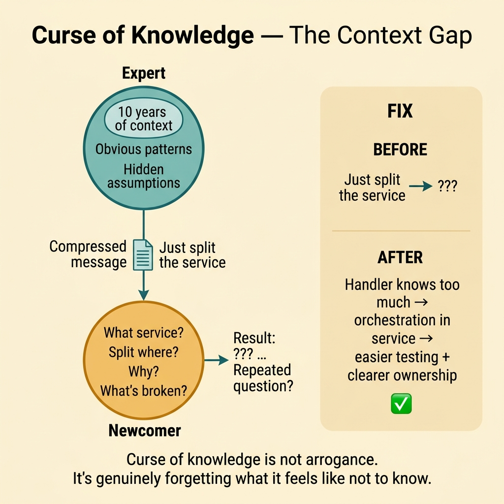
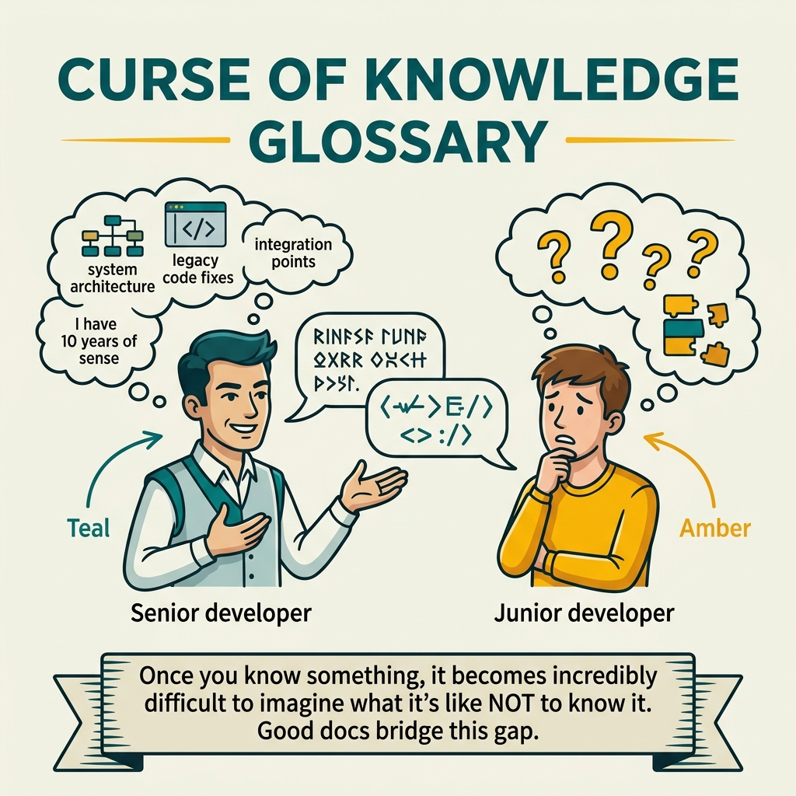

<!-- tags: glossary, reference, developer-cognition-team-dynamics, knowledge-learning, curse-of-knowledge -->
# Curse of Knowledge

> A cognitive bias where someone who deeply understands a topic finds it hard to return to the perspective of someone who does not, unintentionally writing documentation, APIs, or reviews that are too compressed and lack context.

| Aspect | Detail |
| --- | --- |
| **Concept** | A cognitive bias where someone who deeply understands a topic finds it hard to return to the perspective of someone who does not, unintentionally writing documentation, APIs, or reviews that are too compressed and lack context. |
| **Audience** | Reviewer, documentation writer, mentor |
| **Primary style** | Glossary term |
| **Entry point** | Use when docs, reviews, or onboarding keep repeating the pattern of "it has been written but newcomers still do not understand." |

📅 Created: 2026-03-30 · 🔄 Updated: 2026-04-04 · ⏱️ 9 min read

---

## 1. DEFINE

Picture a reviewer who writes "this part is obvious, just split the service out" and thinks they have explained enough. The person receiving the review still does not know which seam to split at, why the current state is wrong, or what will be better after the split. Curse of knowledge is why this type of gap keeps appearing repeatedly.

**Curse of Knowledge** is a cognitive bias where someone who deeply understands a topic finds it hard to return to the perspective of someone who does not, unintentionally writing documentation, APIs, or reviews that are too compressed and lack context.

| Variant | Description |
| --- | --- |
| Documentation curse | Documentation assumes too much background context. |
| Review curse | Reviewer skips the step of explaining reasoning because it is "too obvious." |
| Onboarding curse | The guide unconsciously skips important entry-level steps. |

| Approach | Time | Space | When to choose |
| --- | --- | --- | --- |
| Beginner-first rewrite | O(n docs or reviews) | O(rewritten artifacts) | When documentation or reviews need to be more accessible. |
| Guided onboarding observation | O(n sessions) | O(question logs) | When you want to clearly see where newcomers lose context. |
| Context-explicit review practice | O(n review cycles) | O(review templates) | When you want to pull reasoning out of the expert's head. |

Core insight:

> Curse of knowledge makes deeply knowledgeable people underestimate the amount of context others need. It is not malice; it is a default bias. That is why the team must proactively design docs, reviews, and mentoring to counteract it.

### 1.1 Invariants & Failure Modes

The invariant for counteracting curse of knowledge is that the writer must expose enough context, assumptions, and step transitions. If an artifact only makes sense to someone who already knows the background, it has not actually transmitted knowledge.

---

## 2. CONTEXT

**Who uses it**: Reviewer, documentation writer, mentor

**When**: Use when docs, reviews, or onboarding keep repeating the pattern of "it has been written but newcomers still do not understand."

**Purpose**: Curse of knowledge makes deeply knowledgeable people underestimate the amount of context others need. It is not malice; it is a default bias. That is why the team must proactively design docs, reviews, and mentoring to counteract it.

**In the ecosystem**:
- Curse of knowledge differs from pure communication talent deficiency: even very skilled people fall into it when they forget the newcomer does not share the same mental model.
- It often shows up in phrases like "obvious," "just," and "simply."
- If newcomers repeatedly ask the same question despite docs existing, there is a high chance the docs suffer from curse of knowledge.

---

Not being able to see from the perspective of someone who does not know is clear. But curse of knowledge in documentation, teaching, and code review?

## 3. EXAMPLES

Curse of knowledge surfaces most visibly when a senior writes a README that juniors cannot understand, when error messages assume the user knows internal architecture, or when a code review comment says "this is obvious" while the reviewee is confused. The examples below place the pattern into exactly those situations.

### Example 1: Basic — Rewrite explanations from the perspective of someone without context

> **Goal**: An explanation is only useful when a newcomer can trace the reasoning without needing to read the author's mind.
> **Approach**: Add background, pain points, assumptions, and step transitions to the explanation.
> **Example**: A review comment clearly explains why splitting the service will reduce coupling and where the seam lies.
> **Complexity**: Basic

```yaml
review_rewrite:
  before: "just split the service out"
  after:
    - current_problem: handler_knows_too_much_about_db_and_email
    - target_boundary: orchestration_in_service
    - expected_gain: easier_testing_and_clearer_ownership
```

**Why?** Newcomers do not lack good intentions; they lack hidden context. Rewriting with a beginner-first view pulls that context out of the author's head and turns it into a usable artifact.

**Takeaway**: The basic countermeasure against curse of knowledge is exposing assumptions and transitions, not writing in maximum compression.

### Example 2: Intermediate — Use onboarding questions to discover hidden assumptions

> **Goal**: Do not guess where docs are lacking; directly observe where newcomers lose the thread.
> **Approach**: Record repeated questions during onboarding or review, then use them to supplement context in docs.
> **Example**: Newcomers always ask "where is the entry point for this service?" or "why is retry done here?"
> **Complexity**: Intermediate



*Figure: Curse of knowledge is not arrogance. It is genuinely forgetting what it feels like not to know.*

```yaml
onboarding_signal_log:
  repeated_questions:
    - where_is_the_entry_point
    - why_is_retry_done_here
    - what_assumption_makes_this_safe
  action:
    update_docs_with_missing_context: true
```

**Why?** Repeated questions are very strong evidence of curse of knowledge. They pinpoint exactly where an artifact is assuming too much background context.

**Takeaway**: Intermediate practice uses repeated questions as sensors to patch hidden knowledge gaps.

### Example 3: Advanced — Design review templates that force the knowledgeable to explain reasoning

> **Goal**: Reviews are no longer just short verdicts but places where reasoning is transmitted.
> **Approach**: Review templates require stating the current problem, the proposed direction, the benefit, and the risk if not fixed.
> **Example**: Every important review must have "what is broken / why this change helps / what to watch out for."
> **Complexity**: Advanced

```yaml
review_template:
  required_fields:
    - current_problem
    - proposed_change
    - why_this_helps
    - caveat_or_risk
  anti_pattern:
    one_line_verdict_without_reasoning: forbidden
```

**Why?** When a review template forces reasoning to be visible, even highly skilled people have less opportunity to unconsciously compress all context into a few words like "obvious." Good process fights bias better than expecting individuals to self-remember.

**Takeaway**: Advanced teams reduce curse of knowledge through communication structure, not just through goodwill.

### Example 4: Expert — Build a culture that treats clarity as leverage, not busywork

> **Goal**: Do not let clear explanations be seen as "wasting time" for people who are not good enough yet.
> **Approach**: Reward docs, reviews, and mentoring that create cognitive leverage for many others.
> **Example**: A staff engineer is valued highly when their design doc and reviews help others understand faster, not just when they personally solve hard problems.
> **Complexity**: Expert

```yaml
clarity_culture:
  reward_signals:
    - reusable_explanations
    - high_leverage_docs
    - mentoring_that_reduces_repeat_confusion
  discourage:
    - compressed_expert_only_communication
```

**Why?** Curse of knowledge grows stronger in a culture that celebrates individual speed while devaluing clarity. When clarity is seen as real leverage, the team has systematic motivation to design better communication.

**Takeaway**: The expert response does not just fix individual docs; it changes the incentive around making knowledge clear for others.

---

## 4. COMPARE




*Figure: Position of curse of knowledge among Dunning-Kruger, documentation, and empathy.*

Curse of knowledge sounds like arrogance. Different: arrogance = "I know, you are stupid"; curse of knowledge = "I forgot what it feels like not to know." Unintentional, cognitive bias. The expert genuinely cannot imagine not knowing what they know.

### Level 1

```text
expert knows too much context
  -> explanation becomes compressed
  -> learner misses hidden steps
```

*Figure: Level 1 shows the problem lies in hidden steps being compressed inside the expert's head.*

### Level 2

```text
review or doc written by expert
  -> skips assumptions and transitions
  -> beginner cannot reconstruct reasoning
  -> repeated questions or wrong implementation happen
```

*Figure: Level 2 emphasizes curse of knowledge usually shows up through repeated confusion, not through a single one-off bug.*

### Easy to confuse or cross the boundary

| # | Severity | Mistake | Consequence | Fix |
| --- | --- | --- | --- | --- |
| 1 | 🔴 Fatal | Treating repeated confusion as the newcomer's fault | Team misses the systemic cause in docs or reviews | Audit hidden assumptions in the artifact. |
| 2 | 🟡 Common | Reviews are too compressed, verdict only | The recipient does not learn the reasoning | Add templates that require explaining the reason. |
| 3 | 🟡 Common | Docs lack entry points and assumptions | Onboarding slows, support load increases | Write beginner-first, add context. |
| 4 | 🔵 Minor | Not using repeated questions as improvement signals | The same spot keeps causing confusion | Log questions and update docs periodically. |

### Quick scan

| If you encounter | What to do |
| --- | --- |
| Docs exist but newcomers keep asking about the same spot | Check for curse of knowledge. |
| Review comments are too short and "obvious" | Require reasoning to be made visible. |
| Team celebrates compressing for speed over clarity | Fix the incentive and review culture. |

---

## 5. REF

| Resource | Type | Link | Notes |
| --- | --- | --- | --- |
| Made to Stick | Book | https://heathbrothers.com/books/made-to-stick/ | Useful for clarity and transfer of understanding. |
| A Philosophy of Software Design | Book | https://web.stanford.edu/~ouster/cgi-bin/book.php | Strong connection to clarity and hidden complexity. |
| The Elements of Style | Book | https://www.gutenberg.org/ebooks/37134 | Foundation for writing that is brief yet clear. |

---

## 6. RECOMMEND

Curse of knowledge solves the problem of "expert communicates ineffectively with non-expert." The next question: how does Conway's Law affect team structure?

| Expand to | When | Why | File/Link |
| --- | --- | --- | --- |
| Tacit Knowledge | When the missing part is judgment that is hard to write down | Directly connects to knowledge transfer. | [Tacit Knowledge](./01-tacit-knowledge.md) |
| Explicit Knowledge | When you want to turn hidden assumptions into reusable docs | This is the natural conversion step. | [Explicit Knowledge](./02-explicit-knowledge.md) |
| Knowledge & Learning | When you need to return to the subtopic hub | Keep context of the full branch. | [Knowledge & Learning](./README.md) |

Back to that README the junior could not understand from the beginning — senior wrote for seniors. Now you know: test documentation with fresh eyes. Let a newcomer read it. If they struggle, you have curse of knowledge. Write for the person who does not know yet, not the person who already does.

**Links**: [← Previous](./05-ten-x-developer.md) · [→ Next](./README.md)
