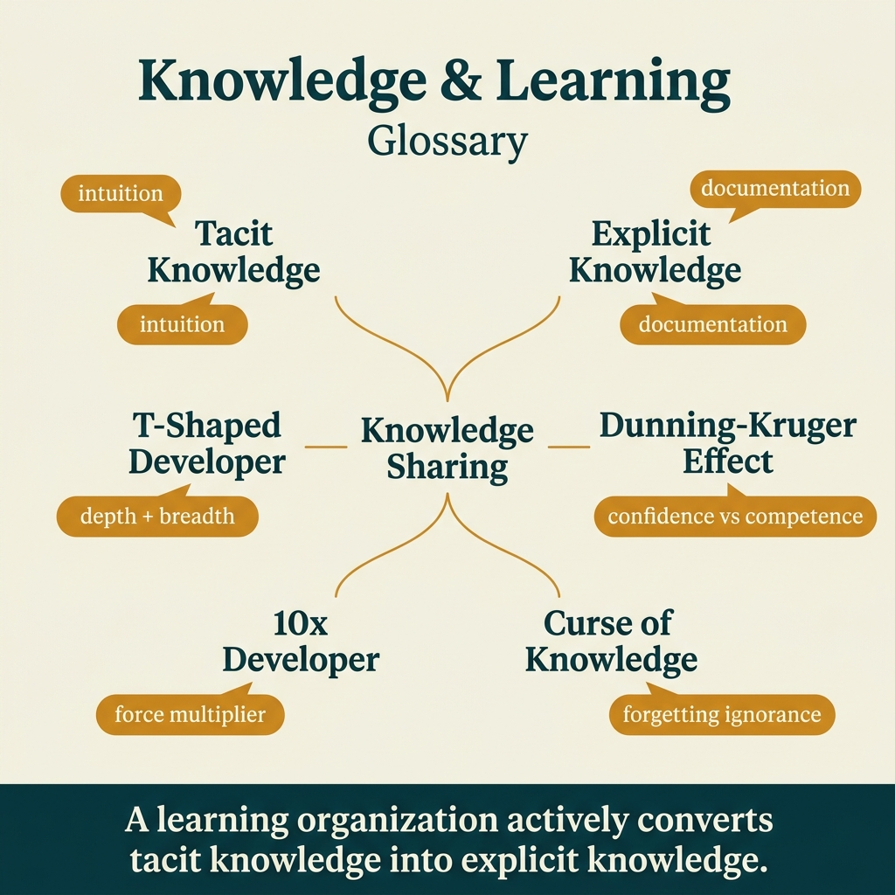

<!-- tags: glossary, reference, developer-cognition-team-dynamics, knowledge-learning, overview -->
# Knowledge & Learning

> A cluster of terms that name how knowledge is retained, lost, transmitted, and misunderstood within technical teams over time.

| Aspect | Detail |
| --- | --- |
| **Concept** | A cluster of terms that name how knowledge is retained, lost, transmitted, and misunderstood within technical teams over time. |
| **Audience** | Developer, mentor, tech lead, engineering manager |
| **Primary style** | Glossary hub router |
| **Entry point** | Open when the issue lies in onboarding, knowledge silos, overconfidence, or difficulty transmitting understanding between people and teams |

📅 Created: 2026-03-30 · 🔄 Updated: 2026-04-04 · ⏱️ 6 min read

---

## 1. DEFINE

Picture a system that might have comprehensive docs but still makes onboarding hard because the most important knowledge lives inside a few people's heads. Sometimes the problem is people becoming confident too early or pushing newcomers into overload. This README routes those phenomena into the right terms about tacit knowledge, explicit knowledge, T-shaped growth, and learning biases.

**Knowledge & Learning** is a cluster of terms that name how knowledge is retained, lost, transmitted, and misunderstood within technical teams over time.

| Variant | Description |
| --- | --- |
| Knowledge form | Tacit and explicit knowledge name the two main forms of understanding within a team. |
| Growth shape | T-shaped developer describes how a person expands breadth without losing depth. |
| Learning distortions | Dunning-Kruger, ten-x developer, and curse of knowledge name the misalignments in learning and teaching. |

| Approach | Time | Space | When to choose |
| --- | --- | --- | --- |
| Route by onboarding symptom | O(1) route | O(1) | When newcomers onboard slowly, ask repeatedly, or depend on a few people |
| Route by knowledge transfer | O(1) route | O(1) | When you need to turn hard-to-articulate understanding into usable artifacts |
| Learn from form to bias | O(1) route | O(1) | When you want to go from how knowledge exists to how it gets distorted |

Core insight:

> Knowledge does not automatically become a team asset; if you do not correctly name its form and bias, the team will continuously pay the price through slow onboarding and owner dependency.

### 1.1 Signals & Boundaries

- Tacit vs explicit is the foundational layer for evaluating docs, pairing, and review.
- T-shaped developer is a mental model for growth, not a self-congratulatory title.
- Curse of knowledge and Dunning-Kruger help name the misalignments that frequently appear in mentoring and review.

### Coverage Map

| Entry | Role | Notes |
| --- | --- | --- |
| [Tacit Knowledge](01-tacit-knowledge.md) | Canonical term | Primary entry for this branch |
| [Explicit Knowledge](02-explicit-knowledge.md) | Canonical term | Primary entry for this branch |
| [T-Shaped Developer](03-t-shaped-developer.md) | Canonical term | Primary entry for this branch |
| [Dunning-Kruger Effect](04-dunning-kruger-effect.md) | Canonical term | Primary entry for this branch |
| [10x Developer](05-ten-x-developer.md) | Canonical term | Primary entry for this branch |
| [Curse of Knowledge](06-curse-of-knowledge.md) | Canonical term | Primary entry for this branch |

---

## 2. VISUAL




*Figure: Router map prioritizing quick-scan of lanes, entry points, and boundaries before diving into detailed prose below.*

A hub only has value when it shows the path forward. The visual above pulls learning paths and symptom routes onto the same plane.

### Level 1

```text
Knowledge form
Growth shape
Learning distortions
```

*Figure: Level 1 divides this hub into primary decision lanes so readers do not have to search through a flat term list.*

### Level 2

```text
If the symptom is...                                      Open this first
------------------------------------------------------   ------------------------------------------
Knowledge lives in a few heads and is hard to document    Tacit Knowledge
Want to turn know-how into docs, checklists, or process   Explicit Knowledge
Debating the growth shape of an engineer                  T-Shaped Developer
Expert speaks too fast for newcomers to follow             Curse of Knowledge
```

*Figure: Level 2 turns the hub into a symptom router: start from the real question, then branch to the specific term.*

---

## 3. CODE

The diagram above groups this cluster by how knowledge is retained, spread, and distorted through experience. From here, use the hub as a diagnostic tool to identify which form of knowledge is missing in the team.

### Problem 1: Basic — Route the right symptom to the right glossary entry

> **Goal**: Do not let every question about **Knowledge & Learning** be thrown into the same bucket.
> **Approach**: Start from the reader's symptom or question, then open the most relevant entry first.
> **Example**: The input is a review or design question; the output is the file to open first, such as `./01-tacit-knowledge.md`.
> **Complexity**: Basic

```yaml
router:
  - symptom: Knowledge lives in a few heads and is hard to document
    open_first: ./01-tacit-knowledge.md
  - symptom: Want to turn know-how into docs, checklists, or process
    open_first: ./02-explicit-knowledge.md
  - symptom: Debating the growth shape of an engineer
    open_first: ./03-t-shaped-developer.md
  - symptom: Expert speaks too fast for newcomers to follow
    open_first: ./06-curse-of-knowledge.md
```

**Why?** In knowledge and learning, the same phenomenon of "the team not understanding each other" can come from tacit knowledge, curse of knowledge, or wrong expectations about T-shaped developers. This router helps lock onto the right type of knowledge that is missing or stuck.

**Takeaway**: The hub's first value is turning vague learning problems into a clear entry point for designing better transmission.

### Problem 2: Intermediate — Use the hub as an intentional learning path

> **Goal**: Read **Knowledge & Learning** in logical clusters instead of jumping between disconnected files.
> **Approach**: Follow a lane from foundations to heavier variants, then return to compare adjacent concepts when needed.
> **Example**: A reader wants to build a more durable mental model rather than just looking up a single definition.
> **Complexity**: Intermediate

```yaml
learning_path:
  knowledge_forms:
    - 01-tacit-knowledge.md
    - 02-explicit-knowledge.md
  growth_shape:
    - 03-t-shaped-developer.md
  learning_biases:
    - 04-dunning-kruger-effect.md
    - 05-ten-x-developer.md
    - 06-curse-of-knowledge.md
```

**Why?** The terms in this cluster are only useful when the reader sees the connections between personal learning, knowledge transmission, and capability illusions. The learning path turns the hub into a capability development map instead of a collection of career slogans.

**Takeaway**: At the intermediate level, this hub helps the reader trace where knowledge is stuck in the learning, mentoring, and transmission journey.

### Problem 3: Advanced — Use the hub as a governance map for shared vocabulary

> **Goal**: Keep reviews, ADRs, runbooks, or post-mortems using the same language within **Knowledge & Learning**.
> **Approach**: Group terms by decision lane, then use that lane as a glossary contract for the team.
> **Example**: When two people use the same word but are actually arguing about two different system layers.
> **Complexity**: Advanced

```yaml
governance_map:
  knowledge_form:
    - 01-tacit-knowledge.md
    - 02-explicit-knowledge.md
  growth_shape:
    - 03-t-shaped-developer.md
  learning_distortions:
    - 04-dunning-kruger-effect.md
    - 05-ten-x-developer.md
    - 06-curse-of-knowledge.md
```

**Why?** Shared vocabulary in this cluster helps the organization reason more clearly about mentorship, onboarding, and capability building. The governance map keeps the team distinguishing knowledge forms, cognitive biases, and role expectations.

**Takeaway**: At the advanced level, this hub is a knowledge circulation map so capability does not get locked inside a few individuals.

---

## 4. PITFALLS

Taxonomy is clear, but correct routing is not enough to avoid common slips when using or interpreting this concept cluster.

| # | Severity | Mistake | Consequence | Fix |
| --- | --- | --- | --- | --- |
| 1 | 🔴 Fatal | Mixing multiple concept layers in the same discussion | Team fixes the wrong problem layer, discussion goes off track | Re-route by the correct lane in the README before opening a specific term |
| 2 | 🟡 Common | Choosing a term by familiar name instead of by symptom | Deep-links to the right file but the wrong boundary | Ask the symptom question first, then choose the entry point |
| 3 | 🟡 Common | Reading a term in isolation, skipping the learning path | Fragmented understanding, missing adjacent concepts for comparison | Follow the reading clusters suggested in CODE/RECOMMEND |
| 4 | 🔵 Minor | Not linking back to parent hub or root hub | Readers have difficulty returning to the taxonomy when lost | Keep the hub as a router; do not turn files into islands |

---

## 5. REF

| Resource | Type | Link | Notes |
| --- | --- | --- | --- |
| The Fifth Discipline | Book | https://www.penguinrandomhouse.com/books/175736/the-fifth-discipline-by-peter-m-senge/ | Great for learning organizations and knowledge flow |
| Team Topologies | Book | https://teamtopologies.com/ | Beautiful connection between knowledge flow and team structure |
| Domain-Driven Design | Book | https://www.domainlanguage.com/ddd/ | Good foundation for shared language and explicit knowledge |

---

## 6. RECOMMEND

You have identified which form the missing knowledge takes. Now proceed to the term that describes the exact learning bottleneck, so onboarding or mentoring design has a clear target.

| Expand to | When | Why | File/Link |
| --- | --- | --- | --- |
| Tacit knowledge first | When the symptom is knowledge silo or "only person A knows" | This is the root name for the knowledge concentration problem | [Tacit Knowledge](./01-tacit-knowledge.md) |
| Explicit knowledge next | When you need to turn knowing into artifacts | It is the counterweight to tacit knowledge in the team workflow | [Explicit Knowledge](./02-explicit-knowledge.md) |
| Curse of knowledge when mentoring gaps | When the skilled person explains but newcomers still cannot follow | This problem is often subtler than expected | [Curse of Knowledge](./06-curse-of-knowledge.md) |

---

## 7. QUICK REF

| If you encounter | Open this |
| --- | --- |
| Knowledge lives in a few heads and is hard to document | [Tacit Knowledge](./01-tacit-knowledge.md) |
| Want to turn know-how into docs, checklists, or process | [Explicit Knowledge](./02-explicit-knowledge.md) |
| Debating the growth shape of an engineer | [T-Shaped Developer](./03-t-shaped-developer.md) |
| Expert speaks too fast for newcomers to follow | [Curse of Knowledge](./06-curse-of-knowledge.md) |
