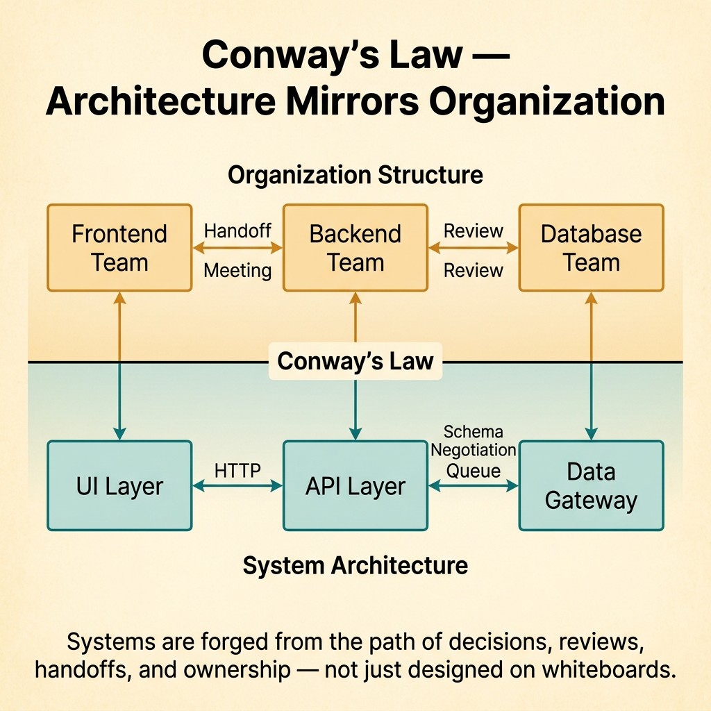
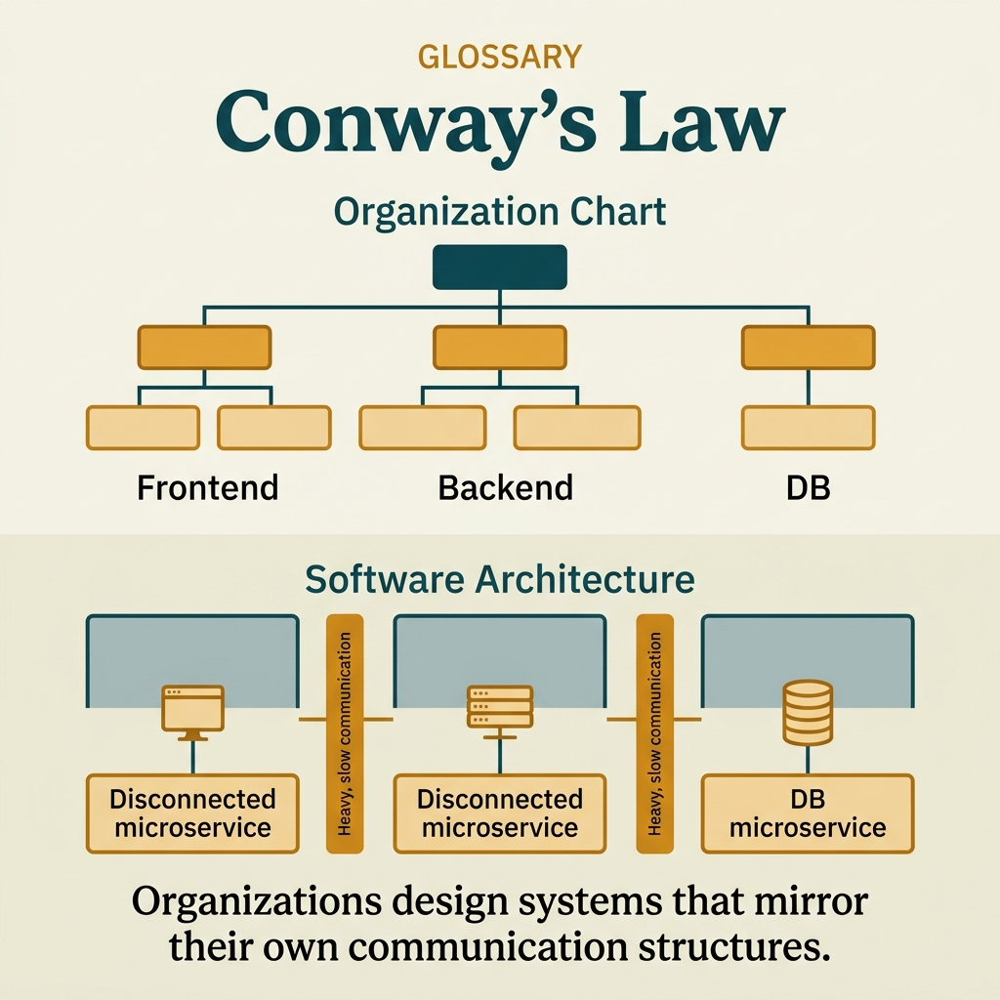

<!-- tags: glossary, reference, developer-cognition-team-dynamics, team-collaboration-dynamics, conways-law -->
# Conway's Law

> A principle stating that system architecture tends to mirror the communication structure of the organization that built it.

| Aspect | Detail |
| --- | --- |
| **Concept** | A principle stating that system architecture tends to mirror the communication structure of the organization that built it. |
| **Audience** | Architect, engineering manager, tech lead |
| **Primary style** | Glossary term |
| **Entry point** | Use when architecture is being "drawn" by meeting charts, ownership, and org charts more than by pure technical intent. |

📅 Created: 2026-03-30 · 🔄 Updated: 2026-04-04 · ⏱️ 9 min read

---

## 1. DEFINE

Picture an organization with a frontend team, a backend team, and a database team rigidly separated. The result is a system that also fractures along those three handoff layers: a thick API layer, prolonged schema negotiation, responsibility split apart. Conway's Law does not say teams are bad; it says systems tend to become the shadow of how people are forced to communicate with each other.

**Conway's Law** is a principle stating that system architecture tends to mirror the communication structure of the organization that built it.

| Variant | Description |
| --- | --- |
| Architecture mirrors org | System boundaries map directly to communication boundaries. |
| Coordination-shaped APIs | Interfaces are born to serve handoffs between teams. |
| Org-driven coupling | Technical coupling follows organizational coupling. |

| Approach | Time | Space | When to choose |
| --- | --- | --- | --- |
| Read architecture through team topology | O(n org mappings) | O(notes) | When system boundaries are hard to explain by technical reasons alone. |
| Minimize forced handoff boundaries | O(n topology changes) | O(interface redesign) | When architecture is heavy because of too many team-to-team seams. |
| Align ownership with desired flow | O(n org reviews) | O(boundary docs) | When desired architecture differs dramatically from the current communication structure. |

Core insight:

> Systems are not just designed on whiteboards; they are forged from the path of decisions, reviews, handoffs, and ownership. To understand why architecture has its current shape, look at how teams must coordinate daily.

### 1.1 Invariants & Failure Modes

The invariant is that communication paths and system paths will find ways to converge over time. If the organization forces too many handoffs, architecture will sooner or later mirror them as APIs, queues, and coordination seams.

---

## 2. CONTEXT

**Who uses it**: Architect, engineering manager, tech lead

**When**: Use when architecture is being "drawn" by meeting charts, ownership, and org charts more than by pure technical intent.

**Purpose**: Systems are not just designed on whiteboards; they are forged from the path of decisions, reviews, handoffs, and ownership. To understand why architecture has its current shape, look at how teams must coordinate daily.

**In the ecosystem**:
- Conway's Law does not say team structure determines 100% of architecture, but its influence is often greater than we want to admit.
- This is a law about socio-technical systems, not about code alone.
- It is most useful when system boundaries look "strange" if viewed only through a technical logic lens.

---

Systems reflecting organizational structure is clear. But is Conway's Law inevitable or manageable, what about reverse Conway, and team design?

## 3. EXAMPLES

Conway's Law surfaces most visibly when three teams build one system but have three deployment pipelines, when API boundaries match team boundaries but not domain boundaries, or when a team reorg happens but system architecture does not change. The examples below place the pattern into exactly those situations.

### Example 1: Basic — Architecture looks strange but actually mirrors handoffs

A service has an extra mid-layer API adapter not for domain reasons, but because two different teams own each side. At the basic level, Conway's Law helps the team correctly name the organizational pressure showing up in code.

Input is a boundary hard to explain purely technically. Output is a mapping between system seams and team seams. Complexity is low since this is just the recognition step.

```go
type OwnershipMap struct {
	TeamBoundary string
	SystemSeam   string
}
```

**Why?** Many "strangely bad" architectures are not born from poor engineering but from real coordination models. Correctly naming the socio-technical origin helps teams avoid treating symptoms with half-hearted refactors.

**Takeaway**: You see technical seams as consequences of communication seams, not just as isolated code errors.
**Caveat**: Not every boundary is org-created; domain truth still has its own role.
**Use when**: Architecture has extra layers or adapters whose technical justification is not truly convincing.

### Example 2: Intermediate — Cross-team API shaped by coordination cost

Two teams want to avoid frequent sync, so they push too much flexibility into the API contract. At the intermediate level, Conway's Law reveals that the contract is carrying the cost of org design.

Input is an interface between teams that is abnormally bloated. Output is a reading frame seeing the contract as a product of coordination pattern. Complexity is moderate since it touches both interface and ways of working.



*Figure: Systems are forged from the path of decisions, reviews, handoffs, and ownership — not just designed on whiteboards.*

```go
type TeamAPIContract struct {
	NeedsCrossTeamSync bool
	Overgeneralized    bool
}
```

**Why?** When the cost of talking is high, teams often try to encode every possible future into the interface so they do not have to ask each other again. The result is an API that grows faster than real need, and technical complexity increases with social structure.

**Takeaway**: You understand why the contract is bloated without blaming the API author entirely.
**Caveat**: Seeing the coordination cause does not automatically solve the problem; sometimes the interface still needs concrete redesign.
**Use when**: Cross-team APIs are overly general or defensive compared to actual current needs.

### Example 3: Advanced — Use Conway as a diagnostic tool for topology debt

A desired architecture follows domain slices, but the organization is still split by specialty layers. At the advanced level, Conway's Law is a diagnostic tool for why the target architecture never materializes.

Input is a desired architecture that does not match reality. Output is a hypothesis about topology debt blocking that architecture. Complexity is high since it involves org design.

```go
type TopologyDebt struct {
	DesiredBoundary string
	CurrentOrgShape string
}
```

**Why?** A desired architecture cannot survive long if the organization is still optimizing for a shape that opposes it. Conway's Law turns the question "why does refactoring never finish?" into a topology-level question instead of just a code-level one.

**Takeaway**: You use this law to see the invisible resistance behind failed architecture attempts.
**Caveat**: Do not use Conway as an excuse to abandon all architecture improvement efforts when the org cannot change immediately.
**Use when**: The target architecture goes through many design rounds but implementation keeps sliding back to the old shape.

### Example 4: Expert — Conway's Law at the organizational level is a design lever

At the expert level, this law is not just for diagnosis but also for design. If you want a different architecture, sometimes you must change how teams communicate first. That is where the inverse Conway maneuver enters.

Input is an org wanting system evolution in a different direction. Output is the awareness that team topology is a primary design lever. Complexity is high since it touches strategy.

```go
type ArchitectureLever struct {
	OrgShapeMatters    bool
	DesiredSystemShape string
}
```

**Why?** Architecture cannot be separated from the structure of decision-making. When leadership treats the org chart as immutable and architecture as something they can draw however they want, the mismatch will repeat endlessly.

**Takeaway**: You elevate Conway's Law from an observation into a design principle for socio-technical systems.
**Caveat**: Changing org to force architecture without clear boundaries can also create new chaos.
**Use when**: Leadership wants to change architecture at a large scale, not just local refactoring.

---

## 4. COMPARE




*Figure: Position of Conway's Law among Inverse Conway Maneuver, team topology, and system design.*

Conway's Law sounds like just an observation. True — but it is also a design tool: if you know org structure → system structure, then design org structure first to get desired system structure (Inverse Conway Maneuver).

### Level 1

```text
org communication graph
  -> shapes system boundaries
  -> shapes interfaces
```

*Figure: Level 1 shows architecture and org chart tend to pull each other rather than living independently.*

### Level 2

```text
team boundary
  frontend | backend | database

system boundary
  ui layer | api layer | data gateway
```

*Figure: Level 2 emphasizes the handoff paths in the organization often materialize as seams in the system.*

### Easy to confuse or cross the boundary

| # | Severity | Mistake | Consequence | Fix |
| --- | --- | --- | --- | --- |
| 1 | 🔴 Fatal | Viewing architecture as completely independent of team structure | Continuous refactoring but the old shape keeps returning | Audit org seams alongside system seams. |
| 2 | 🟡 Common | Blaming every architecture problem on Conway | Missing real domain and technical causes | Use this law as one lens, not the only explanation. |
| 3 | 🟡 Common | Seeing topology debt but not acting at the org layer | Diagnosis is right but cannot cure | Connect findings to ownership and topology changes. |
| 4 | 🔵 Minor | Using Conway as an immutable destiny | Team loses the will to improve | Combine with the inverse Conway maneuver. |

### Quick scan

| If you encounter | What to do |
| --- | --- |
| Architecture has seams hard to explain technically | Check the corresponding org seam. |
| Cross-team API is bloated | Examine how coordination cost is shaping the contract. |
| Target architecture does not materialize | Audit topology debt. |
| Want to truly change system shape | Use team structure as a design lever. |

---

## 5. REF

| Resource | Type | Link | Notes |
| --- | --- | --- | --- |
| Conway's law | Reference | https://en.wikipedia.org/wiki/Conway%27s_law | Basic concept source. |
| Team Topologies | Book | https://teamtopologies.com/ | Very strong on applying this law to organizational design. |
| Inverse Conway Maneuver | Related term | ./02-inverse-conway-maneuver.md | Next step from diagnosis to action. |

---

## 6. RECOMMEND

Conway's Law solves the problem of "system architecture is coupled to the org chart." The next question: how does the Inverse Conway Maneuver work, and what about bus factor?

| Expand to | When | Why | File/Link |
| --- | --- | --- | --- |
| Inverse Conway Maneuver | When you want to move from understanding the problem to changing the structure | This is the proactive response to Conway's Law. | [Inverse Conway Maneuver](./02-inverse-conway-maneuver.md) |
| Two-Pizza Rule | When coordination cost rises with team size | Team shape and system shape are tightly connected. | [Two-Pizza Rule](../decision-making-trade-offs/04-two-pizza-rule.md) |
| Team & Collaboration Dynamics | When you need to return to the hub | Keep context of the full topic. | [Team & Collaboration Dynamics](./README.md) |

Back to those three teams with three pipelines from the beginning — Conway's Law in action. Now you know: org structure → system structure. Want microservices? Need small, autonomous teams. Want monolith? Need unified team. Design team first, system follows.

**Links**: [← Previous](./README.md) · [→ Next](./02-inverse-conway-maneuver.md)
