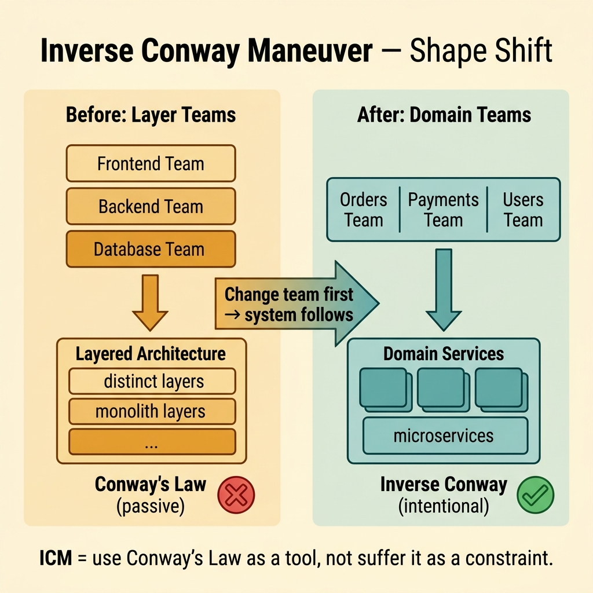
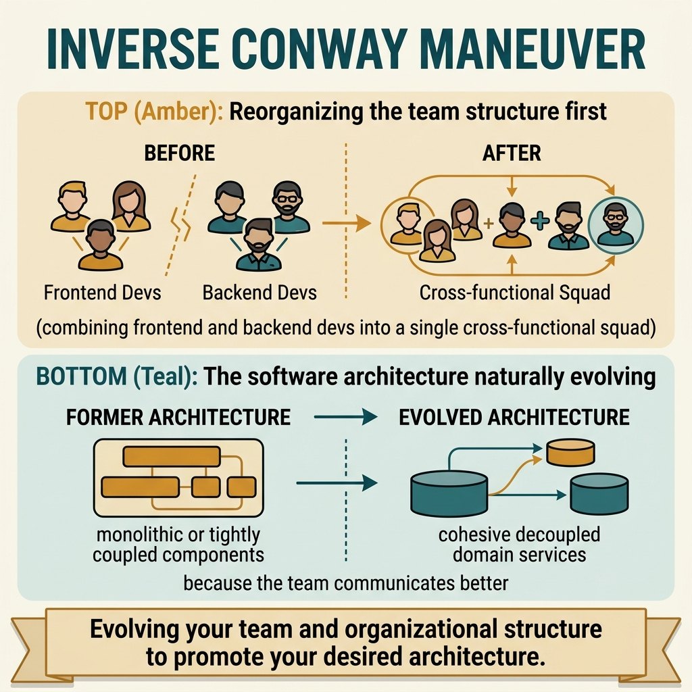

<!-- tags: glossary, reference, developer-cognition-team-dynamics, team-collaboration-dynamics, inverse-conway-maneuver -->
# Inverse Conway Maneuver

> Proactively redesigning team structure to match the desired architecture instead of letting the system be pulled by the old organization.

| Aspect | Detail |
| --- | --- |
| **Concept** | Proactively redesigning team structure to match the desired architecture instead of letting the system be pulled by the old organization. |
| **Audience** | Engineering leadership, architect |
| **Primary style** | Glossary term |
| **Entry point** | Use when the team has seen Conway's Law dominating architecture and wants to actively steer rather than just accept the status quo. |

📅 Created: 2026-03-30 · 🔄 Updated: 2026-04-04 · ⏱️ 9 min read

---

## 1. DEFINE

Picture wanting a system built around domain-aligned services, but the organization is still rigidly split into frontend, backend, and database teams. The new architecture will continuously be pulled back to the old pattern. Inverse Conway Maneuver is the deliberate act of changing team topology to support the desired system shape.

**Inverse Conway Maneuver** is proactively redesigning team structure to match the desired architecture instead of letting the system be pulled by the old organization.

| Variant | Description |
| --- | --- |
| Team-first architecture move | Change ownership and topology first to pave the way for architecture. |
| Domain-aligned reorganization | Arrange teams by domain boundaries instead of layer specialties. |
| Temporary maneuver | Reorganize for a migration target, then adjust further afterward. |

| Approach | Time | Space | When to choose |
| --- | --- | --- | --- |
| Map desired architecture to team boundaries | O(n boundary plans) | O(org design notes) | When the target architecture is fairly clear. |
| Reassign ownership before deep refactor | O(n transitions) | O(hand-off plans) | When refactoring is being heavily blocked by org seams. |
| Pilot with one domain slice first | O(n pilot cycles) | O(learning notes) | When changing the entire org at once is too risky. |

Core insight:

> If system shape mirrors communication shape, then to change system shape sustainably, sometimes you must change the communication shape first. Inverse Conway is not an exercise in drawing pretty org charts; it is a lever for refactoring socio-technical systems.

### 1.1 Invariants & Failure Modes

The invariant is that new team boundaries must genuinely support the new decision flow. If only the org chart changes but ownership and interfaces remain the same, the maneuver becomes a cosmetic change.

---

## 2. CONTEXT

**Who uses it**: Engineering leadership, architect

**When**: Use when the team has seen Conway's Law dominating architecture and wants to actively steer rather than just accept the status quo.

**Purpose**: If system shape mirrors communication shape, then to change system shape sustainably, sometimes you must change the communication shape first. Inverse Conway is not an exercise in drawing pretty org charts; it is a lever for refactoring socio-technical systems.

**In the ecosystem**:
- Not every large refactor requires changing team topology, but refactors that are continuously blocked by handoffs are worth serious consideration.
- This is an intentional maneuver, not "reorganize and things will improve."
- It is most effective when the desired boundary is clear enough to map to real ownership.

---

Designing team structure to get desired architecture is clear. But how do you sell ICM to management, what are the risks when re-orging, and what about team topology?

## 3. EXAMPLES

Inverse Conway Maneuver surfaces most visibly when a company wants microservices but has one monolith team, when teams are re-organized by domain boundary before splitting a service, or when "just split the monolith" fails because team structure did not change. The examples below place the pattern into exactly those situations.

### Example 1: Basic — See the desired boundary clearly before changing teams

If you do not know what system shape you want, inverse Conway easily becomes an emotional reorganization. At the basic level, the desired boundary must be finalized first.

Input is an intention to change architecture. Output is a boundary map clear enough to say which team should own which part. Complexity is low since this is just the framing step.

```go
type DesiredBoundary struct {
	Domain    string
	OwnerTeam string
}
```

**Why?** Reorg without a clear target architecture only creates more churn. A desired boundary map gives the maneuver a technical destination, not just organizational momentum.

**Takeaway**: You change team structure based on a real architecture goal, not based on a feeling that "rearranging will help."
**Caveat**: An overly rough boundary map will push ambiguity to the handoff phase.
**Use when**: Leadership is discussing team changes but the target architecture is still described vaguely.

### Example 2: Intermediate — Change ownership before deep refactoring

A domain is currently touched by three teams. If ownership has not changed but code refactoring has already started, every PR will still go through old paths. At the intermediate level, inverse Conway usually needs the ownership move to go first.

Input is a large refactor blocked by current review and handoff patterns. Output is new owner alignment before broadening code changes. Complexity is moderate since it touches daily workflows.



*Figure: ICM = use Conway's Law as a tool, not suffer it as a constraint.*

```go
type OwnershipTransfer struct {
	FromTeam string
	ToTeam   string
	Surface  string
}
```

**Why?** Code refactoring and org refactoring are two halves of the same problem. If old ownership remains, the system will be pulled back through review paths, incident handling, and decision authority.

**Takeaway**: You pave the way for new architecture by changing who has decision authority at the right boundary.
**Caveat**: Ownership transfer without good onboarding and handoff notes will increase bus factor in the short term.
**Use when**: Refactoring is continuously slow because too many teams have a voice on the same domain slice.

### Example 3: Advanced — Pilot on a small slice to learn before changing widely

Changing the entire org at once easily causes shock. At the advanced level, inverse Conway should usually be piloted on a domain slice representative enough to learn how the new boundary actually operates.

Input is an intention to change topology at a large scale. Output is a small pilot scope with clearly measurable learning. Complexity is high since picking the right slice matters.

```go
type ManeuverPilot struct {
	DomainSlice   string
	SuccessSignal string
}
```

**Why?** Topology change has many unknowns: incident flow, review load, skill gaps, backlog boundaries. A pilot lets the team learn on a real slice before committing to a broad reorg.

**Takeaway**: You reduce the risk of inverse Conway by turning it into a bounded experiment.
**Caveat**: A pilot that is too small or too unique will produce distorted lessons that are hard to scale.
**Use when**: The desired architecture is clear but the organizational impact still has many unknowns.

### Example 4: Expert — Use the maneuver as a strategy for transforming the socio-technical system

At the expert level, inverse Conway is not just about changing team diagrams. It is a strategy that ties product roadmap, team topology, ownership, and architecture evolution into a single movement.

Input is an organization wanting to change system shape at a foundational scale. Output is a plan where org moves and code moves are designed together. Complexity is high since this is transformation work.

```go
type TransformationPlan struct {
	TopologyChange     string
	ArchitectureChange string
}
```

**Why?** If the org changes without a code plan, or code changes without org changes, the transformation will be torn in two. The maneuver is effective when it treats organization and architecture as two faces of the same design problem.

**Takeaway**: You use inverse Conway as a lever for simultaneously transforming people and systems.
**Caveat**: This is an expensive maneuver; only open it when the architecture benefit is large enough and leadership commits to the full cycle.
**Use when**: The organization wants to bend the system to a new shape sustainably, not just perform cosmetic refactoring.

---

## 4. COMPARE




*Figure: Position of Inverse Conway among Conway's Law, team topology, and organizational design.*

ICM sounds like re-org. Different: re-org is usually driven by business or HR (reporting lines), ICM is driven by desired technical architecture (team boundaries = service boundaries). ICM is an intentional re-org for a technical outcome.

### Level 1

```text
desired architecture
  -> choose matching team boundaries
  -> align communication with system goals
```

*Figure: Level 1 shows inverse Conway is designing communication structure to nurture the right architecture.*

### Level 2

```text
current org
  layer teams -> layered architecture

desired org
  domain teams -> domain services
```

*Figure: Level 2 emphasizes this maneuver is an intentional shape-shift between organization and system.*

### Easy to confuse or cross the boundary

| # | Severity | Mistake | Consequence | Fix |
| --- | --- | --- | --- | --- |
| 1 | 🔴 Fatal | Reorganizing before knowing the desired architecture | Large churn but no outcome change | Finalize the boundary map first. |
| 2 | 🟡 Common | Changing the org chart but not changing actual ownership | System still gets pulled to old seams | Tie topology changes to authority changes. |
| 3 | 🟡 Common | Opening the maneuver too broadly too early | Increased risk and resistance | Pilot on a meaningful domain slice. |
| 4 | 🔵 Minor | Treating this as purely an HR problem | Code plan and org plan are separated | Design the transformation simultaneously. |

### Quick scan

| If you encounter | What to do |
| --- | --- |
| Want to change architecture but the old org pulls it back | Draw the desired boundary map first. |
| Refactor stuck due to review and handoff | Transfer ownership first. |
| Reorg is too risky to do all at once | Pilot on one domain slice. |
| Need long-term transformation | Tie the org plan to the code plan. |

---

## 5. REF

| Resource | Type | Link | Notes |
| --- | --- | --- | --- |
| Team Topologies | Book | https://teamtopologies.com/ | Very close to how to execute inverse Conway. |
| Conway's Law | Related term | ./01-conways-law.md | This is the diagnostic foundation for the maneuver. |
| Inverse Conway maneuver | Reference | https://martinfowler.com/bliki/ConwaysLaw.html | Martin Fowler has many useful short explanations. |

---

## 6. RECOMMEND

ICM solves the problem of "want new architecture but old team structure forces old architecture." The next question: what about bus factor risk, and truck factor?

| Expand to | When | Why | File/Link |
| --- | --- | --- | --- |
| Conway's Law | When you need to return to diagnosis | Inverse Conway is the proactive response to this law. | [Conway's Law](./01-conways-law.md) |
| Two-Pizza Rule | When topology change raises questions about team size | Size and boundary go together. | [Two-Pizza Rule](../decision-making-trade-offs/04-two-pizza-rule.md) |
| Team & Collaboration Dynamics | When you need to return to the hub | Keep context of the full topic. | [Team & Collaboration Dynamics](./README.md) |

Back to that "split the monolith" failure from the beginning — team structure did not change, architecture could not change. Now you know: change team first, system follows. ICM = use Conway's Law as a tool, not suffer it as a constraint.

**Links**: [← Previous](./01-conways-law.md) · [→ Next](./03-bus-factor.md)
