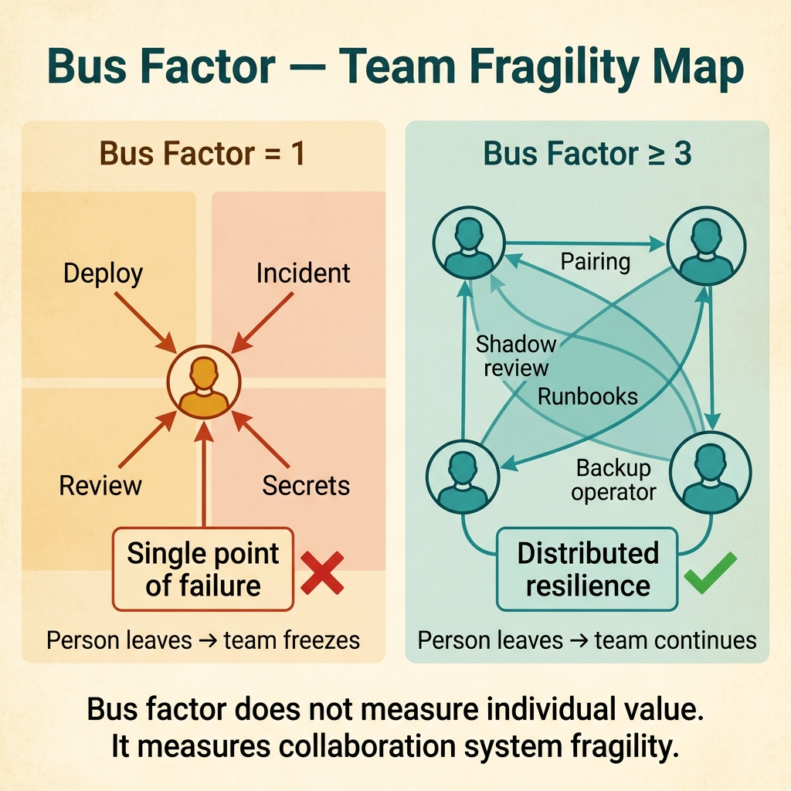
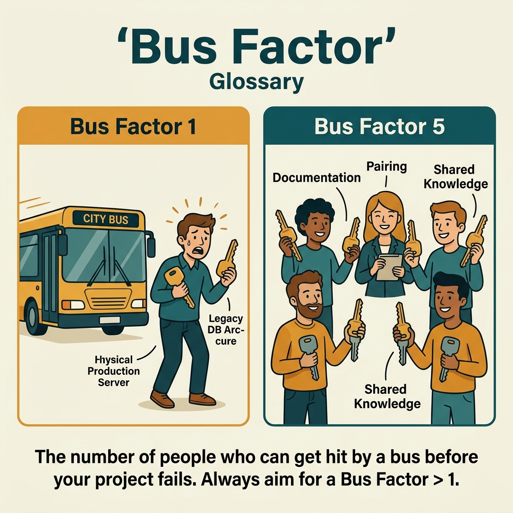

<!-- tags: glossary, reference, developer-cognition-team-dynamics, team-collaboration-dynamics, bus-factor -->
# Bus Factor

> The minimum number of people who, if they suddenly left, would cause the team or project to become severely paralyzed.

| Aspect | Detail |
| --- | --- |
| **Concept** | The minimum number of people who, if they suddenly left, would cause the team or project to become severely paralyzed. |
| **Audience** | Tech lead, EM, architect |
| **Primary style** | Glossary term |
| **Entry point** | Use when knowledge or decision-making authority is concentrated too heavily in a few individuals. |

📅 Created: 2026-03-30 · 🔄 Updated: 2026-04-04 · ⏱️ 9 min read

---

## 1. DEFINE

Picture a service where only one person understands it deeply enough to deploy safely, debug incidents, and review every sensitive change. The team still "runs fine" until that person takes leave or switches projects. Bus factor exposes that degree of fragility.

**Bus Factor** is the minimum number of people who, if they suddenly left, would cause the team or project to become severely paralyzed.

| Variant | Description |
| --- | --- |
| Knowledge bus factor | Knowledge is concentrated in a few people. |
| Operational bus factor | Only a few people hold enough authority and understanding to operate. |
| Decision bus factor | Decision-making authority is bottlenecked at a single person node. |

| Approach | Time | Space | When to choose |
| --- | --- | --- | --- |
| Map critical knowledge owners | O(n systems) | O(notes) | When you do not know where concentration risk lies. |
| Spread knowledge through pairing, review, and runbooks | O(n cycles) | O(doc time) | When dependency is clear but not yet urgent. |
| Reduce single-gate authority | O(n ownership changes) | O(process changes) | When the bottleneck is in decisions or operations, not just knowledge. |

Core insight:

> Bus factor does not measure the "value" of individuals. It measures the fragility of the collaboration system. A low bus factor means the team is trading short-term speed for long-term survivability and learning capacity.

### 1.1 Invariants & Failure Modes

The invariant is that every critical capability must have more than one path to knowledge and authority to act. When every path goes through one person, system resilience degrades very quickly.

---

## 2. CONTEXT

**Who uses it**: Tech lead, EM, architect

**When**: Use when knowledge or decision-making authority is concentrated too heavily in a few individuals.

**Purpose**: Bus factor does not measure the "value" of individuals. It measures the fragility of the collaboration system. A low bus factor means the team is trading short-term speed for long-term survivability and learning capacity.

**In the ecosystem**:
- Low bus factor does not only happen in legacy code; it frequently appears in fast-growing projects too.
- This is a risk indicator, not a tool for labeling or blaming the person holding the knowledge.
- Bus factor can be low in specific domain slices without necessarily affecting the entire organization.

---

How many people getting hit by a bus kills the project is clear. But how do you fix bus factor 1, how do you measure it, and bus factor vs key-person risk?

## 3. EXAMPLES

Bus factor surfaces most visibly when one dev knows the entire system and takes vacation causing the team to freeze, when a critical service has only one maintainer, or when code review can only be approved by one person with context. The examples below place the pattern into exactly those situations.

### Example 1: Basic — Team does not know where knowledge is concentrated

Everyone feels "this system probably depends on person A too much" but nobody has clearly mapped which capability has only one real owner. At the basic level, that intuition needs to become an inventory.

Input is a system or team suspected of low bus factor. Output is a map of critical capabilities with the number of people who can handle them safely. Complexity is low since this is just the recognition step.

```go
type CriticalCapability struct {
	Name            string
	QualifiedOwners int
}
```

**Why?** You cannot reduce risk if you do not know where it lies. A capability map exposes the zones where the team wrongly assumes "many people know" when in reality only one person is confident enough to handle it.

**Takeaway**: You turn bus factor risk from rumor into actionable data.
**Caveat**: Self-reporting "I know this" is not enough; capability needs to be proven through real behavior.
**Use when**: Team suspects person-dependency but does not have a clear risk map.

### Example 2: Intermediate — Spread knowledge through review and pairing, not just docs

One person holds most knowledge because they are always the sole reviewer and the sole incident handler. At the intermediate level, bus factor increases not just through docs but through mechanisms that share real participation.

Input is an identified hotspot. Output is a plan to increase the number of people meaningfully participating in that hotspot. Complexity is moderate since it changes working rhythms.



*Figure: Bus factor does not measure individual value. It measures collaboration system fragility.*

```go
type KnowledgeSpreadPlan struct {
	ShadowReviewer bool
	PairingWindow  bool
	RunbookUpdated bool
}
```

**Why?** Docs are essential but do not automatically create competence. Bus factor only truly increases when multiple people share the experience of reviewing, fixing, and operating on that capability.

**Takeaway**: You transfer knowledge from "one person knows deeply" to "multiple people have actually done it."
**Caveat**: Spreading knowledge equally across everything will consume massive bandwidth; prioritize the most dangerous hotspots first.
**Use when**: The system has identified hotspots but knowledge has not yet been shared through real practice.

### Example 3: Advanced — Bus factor is low because of authority, not just knowledge

Sometimes many people understand the system, but only one person has the authority to deploy, rotate secrets, or approve production fixes. At the advanced level, bus factor must also be viewed through the authority path.

Input is a capability bottlenecked by action authority. Output is clear delegation or backup paths. Complexity is high since it involves governance and security.

```go
type OperationalGate struct {
	PrimaryOperator string
	BackupOperator  string
}
```

**Why?** Knowledge distributed but authority still concentrated means the system is still fragile. Incidents do not wait for the right authorized person to be online before happening.

**Takeaway**: You raise bus factor by opening additional legitimate action paths, not just understanding paths.
**Caveat**: Delegation without guardrails can increase security risk; balance with controls.
**Use when**: Many people understand what needs to be done but only one person is actually allowed to do it.

### Example 4: Expert — Bus factor as an indicator for topology and incentives

If many different domains all have low bus factor, the problem may lie in the reward system: the team unconsciously rewards heroism more than redundancy. At the expert level, bus factor is an indicator of how the organization learns and distributes responsibility.

Input is a pattern of low bus factor repeating across many areas. Output is a deeper organizational diagnosis. Complexity is high since it goes beyond any single module.

```go
type OrgRiskPattern struct {
	HeroCulture   bool
	RedundancyLow bool
}
```

**Why?** Low bus factor is rarely just an accident. It is usually the result of incentives: the person who rescues fast gets rewarded, the person who writes runbooks and teaches others gets less visibility.

**Takeaway**: You use bus factor to look deeper into how the organization distributes knowledge and recognizes contributions.
**Caveat**: Do not weaponize this metric to blame the people who are carrying the system.
**Use when**: Low bus factor appears repeatedly across many teams or critical systems.

---

## 4. COMPARE




*Figure: Position of bus factor among truck factor, knowledge sharing, and team resilience.*

Bus factor sounds like truck factor. Same concept, different name — bus factor (original, morbid) = truck factor (sanitized). Both ask "how many people need to be unavailable for the project to be stuck?" Ideal: bus factor ≥ team_size / 2.

### Level 1

```text
critical knowledge
  -> concentrated in few people
  -> absence causes stall
```

*Figure: Level 1 shows bus factor is really the topology of knowledge and authority to act.*

### Level 2

```text
low bus factor
  one owner
  no runbook
  no shadow reviewer

healthier factor
  shared docs
  multiple reviewers
  backup operators
```

*Figure: Level 2 emphasizes bus factor is raised through intentional redundancy, not just by adding more people.*

### Easy to confuse or cross the boundary

| # | Severity | Mistake | Consequence | Fix |
| --- | --- | --- | --- | --- |
| 1 | 🔴 Fatal | Only one person knows or is authorized for critical work | Incidents and delivery easily stall | Map capabilities and create backup paths. |
| 2 | 🟡 Common | Thinking docs are enough to raise bus factor | Real competence remains concentrated | Combine docs with pairing, review, and runbook drills. |
| 3 | 🟡 Common | Only looking at knowledge and forgetting authority | People who know still cannot act | Delegate with guardrails. |
| 4 | 🔵 Minor | Using bus factor to blame individuals | Trust drops, hero culture gets even stronger | Treat this as a systemic issue. |

### Quick scan

| If you encounter | What to do |
| --- | --- |
| Suspected person-dependency | Map critical capabilities. |
| Only one person reviews or operates a zone | Add shadow reviewer and backup operator. |
| Many people know but nobody has authority | Open authority paths with guardrails. |
| Low bus factor repeats across many areas | Examine incentives and hero culture. |

---

## 5. REF

| Resource | Type | Link | Notes |
| --- | --- | --- | --- |
| Bus factor | Reference | https://en.wikipedia.org/wiki/Bus_factor | Basic concept. |
| Collective Code Ownership | Related term | ./08-collective-code-ownership.md | A strong mechanism for raising bus factor. |
| Truck Factor | Related term | ./04-truck-factor.md | Near-synonym, often used interchangeably. |

---

## 6. RECOMMEND

Bus factor solves the problem of "project depends too much on one person." The next question: how is truck factor measured, and how does rubber duck debugging work?

| Expand to | When | Why | File/Link |
| --- | --- | --- | --- |
| Collective Code Ownership | When you want to increase redundancy in code ownership | This is the pattern that directly counters low bus factor. | [Collective Code Ownership](./08-collective-code-ownership.md) |
| Psychological Safety | When knowledge sharing is blocked by fear of asking or fear of mistakes | Psychological safety is the foundation for real redundancy. | [Psychological Safety](./07-psychological-safety.md) |
| Team & Collaboration Dynamics | When you need to return to the hub | Keep context of the full topic. | [Team & Collaboration Dynamics](./README.md) |

Back to that one dev taking vacation and the team freezing from the beginning — bus factor = 1. Now you know: pair programming, code review rotation, documentation, cross-training. Increase bus factor = distribute knowledge. Not optional, operational necessity.

**Links**: [← Previous](./02-inverse-conway-maneuver.md) · [→ Next](./04-truck-factor.md)
